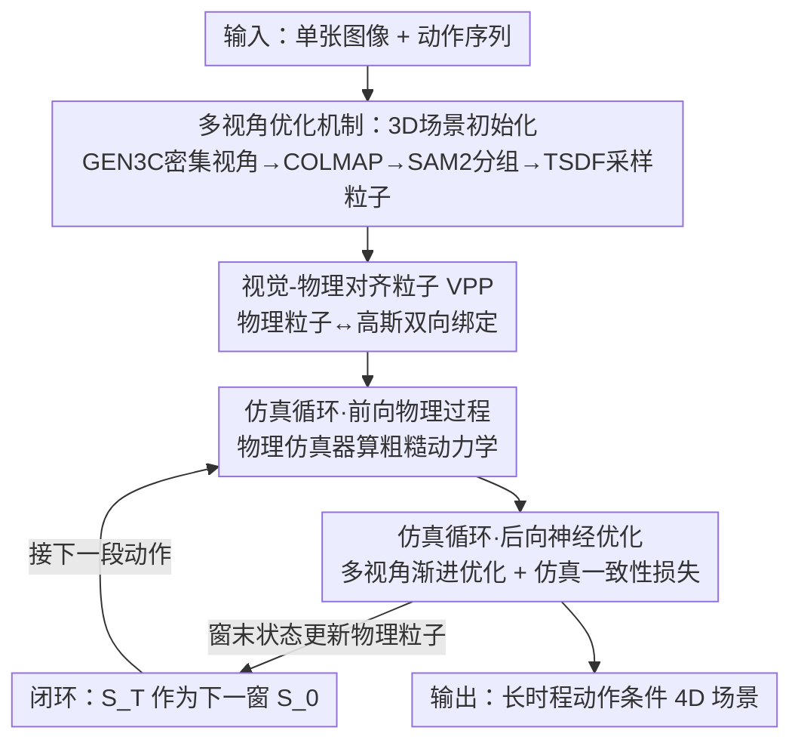

# PerpetualWonder: Long-horizon Action-conditioned 4D Scene Generation

**会议**: CVPR 2026  
**论文**: [CVF Open Access](https://openaccess.thecvf.com/content/CVPR2026/html/Zhan_PerpetualWonder_Long-horizon_Action-conditioned_4D_Scene_Generation_CVPR_2026_paper.html)  
**领域**: 3D视觉 / 4D场景生成  
**关键词**: 4D场景生成, 动作条件, 生成式仿真器, 高斯泼溅, 闭环优化

## 一句话总结
PerpetualWonder 提出"视觉-物理对齐粒子"（VPP）这一统一表征，把物理粒子和高斯基元双向绑定，配合多视角渐进优化，第一次让混合生成式仿真器形成真正的闭环——使得视频模型的视觉修正能反向更新物理状态，从而支持从单张图像出发、对长时程连续动作做出物理合理的 4D 场景生成。

## 研究背景与动机

**领域现状**：从单张图像生成"会对动作做出响应"的动态 4D 场景，是世界模型（VR/AR、游戏、具身智能）的核心能力。当前主流是**混合生成式仿真器**（hybrid generative simulator）：先用传统物理仿真器算出粗糙的、动作驱动的动力学，再用视频生成模型当"神经修复器"补上高保真视觉细节，试图兼得物理可控性与视觉真实感。代表作是 WonderPlay。

**现有痛点**：WonderPlay 这类方法**只能处理单个时间窗内的短时交互**，无法做长时程的连续动作。根因是信息流是**单向不完整**的：物理状态可以驱动视频模型，但视频模型修出来的结果只回流到场景的**外观表征**，没法回写到底层**物理状态**。

**核心矛盾**：物理表征（粒子位置/速度）和视觉表征（高斯基元）是**解耦**的。物理仿真器对上一步的生成式修正"视而不见"，每开启新一轮动作时，物理粒子被重置回原始位置而非优化后的位置，于是误差逐轮累积——castle 被铲子戳进去后会碎裂、形变失真，时间连续性被打断。

**本文目标**：让系统能**永续地**在"用户动作 → 物理仿真 → 生成式修正"之间循环。这要解决两个根本难题：(1) 当前物理状态无法被视频模型的修正更新，需要一个统一物理域与视觉域的新表征；(2) 要更新这个统一表征，视频修正必须是**多视角**的以消除优化歧义，但视频模型天然不会从不同视角生成完全一致的视频，因此需要鲁棒的更新机制。

**核心 idea**：用一套"视觉-物理对齐粒子"把物理粒子和高斯绑成双向桥梁，让外观优化反向校正动力学，再用多视角渐进优化消歧，从而把开环改成闭环，支持长时程顺序交互。

## 方法详解

### 整体框架
给定单张图像 $I$ 和一串用户动作 $\{A_t\}_{t=0}^{T-1}$（全局力如重力/风场 $f(x,y,z,t)$，或局部力 $f(t)$），PerpetualWonder 输出动态 4D 场景序列 $\{S_t\}_{t=0}^{T}$。每个时刻场景状态 $S_t=(B_t, F_t)$ 拆成背景 $B_t$ 和可交互的动态前景 $F_t$。

整个系统是一个闭环混合生成式仿真器，在**前向物理过程** $\Phi_p$ 和**反向神经优化过程** $\Psi_n$ 之间永续迭代。流程是：先从单图重建出支持任意视角渲染的 3D 场景作为初始状态 → 对当前时间窗的 $T$ 步用物理仿真器算出粗糙动力学（前向）→ 用视频模型从多视角修复 RGB/光流并反向优化 VPP（后向）→ 用优化后的视觉基元更新物理粒子，把本窗末状态 $S_T$ 当作下一窗初始状态 $S_0$（闭环），从而接上下一段动作。

### 关键设计

**1. 视觉-物理对齐粒子 VPP：把物理粒子和高斯绑成可双向更新的桥**

闭环的关键卡在底层表征。以前的混合仿真器用**解耦**的两套东西——高斯泼溅管外观、物理粒子管动力学，绑定是单向的（物理粒子驱动视觉基元），导致视频模型的视觉修正永远改不到底层动力学，闭环和长时程仿真都无从谈起。VPP 的做法是把每个物理粒子 $p_j$ 当作锚点，挂上 $K$ 个高斯基元 $\{g_{j,k}\}$，使物理与视觉共享同一组可优化参数。每个高斯的位置由相对锚点粒子的一个小的可学习偏移决定：

$$\mu_{j,k} = p_j + \tanh(\tilde p_{j,k})\cdot\delta$$

其中 $\delta$ 是仿真器采样时定义的物理粒子尺寸，$\tanh$ 把偏移约束在一个粒子大小内。受时空表征启发，每个高斯还带空间不透明度 $o_s$ 和时间不透明度 $o_t(t)$，后者用中心时刻 $\mu_t$ 和持续时长 $s_d$ 参数化：

$$o_t(t)=\exp\left(-\frac{1}{2}\left(\frac{t-\mu_t}{s_d}\right)^2\right),\quad o(t)=o_s\times o_t(t)$$

这样所有动力学和外观都由可优化的视觉基元表达：前向时物理过程更新 $p_j$ 带动所有锚定高斯一起动；后向时优化 $\{g_{j,k}\}$ 的属性又能在"不脱离锚点粒子"的约束下修正最终 4D 场景——这条双向桥正是闭环得以成立的根基。

**2. 多视角优化机制：先重建可任意换视角的 3D 场景，再用渐进式多视角监督消歧**

VPP 提供了"可被更新"的表征，但**怎么一致地更新**仍是难题。WonderPlay 只用单视角视频修复来优化，从新视角看就会有严重歧义和伪影。本设计分两步。其一是**3D 场景初始化**：用相机可控视频模型 GEN3C 从输入图合成密集环绕视角（实现里用了 242 个视角），经 COLMAP 得到点云初始化 3D 高斯；再借 Gaussian Grouping 思路给每个高斯加可学习特征、用 SAM2 在环绕视角上拿物体掩码做监督，把场景拆成背景集和前景物体集；前景物体经 TSDFusion 转成闭合网格，从网格体内采样初始物理粒子 $P_0$。这与 WonderPlay 用单视深度反投影+物体摆放不同——它把背景和所有物体建在**统一的 3D 坐标系**里，这是支持任意密集视角渲染的前提。

其二是**渐进式多视角优化**。粗糙 4D 场景被渲成 RGB 和光流，送入视频生成模型经双模态控制修复成 $V_t$。但不同视角修出来的视频天然不一致，不能直接拿来优化。为此一方面设计了带前景掩码 $M$ 的整体损失（前景/背景分开算 L1+SSIM 光度损失 $\mathcal{L}_p$ 并加一致性正则），并引入仿真一致性损失：

$$\mathcal{L}_{sim}=\frac{1}{T\cdot J}\sum_{t=1}^{T}\sum_{j=1}^{J}\left\|p_{j,t}-\frac{1}{K}\sum_{k=1}^{K}\mu_{j,k,t}\right\|_2^2$$

它惩罚视觉基元 $\mu_{j,k,t}$ 偏离对应物理粒子 $p_{j,t}$，相当于一个强正则，保证优化后的视觉基元不会从物理锚点"散架"，从根上缓解不一致。另一方面用**渐进策略**：先只渲染并优化输入图视角的视频，再用更小的控制权重修其他视角，最后把所有视角的修复视频一起拿来再优化一遍，逐步消歧得到一致的 4D 场景。

**3. 仿真循环与闭环：用优化后的视觉基元回写物理粒子，接上下一段长时程动作**

有了 VPP 和多视角优化，就能组装出永续仿真循环，每个时间窗含三阶段。**前向过程**：从场景状态 $S_0$ 出发，逐步对每个动作施加物理算子 $\hat S_{t+1}=\Phi_p(\hat S_t, A_t)$，算出整段粗糙序列 $\{\hat S_t\}$；用了一组求解器覆盖布料、沙、雪、液体、烟、弹性体、刚体等多种材料。**后向优化**：把粗糙序列喂进 $\Psi_n$，用上面的渐进多视角优化在所有 $T$ 步上校正外观与动力学，得到精修序列 $\{S_t\}$。**闭环**是关键创新：本窗精修末状态 $S_T$ 成为下一窗初始 $S_0$，具体做法是把 $T$ 时刻优化后视觉基元 $\{g_{j,k}\}$ 的位置取平均，回写对应物理粒子的位置 $p_j$；速度则直接继承 $T$ 时刻原速度（因为 $\mathcal{L}_{sim}$ 把粒子位置更新限制在很小范围，这样做才成立）。这一步正是 WonderPlay 缺失的——它每开新窗都把高斯重置回原始位置，造成断裂伪影；而本文把修正后的物理状态 $\{P_T, V_T\}$ 当作下一前向过程的输入，让误差不再逐轮累积，从而支持长时程顺序交互。

### 损失函数 / 训练策略
整体损失（公式 3）由背景区域光度损失、前景区域光度损失，加上权重 $\lambda_{sim}$ 的仿真一致性损失 $\mathcal{L}_{sim}$ 组成；$\mathcal{L}_p$ 为 L1+SSIM。背景高斯也带可学习时空不透明度以捕捉阴影等二级视觉效果。实现上每个时间窗跨 392 个物理仿真步、输出 49 帧视频（每 8 步采一帧），修复分辨率 H=704、W=1280，渐进多视角优化用正面/左侧/右侧 3 个关键视角监督，典型实验跨 3 个时间窗。

## 实验关键数据

### 主实验
在 10 个涵盖布料、刚体、弹性体、液体、气体、颗粒物等多材料的场景上，用 WorldScore 指标评估（Camera Ctrl=可控性，3D Consist=一致性，Imaging=成像质量）：

| 方法 | Camera Ctrl | 3D Consist | Imaging |
|------|------|------|------|
| Wan2.2 | 59.73 | 65.35 | 67.03 |
| GEN3C | 80.29 | 61.69 | 66.25 |
| WonderPlay | 75.95 | 63.93 | 36.80 |
| Tora | 51.80 | 60.77 | 54.37 |
| Wan2.6 | 64.75 | 70.49 | 66.09 |
| DaS | 78.96 | 62.18 | 60.23 |
| Veo3.1 | 60.61 | 73.93 | 67.82 |
| **PerpetualWonder（本文）** | **93.26** | **80.41** | 66.98 |

PerpetualWonder 在相机可控性和 3D 一致性上大幅领先，同时保持高水平成像质量。条件视频生成模型普遍要么忽略相机指令（Wan2.2 几乎不动相机）、要么虽 3D 感知但物体对动作无响应（GEN3C 物体静止）；WonderPlay 能施加动作但单视角优化在新视角下有严重伪影和几何不一致。

人类偏好（2AFC 双盲对比，本文相对各基线在动态真实感上的胜率）：

| 对比对象 | Physics Plausibility | Motion Fidelity |
|------|------|------|
| over Wan2.2 | 74.1% | 71.8% |
| over GEN3C | 93.5% | 83.5% |
| over WonderPlay | 80.8% | 86.3% |
| over Veo3.1 | 62.0% | 70.8% |
| over Wan2.6 | 68.5% | 77.3% |
| over Tora | 83.5% | 85.3% |
| over DaS | 80.9% | 81.9% |

约 70%~90% 的参与者在物理合理性与运动保真度两方面都更偏好本文方法。

### 消融实验
消融以定性图示为主（无数值表），考察 VPP 表征与渐进多视角优化各自的作用：

| 配置 | 现象 | 说明 |
|------|---------|------|
| Full（VPP + 渐进优化） | 动力学合理、多视角一致 | 完整模型 |
| w/o VPP（换标准 3DGS 基元） | 动力学混乱、视觉伪影退化 | 无约束高斯只顾最小化光度损失，脱离物理 |
| w/o 渐进优化（直接多视角优化） | 苹果纹理模糊、外观随时间闪烁 | 各视角不一致监督直接合并导致优化冲突、表征被污染 |

### 关键发现
- **VPP 是动力学正确性的根基**：去掉 VPP、改用无约束的标准 3D 高斯后，基元只会一味最小化光度损失而脱离物理粒子，导致混乱动力学和伪影——说明把视觉基元绑死在物理锚点上才能让"物理求解器算出的动力学"被忠实渲染出来。
- **渐进优化是多视角一致性的关键**：视频生成器从不同视角会幻觉出冲突的颜色/形状细节，一次性合并这些不一致监督会让表征被污染（随时间变模糊、闪烁）；先单视角后逐步引入其他视角的渐进策略能消解歧义。
- **长时程优势来自闭环回写**：WonderPlay 因每窗重置物理粒子、误差逐轮累积（铲子在 castle 上碎裂失真）；本文用 $S_T \to S_0$ 的状态回写避免累积，castle 等场景能稳定支持四轮连续交互。

## 亮点与洞察
- **VPP 双向桥是真正的"闭环"开关**：把物理粒子当锚点、高斯当可优化外壳，并用 $\tanh\cdot\delta$ 把偏移夹在一个粒子尺度内——这一个表征同时解决了"外观优化能否回写动力学"和"回写会不会让基元散架"两件事，是整篇论文最巧妙的地方。
- **用仿真一致性损失换来一个工程便利**：$\mathcal{L}_{sim}$ 把粒子位置更新限制在小范围，使得闭环时速度可以直接继承而无需重新估计，省掉了一个棘手的速度回写问题。
- **"渐进引入多视角监督"这一思路可迁移**：凡是用生成模型当监督、又面临多视角/多源不一致的优化任务（如 4D 重建、可控生成蒸馏），都可借鉴"先可信视角、再小权重补充、最后联合"的渐进消歧策略。
- **WonderPlay++ 公平基线设计严谨**：把本文的多视角重建初始化也给基线用，单独剥离出"统一表征+闭环"的贡献，避免把增益全算到更好的初始化上。

## 局限与展望
- **依赖一长串预训练大模型**：GEN3C 合成密集视角、COLMAP、SAM2、TSDFusion、视频生成模型、物理仿真器（Genesis）环环相扣，任一环节出错（如 GEN3C 幻觉、COLMAP 重建失败）都会向下游传导，系统复杂度和算力开销都很高。
- **闭环回写较为简化**：位置用 $T$ 时刻视觉基元平均、速度直接继承，依赖 $\mathcal{L}_{sim}$ 把位移约束得足够小；当动作剧烈、形变很大时这种"小范围更新"假设可能不成立，文中未充分讨论失效边界。
- **评测规模偏小**：仅 10 个场景、3 个时间窗，长时程主要靠定性展示（castle 四轮）；缺乏对更长时程（如数十轮）误差累积的定量曲线。
- **物理保真仍受仿真器与视频模型先验制约**：材料求解器是简化物理，视频模型补的是"看起来真实"而非严格物理，二者结合后的物理正确性缺乏客观物理量度量，主要靠人类偏好。

## 相关工作与启发
- **vs WonderPlay（最相关的混合生成式仿真器）**：WonderPlay 也是"物理仿真出粗糙动力学 + 视频模型修外观"，但表征解耦、信息单向、只能短时交互；本文用 VPP 统一表征 + 闭环回写 + 多视角优化，把它升级成支持长时程顺序动作的闭环系统，3D 一致性 80.41 vs 63.93、人类偏好胜率 80%+。
- **vs 条件视频生成模型（Wan2.2 / GEN3C / Veo3.1 / Tora / DaS）**：这类方法直接生成视频，要么不遵循相机轨迹、要么物体对动作无响应，且缺乏显式 3D 表征，无法保证物理准确的动作条件和新视角下的 3D 一致；本文运行在完整 3D 表征上，兼顾精确物理交互与一致多视角渲染。
- **vs 动态 4D 场景生成（动态 NeRF / 动态高斯 / 视频先验蒸馏）**：这些方法或只能回放预捕捉事件、或生成被动的预定动画，缺乏对用户动作的物理合理响应；本文的核心区别在于动作条件下的可交互、可仿真。
- **vs 纯物理仿真生成**：传统物理仿真精确可解释但有显著真实感差距（简化物理+解析渲染抓不住材料形变、光照、飞溅等二级视觉效果）；本文用视频模型先验补上真实感，同时保留物理可控性。

## 评分
- 新颖性: ⭐⭐⭐⭐⭐ 首个真正闭环的混合生成式仿真器，VPP 统一表征 + 状态回写是实质性突破。
- 实验充分度: ⭐⭐⭐⭐ 对比基线丰富、WonderPlay++ 公平基线设计好，但场景仅 10 个、长时程多靠定性、消融无数值。
- 写作质量: ⭐⭐⭐⭐⭐ 难题拆解清晰（两大挑战 → 两个组件 → 仿真循环），动机与方法对应严密。
- 价值: ⭐⭐⭐⭐⭐ 直指世界模型/具身智能对"可交互长时程仿真"的刚需，闭环与渐进消歧的思路可迁移性强。

<!-- RELATED:START -->

## 相关论文

- [\[CVPR 2026\] MANSION: Multi-floor Language-to-3D Scene Generation for Long-horizon Tasks](mansion_multi-floor_language-to-3d_scene_generation_for_long-horizon_tasks.md)
- [\[CVPR 2026\] Text–Image Conditioned 3D Generation](text-image_conditioned_3d_generation.md)
- [\[CVPR 2026\] Action-guided Generation of 3D Functionality Segmentation Data](action-guided_generation_of_3d_functionality_segmentation_data.md)
- [\[CVPR 2026\] 4D Primitive-Mâché: Glueing Primitives for Persistent 4D Scene Reconstruction](4d_primitive-mache_glueing_primitives_for_persistent_4d_scene_reconstruction.md)
- [\[CVPR 2026\] Long-SCOPE: Fully Sparse Long-Range Cooperative 3D Perception](long_scope_fully_sparse_long_range_cooperative_3d_perception.md)

<!-- RELATED:END -->
