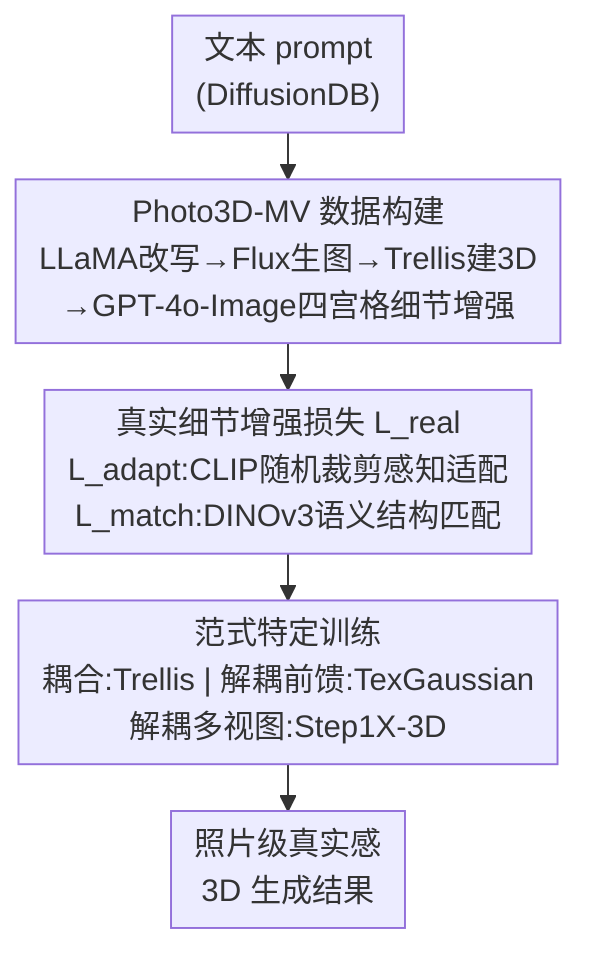

# Photo3D: Advancing Photorealistic 3D Generation through Structure-Aligned Detail Enhancement

**会议**: CVPR 2026  
**论文**: [CVF Open Access](https://openaccess.thecvf.com/content/CVPR2026/html/Liang_Photo3D_Advancing_Photorealistic_3D_Generation_through_Structure-Aligned_Detail_Enhancement_CVPR_2026_paper.html)  
**代码**: [项目页](https://liangsanzhu.github.io/photo3d-page/)  
**领域**: 3D视觉 / 扩散模型  
**关键词**: 3D生成, 照片级真实感, 多视图数据集, 细节增强, 结构对齐

## 一句话总结
Photo3D 用 GPT-4o-Image 把 3D 渲染图增强成"结构对齐、细节逼真"的多视图，构建出配对 3D 几何的 Photo3D-MV 数据集，再用一套 CLIP 感知适配 + DINOv3 语义结构匹配的"宽松细节增强损失"做监督，在不破坏 3D-native 几何的前提下给三类主流 3D 生成范式注入照片级外观，刷到照片真实感 SOTA。

## 研究背景与动机

**领域现状**：3D 生成已从 score-distillation、multi-view-based 转向 3D-native 范式——直接从大规模 3D 数据集学 3D 分布，生成更快、更稳、几何更精细。3D-native 又分两类：几何-纹理耦合（联合学几何与纹理）和几何-纹理解耦（先生成几何再用另一个 texturing 模型上纹理）。

**现有痛点**：现有大规模 3D 数据集几乎全是合成资产，外观跟真实影像差很远；少量真实扫描 3D 数据又因表示能力和扫描仪精度受限而外观过度平滑、缺细粒度纹理。结果是 3D-native 生成器普遍产出"合成色彩 + 卡通质感"的纹理，几何看着合理但外观一眼假。想用 2D 真实影像补外观，Real3D 用单视图 + cycle-consistency 监督，但缺立体约束导致几何不稳、绕视真实感差；用图像生成器（如 GPT-4o-Image）合成多视图又缺内在一致性，会纹理打架、结构漂移，拿去 finetune multi-view 还会把外观带偏成合成 3D 风。

**核心矛盾**：要"逼真外观"就得引入真实/生成的 2D 细节作监督，但这些 2D 细节天生缺多视图一致性、且会和 3D-native 已经学好的稳定几何打架——外观真实感和结构一致性之间存在张力。强行做像素级监督只会让结构和纹理错位。

**本文目标**：①造出既逼真又与 3D 几何对齐的多视图训练数据；②设计一套既能增强真实细节、又不破坏 3D 结构的鲁棒训练方案；③让方案能通用地套到不同 3D-native 范式上。

**切入角度**：与其逼模型严格对齐每个像素，不如承认生成图像的视图间细节会有差异、改用"宽松"的特征级监督——只要语义/感知上对齐就行，把结构稳定性交给 3D-native 几何本身去保。

**核心 idea**：先用"外观锚定 + 结构对齐"的合成管线造数据，再用感知特征适配（CLIP）+ 语义结构匹配（DINOv3）的宽松损失做细节增强，并为耦合/解耦范式各设计专门的训练策略。

## 方法详解

### 整体框架
Photo3D 分三步走：先构建数据（Sec 3.1）——把文本 prompt 经 LLaMA-3 改写成富真实感的物体描述，Flux.1-Dev 生单视图、去背景，Trellis 生成 3D 资产（structured latent / mesh / 3DGS），渲四个正交视图拼成四宫格交给 GPT-4o-Image 做"跨视图对齐的细节增强"，最终得到与 3D 几何配对的真实多视图数据集 Photo3D-MV（10K 物体、覆盖 LVIS 373 类）；再设计监督方案（Sec 3.2）——因为四视图不足以重建完整纹理且 GPT-4o 输出有视图相关细节差异，用 CLIP 随机裁剪的感知适配损失 $L_{\text{adapt}}$ + DINOv3 语义补丁匹配损失 $L_{\text{match}}$ 组成宽松的真实感损失 $L_{\text{real}}$；最后做范式特定训练（Sec 3.3）——把这套方案分别适配到耦合（Trellis）、解耦前馈（TexGaussian）、解耦多视图（Step1X-3D）三种 3D-native 生成器上。

### 关键设计

**1. 结构对齐的多视图合成管线 + Photo3D-MV 数据集：用 GPT-4o-Image 造逼真且与 3D 对齐的训练数据**

针对"缺乏富细节真实 3D 资产"这一根本痛点，作者不去采集真实 3D（尺度多变、非刚体运动、扫描仪精度有限），而是合成数据。管线是：DiffusionDB 的文本 prompt 先经 LLaMA-3-8B 改写成带真实感属性的物体中心描述（如"a bee, striped black-and-yellow, real camera shot…"），Flux.1-Dev 生单视图图像并去背景，送进 Trellis 生成 3D 资产（结构化 3D latent、mesh、3DGS）；接着渲染每个 3DGS 模型的四个正交视图、拼成一张四宫格图，用一条专为"跨视图对齐细节增强"设计的编辑 prompt（"preserve the original structure; refine details for higher realism"）交给 GPT-4o-Image 处理。关键在于这是**外观锚定的精修**而非"几何条件生成图像"——它在已有 3D 渲染上精修细节，因此能与 3D 结构做感知上更精细的对齐，产出"逼真多视图 + 配对 3D 几何"。作者特别指出 GPT-4o-Image 在真实细节增强上优于 Gemini-2.5-Flash、Flux.1-Kontext。最终 Photo3D-MV 含 10K 物体、覆盖 LVIS 1.2K 类中的 373 类，提供高保真且 3D 对齐的真实细节先验。

**2. 宽松的真实细节增强损失：用 CLIP 感知适配 + DINOv3 语义结构匹配避开像素级监督的错位**

四张多视图不足以重建完整纹理，所以把它们当**监督信号**而非重建目标用；但 GPT-4o-Image 会引入视图相关的细节波动，强行做逐像素监督会造成结构/纹理错位。于是作者设计两项宽松损失。**感知特征适配** $L_{\text{adapt}}$ 用 CLIP：对合成图 $I_{\text{syn}}$ 和 GT 图 $I_{\text{GT}}$ 做随机裁剪（绕开 CLIP 不支持高分辨率的限制、同时抓细粒度细节），在 CLIP 共享嵌入空间对齐——$L_{\text{adapt}}=\frac{1}{|C|}\sum_{c\in C}\big(1-\langle\phi(\tau_c(I_{\text{syn})}),\phi(\tau_c(I_{\text{GT}}))\rangle\big)$，$\tau_c$ 为随机裁剪、$\phi$ 为 CLIP 编码、$\langle\cdot,\cdot\rangle$ 为余弦相似度。**语义结构匹配** $L_{\text{match}}$ 用 DINOv3：把两图缩到统一分辨率 $m\times m$（实现取 $m=1024$）经 DINOv3 backbone $\psi$ 得 patch 级特征 $F_p=\psi(I_{\text{syn}})$、$F_q=\psi(I_{\text{GT}})$，展平成 token 集 $P,Q$，对每个预测 token 在目标里找语义最相似的 token 做匹配——$L_{\text{match}}=1-\frac{1}{|P|}\sum_{p\in P}\max_{q\in Q}\langle f_p,f_q\rangle$。两者合成 $L_{\text{real}}=L_{\text{adapt}}+L_{\text{match}}$。直觉是：$L_{\text{adapt}}$ 负责"看起来逼真"，$L_{\text{match}}$ 用 DINOv3 稠密判别特征做细粒度结构对应、负责"结构别漂"，两者一起既增真实细节又稳住几何。

**3. 范式特定训练：把同一套方案分别适配到耦合 / 解耦前馈 / 解耦多视图三种 3D-native 生成器**

不同 3D-native 生成器范式不同，监督接法也得不同，否则 $L_{\text{real}}$ 落不下去。对**几何-纹理耦合**（Trellis，diffusion-based）：采样结构化 3D latent $x_0$、加噪得 $x_t$，取配对真实多视图为 $I_{\text{GT}}$、随机选一视图当条件 $I_{\text{cond}}$，3D diffusion 预测干净 latent $\hat{x}_0=x_t-t\,v_\theta(x_t,t,I_{\text{cond}})$，再经 3D decoder $D_\phi$ 解成 3DGS、在 $I_{\text{GT}}$ 同视角渲染后用 $L_{\text{real}}$ 监督；妙在不依赖 GT 3D latent——给 $x_0$ 加噪逼模型向真实 GT 配对的方向探索更大的生成空间。对**解耦-前馈**（TexGaussian，单次前馈从 mesh 生成八叉树 3DGS）：把 TexGaussian 当 GT 做纹理优化，条件是 Photo3D-MV 的 mesh $M$ 和文本 $y_{\text{text}}$，渲染后用 $L_{\text{real}}$ 监督 $T_\theta(y_{\text{text}},M)$。对**解耦-多视图**（Step1X-3D，基于预训练单图 diffusion finetune 的多视图 texturing，常产过平滑纹理）：把真实多视图编码成 multi-view latent $X_0=\{x_i\}_{i=1}^4$ 加噪得 $X_t$，以 mesh 的几何渲染图为条件预测噪声、还原 $\hat{X}_0=\alpha_t X_t-\beta_t\epsilon_\theta(X_t,t,I_{\text{cond}},M)$，冻结 2D decoder 解码后用 $L_{\text{real}}$ 监督。三种接法殊途同归：都把 $L_{\text{real}}$ 的真实感先验注入对应范式的生成过程。

### 损失函数 / 训练策略
核心损失即 $L_{\text{real}}=L_{\text{adapt}}+L_{\text{match}}$。在 8×NVIDIA H20 上 finetune 三个生成器：Trellis（1.1B）100K 步、bs=1、lr $1\times10^{-4}$；TexGaussian 10K 步、bs=5、lr $4\times10^{-4}$；Step1X-3D 10K 步、bs=1、lr $1\times10^{-4}$；输入输出图像 512×512，$L_{\text{match}}$ 上采样分辨率 $m=1024$，AdamW。

## 实验关键数据

### 主实验
在两类测试集上评估：真实扫描 3D 数据（GSO + Omni3D + DTC，挑 400 个高美学样本）和 ImageNet（挑 1000 张高美学图、Gemini-2.5-Flash 抠前景、BLIP-2 生 caption）。指标分量化与质化：**Fidelity**（CLIP 相似度↑、KID↓，测多视图渲染与输入图的对齐）、**Realism**（MANIQA↑、MUSIQ↑，测渲染图真实感）、**Aesthetic**（NIMA↑、Aesthetic Score↑）；质化为 Gemini-2.5 两两比较的 Winning Rate↑ 和 20 人 1–5 分主观真实感 Score↑。

| 测试集 | 方法 | CLIP↑ | KID↓ | MANIQA↑ | MUSIQ↑ | NIMA↑ | Aes.↑ | Gemini胜率%↑ | 人评↑ |
|--------|------|-------|------|---------|--------|-------|-------|------|------|
| ImageNet | Trellis | 0.672 | 0.045 | 0.438 | 69.108 | 5.239 | 4.682 | 68.1 | 3.4 |
| ImageNet | **Photo3D (Trellis)** | **0.679** | **0.044** | **0.470** | **72.385** | **5.548** | **4.927** | **95.0** | **4.4** |
| Real 3D | Trellis | 0.853 | 0.002 | 0.427 | 64.155 | 4.653 | 4.481 | 70.6 | 3.9 |
| Real 3D | **Photo3D (Trellis)** | **0.864** | 0.002 | **0.459** | **65.724** | **4.856** | **4.689** | **93.8** | **4.8** |

跨范式都能稳定提升各自 baseline：Photo3D (Trellis) 在 ImageNet 上把 Gemini 胜率从 68.1% 拉到 95.0%、人评从 3.4 升到 4.4，且 Trellis 版整体最强。Step1X-3D、TexGaussian 套上 Photo3D 后同样在真实感/美学上明显改善（如 Photo3D (Step1X-3D) ImageNet Gemini 胜率 66.9%→80.0%）。

### 消融实验
基于 Trellis 版，分析各监督项与其它监督类型（Table 2，ImageNet）：

| 配置 | CLIP↑ | KID↓ | MANIQA↑ | MUSIQ↑ | NIMA↑ | Aes.↑ |
|------|-------|------|---------|--------|-------|-------|
| **Ours（$L_{\text{adapt}}+L_{\text{match}}$）** | **0.679** | **0.044** | **0.470** | **72.385** | **5.548** | **4.927** |
| w/o $L_{\text{adapt}}$ | 0.668 | 0.054 | 0.308 | 61.681 | 4.726 | 4.579 |
| w/o $L_{\text{match}}$ | 0.671 | 0.048 | 0.409 | 71.069 | 5.400 | 4.897 |
| w/o all（Baseline） | 0.672 | 0.045 | 0.438 | 69.108 | 5.239 | 4.682 |
| w/ L2 loss | 0.598 | 0.195 | 0.346 | 55.281 | 4.782 | 4.225 |
| w/ Gram loss | 0.671 | 0.049 | 0.444 | 69.646 | 5.241 | 4.682 |
| w/ GAN loss | 0.672 | 0.046 | 0.468 | 72.058 | 5.260 | 4.901 |

### 关键发现
- **$L_{\text{adapt}}$ 是真实感主力**：去掉它 MANIQA 从 0.470 崩到 0.308、MUSIQ 从 72.4 跌到 61.7，真实感大幅退化；只留 $L_{\text{match}}$ 能稳住结构但细节真实感不够。两者互补——一个管"逼真"、一个管"结构不漂"。
- **像素级/传统监督会反伤**：直接上 L2 loss 全面崩盘（KID 0.044→0.195、CLIP 0.679→0.598），印证"GPT-4o 视图细节有差异、强行逐像素监督会错位"的动机；Gram、GAN 损失也都不如本文的 CLIP+DINOv3 宽松组合。
- **范式无关的通用性**：耦合的 Trellis 提升最猛（细粒度毛发等纹理质感），解耦的 Step1X-3D、TexGaussian 也都被一致拉高，说明 $L_{\text{real}}$ 这套真实感先验是可移植的。

## 亮点与洞察
- **"宽松监督"是核心哲学**：承认生成多视图天生不一致，于是放弃像素对齐、改用 CLIP（感知）+ DINOv3（语义结构）的特征级宽松监督——这把"数据不完美"从 bug 变成可容忍的前提，消融里 L2 全崩正好反证这个选择的必要性。
- **用 GPT-4o-Image 当"细节放大器"而非"几何生成器"**：在已有 3D 渲染上做外观锚定精修，而非从条件生成全新图，从而天然保住与 3D 结构的对齐——这个"精修而非重画"的取数据思路很可复用。
- **DINOv3 稠密特征做结构对应**：用 patch 级最近邻匹配代替逐像素约束来保结构，对任何"风格/细节迁移又不想破坏几何"的任务都有迁移价值（如纹理迁移、风格化重渲染）。
- **一套方案三种范式落地**：同一个 $L_{\text{real}}$ 用三种不同接法塞进耦合/解耦/多视图生成器，且都涨点，展示了方法的通用性而非只对某个 backbone 调参。

## 局限与展望
- **重度依赖闭源 GPT-4o-Image**：整个数据管线的真实感来源是闭源 API，复现成本高、可控性差，且其行为变化会直接影响数据质量。
- **四视图监督的覆盖有限**：每物体只渲四个正交视图做监督，对自遮挡严重或细节高度各向异性的物体可能覆盖不足。⚠️ 论文未量化视图数对效果的影响。
- **数据规模与类别**：Photo3D-MV 仅 10K 物体、覆盖 LVIS 373/1.2K 类，类别广度仍受限，对长尾/罕见物体的真实感泛化未充分验证。
- **只增外观、不改几何**：方法定位是"在已有 3D-native 几何上增真实纹理"，若底层几何本身错了，Photo3D 无法纠正——它解决的是外观-几何 gap 的外观侧。

## 相关工作与启发
- **vs Real3D**：Real3D 用单视图真实图 + cycle-consistency 监督提外观，但缺立体约束导致几何不稳、绕视真实感差；本文用结构对齐的多视图 + DINOv3 结构匹配，既增真实感又稳几何，主表里 Real3D 的 Gemini 胜率为 0、人评 1.0 被全面碾压。
- **vs PBR 材质类方法**：它们生成 PBR 材质图但保持原纹理不变、只加渲染器相关光照，外观真实感提升有限；本文在生成过程中直接增强外观、产出渲染无关的照片级 3D。
- **vs 在 3D 数据集上 finetune multi-view 生成**：那类做法仍解不掉视图不一致、反而把外观带偏成合成 3D 风；本文用宽松特征监督 + 范式特定训练，避免了"被合成风格污染"。

## 评分
- 新颖性: ⭐⭐⭐⭐ "宽松特征监督 + GPT-4o 外观锚定造数据 + 三范式通用"组合新颖，思路清晰；单项技术（CLIP/DINOv3）非全新但组合得当。
- 实验充分度: ⭐⭐⭐⭐ 两类测试集 + 量化/质化 + 人评 + 监督类型消融较完整；但缺视图数、数据规模的敏感性分析。
- 写作质量: ⭐⭐⭐⭐ 动机—数据—损失—范式落地逻辑顺，公式与框架对得上，三个设计与图一致。
- 价值: ⭐⭐⭐⭐ 真切解决了 3D 生成"几何对但外观假"的痛点，且能通用套到主流生成器；依赖闭源 GPT-4o 略减可复现性。

<!-- RELATED:START -->

## 相关论文

- [\[CVPR 2026\] Realiz3D: 3D Generation Made Photorealistic via Domain-Aware Learning](realiz3d_3d_generation_made_photorealistic_via_domain-aware_learning.md)
- [\[CVPR 2026\] mmWaveFlow: Unified Enhancement and Generation of mmWave Human Point Clouds](mmwaveflow_unified_enhancement_and_generation_of_mmwave_human_point_clouds.md)
- [\[CVPR 2026\] PointNSP: Autoregressive 3D Point Cloud Generation with Next-Scale Level-of-Detail Prediction](pointnsp_autoregressive_3d_point_cloud_generation_with_next-scale_level-of-detai.md)
- [\[CVPR 2026\] REVIVE 3D: Refinement via Encoded Voluminous Inflated prior for Volume Enhancement](revive_3d_refinement_via_encoded_voluminous_inflated_prior_for_volume_enhancemen.md)
- [\[CVPR 2026\] Breaking the 3D Dataset Bottleneck: Fast Scalable Generation of Aligned 3D Assets from Scratch for Category 6D Pose Estimation and Robotic Grasping](breaking_the_3d_dataset_bottleneck_fast_scalable_generation_of_aligned_3d_assets.md)

<!-- RELATED:END -->
