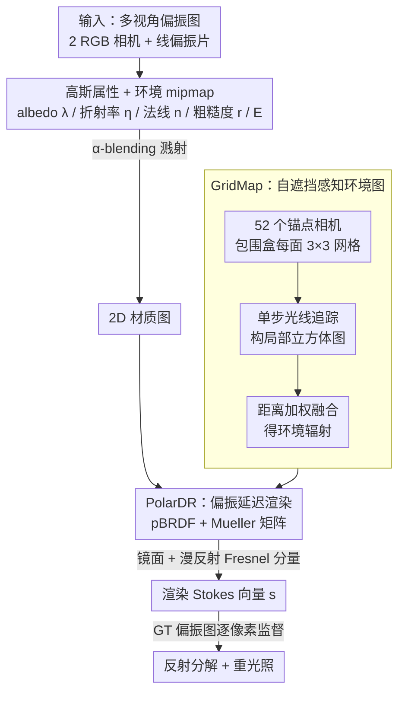

<!-- 由 src/gen_stubs.py 自动生成 -->
# PhyGaP: Physically-Grounded Gaussians with Polarization Cues

**会议**: CVPR2026  
**arXiv**: [2603.14001](https://arxiv.org/abs/2603.14001)  
**代码**: 即将公开  
**领域**: 3D视觉  
**关键词**: 3D高斯泼溅, 偏振成像, 逆渲染, 重光照, 反射分解, pBRDF, 环境光照

## 一句话总结

提出 PhyGaP，通过偏振延迟渲染（PolarDR）将偏振线索融入 2DGS 优化，并设计自遮挡感知的 GridMap 环境图技术，实现光泽物体的精确反射分解与真实重光照。

## 背景与动机

1. **反射物体重建困难**：3DGS 及其变体缺乏显式几何表示，溅射管线无法模拟二次光传输，对光泽表面建模能力有限。
2. **RGB 图像信息不足**：现有 DR 方法依赖对法线、反射率和粗糙度的精确估计，但普通 RGB 图像并不编码这些物理属性，导致 albedo 与反射光分解失败。
3. **重光照质量差**：由于反射分解不准确，已有方法在更换光照条件时常出现色偏、不真实阴影甚至表面不连续。
4. **偏振包含丰富物理信息**：镜面反射会产生强线性偏振，漫反射产生弱偏振且偏振角偏移 90°，偏振线索天然适合指导反射属性学习。
5. **非凸物体自遮挡问题**：环境立方体图假设光源在无穷远处，无法处理非凸物体的自遮挡与间接光照，导致重光照产生伪影。
6. **现有偏振方法不支持重光照**：PANDORA 隐式编码环境图，PolGS 不分解 albedo，均无法实现光照替换。

## 方法详解

### 整体框架

PhyGaP 要解决的是光泽/反射物体的逆渲染：普通 RGB 不编码法线、反射率、粗糙度这些物理量，导致 albedo 与反射光分解失败、重光照时出现色偏和伪影。它基于 2DGS + Ref-Gaussian，给每个高斯原语维护可学习的 albedo $\boldsymbol{\lambda}$、折射率 $\eta$、法线 $\mathbf{n}$、粗糙度 $r$，外加一个可学习的环境立方体 mipmap $E$。流程是：先用 α-blending 把这些属性溅射成 2D 材质图，送入 PolarDR 算出每像素的偏振 Stokes 向量，再用真值偏振图直接监督优化——偏振线索充当了 RGB 给不出的物理约束。其中 GridMap 负责把非凸物体的自遮挡间接光照算进 PolarDR 的辐射计算里。

### 关键设计

**1. PolarDR：用偏振 Stokes 向量直接监督，破解 albedo-光照歧义**

普通 RGB 只能看到混在一起的颜色，分不清哪部分是 albedo、哪部分是反射光。PhyGaP 抓住偏振的物理规律——镜面反射强线偏、漫反射弱偏且偏振角偏移 90°——把 pBRDF 嵌进 GS 延迟渲染：光的偏振态用 Stokes 向量 $\mathbf{s}=[s_0, s_1, s_2, s_3]^\top$ 表示，与表面交互用 Mueller 矩阵建模。镜面分量用 Fresnel 系数 $R^\perp, R^\parallel$ 算偏振度 $\beta_s$ 再乘镜面辐射度 $L_s$，漫反射分量用透射 Fresnel 系数 $T^\perp, T^\parallel$ 算 $\beta_d$ 再乘漫反射辐射度 $L_d$，两者相加得到渲染 Stokes 向量，与 GT 偏振图逐像素比对。这样镜面/漫反射的分解被偏振显式约束住，不再退化成歧义解；颜色也刻意不用球谐表示，因为 albedo 本该与视角无关。

**2. GridMap：自遮挡感知环境图，处理非凸物体的间接光照**

传统环境立方体图假设光源在无穷远，碰到非凸物体的自遮挡和互反射就会渲染出错误阴影。PhyGaP 在物体包围盒每个面划 3×3 网格、在节点放锚点相机（底面除外，共 $N=52$ 个），对每个锚点做一次单步光线追踪，构出一张混合了自身颜色与全局环境的局部立方体图 $\tilde{E}_i$；渲染时按距离加权融合所有局部图的 Stokes 结果

$$\tilde{S}_d = \frac{\sum_{i=1}^{N} \|\mathbf{p}-\mathbf{c}_i\|_2 \cdot \tilde{S}_d^{(i)}}{\sum_{i=1}^{N} \|\mathbf{p}-\mathbf{c}_i\|_2}$$

局部立方体图不需要梯度、只需低频更新，开销远低于多次弹射光追，却把"近处物体挡光"这类局部遮挡信息补了回来。

### 损失函数

总损失把 RGB 重建和偏振、几何约束合到一起：

$$\mathcal{L} = \mathcal{L}_{\mathrm{rgb}} + \lambda_1 \mathcal{L}_{\mathrm{pol}} + \lambda_2 \mathcal{L}_{\mathrm{mask}} + \lambda_3 \mathcal{L}_{\mathrm{depth}} + \lambda_4 \mathcal{L}_{\mathrm{smooth}}$$

| 损失项 | 作用 |
|---|---|
| $\mathcal{L}_{\mathrm{rgb}}$ | 0.8 L1 + 0.2 DSSIM，RGB 重建 |
| $\mathcal{L}_{\mathrm{pol}}$ | $s_1, s_2$ 的 L1 损失，偏振重建 |
| $\mathcal{L}_{\mathrm{mask}}$ | 分割掩码监督，消除浮点高斯 |
| $\mathcal{L}_{\mathrm{depth}}$ | 深度-法线一致性，约束 2DGS 对齐表面 |
| $\mathcal{L}_{\mathrm{smooth}}$ | 边缘感知法线平滑，正则化法线变化 |

## 实验关键数据

### 新视角合成与法线重建

在 9 个场景（PANDORA/RMVP/SMVP/Mitsuba3 数据集）上评测。PhyGaP 相比 RGB 方法平均提升约 **2 dB PSNR**，法线余弦距离降低 **45.7%**。

| 方法 | owl PSNR↑ | frog PSNR↑ | dog PSNR↑ | teapot PSNR↑ | frog CD↓ | dog CD↓ | teapot CD↓ |
|---|---|---|---|---|---|---|---|
| Ref-Gaussian | 22.39 | 34.13 | 37.94 | 29.67 | 0.1122 | 0.0207 | 0.0093 |
| 3DGS-DR | 24.20 | 34.68 | 39.59 | 29.07 | 0.0484 | 0.0462 | 0.0325 |
| PolGS | 24.99 | 28.25 | 28.15 | - | 0.0343 | 0.0297 | - |
| **PhyGaP** | **28.14** | **32.92** | **37.82** | **29.69** | **0.0482** | **0.0261** | **0.0079** |

### 重光照评测

| 方法 | 环境图 PSNR (teapot)↑ | 环境图 PSNR (matpre.)↑ | 重光照 PSNR↑ | 重光照 SSIM↑ | 重光照 LPIPS↓ |
|---|---|---|---|---|---|
| GIR | 10.30 | 10.73 | 18.02 | 0.960 | 0.0327 |
| **PhyGaP** | **11.50** | **17.46** | **19.18** | **0.973** | **0.0255** |

### 消融实验

| 配置 | 重光照 PSNR↑ | SSIM↑ | LPIPS↓ |
|---|---|---|---|
| 无 PolarDR & 无 GridMap | 15.56 | 0.955 | 0.0369 |
| 仅 PolarDR（无 GridMap） | 17.81 | 0.967 | 0.0321 |
| **完整 PhyGaP** | **19.18** | **0.973** | **0.0255** |

- PolarDR 有效排除镜面反射对 albedo 的污染，提升环境图质量。
- GridMap 解决非凸几何的自遮挡阴影，恢复一致的表面颜色。

## 亮点

- **首个支持重光照的偏振 GS 方法**：在 PANDORA、PolGS 等偏振方法均不支持重光照的前提下，PhyGaP 实现了显式反射分解与光照替换。
- **物理驱动的偏振渲染**：PolarDR 将 pBRDF 模型嵌入 GS 延迟渲染，用偏振 Stokes 向量直接监督，避免 albedo-光照歧义。
- **GridMap 实用高效**：52 个锚点相机 + 距离加权融合，在不需要场景特定参数的前提下解决间接光照，开销可控且易于 GPU 并行。
- **支持部分偏振输入**：仅用两个普通 RGB 相机加线偏振片即可采集数据，不依赖专用偏振相机。

## 局限与展望

- **金属表面建模不足**：金属的 pBRDF 涉及复数折射率和相位项，当前模型可能不准确。
- **GridMap 对极端形状受限**：高度不规则的物体或多次互反射的强镜面场景仍有困难。
- **环境图假设无穷远光源**：真实场景中有限距离光源会造成重建偏差。
- **多次弹射光传输未建模**：GridMap 仅做单步光线追踪，复杂互反射场景仍有改进空间。

## 与相关工作的对比

| 方法 | 表示 | 偏振 | 反射分解 | 重光照 | 间接光照 |
|---|---|---|---|---|---|
| Ref-Gaussian | 2DGS+DR | ✗ | 部分 | ✗ | 学习 SH |
| 3DGS-DR | 3DGS+DR | ✗ | 部分 | ✗ | - |
| PANDORA | NeRF | ✓ | ✓ | ✗ | 隐式 |
| PolGS | 3DGS | ✓ | 部分（无 albedo） | ✗ | - |
| GIR | 3DGS+DR | ✗ | ✓ | ✓ | - |
| **PhyGaP** | **2DGS+PolarDR** | **✓** | **✓（完整）** | **✓** | **GridMap** |

## 评分

- 新颖性: ⭐⭐⭐⭐ — 将偏振 pBRDF 融入 GS 延迟渲染并设计 GridMap 解决间接光照，技术组合新颖
- 实验充分度: ⭐⭐⭐⭐ — 9 个场景、合成+真实数据、NVS/法线/分解/重光照多维评测、消融完整
- 写作质量: ⭐⭐⭐⭐ — 结构清晰，公式推导完整，图表丰富
- 价值: ⭐⭐⭐⭐ — 首次实现偏振 GS 的重光照能力，对 VR/AR 和交互设计有实际应用前景

<!-- RELATED:START -->

## 相关论文

- [\[ICCV 2025\] GeoSplatting: Towards Geometry Guided Gaussian Splatting for Physically-based Inverse Rendering](../../ICCV2025/3d_vision/geosplatting_towards_geometry_guided_gaussian_splatting_for_physically-based_inv.md)
- [\[CVPR 2026\] AeroDGS: Physically Consistent Dynamic Gaussian Splatting for Single-Sequence Aerial 4D Reconstruction](aerodgs_physically_consistent_dynamic_gaussian_splatting_for_single-sequence_aer.md)
- [\[CVPR 2026\] GGPT: Geometry-Grounded Point Transformer](ggpt_geometry_grounded_point_transformer.md)
- [\[CVPR 2026\] Physically Inspired Gaussian Splatting for HDR Novel View Synthesis](physically_inspired_gaussian_splatting_for_hdr_novel_view_synthesis.md)
- [\[ICLR 2026\] Quantized Visual Geometry Grounded Transformer](../../ICLR2026/3d_vision/quantized_visual_geometry_grounded_transformer.md)

<!-- RELATED:END -->
