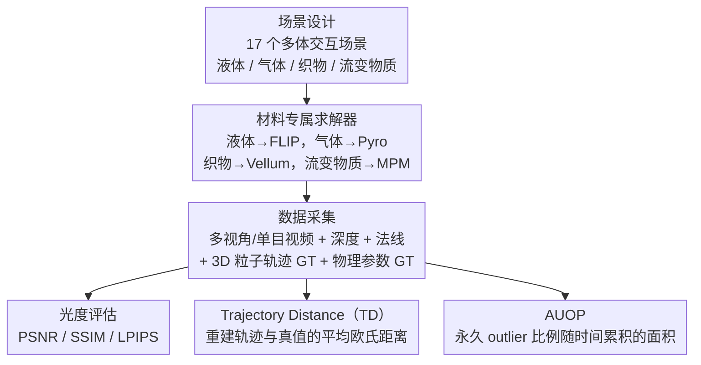

# PhysGaia: A Physics-Aware Benchmark with Multi-Body Interactions for Dynamic Novel View Synthesis

**会议**: CVPR 2026  
**arXiv**: [2506.02794](https://arxiv.org/abs/2506.02794)  
**代码**: [https://cv.snu.ac.kr/research/PhysGaia/](https://cv.snu.ac.kr/research/PhysGaia/)  
**领域**: 3D视觉 / 动态场景重建  
**关键词**: 物理感知基准、动态新视角合成、多体交互、4D高斯溅射、物理参数评估

## 一句话总结
PhysGaia 构建了一个包含 17 个场景的物理感知基准数据集，涵盖液体/气体/织物/流变物质等多种材料的多体交互，提供 3D 粒子轨迹和物理参数（如粘度）的 ground truth，并提出 Trajectory Distance (TD) 和 AUOP 两个新指标来量化 4DGS 方法的物理真实性，揭示了现有 DyNVS 方法在物理推理上的严重不足。

## 研究背景与动机

**领域现状**：动态新视角合成（DyNVS）是近年 3D 视觉的热点方向。从 NeRF 到 4D Gaussian Splatting (4DGS)，现有方法在光度真实性（photorealism）上取得了长足进步，能够从视频输入重建高质量的 4D 时空场景。

**现有痛点**：(1) 现有 DyNVS 数据集（如 D-NeRF、Nerfies、DyCheck）主要关注外观重建质量，几乎不考虑物理真实性；(2) 少数物理相关数据集（如 Spring-Gaus、PAC-NeRF、ScalarFlow）仅限于单一材料（只有流变物质或只有气体）和单物体场景，缺少多体交互；(3) 真实视频虽然可以捕捉复杂场景，但无法提供 3D 轨迹和物理参数的 ground truth，难以定量评估物理推理能力。

**核心矛盾**：DyNVS 正从"看起来像"向"行为像"演进（从 photorealism 到 physical realism），但缺乏支撑这一转变的基准——需要同时具备复杂多体交互、多种材料、可靠物理 ground truth 的数据集。

**本文目标** (1) 构建涵盖 4 类材料多体交互场景的物理感知数据集；(2) 提供完整 ground truth（3D 轨迹 + 物理参数）；(3) 设计物理真实性指标；(4) 揭示现有方法的物理局限。

**切入角度**：利用专业物理求解器（FLIP、Pyro、Vellum、MPM）确保每个场景严格遵循物理定律，生成带有准确物理 ground truth 的合成数据。

**核心 idea**：用材料专属物理求解器生成多体交互基准数据集，同时评估 DyNVS 方法在光度和物理两个维度上的表现。

## 方法详解

### 整体框架
PhysGaia 想回答一个被现有动态重建基准回避的问题：4DGS 方法重建出来的场景，除了"看起来对"，运动是否真的"物理上对"？为此它把整条 pipeline 拆成三层往下走。最上游是场景设计与物理仿真——按液体、气体、织物、流变物质 4 类材料分别选最合适的专业求解器，生成 17 个带多体交互的场景，保证每一帧都严格服从物理定律。中间是数据采集——从仿真器里同时导出多视角/单目视频、深度图、法线图，以及别的真实数据集给不出的两样东西：每个粒子的 3D 轨迹和材料的物理参数（如粘度）的 ground truth。最下游是评估体系——在常规光度指标（PSNR/SSIM/LPIPS）之外，补上两个直接量化"运动对不对"的物理指标 TD 和 AUOP。三层连起来，PhysGaia 才能把"光度真实"和"物理真实"两个维度分开打分。

### 关键设计

**1. 材料专属求解器：让每类材料用它最该用的仿真器**

现有的物理感知 4DGS 工作几乎清一色用 MPM（Material Point Method），但 MPM 本质上是为固体和流变物质设计的，拿它去模拟液体或气体，精度和数值稳定性都不理想。PhysGaia 的做法是不再一个求解器包打天下，而是按材料分工：液体用 FLIP（Fluid-Implicit Particle），气体用 Pyro，织物用 Vellum，流变物质才用 MPM。每个选择都对应该类材料仿真的最佳实践——FLIP 的混合粒子-网格表示在不可压缩流体上比纯粒子的 SPH 更稳定，Pyro 的体素网格能准确捕捉温度、浮力这类热力学效应。正是这种"对症下药"，才让基准里 4 类材料的运动都站得住脚，而不是被统一求解器拉到同一种近似行为上。

**2. Trajectory Distance（TD）：直接量重建轨迹和真值轨迹差多远**

光度指标（PSNR、SSIM）只看渲染出来的图好不好，完全看不出粒子在 3D 空间里实际怎么动——一个粒子完全可能被渲染在"对的"位置，但它走过的轨迹早就错了。TD 把这件事显式量化出来。设重建得到 $M$ 个高斯原语、共 $T$ 帧，先在初始帧用最近邻把每个重建原语 $i$ 匹配到对应的 ground truth 轨迹 $j(i)$，再沿整条时间线算平均欧氏距离：

$$\text{TD} = \frac{1}{MT}\sum_{i}\sum_{t}\big\|X_i^{t,\text{recon}} - X_{j(i)}^{t,\text{gt}}\big\|_2$$

TD 越小，说明重建出来的粒子不只是"看着像"，连运动轨迹都贴着真实物理走。

**3. Area Under the Outlier Percentages（AUOP）：捕捉物理偏差的累积放大**

TD 是全时间线的全局平均，问题是它会被一批精确轨迹拉低均值，掩盖掉"少数轨迹从某一刻起彻底跑偏并再也回不来"这种更严重的失败。AUOP 专门盯这种累积效应。它对每个原语在每个时间步判断偏差是否超过阈值 $\delta$，关键的一笔是"一旦被标记为 outlier 就永远是 outlier"——即 $O_i^t = 1$ 当 $O_i^{t-1}=1$ 或当前偏差超阈值，然后对 outlier 比例随时间的曲线求面积。这种不可逆的标记方式，对应的正是物理仿真里的一个核心现象：初始的小偏差会在后续帧被指数级放大，像混沌系统里的蝴蝶效应。所以 AUOP 衡量的不是某一帧误差多大，而是"有多少轨迹已经永久脱离了物理"，更能反映物理推理失败的严重程度。

### 损失函数 / 训练策略
PhysGaia 是数据集而非模型，不涉及训练。它额外提供 COLMAP 重建点云和与 5 种 4DGS 方法的现成集成 pipeline，让研究者拿来即用。

## 实验关键数据

### 主实验（光度质量 - 单目设置下各材料平均）

| 方法 | 液体 PSNR↑ | 气体 PSNR↑ | 流变物质 PSNR↑ | 织物 PSNR↑ |
|------|-----------|-----------|-------------|-----------|
| D-3DGS | 22.7 | 21.9 | 20.1 | 22.1 |
| 4DGS | 24.2 | 21.7 | 19.5 | 24.9 |
| STG | 19.2 | 21.9 | 13.6 | 21.9 |
| MoSca | 20.5 | 21.2 | 17.8 | 18.6 |
| SoM | 19.6 | 20.0 | 16.7 | 20.7 |

### 消融实验（与现有物理基准对比）

| 基准 | 多体交互 | Dynamic Score↑ | FID↓ | KID↓ |
|------|---------|---------------|------|------|
| ScalarFlow | 否 | 0.391 | 293.5 | 0.255 |
| PAC-NeRF | 否 | N/A | 242.6 | 0.164 |
| Spring-Gaus | 否 | 0.372 | 261.8 | 0.171 |
| **PhysGaia** | **是** | **0.444** | **207.8** | **0.118** |

### 关键发现
- **所有现有方法在 PhysGaia 上的表现远低于在传统数据集上的水平**：即使是多视角设置，平均 PSNR 也低于 30，远不及在 D-NeRF（35+）上的表现。根本原因是多体交互带来的运动复杂度远超单物体形变
- **流变物质场景最难重建**：PSNR 最低（STG 仅 13.6），因为流变物质（如果冻碰撞）涉及多个组件的复杂动力学，现有方法的多项式运动模型或 ARAP 约束无法捕捉
- **针状伪影（needle-like artifacts）是普遍问题**：在 jelly party 等多体碰撞场景中，所有方法都产生严重的几何伪影，说明它们在物理接触区域无法维持合理的高斯分布
- **PhysGaia 的 Dynamic Score 最高（0.444）**，验证了其运动复杂度显著高于现有基准

## 亮点与洞察
- **"一旦 outlier 永远 outlier" 的 AUOP 设计非常精巧**：它捕捉了物理仿真中的一个核心现象——初始偏差会在后续帧中指数级放大。这种不可逆的 outlier 标记方式比简单的帧级误差统计更能反映物理推理的可靠性
- **材料专属求解器的思路对 4DGS 研究有重要启示**：目前几乎所有物理感知 4DGS 都用 MPM，但液体（FLIP）、气体（体素网格+热力学）、织物（Vellum/PBD）需要不同的求解器，这指明了一个被忽视的研究方向
- **提供完整的仿真节点图和源文件**，用户可以自定义生成更高分辨率、更多模态（深度、法线、重打光）的数据，极大提升了基准的可拓展性

## 局限与展望
- **仅 17 个场景**：相对于深度学习模型的数据需求，场景数量偏少，某些材料类别（如气体）仅 2-3 个场景
- **合成数据与真实数据的 domain gap**：虽然 FID/KID 表明视觉保真度较高，但合成渲染与真实世界拍摄之间仍存在纹理和光照分布的差异
- **缺少刚体碰撞场景**：4 类材料都是可变形物质，没有涉及刚体碰撞，而这在机器人操作等应用中同样重要
- **TD 指标的初始帧匹配假设**：如果重建的高斯原语在初始帧就有较大位置误差，最近邻匹配可能导致错误的轨迹对应

## 相关工作与启发
- **vs Spring-Gaus**: Spring-Gaus 仅限流变物质+单物体，PhysGaia 扩展到 4 类材料+多体交互，且提供更丰富的 ground truth
- **vs PAC-NeRF**: PAC-NeRF 的液体场景实际是高粘度流体（行为类似弹性体），PhysGaia 用 FLIP 求解器模拟真正的低粘度液体
- **vs Phystwin**: Phystwin 有 22 个场景但仅限流变物质、无 ground truth 物理参数，PhysGaia 在物理信息完整性上更优
- **启发**：该基准可以推动"物理感知 4DGS"从单材料向多材料、多体交互拓展，特别是如何在一个统一框架中集成多种物理求解器

## 评分
- 新颖性: ⭐⭐⭐⭐ 首个多材料多体交互的物理感知 DyNVS 基准，AUOP 指标设计新颖
- 实验充分度: ⭐⭐⭐⭐ 测试了 5 种主流 4DGS 方法，与 3 个物理基准做了对比，但 TD/AUOP 指标的分析较简略
- 写作质量: ⭐⭐⭐⭐ 结构清晰，可视化效果好，物理求解器选择的论证充分
- 价值: ⭐⭐⭐⭐ 为物理感知动态场景重建指明方向，但场景数量制约了实际应用价值

<!-- RELATED:START -->

## 相关论文

- [\[CVPR 2026\] 3D Gaussian Splatting for Efficient Retrospective Dynamic Scene Novel View Synthesis with a Standardized Benchmark](3d_gaussian_splatting_for_efficient_retrospective_dynamic_scene_novel_view_synth.md)
- [\[CVPR 2026\] Dynamic-Static Decomposition for Novel View Synthesis of Dynamic Scenes with Spiking Neurons](dynamic-static_decomposition_for_novel_view_synthesis_of_dynamic_scenes_with_spi.md)
- [\[CVPR 2026\] RF4D: Neural Radar Fields for Novel View Synthesis in Outdoor Dynamic Scenes](rf4dneural_radar_fields_for_novel_view_synthesis_in_outdoor_dynamic_scenes.md)
- [\[CVPR 2026\] MoVieS: Motion-Aware 4D Dynamic View Synthesis in One Second](movies_motion-aware_4d_dynamic_view_synthesis_in_one_second.md)
- [\[ICLR 2026\] Dynamic Novel View Synthesis in High Dynamic Range](../../ICLR2026/3d_vision/dynamic_novel_view_synthesis_in_high_dynamic_range.md)

<!-- RELATED:END -->
