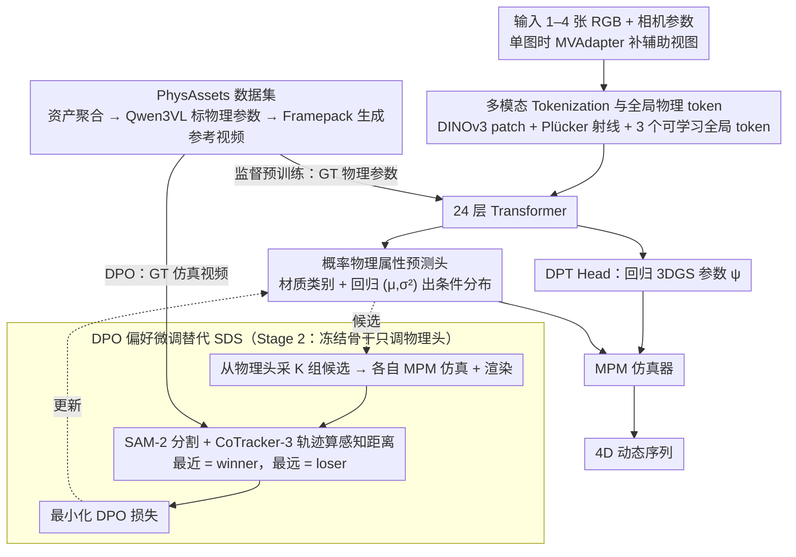

# PhysGM: Large Physical Gaussian Model for Feed-Forward 4D Synthesis

**会议**: CVPR 2026  
**arXiv**: [2508.13911](https://arxiv.org/abs/2508.13911)  
**代码**: [项目页面](https://hihixiaolv.github.io/PhysGM.github.io/)  
**领域**: 3D视觉 / 物理仿真  
**关键词**: 4D合成, 物理感知高斯, 前馈推理, DPO对齐, 单图到4D, MPM仿真

## 一句话总结
首个从单张图像前馈预测3DGS+物理属性（材质类别/杨氏模量/泊松比）的框架，两阶段训练（监督预训练+DPO偏好微调）完全绕过SDS和可微物理引擎，配合50K+ PhysAssets数据集，1分钟内生成高保真4D物理仿真，CLIP_sim和人类偏好率均超越逐场景优化方法。

## 研究背景与动机
**领域现状**: 物理4D合成需先从多视图重建3DGS（数小时）、手动指定物理参数、再运行仿真。SDS基方法（OmniPhysGS/DreamPhysics）尝试从视频模型蒸馏物理先验，但需可微物理引擎，计算昂贵不稳定

**现有痛点**: 三大瓶颈——(a)依赖预重建3DGS（密集多视图+逐场景优化）；(b)物理属性要么手工指定要么SDS优化（不灵活/不稳定）；(c)3DGS与物理模块简单拼接忽略外观中的物理线索

**核心矛盾**: 逐场景优化天然不具备泛化性，每个新场景从头来过；SDS虽数据驱动但需差分物理引擎且不稳定

**本文要解决**: 能否完全绕过逐场景优化，学习一个能从稀疏输入直接前馈生成完整物理4D仿真的生成模型？

**切入角度**: 将问题从"慢迭代重建"重构为"摊还前馈推理"——用大规模数据训练Transformer大模型学习通用物理先验

**核心idea**: 联合预测3DGS+物理属性的前馈Transformer + 概率物理建模 + DPO偏好微调（而非SDS），一次前向传播完成4D推理

## 方法详解

### 整体框架

PhysGM 要回答的是：能不能完全绕开逐场景优化，用一次前向传播就从单图直接吐出可仿真的物理 4D？输入 1–4 张 RGB 图加相机参数，先用 DINOv3 编码图像 patch、用 Plücker 射线编码每像素相机几何，拼接后再附 3 个可学习全局 token，一起送进 24 层 Transformer；输出分两路——DPT Head 回归 3DGS 参数 $\psi$，Physics Head 预测物理属性分布 $\theta$（材质类别 + 杨氏模量/泊松比）；最后把几何和物理参数交给 MPM 仿真器，滚出 4D 动态序列。单图推理时用 MVAdapter 先补出后/左/右辅助视图。整套流程由两阶段训练撑起：先用 PhysAssets 的 GT 物理参数做监督预训练，再冻结骨干、只对物理头跑 DPO 偏好微调。

### 关键设计

**1. 多模态 Tokenization 与全局物理 token：让物理预测看全场景而非局部**

物理属性（这是金属还是果冻）往往要综合整张物体的外观才能判断，只盯局部 patch 会判错。PhysGM 把 DINOv3 的图像特征和 Plücker 射线坐标拼在一起编码几何，再额外挂 3 个可学习全局 token 专供物理头——这些 token 在注意力里聚合全场景的外观线索，物理预测因此建立在"整体材质印象"上，而不是某个局部纹理。

**2. 概率物理属性预测头：用分布而非点估计承认物理的多解性**

同一张外观可能对应多种物理参数（看起来一样硬的东西未必一样的杨氏模量），点估计会武断。Physics Head 因此分两支：分类头 $f_{material}(g_k) \to C$ 出材质类别，回归头输出均值和方差 $(\mu_\theta, \log\sigma_\theta^2) = f_{phys}(g_k)$，定义条件分布 $P(\theta|I) = \mathcal{N}(\theta|\mu_\theta, \text{diag}(\sigma_\theta^2))$，推理时从中采样。概率建模既捕获了"一种外观对应多组参数"的不确定性，又顺带给下一步 DPO 提供了"采样多个候选"的能力——这是后面偏好微调能跑起来的前提。

**3. DPO 偏好微调替代 SDS：把不可微的仿真器当黑盒**

SDS 要让梯度穿过物理引擎，既慢又不稳。PhysGM 改用偏好学习绕过可微性要求：冻结预训练策略作 $\pi_{ref}$，从 $\pi_\omega$ 采 K 组物理参数候选，各自跑 MPM 仿真 + 渲染，用 SAM-2 分割 + CoTracker-3 轨迹算出与 GT 视频的感知距离，最近的当 winner、最远的当 loser，再最小化 DPO 损失

$$L_{DPO} = -\mathbb{E}\Big[\log\sigma\big(\beta\log\tfrac{\pi_\omega(\phi_w|z)}{\pi_{ref}(\phi_w|z)} - \beta\log\tfrac{\pi_\omega(\phi_l|z)}{\pi_{ref}(\phi_l|z)}\big)\Big]$$

整个仿真/渲染被当成黑盒，只比较输出好坏即可学习，训练大幅简化。消融显示去掉概率分布（改点估计）后 DPO 没法采样多候选、直接失效，印证设计 2 与设计 3 是绑在一起的。

**4. PhysAssets 数据集（50K+）：同时喂监督预训练和 DPO**

前馈范式吃数据，而配对"3D 资产–物理标注–仿真参考视频"的大规模数据此前是空白。PhysGM 从 Objaverse/OmniObject3D/ABO/HSSD 聚合资产，用 Qwen3VL 多模态 LLM 从多视图推断材质类别和物理参数，再用 Framepack 生成 GT 仿真视频——前者支撑监督预训练（有 GT 物理参数），后者支撑 DPO 微调（有 GT 仿真视频），一套数据填两个阶段的料。

### 训练策略

两阶段：Stage 1 大规模监督预训练，联合优化重建损失（MSE + Alpha + LPIPS）和物理预测损失；Stage 2 冻结骨干、只微调物理头执行 DPO。32 卡 A800 训练 3 天，每卡 batch size 8。MPM 仿真参数：子步时间 $2\times10^{-5}$ s，帧时间 $4\times10^{-2}$ s，每序列 50 帧。

## 实验关键数据

### 主实验（5种材质对比）

| 方法 | metal CLIP | jelly CLIP | plast. CLIP | snow CLIP | sand CLIP | avg CLIP | avg UPR |
|------|-----------|-----------|------------|----------|----------|---------|---------|
| OmniPhysGS | 0.215 | 0.229 | 0.214 | 0.183 | 0.205 | 0.209 | 10% |
| DreamPhysics | 0.227 | 0.246 | 0.244 | 0.207 | 0.222 | 0.229 | 17.2% |
| PhysGM (w/o DPO) | 0.270 | 0.270 | 0.255 | 0.254 | 0.298 | 0.269 | 30% |
| **PhysGM (w/ DPO)** | **0.273** | **0.277** | **0.269** | **0.255** | **0.300** | **0.275** | **42.8%** |

### 消融实验

| 配置 | avg CLIP_sim | avg UPR | 说明 |
|------|-------------|---------|------|
| PhysGM w/o DPO | 0.269 | 30% | 仅预训练 |
| **PhysGM w/ DPO** | **0.275** | **42.8%** | DPO显著提升UPR (+12.8%) |

### 关键发现
- **前馈超越逐场景优化**: PhysGM在所有材质类型上CLIP_sim和UPR均超越需要数小时的SDS基线——证明前馈不牺牲质量
- **DPO提升感知质量而非数值指标**: DPO后CLIP_sim提升有限但UPR大幅提升12.8%——偏好微调主要改善人类感知的物理真实感
- **概率建模是DPO的基础**: 删除概率分布（改为点估计）后DPO无法有效采样多候选，微调失效
- **联合训练优于分离**: 联合预测外观+物理比分离模块效果更好——验证了外观蕴含物理线索的假设
- **速度**: 1分钟完成完整4D仿真 vs SDS方法数小时

## 亮点与洞察
- **前馈物理推理范式** — 从"逐场景优化"到"摊还推理"的范式转变。PhysGM证明了大模型+大数据可以学习通用物理先验，一次前向传播代替数小时优化
- **DPO在生成模型中的新应用** — 将DPO从语言模型偏好对齐迁移到物理仿真质量对齐，利用非可微仿真器输出构建偏好对的思路极具创新性
- **概率物理建模的设计优雅** — 预测分布而非点估计，既捕获不确定性又为DPO采样提供基础——一举两得

## 局限与展望
- **数据集标注依赖LLM**: Qwen3VL推断的物理参数可能不够精确，专业物理测量数据更可靠
- **GT视频质量**: Framepack生成的参考仿真视频可能本身不够物理真实
- **材质类别有限**: 仅覆盖5种材质类别，未处理复合材质或流体
- **单物体场景为主**: 多物体交互场景的处理能力有待验证
- **改进思路**: 引入真实物理实验视频作为GT；扩展材质类别包括流体/布料；支持用户交互式物理操控

## 相关工作与启发
- **vs PhysGaussian**: PhysGaussian首创3DGS+MPM耦合但需手动设参，PhysGM自动预测物理参数且无需预重建
- **vs OmniPhysGS/DreamPhysics**: 这些SDS方法每场景优化数小时，PhysGM前馈1分钟完成且效果更好
- **vs LGM/GS-LRM**: 这些前馈3D重建方法仅处理静态场景，PhysGM首次嵌入物理推理实现动态4D
- **启发**: DPO+非可微仿真的范式可推广到任何需要黑盒仿真器反馈的生成任务（机器人控制、流体仿真等）

## 评分
- 新颖性: ⭐⭐⭐⭐⭐ 首个前馈物理4D生成框架，DPO替代SDS的思路新颖
- 实验充分度: ⭐⭐⭐⭐ 5种材质对比+消融+用户研究，但缺少更多定量消融
- 写作质量: ⭐⭐⭐⭐⭐ 动机清晰、方法系统、两阶段训练逻辑自然
- 价值: ⭐⭐⭐⭐⭐ 对4D合成和物理感知3D视觉领域具有开创性价值

## 实验

### 表1：物理仿真质量对比（5种材质）

| 方法 | metal CLIPsim | jelly CLIPsim | plasticine CLIPsim | snow CLIPsim | sand CLIPsim | 平均 CLIPsim | 平均 UPR |
|------|:---:|:---:|:---:|:---:|:---:|:---:|:---:|
| OmniPhysGS | 0.2149 | 0.2291 | 0.2135 | 0.1834 | 0.2047 | 0.2091 | 10% |
| DreamPhysics | 0.2273 | 0.2459 | 0.2437 | 0.2071 | 0.2217 | 0.2291 | 17.2% |
| PhysGM (w/o DPO) | 0.2698 | 0.2700 | 0.2547 | 0.2541 | 0.2980 | 0.2693 | 30% |
| **PhysGM (w/ DPO)** | **0.2732** | **0.2774** | **0.2691** | **0.2548** | **0.2997** | **0.2748** | **42.8%** |

### 表2：多视图重建质量（GSO 数据集）

| 方法 | 分辨率 | PSNR↑ | SSIM↑ | LPIPS↓ |
|------|:---:|:---:|:---:|:---:|
| LGM | 256 | 21.44 | 0.832 | 0.122 |
| PhysGM (ours) | 256 | **25.47** | **0.916** | **0.071** |
| GS-LRM | 512 | **30.52** | 0.952 | 0.050 |
| PhysGM (ours) | 512 | 28.95 | **0.953** | **0.039** |

### 表3：效率与泛化对比

| 方法 | 训练方式 | 可泛化 | 推理时间 | CLIPsim |
|------|:---:|:---:|:---:|:---:|
| OmniPhysGS | SDS | ✗ | >12h | 0.2091 |
| DreamPhysics | SDS | ✗ | >0.5h | 0.2291 |
| **PhysGM** | **DPO** | **✓** | **<1min** | **0.2748** |

## 关键发现

- **前馈 vs 逐场景优化**：PhysGM 在不到 1 分钟内完成单图到 4D 仿真（推理 <30s + MPM 仿真），而 OmniPhysGS 需要 >12h、DreamPhysics 需要 >0.5h
- **DPO 显著提升仿真质量**：加入 DPO 后 CLIPsim 从 0.2693 提升到 0.2748，UPR 从 30% 提升到 42.8%（用户偏好率提升 12.8 个百分点）
- **重建质量不逊于专用方法**：在 GSO 256 分辨率上 PSNR 比 LGM 高 4.03dB，仅用 GS-LRM 10% 数据量即在 512 分辨率上 LPIPS 更优
- **唯一全自动方案**：PhysGM 是唯一同时不需要预优化 3DGS、不需要预定义物理参数、可泛化、不依赖 LLM 且推理 <30s 的方法

## 亮点

- **范式创新**：将物理 4D 合成从逐场景优化范式转变为前馈推理范式，速度提升 720× 以上（vs OmniPhysGS 的 12h）
- **DPO 用于物理仿真对齐**：首次将 DPO 引入物理仿真领域，绕过可微分物理引擎的限制，用黑盒仿真器输出构建偏好对
- **概率性物理预测**：输出物理属性的分布而非点估计，自然地支持 DPO 采样和不确定性建模
- **SAM-2 + CoTracker-3 构建偏好标签**：自动化偏好标注流程，用实例分割和轨迹追踪量化仿真视频与 GT 的保真度
- **大规模物理标注数据集 PhysAssets**：50K+ 资产涵盖金属、果冻、橡皮泥、雪、沙等多种材质，填补领域数据空白

## 局限性

- **MPM 仿真计算瓶颈**：MPM 仿真仍是 4D 合成的主要耗时环节（200³ 网格分辨率），限制了实时应用；缺乏高效替代方案处理流体和断裂
- **Sim-to-Real 差距**：训练数据基于合成仿真视频（Framepack 生成），简化的本构模型与真实物理存在固有差异，限制真实世界部署的鲁棒性
- **SH 阶数限制**：球谐函数设为 0 阶（仅漫反射），无法建模视角依赖的高光效果
- **单图深度模糊**：从单张图像重建 3D 的精度受限于遮挡和深度不确定性
- **材质覆盖范围**：虽有 50K 资产，但物理属性标注由 MLLM 推断（非实际测量），准确性有限

## 相关工作

- **vs PhysGaussian**：开创性地将 3DGS 与 MPM 耦合，但需手动逐场景调参；PhysGM 自动预测物理属性
- **vs DreamPhysics/OmniPhysGS**：用 SDS 从视频模型蒸馏物理参数，需可微仿真器且耗时数小时；PhysGM 用 DPO 绕过可微性
- **vs PhysDreamer**：同样用 SDS 优化杨氏模量但不可泛化；PhysGM 首次实现跨场景泛化
- **vs PhysSplat**：利用 LLM 推断物理参数但依赖预重建 3DGS；PhysGM 端到端前馈
- **vs LGM/GS-LRM**：前馈 3D 重建方法但仅预测静态几何，不包含物理属性

## 评分

- 新颖性: ⭐⭐⭐⭐⭐ 首个前馈式物理感知 4D 合成框架，DPO 用于物理对齐是领域首创
- 实验充分度: ⭐⭐⭐⭐ 5 种材质定量对比 + 多视图重建消融 + 用户研究；缺少真实世界定量评估
- 写作质量: ⭐⭐⭐⭐ 逻辑清晰，两阶段动机充分；方法描述详实
- 价值: ⭐⭐⭐⭐⭐ 从根本上改变了物理 4D 合成的范式——从小时级优化到秒级推理

<!-- RELATED:START -->

## 相关论文

- [\[CVPR 2026\] MoRe: Motion-aware Feed-forward 4D Reconstruction Transformer](more_motion-aware_feed-forward_4d_reconstruction_transformer.md)
- [\[CVPR 2026\] From Rays to Projections: Better Inputs for Feed-Forward View Synthesis](from_rays_to_projections_better_inputs_for_feed-forward_view_synthesis.md)
- [\[CVPR 2026\] Particulate: Feed-Forward 3D Object Articulation](particulate_feed-forward_3d_object_articulation.md)
- [\[CVPR 2026\] Z-Order Transformer for Feed-Forward Gaussian Splatting](z-order_transformer_for_feed-forward_gaussian_splatting.md)
- [\[CVPR 2026\] Learning Compact 3D Representations from Feed-Forward Novel View Synthesis](learning_compact_3d_representations_from_feed-forward_novel_view_synthesis.md)

<!-- RELATED:END -->
