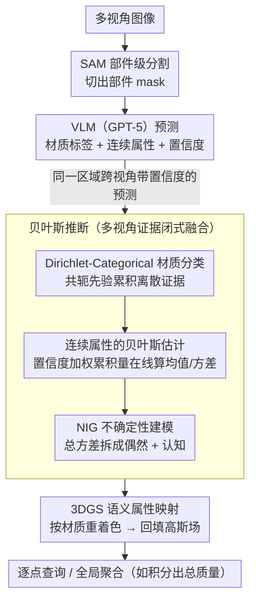

# PhysGS: Bayesian-Inferred Gaussian Splatting for Physical Property Estimation

**会议**: CVPR 2026  
**arXiv**: [2511.18570](https://arxiv.org/abs/2511.18570)  
**代码**: [项目主页](https://samchopra2003.github.io/physgs)  
**领域**: 3D视觉  
**关键词**: 物理属性估计, 贝叶斯推断, 3D高斯溅射, 不确定性量化, 视觉语言模型

## 一句话总结
提出 PhysGS，将贝叶斯推断嵌入3D高斯溅射管线，利用视觉-语言模型先验和多视角置信度加权更新，实现逐点物理属性（摩擦力、硬度、密度、刚度）的概率估计与不确定性量化，在质量估计上比 NeRF2Physics 提升 22.8%（APE），岸氏硬度误差降低 61.2%。

## 研究背景与动机
**领域现状**：理解环境的物理属性（摩擦力、硬度、弹性、密度等）对机器人安全交互至关重要。现有3D重建方法（NeRF、3DGS）主要关注几何和外观，无法推断底层物理属性。

**现有痛点**：
   - NeRF2Physics 等方法用语言嵌入做零样本回归，但没有建模不确定性，在模糊区域（泥土 vs 沥青）容易产生脆弱预测
   - 已有方法通常只估计一两种物理属性（如摩擦力或弹性），不够通用
   - 室外场景几乎未被探索
   - 传感器噪声和模型知识不足导致的两类不确定性（偶然+认知）未被显式建模

**核心矛盾**：如何从视觉传感器出发，在统一框架下估计多种物理属性，同时量化估计的可靠程度

**切入角度**：将每个高斯原语视为概率实体，其物理属性信念通过贝叶斯后验更新不断精化

**核心 idea**：用 Dirichlet-Categorical 模型融合离散材质分类 + Normal-Inverse-Gamma 先验建模连续属性的偶然和认知不确定性

## 方法详解

### 整体框架
PhysGS 想解决的是：从一组普通多视角照片出发，不仅重建出几何，还要逐点估计物体的物理属性（摩擦力、硬度、密度、刚度），并且告诉你每个估计有多可信。整条管线把"看图—问 VLM—贝叶斯融合—回填到 3D 高斯场"串成一条线。具体来说，先用 SAM 把每张图切成部件级的 mask，再让 VLM（GPT-5）对每个部件预测材质标签、连续物理属性以及它自己的置信度；同一块区域会在多个视角下被反复观测，于是这些带置信度的预测被送进一个贝叶斯推断模块逐步融合成后验；最后把融合得到的材质-属性结果回填到 3DGS 重建出的高斯场上，得到一个可以逐点查询、也可以全局聚合（如积分出总质量）的物理属性场。

整篇方法的核心在于：每个高斯原语不再只携带颜色和几何，而被当成一个"对自身物理属性持有概率信念"的实体，信念随着新视角的证据不断被后验更新精化。

### 关键设计

**1. Dirichlet-Categorical 材质分类：让多视角的离散材质判断闭式融合成一个后验**

VLM 在单个视角下给出的材质标签经常不一致——同一块地面，这张图被认成泥土、那张图被认成沥青。直接投票会丢掉置信度信息，也无法在线增量更新。PhysGS 把材质类别建成一个 Categorical 变量，并用它的共轭先验 Dirichlet 分布来累积证据，这样每来一次新预测就能闭式地改写后验，无需重新优化。后验参数的递归更新写作 $\tilde{\alpha}_i \leftarrow \alpha_i(0) + \sum_{m: c_m=i} \lambda p_m$，其中 $p_m$ 是 VLM 对第 $m$ 次预测的置信度，$\lambda$ 是融合步长——置信度越高的预测对后验的拉动越大。最终某点属于材质 $i$ 的后验预测概率就是归一化的 $f(z=i \mid Z, \boldsymbol{\alpha}) = \tilde{\alpha}_i / \sum_j \tilde{\alpha}_j$。共轭性是这里的关键：它让"融合多视角证据"退化成对计数器做加法，天然适配流式、增量的重建场景。

**2. 连续属性的贝叶斯估计：用置信度加权的累积量在线估出每种材质的均值与方差**

材质标签之外，摩擦系数、密度这类连续属性也要估，而且同样需要跨视角融合、又不想把所有历史观测都存下来。PhysGS 对每种材质维护三个置信度加权的累积器：$W_i = \sum p_m$、$S_i = \sum p_m \psi_m$、$Q_i = \sum p_m \psi_m^2$（$\psi_m$ 是第 $m$ 次观测到的属性值）。有了这三个量就能闭式算出后验均值和方差：

$$\mu_i = \frac{S_i}{W_i}, \qquad \sigma_i^2 = \frac{Q_i}{W_i} - \mu_i^2$$

由于某个高斯点的材质本身是不确定的（上一设计给出的后验分布），它最终的属性分布是各材质高斯按材质后验概率加权的混合：$f(\psi \mid Z, \boldsymbol{\alpha}) = \sum_i \frac{\tilde{\alpha}_i}{\sum_j \tilde{\alpha}_j} \mathcal{N}(\mu_i, \sigma_i^2)$。整套估计只靠累加这三个标量，不存历史观测，因此可以边重建边更新。

**3. Normal-Inverse-Gamma 不确定性建模：把总不确定性拆成"感知噪声"和"知识不足"两部分**

对机器人来说，"我估出来的摩擦系数有多不可信"和数值本身一样重要，而且不可信的来源还分两类：一类是传感器/感知噪声带来的偶然不确定性（aleatoric，再多看也消不掉），另一类是观测不够、模型知识不足带来的认知不确定性（epistemic，多看几眼能降下来）。PhysGS 对均值 $\mu_i$ 和方差 $\sigma_i^2$ 的联合后验用 NIG 分布 $p(\mu_i, \sigma_i^2 \mid \tau_i, \kappa_i, \alpha_i, \beta_i)$ 建模，从而把总方差解析地拆开：

$$\text{Var}[\psi_i] = \underbrace{\mathbb{E}[\sigma_i^2]}_{\text{偶然}} + \underbrace{\text{Var}[\mu_i]}_{\text{认知}}, \quad \mathbb{E}[\sigma_i^2] = \frac{\tilde{\beta}_i}{\tilde{\alpha}_i - 1}, \quad \text{Var}[\mu_i] = \frac{\mathbb{E}[\sigma_i^2]}{\tilde{\kappa}_i}$$

这样一来，高偶然不确定性的区域提示"这里本身就难感知"，高认知不确定性的区域提示"再多采几个视角会有帮助"——两类信号对下游决策有不同含义，分开看才有用。

**4. 3DGS 语义属性映射：把材质-属性的后验回填到三维高斯场，支持逐点查询和全局聚合**

前面三步都在"材质-属性"这个语义空间里完成推断，最后还得落回 3D 才能用。PhysGS 用贝叶斯推断确定的材质给每类指定一种代表色，对场景图像做重着色，再把这些带语义的图像作为输入建 3DGS。重建出的每个体素因此关联到一个预测属性值，既能逐点查询（比如某处地面的摩擦力），也能全局聚合（比如对密度场积分出整个物体的总质量）。

### 损失函数 / 训练策略
- 使用 Nerfstudio 的 splatfacto-big 变体重建，20k 迭代，单卡 RTX A5000
- VLM 使用 GPT-5，配结构化的视觉-文本 prompt 来获取材质标签、属性值及置信度

## 实验关键数据

### 主实验——质量估计（ABO-500 测试集，100个物体）

| 方法 | ADE↓(kg) | ALDE↓ | APE↓ | MnRE↑ |
|------|---------|--------|------|-------|
| Image2mass | 12.496 | 1.792 | 0.976 | 0.341 |
| 2D CNN | 15.431 | 1.609 | 14.459 | 0.362 |
| LLaVA | 17.328 | 1.893 | 1.837 | 0.306 |
| NeRF2Physics | 8.730 | **0.771** | 1.061 | **0.552** |
| **PhysGS** | **8.254** | 0.999 | **0.819** | 0.474 |

### 消融实验（ABO-500 验证集）

| 配置 | ADE↓ | APE↓ | 说明 |
|------|------|------|------|
| NeRF2Physics | 9.786 | 0.931 | 基线 |
| PhysGS (w/o 贝叶斯) | 9.728 | 0.717 | 去掉贝叶斯更新 |
| **PhysGS (w/ 贝叶斯)** | **9.187** | **0.715** | 完整模型 |

### 关键发现
- PhysGS 在 APE 上相比 NeRF2Physics 降低 22.8%（1.061→0.819），ADE 降低 5.5%
- 贝叶斯推断相比不做贝叶斯更新的变体，ADE 降低 5.6%
- 岸氏硬度误差降低 61.2%，动摩擦系数误差降低 18.1%
- 偶然不确定性高的区域对应传感器噪声大或材质识别困难区域，认知不确定性高的区域对应证据不足区域——与直觉一致

## 亮点与洞察
- **贝叶斯推断 + 3DGS 的结合有理论美感**：将每个高斯原语视为概率实体并通过后验更新，是一个自然且优雅的建模方式。置信度加权的在线更新不需要存储历史数据，适合增量重建
- **不确定性分解的实用性**：偶然 vs 认知的区分对下游机器人决策非常重要。比如在高认知不确定性区域，机器人应该更谨慎或寻求更多观测
- **VLM 作为物理先验源**：利用 GPT-5 作为材质识别和属性估计的零样本先验源是一个可行方案，虽然精度有限但通过贝叶斯多视角融合可以显著改善

## 局限与展望
- VLM 的物理属性估计是零样本的，缺乏领域校准，可能在非常见材质上偏差很大
- 质量估计依赖于密度估计 × 体积积分，体积估计的误差会级联放大
- NeRF2Physics 在 ALDE 和 MnRE 上仍然更好，说明在某些度量下贝叶斯方法反而引入了偏差
- 需要 SAM 分割和 VLM 推理，计算成本较高（相比纯几何方法）
- 室外场景的验证主要是定性的，缺少定量基准

## 相关工作与启发
- **vs NeRF2Physics**：NeRF2Physics 用 CLIP 嵌入 + 核回归做属性估计，无不确定性建模。PhysGS 通过贝叶斯更新在多数指标上更优，但 ALDE 和 MnRE 落后
- **vs GaussianProperty**：同样基于3DGS+VLM，但没有贝叶斯更新和不确定性分解
- **vs EVORA/MEM 等不确定性方法**：它们在2D感知中建模不确定性，PhysGS 是首个在3DGS中同时做物理属性+不确定性的工作

## 评分
- 新颖性: ⭐⭐⭐⭐ 贝叶斯推断+3DGS+物理属性的三者结合有创新性，NIG分解也有理论深度
- 实验充分度: ⭐⭐⭐ 数据集和基线较有限，室外场景缺少定量评估
- 写作质量: ⭐⭐⭐⭐ 数学推导完整清晰，问题动机表述好
- 价值: ⭐⭐⭐⭐ 不确定性感知的物理属性估计对机器人领域有重要意义

<!-- RELATED:START -->

## 相关论文

- [\[CVPR 2026\] Adapting Point Cloud Analysis via Multimodal Bayesian Distribution Learning](adapting_point_cloud_analysis_via_multimodal_bayesian_distribution_learning.md)
- [\[CVPR 2026\] P2GS: Physical Prior-guided Gaussian Splatting for Photometrically Consistent Urban Reconstruction](p2gs_physical_prior-guided_gaussian_splatting_for_photometrically_consistent_urb.md)
- [\[CVPR 2026\] IDESplat: Iterative Depth Probability Estimation for Generalizable 3D Gaussian Splatting](idesplat_iterative_depth_probability_estimation_for_generalizable_3d_gaussian_sp.md)
- [\[CVPR 2026\] PhysGM: Large Physical Gaussian Model for Feed-Forward 4D Synthesis](physgm_large_physical_gaussian_4d_synthesis.md)
- [\[CVPR 2026\] PRIMU: Uncertainty Estimation for Novel Views in Gaussian Splatting from Primitive-Based Representations of Error and Coverage](primu_uncertainty_estimation_for_novel_views_in_gaussian_splatting_from_primitiv.md)

<!-- RELATED:END -->
