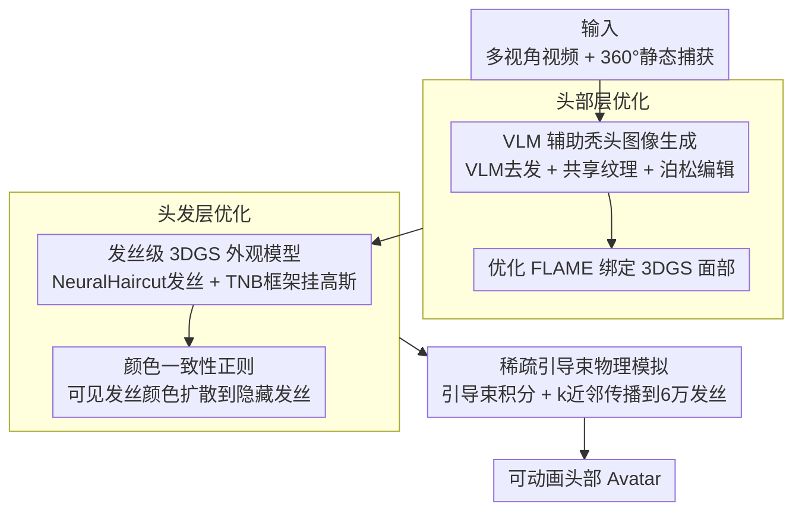

# PhysHead: Simulation-Ready Gaussian Head Avatars

**会议**: CVPR 2026  
**arXiv**: [2604.06467](https://arxiv.org/abs/2604.06467)  
**代码**: [https://phys-head.github.io](https://phys-head.github.io)  
**领域**: 3D视觉 / 头部Avatar  
**关键词**: 头部Avatar重建, 3D高斯溅射, 发丝物理模拟, 分层表示, VLM辅助

## 一句话总结
提出PhysHead——首个将物理驱动头发动力学与可动画3DGS头部Avatar结合的方法：用FLAME网格+3DGS建模可表达面部、用发丝(strand)+3DGS建模头发外观、用物理引擎驱动头发动画，并通过VLM生成秃头图像实现头发与面部的分层优化。

## 研究背景与动机

**领域现状**：现有数据驱动的可动画头部Avatar方法（如GA、GHA）能达到高质量渲染，但普遍将头发当作头部的刚性外壳——转头时头发不会自然飘动。近期工作开始分离头发和头部（DELTA、MeGA），但头发仍是静态的。并行工作（HairCUP）虽可组合分解但使用非结构化高斯，不支持物理模拟。

**现有痛点**：(1) 大多数Avatar方法中头发是刚体，无法模拟风吹、甩头等动态效果；(2) 数据驱动的头发动力学方法（如学习从数据中拟合动力学）无法泛化到未见过的动力学场景——不可能捕获所有可能的头发运动；(3) 影视/游戏中的发丝级表示可以用物理引擎模拟，但通常只关注几何，外观由美术师手工制作，不包含真实感表情。

**核心矛盾**：需要同时满足两个需求——(1) 基于3DMM驱动的真实感面部Avatar；(2) 与物理引擎兼容的发丝表示以实现动态头发。现有方法无法同时满足。

**本文目标** 构建一个既有参数化面部控制（表情+头姿）、又有物理引擎驱动的真实感头发动画的头部Avatar。

**切入角度**：分层表示——面部用FLAME+3DGS、头发用strand+3DGS，分别建模后通过物理引擎实现头发与头姿的动态耦合。

**核心 idea**：用分层3DGS表示（FLAME面部层+发丝头发层）构建可模拟的头部Avatar，并提出VLM辅助的秃头图像生成和颜色一致性正则来解决分层优化中的遮挡问题。

## 方法详解

### 整体框架
输入多视角视频和360°静态捕获。方法包含两阶段优化：(1) **头部层优化**：先用VLM编辑去除头发生成秃头训练图像，在这些图像上优化FLAME绑定的3DGS面部模型；(2) **头发层优化**：在头部层之上，用NeuralHaircut初始化发丝几何，将3DGS挂载到发丝段上优化外观。最终头发通过物理引擎中的引导束(guiding strands)+稀疏-密集传播实现动画。

### 关键设计

**1. VLM 辅助秃头图像生成：先把头发"擦掉"，才能重建被它遮挡的耳朵和颈部**

头部层要单独优化面部 Avatar，可训练图像里头发死死盖住了耳朵、颈部和部分脸颊，这些区域根本没有监督信号。PhysHead 的做法是先生成一批"无头发"的训练图：用 Nano-Banana VLM 自动给首帧去掉头发，再从中筛出多视角一致的若干视角，在这些稀疏视角上通过可微渲染优化一张 FLAME 共享纹理贴图 $T \in \mathbb{R}^{2048 \times 2048 \times 3}$。有了这张纹理后，对每个训练帧都用它渲染出对应姿态的"外观代理"，再用泊松图像编辑（Poisson blending）把代理与原图的面部区域无缝混合，得到这一帧的秃头版本。相比 HairCUP 用 SDS 蒸馏去发，VLM 生成的秃头图质量更高、也能泛化到不同肤色；而共享纹理加泊松编辑则保证了拼接处不会出现强边界伪影。

**2. 发丝级 3DGS 外观模型：把真实感外观直接挂到能被物理引擎模拟的发丝上**

要让头发既真实又能物理模拟，关键是表示形式得同时满足渲染和仿真——非结构化高斯渲染好看却没法进物理引擎。PhysHead 改用发丝（strand）作为骨架：从 NeuralHaircut 拿到几何，均匀重采样成 $m=60000$ 根发丝、每根 $n=16$ 个点，再给每一个发丝段挂一个 3DGS primitive，用 Frenet-Serret 框架（TNB frames）算出它的旋转。每个高斯被设成沿发丝方向拉长的椭球：均值取段两端中点 $\mathbf{g}_{\text{mean}}=(p_1+p_2)/2$，尺度沿切向取段长、另两轴取一个很细的常数 $\mathbf{g}_{\text{scale}}=(\|p_2-p_1\|, k, k)$，$k=0.0001$。这样几何完全由发丝定义，外观才能搭在一套能直接接受碰撞检测、重力、风力约束的结构上。

**3. 颜色一致性正则：让看不见的内层发丝也有合理颜色**

头发层的 photometric loss 只在 mask 内的可见发丝上计算，于是内层、背面那些从没被任何视角看到的发丝会学到一堆随机颜色——平时藏着没事，一旦头发甩动暴露出来就是刺眼的伪影。为此 PhysHead 对每根发丝 $i$ 和它的近邻 $j \in \mathcal{N}(i)$ 加一个颜色差异正则，把可见发丝学到的颜色顺着邻接关系扩散到隐藏发丝：

$$\mathcal{L}_{\text{consistency}} = \sum_{i \in \mathcal{S}} \sum_{j \in \mathcal{N}(i)} \|\mathbf{c}_i - \mathbf{c}_j\|_2^2$$

这一项在外层 RGB 优化跑了若干次迭代之后才启用，先让可见发丝把颜色学准，再扩散出去，避免一开始就把错误颜色互相传染。

**4. 稀疏引导束物理模拟：用少量引导束驱动 6 万根发丝动起来**

直接对 6 万根密集发丝逐根做物理积分，计算成本扛不住。PhysHead 沿用图形学里的标准套路：从密集发丝中挑出一小撮稀疏引导束（guiding strands）建成一个 hair particle system，只对这批引导束用物理引擎（半隐式欧拉积分 + 迭代约束求解器）算动力学，再通过 k 近邻 strand skinning 把引导束的相对位移按距离反比的权重插值传播回密集发丝。这样既保住了密集发丝的视觉细节，又把仿真规模压到可承受的量级，让头发能对转头、甩头、风吹等任意头姿和外力做出响应。

### 损失函数 / 训练策略
头部层损失：$\mathcal{L} = (1-\lambda)\mathcal{L}_1 + \lambda\mathcal{L}_{\text{D-SSIM}} + \lambda_{\text{pos}}\mathcal{L}_{\text{pos}} + \lambda_{\text{scaling}}\mathcal{L}_{\text{scaling}}$，$\lambda=0.2$。仅在面部mask区域计算loss。

头发层损失：$\mathcal{L}_{\text{hair}} = \mathcal{L}_{\text{rgb}} + \lambda_{\text{consistency}}\mathcal{L}_{\text{consistency}}$，其中RGB损失仅在头发mask区域计算。发丝的scale和rotation从TNB frames初始化后固定，opacity固定为1，仅优化颜色和球谐系数。

## 实验关键数据

### 主实验（与GaussianHaircut对比）

| 方法 | PSNR↑ | SSIM↑ | LPIPS↓ |
|------|-------|-------|--------|
| GaussianHaircut | 30.55 | 0.915 | 0.071 |
| Ours w/ $\mathcal{L}_{\text{consistency}}$ | 28.24 | 0.893 | 0.078 |
| **Ours (完整)** | **30.28** | **0.946** | **0.061** |

### 消融实验

| 配置 | 说明 |
|------|------|
| 无颜色一致性损失 | 内层发丝出现随机颜色，动画时产生严重伪影 |
| 有颜色一致性损失 | 隐藏发丝获得合理颜色，可用于物理模拟 |
| 单层表示（不分层） | 动画时出现皮肤剥落、隐藏区域处理差 |
| 分层表示（头部+头发） | 可独立控制表情和头发物理模拟 |

注：颜色一致性损失在5000次迭代后启用最佳，允许可见发丝先学好颜色再扩散到隐藏发丝。

### 关键发现
- **PhysHead的核心优势不在静态重建质量（与GaussianHaircut相当），而在于动画能力**——是唯一支持物理驱动头发动画的方法
- GaussianHaircut的发丝会穿透头部并学到皮肤颜色，使其不适合作为物理模拟的外观模型
- 与GA/GHA相比：当头部运动较小时基线方法质量相近(t=0)，但在大幅运动（转头、点头、风吹）时差异明显——基线方法的头发始终刚体运动
- 与HairCUP相比：HairCUP使用SDS导致头部层有伪影，且倾向于生成相同肤色；PhysHead使用VLM泛化性更好

## 亮点与洞察
- **VLM+可微渲染+泊松编辑**的组合方案很巧妙——VLM做粗略去发，可微渲染生成共享纹理作为遮挡区域代理，泊松编辑实现无缝融合。这种流程可以迁移到其他需要分离前景/背景的场景
- **发丝3DGS绑定**：用TNB frames给发丝段分配elongated Gaussian的做法简洁有效——几何由发丝定义且固定，只优化颜色和球谐系数，大幅简化优化
- **从复杂连续体到离散可模拟表示的转换思路**：将"发丝外观+物理模拟"解耦——物理引擎处理运动，3DGS处理渲染，两者通过strand的几何位置连接。这种组合可推广到衣物、流体等可变形物体

## 局限与展望
- 外观质量依赖前景/头发mask质量，不完美的mask会导致错误的分层
- 发丝几何来源于NeuralHaircut，继承了其局限性（如对卷发重建效果差）
- 物理模拟的真实感取决于稀疏引导束到密集发丝的传播质量，复杂发型可能传播不准确
- 未展示定量的动画质量评估（如与真实动态头发视频的对比）
- 训练需要多视角视频+360°静态捕获，数据获取成本较高

## 相关工作与启发
- **vs Gaussian Avatars (GA)**: GA用FLAME绑定3DGS实现面部控制，但头发作为3DMM offset是刚体的。PhysHead将GA的面部层方案与发丝物理模拟结合
- **vs GaussianHaircut**: 专注发丝几何和外观重建，但存在发丝穿透头部和学到皮肤色的问题，且不支持动画。PhysHead通过分层优化解决了这些问题
- **vs HairCUP**: 同为分层方法但使用SDS获取秃头图像（质量差、颜色偏差），使用非结构化高斯（不支持物理模拟）。PhysHead的VLM方案更鲁棒、发丝表示更适合模拟
- **vs 数据驱动头发动力学方法**: 从数据学习动力学无法泛化到未见过的运动。PhysHead使用通用物理引擎，可泛化到任意头姿和外力

## 评分
- 新颖性: ⭐⭐⭐⭐ 将物理引擎驱动的发丝动力学与3DGS头部Avatar结合是开创性工作，VLM辅助分层方案有新意
- 实验充分度: ⭐⭐⭐ 定性比较充分展示了动画优势，但定量评估有限（仅静态重建指标），缺少动画质量的定量度量
- 写作质量: ⭐⭐⭐⭐ 问题动机清晰，方法流程条理分明
- 价值: ⭐⭐⭐⭐ 为可模拟头部Avatar开辟了新方向，是迈向高度真实人类Avatar的重要一步

<!-- RELATED:START -->

## 相关论文

- [\[CVPR 2025\] SimAvatar: Simulation-Ready Avatars with Layered Hair and Clothing](../../CVPR2025/3d_vision/simavatar_simulation-ready_avatars_with_layered_hair_and_clothing.md)
- [\[CVPR 2026\] MotionAnymesh: Physics-Grounded Articulation for Simulation-Ready Digital Twins](motionanymesh_physics-grounded_articulation_for_simulation-ready_digital_twins.md)
- [\[CVPR 2026\] ProgressiveAvatars: Progressive Animatable 3D Gaussian Avatars](progressiveavatars_progressive_animatable_3d_gaussian_avatars.md)
- [\[CVPR 2026\] Motion-Aware Animatable Gaussian Avatars Deblurring](motion-aware_animatable_gaussian_avatars_deblurring.md)
- [\[CVPR 2026\] ReWeaver: Towards Simulation-Ready and Topology-Accurate Garment Reconstruction](reweaver_towards_simulation-ready_and_topology-accurate_garment_reconstruction.md)

<!-- RELATED:END -->
