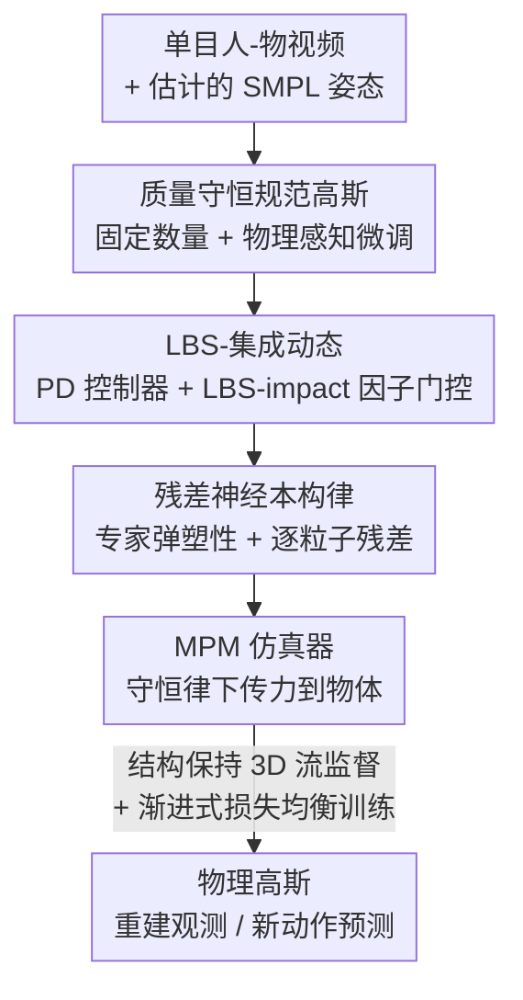

# PhysHO: Physics-Based Dynamic 3D Gaussian Human and Object from Monocular Video

**会议**: CVPR 2026  
**论文**: [CVF Open Access](https://openaccess.thecvf.com/content/CVPR2026/html/Jiang_PhysHO_Physics-Based_Dynamic_3D_Gaussian_Human_and_Object_from_Monocular_CVPR_2026_paper.html)  
**代码**: 项目页 https://suezjiang.github.io/physho/  
**领域**: 3D视觉  
**关键词**: 物理重建, 3D高斯, 人物交互, 物质点法MPM, 单目视频

## 一句话总结
PhysHO 把 SMPL 驱动的线性混合蒙皮（LBS）当作"人体内部驱动力的先验"、把物质点法（MPM）当作把这些力通过接触传播到物体的物理引擎，再叠上逐粒子的残差神经本构律，从一段单目视频里重建出物理上合理的"人推/拽物体"动态，并能在新动作下做外推预测。

## 研究背景与动机
**领域现状**：从视频重建可仿真的动态场景，主流有两条路。一条是动态 3D 高斯（4D Gaussian、运动基、形变场、GART 等），渲染质量高；另一条是物理重建，把可微渲染器（NeRF/3DGS）和可微仿真器（MPM）耦合起来，从视频反推材料属性、恢复物体动态。

**现有痛点**：动态高斯类方法只是把时间条件的形变函数过拟合到观测帧，**没有物理约束**，无法外推到没见过的新动作、也不能做预测；一旦给未来人体姿态，运动基会失效甚至把物体结构压垮。物理重建类方法虽有物理约束，却几乎都**只考虑重力和地面接触**，忽略了人体主动产生的内部驱动力，而且依赖理想化的本构律（均质、各向同性），拟合不了真实材料的异质性和各向异性。

**核心矛盾**：真实的"人和物体交互"场景里，运动来源不只是重力，还有人通过肢体注入的内部力——这些力既要从观测里被"辨识"出来，又只应作用在人体内部（物体只能靠接触被动传力）。同时材料千差万别，纯专家本构律表达力不足，但纯神经本构律又容易让仿真器发散崩溃。

**本文目标**：单目视频下，既能高保真重建观测到的人-物动态，又能在新人体动作下做物理上合理的仿真预测。

**切入角度**：作者的关键观察是——SMPL+LBS 已经能解释"人在哪里、怎么动"，那它天然就是一个**内部驱动力的可解释先验**；只要用它告诉 MPM"哪些粒子该被主动驱动、驱动多大"，再让 MPM 在守恒律下把力传出去，就能把"人主动施力"这件事建模进物理仿真。

**核心 idea**：用 LBS 轨迹经 PD 控制器生成驱动力、用逐粒子可学的 LBS-impact 因子把力**只注入 SMPL 体内**，再用叠在专家本构律上的残差神经项表达异质/各向异性材料，最后靠结构保持的 3D 流监督把单目优化变得良定。

## 方法详解

### 整体框架
PhysHO 输入是一段单目"人-物交互"视频，输出是一组既能复现观测、又能在新动作下仿真预测的物理高斯。整体把 3D 高斯同时当作 MPM 仿真粒子，分四块串起来：先在"旋转身体"片段里学一套质量守恒、数量固定的规范空间高斯并做物理感知微调；进入动态片段后，用 LBS 轨迹经 PD 控制器算驱动力、再被 LBS-impact 因子门控只注入人体内部；MPM 仿真时每个粒子的应力 = 专家弹塑性本构 + 逐粒子残差神经本构；训练上先求一套结构保持的 3D 流当监督，再按"先易后难、按损失分配迭代"的渐进式日程优化。

### 关键设计

**1. 质量守恒规范高斯 + 物理感知微调：把渲染参数对齐到形变梯度**

物理重建要求粒子数量固定、质量守恒，所以高斯必须先在一个规范空间里预重建好再当仿真粒子用。与 GART 引入隐式骨骼和可学蒙皮权重不同，PhysHO 直接用**原始 SMPL 骨骼 + 固定蒙皮权重**学规范高斯 $G=\{(\mu_c^i,R_c^i,S_c^i,\eta_c^i,h_c^i)\}$，因为用于学规范空间的"旋转身体"片段除了整体转身没有显著非刚性形变，没必要上额外自由度。问题是：物理仿真带来的形变会通过形变梯度 $F^{i,n}$ 改写协方差 $\Sigma^{i,n}=F^{i,n}R_{lbs}^{i,0}S_{lbs}^{i,0}(S_{lbs}^{i,0})^\top(R_{lbs}^{i,0})^\top(F^{i,n})^\top$，而原始外观参数没适配这种形变，直接套用会让纹理糊掉。于是作者把 LBS 各帧的高斯均值当作"期望粒子位置"、用中心差分估速度，在 $\sigma=0$、塑性恒等的设定下跑一遍 MPM 拿到 $F^{i,n}$，再用 RGB 损失 $\mathcal{L}_{RGB}=\|I-I^*\|_1$ 微调外观参数。这一步把"运动学 LBS"和"物理驱动形变"桥接起来，让外观参数适配形变梯度，同时保持粒子集质量守恒。

**2. LBS-集成动态：用 LBS-impact 因子把驱动力只注入人体内部**

这是本文最核心的创新，针对"人体内部力如何辨识与建模"这一痛点。作者把 LBS 位置轨迹当参考运动，用 PD 控制器算每个粒子的附加力 $f_{PD}^{i,n}=k_p(\mu_{lbs}^{i,n}-x^{i,n})+k_d(v_{lbs}^{i,n}-v^{i,n})$。但不是所有粒子都该受这个力——内部驱动只能源自人体，物体粒子只能靠接触被动传力，而且第二阶段的参考轨迹本身不完美（尤其非刚性区域）。于是引入逐粒子可学系数 $\omega_i$ 做门控：$f_{ex}^{i,n}=\omega_i f_{PD}^{i,n}$。在规范空间里，**SMPL 模板表面之外的粒子（物体粒子、人体外表面）一律被设为 $\omega_i=0$**，彻底不接受 PD 力；只有严格落在 SMPL 体内的粒子才有可学的 $\omega_i$ 控制受力强度。这样就实现了"定向驱动"——只有人体内部被直接驱动，避免在物体上凭空冒出力，从而提升交互保真度。

**3. 残差神经本构律：在专家弹塑性骨架上叠逐粒子残差表达异质/各向异性**

经典 MPM 假设均质各向同性，即便学空间变化的杨氏模量 $E$、泊松比 $\nu$ 也不足以刻画各向异性和复杂空间变化。NCLaw 证明神经本构能捕捉丰富的各向异性，但它本质是空间均质的，应付不了"材料和位置都在变"的场景；而纯靠逐帧渲染损失学异质神经本构是病态的，无约束的预测很容易让仿真器崩溃。作者的做法是把神经项写成**叠在专家模型上的残差**：弹性 $\sigma=E(F,E,\nu)+E_\theta(F,l_e)$，塑性 $F=P(F^{trial})+P_\theta(F^{trial},l_p)$，其中 $l_e,l_p$ 是逐粒子特征向量。专家项提供稳健的弹塑性骨架，逐粒子条件的残差项负责空间异质和方向各向异性。这一思路受 NeuMA 启发（给预训练 NCLaw 加 LoRA 残差 $M_\theta:=M_0+\Delta M_\theta$），既拿到了表达力，又保住了物理结构和数据效率上的稳定。

**4. 结构保持 3D 流监督 + 渐进式损失均衡训练：把单目优化变良定**

单目 + 耦合的"驱动 + 弹塑性动态"让优化严重欠约束，纯 RGB 监督会把高斯逼成不合理形状。作者先**逐帧优化粒子位置 $x'_n$ 得到一套结构保持的 3D 流**：对每帧从 $x'_n$ 算形变梯度并渲染，用 RGB 损失 + 光流损失 + as-rigid-as-possible（ARAP）刚性正则联合优化 $\mathcal{L}_{SP\text{-}Flow}=\lambda_{rgb}\mathcal{L}_{rgb}+\lambda_{flow}\mathcal{L}_{flow}+\lambda_{arap}\mathcal{L}_{arap}$，这套 3D 流保住了内在结构、给仿真器提供 3D 监督。端到端损失则把仿真推进后的位置对齐到优化流：$\mathcal{L}_{E2E}=\lambda_{rgb}\mathcal{L}_{rgb}+\lambda_{3Dflow}\|x_{n+1}-x'_{n+1}\|_1$，并加正则 $R$ 限制残差幅度和注入驱动力的大小。最后用**渐进式损失均衡日程**：材料参数主宰全局动态，早期帧不准时硬拟合后期帧会让训练失稳，所以先用很短的前缀帧训练，等早期动态稳定再扩窗，每个周期后按逐帧损失把更多迭代分配给损失高的难帧，既加速收敛又不浪费更新在已拟合好的帧上。

### 损失函数 / 训练策略
密度 $\rho$ 手动设定，联合优化逐粒子 $E,\nu$、LBS-impact 因子 $\omega$、特征向量 $(l_e,l_p)$ 以及残差网络 $E_\theta,P_\theta$ 的参数。正则项 $R=\lambda_{law}(\|E_\theta(F,l_e)\|^2+\|P_\theta(F^{trial},l_p)\|^2)+\lambda_\omega\|\omega\|^2$ 同时约束残差幅度与注入驱动力。整套训练分两阶段：旋转身体阶段重建高质量高斯，动态阶段学材料属性并匹配观测，配合渐进式损失均衡日程稳定收敛。

## 实验关键数据

作者自采了一个 1080p、30 FPS 的单目数据集（静态相机、竖轴对齐重力方向），含 8 段序列、6 个物体；每段分"旋转身体"和"动态"两个阶段，动态阶段又拆成观测部分和预测部分。SMPL 姿态用现成估计器获得。

### 主实验
重建与未来预测的渲染精度对比（节选，PSNR/SSIM 越高越好，LPIPS 越低越好；Full 为整段序列，#-#% 为大形变子集）：

| 任务 | 序列 / 子集 | 指标 | Ours | GART | 4D-Gaus |
|------|------|------|------|------|---------|
| 重建 | Square Pillow Full | LPIPS↓ | **0.1079** | 0.1282 | 0.1099 |
| 重建 | Square Pillow 40-60% | LPIPS↓ | **0.1150** | 0.1322 | 0.1180 |
| 重建 | C-shape Pillow #1 Full | LPIPS↓ | **0.0676** | 0.0690 | 0.0703 |
| 预测 | Square Pillow Full | PSNR↑ | **18.94** | 18.57 | —（无法外推） |
| 预测 | Square Pillow 30-50% | PSNR↑ | **18.18** | 16.80 | — |

关键 caveat：在 PSNR/SSIM 上 GART 和 4D-Gaus 有时反而更高，作者解释这是因为它们的高斯**持续优化外观去贴 GT**，能过拟合像素级指标；而 PhysHO 为学物理模型必须**固定外观**，所以更吃亏。但 PSNR/SSIM 主要看像素对齐，LPIPS 才看纹理保真和感知相似——PhysHO 在 LPIPS 上一致领先，说明视觉真实感和纹理保持更好。预测任务里 4D-Gaus 根本无法外推到训练帧之外，GART 在大形变帧会严重退化甚至压垮物体结构，PhysHO 靠物理仿真在整段序列保持稳健，掩码 IoU 也更高。

### 消融实验
| 配置 | PSNR↑ | SSIM↑ | LPIPS↓ | IoU↑ | 说明 |
|------|------|------|--------|------|------|
| Full | **24.03** | **0.9534** | **0.0652** | **0.8845** | 完整模型 |
| w/o $l_e,l_p$ | 23.54 | 0.9436 | 0.0680 | 0.8636 | 去逐粒子特征，物理模型表达力下降 |
| w/o $E_\theta,P_\theta$ | 22.26 | 0.9387 | 0.0664 | 0.8289 | 只用专家本构，复现不了观测动态 |

渲染质量上的微调消融（旋转身体阶段）：

| 配置 | PSNR↑ | SSIM↑ | LPIPS↓ |
|------|------|------|--------|
| w Fine-tuning | **27.30** | **0.9464** | **0.0681** |
| w/o Fine-tuning | 25.42 | 0.9292 | 0.0854 |

### 关键发现
- **残差神经本构（$E_\theta,P_\theta$）贡献最大**：去掉后 PSNR 从 24.03 掉到 22.26、IoU 从 0.8845 掉到 0.8289，说明纯专家本构无法复现真实异质材料的动态。
- **物理感知微调不可省**：不微调时直接用形变梯度套协方差会让规范高斯不再贴合观测、纹理糊化，PSNR 掉约 1.9 dB。
- **3D 流监督是稳定阀门**：作者指出没有 3D 流监督时，残差神经模型会去过拟合大重建误差的帧，导致对专家本构过度修正、训练失败。

## 亮点与洞察
- **把 SMPL/LBS 重新定位成"驱动力先验"而非"形状先验"**：以往 SMPL 多用来约束几何或蒙皮，这里把它的轨迹当作 PD 控制器的参考，配合逐粒子门控因子，干净地解决了"人主动施力、物体被动受力"的建模难题——这个视角迁移性很强，凡是"主动体 + 被动体接触"的场景都可借鉴。
- **残差写法兼顾表达力与稳定性**：专家弹塑性当骨架、神经项当残差，既避免纯神经本构发散，又拿到逐粒子异质/各向异性表达，是"物理先验 + 神经修正"范式在本构建模上的漂亮落地。
- **诚实地讨论了 PSNR/SSIM 的误导性**：作者主动点明固定外观换来的指标劣势，并用 LPIPS/IoU 论证真实视觉质量，这种自洽分析值得借鉴。

## 局限与展望
- **依赖固定相机与重力对齐假设**：数据集是静态相机、竖轴对齐重力方向采集的，真实手持/运动相机下的鲁棒性未验证。⚠️
- **SMPL 姿态来自现成估计器**：内部驱动先验的质量直接受姿态估计精度影响，参考轨迹在非刚性区域本就不完美（作者也承认），姿态误差可能进一步劣化驱动建模。
- **规范空间假设无显著非刚性形变**：用固定蒙皮权重的前提是旋转身体阶段除转身外无大形变，对穿着宽松衣物、大幅非刚性形变的人体可能不成立。
- **数据规模有限**：仅 8 序列 6 物体且为自采，跨物体材料、跨场景泛化能力有待更大规模验证。

## 相关工作与启发
- **vs GART**：GART 用 SMPL 骨骼 + 隐式骨骼 + 可学蒙皮权重重建动态人体高斯，渲染好但纯过拟合观测帧、无物理约束，给未来姿态会失效甚至压垮物体；PhysHO 用原始 SMPL + 固定蒙皮，把 LBS 当物理驱动先验，能外推预测。
- **vs 4D-Gaussian**：4D-Gaus 学时间条件形变场，视觉偏糊且**完全无法外推**到训练帧之外；PhysHO 靠物理仿真可在新动作下预测。
- **vs PhysRig**：PhysRig 也注入驱动力（学速度控制学骨架驱动动态），但需要合成 3D 监督，难迁移到真实视频；PhysHO 在单目真实视频上用 3D 流监督替代了 3D 真值。
- **vs NCLaw / NeuMA**：NCLaw 的神经本构空间均质，应付不了异质场景；PhysHO 借鉴 NeuMA 的 LoRA 残差思路，把神经项做成专家模型上的逐粒子残差，兼顾表达力与稳定。

## 评分
- 新颖性: ⭐⭐⭐⭐⭐ 把 LBS 当内部驱动先验 + 逐粒子门控 + 残差本构，三点组合解决了"人主动施力"这一前人忽略的难题
- 实验充分度: ⭐⭐⭐⭐ 消融清晰、对比有诚实分析，但数据集为自采且规模偏小（8 序列 6 物体），缺更大范围泛化验证
- 写作质量: ⭐⭐⭐⭐ 动机推导和方法讲解扎实，公式与算法伪代码完整；表格组织略密
- 价值: ⭐⭐⭐⭐ 为单目可仿真人-物重建提供了物理化范式，对 VR/AR、数字人、机器人仿真有实用价值

<!-- RELATED:START -->

## 相关论文

- [\[CVPR 2026\] Recovering Physically Plausible Human-Object Interactions from Monocular Videos](recovering_physically_plausible_human-object_interactions_from_monocular_videos.md)
- [\[CVPR 2026\] Illumination-Consistent Human-Scene Reconstruction from Monocular Video](illumination-consistent_human-scene_reconstruction_from_monocular_video.md)
- [\[CVPR 2026\] Learning Explicit Continuous Motion Representation for Dynamic Gaussian Splatting from Monocular Videos](learning_explicit_continuous_motion_representation_for_dynamic_gaussian_splattin.md)
- [\[CVPR 2026\] RHINO: Reconstructing Human Interactions with Novel Objects from Monocular Videos](rhino_reconstructing_human_interactions_with_novel_objects_from_monocular_videos.md)
- [\[CVPR 2026\] CARI4D: Category Agnostic 4D Reconstruction of Human-Object Interaction](cari4d_category_agnostic_4d_reconstruction_of_human_object_interaction.md)

<!-- RELATED:END -->
