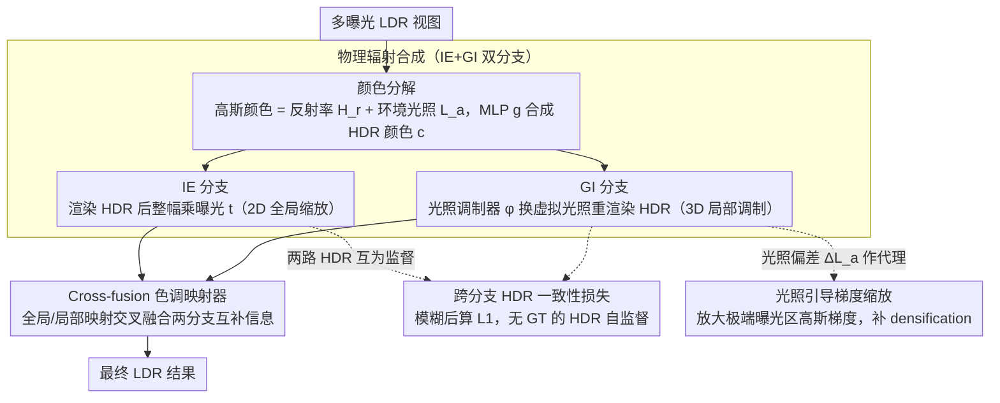

# Physically Inspired Gaussian Splatting for HDR Novel View Synthesis

**会议**: CVPR 2026  
**arXiv**: [2603.28020](https://arxiv.org/abs/2603.28020)  
**代码**: [https://huimin-zeng.github.io/PhysHDR-GS/](https://huimin-zeng.github.io/PhysHDR-GS/)  
**领域**: 3D视觉 / HDR新视角合成  
**关键词**: HDR新视角合成, 3DGS, 物理渲染启发, 双分支架构, 光照引导梯度缩放

## 一句话总结
提出PhysHDR-GS——一个物理渲染启发的HDR新视角合成框架：将高斯颜色分解为固有反射率和可调环境光照，通过图像-曝光(IE)分支和高斯-光照(GI)分支互补捕获HDR细节，跨分支HDR一致性损失提供无GT的显式HDR监督，光照引导梯度缩放解决曝光偏差的梯度饥饿问题，在多个基准上优于HDR-GS 2.04dB且保持76FPS实时渲染。

## 研究背景与动机

**领域现状**：HDR新视角合成(HDR-NVS)通过融合不同曝光的LDR视图来重建高动态范围场景。从NeRF到3DGS的演进显著加速了HDR-NVS，HDR-GS用球谐拟合HDR颜色+MLP色调映射，GaussHDR统一3D/2D色调映射并融合双分支LDR输出。

**现有痛点**：(1) **外观纠缠**：物体外观由材料属性和环境条件（直接/间接光照）共同决定，仅缩放传感器曝光时间无法分解这些因素、也无法反映光照依赖的外观变化——曝光变化 $\Delta t$ 导致全局强度变化，而环境光变化 $\Delta L_a$ 导致局部外观变化（如幸运猫铭牌处的反射）；(2) **隐式HDR监督**：HDR真值通常不可用，HDR内容的监督只能通过约束tone-mapped的LDR结果间接实现，但色调映射压缩动态范围使得异常/饱和HDR值无法被有效约束；(3) **曝光偏差梯度饥饿**：色调映射曲线在极端（过曝/欠曝）区域斜率极小，对应区域的高斯primitive累积梯度远小于正常曝光区域，难以达到densification阈值，导致这些区域表示不足。

**核心矛盾**：现有HDR-NVS方法遵循传统HDR成像管线——用曝光+色调映射模拟不同亮度级别的2D图像，但不在3D空间中建模光照，场景的环境依赖属性被忽视。

**本文目标** (1) 分解曝光和环境光照对外观的不同影响；(2) 无HDR GT情况下的显式HDR监督；(3) 极端曝光区域高斯的梯度饥饿和不足densification。

**切入角度**：从物理渲染方程出发——将高斯颜色建模为固有反射率 $H_r$ 和环境光照 $L_a$ 的函数，曝光 $t$ 和光照 $L_a$ 互补地调制动态范围。

**核心 idea**：将3DGS的颜色分解为反射率和光照，用曝光调制图像(IE)和光照调制高斯(GI)两个分支互补捕获HDR细节，跨分支一致性损失和光照引导梯度缩放解决HDR监督和梯度饥饿问题。

## 方法详解

### 整体框架
PhysHDR-GS将每个高斯的颜色分解为固有反射率 $H_r$（场景内在属性，曝光不变）和环境光照 $L_a$（可调节），通过MLP合成HDR颜色 $\mathbf{c} = g(L_a, H_r)$。基于此，框架包含两个互补分支：(1) **IE分支**：在渲染出的HDR图像上施加曝光缩放 $I_{HDR} \times t$，模拟标准相机观测；(2) **GI分支**：用光照调制器调整3D高斯的环境光照，渲染重光照HDR图像 $\hat{I}_{HDR}$，捕获光照依赖的外观变化。两分支的HDR输出经色调映射器（tone mapper）交叉融合为最终LDR结果。训练时还叠加两个机制：跨分支HDR一致性损失让两条路径在HDR域互为监督，弥补HDR真值缺失；光照引导梯度缩放补偿极端曝光区高斯的densification不足。

### 关键设计

**1. 物理辐射合成（IE+GI 双分支）：曝光调图像、光照调高斯，两条路径互补覆盖动态范围**

之前的方法只缩放传感器曝光时间，无法分解材料与光照、也反映不出光照依赖的外观变化。本文回到简化渲染方程 $L_o(\mathbf{x},\omega_o) = L_e(\mathbf{x}) + L_a(\mathbf{x}) H_r(\mathbf{x},\omega_o)$，把高斯颜色拆成场景内在、曝光不变的反射率 $H_r$ 和可调的环境光照 $L_a$，再用一个 MLP $g$ 合成颜色 $\mathbf{c}=g(L_a,H_r)$。在此基础上分出两条互补的渲染路径：IE 分支先渲染出 HDR 图像、再整幅乘以曝光 $t$ 做全局缩放，相当于在 2D 域调亮度，把不同亮度带依次拉进相机响应范围；GI 分支则在 3D 域动手，引入光照调制器 $\hat{L}_a = \varphi(L_a, l)$ 用虚拟光照 $\hat{L}_a$ 替换 $L_a$，重新合成重光照颜色 $\hat{\mathbf{c}}=g(\hat{L}_a, H_r)$，通过局部调整辐射强度来避开饱和。

关键在于两者的响应模式天然互补——曝光 $t$ 是整幅一致的全局缩放，环境光照 $L_a$ 是逐点的局部调制（比如幸运猫铭牌处的反射只随光照变、不随曝光变）。把这两种调制叠在一起，能覆盖单靠曝光达不到的动态范围。

**2. 跨分支 HDR 一致性损失：让两条建模路径互相当监督，补上缺失的 HDR 真值**

HDR 真值通常拿不到，只能用 tone-mapped 的 LDR 结果间接约束，可这一压缩恰好把饱和、异常的 HDR 值抹平了，监督不到。本文的做法是：既然 IE 和 GI 是两条不同路径在估计同一份 HDR 辐射，那它们的结果就该一致。具体地，对每个视图把光照级别 $l$ 设成曝光 $t$（让两分支亮度可比），再对 IE 的 $I_{HDR} \times t$ 和 GI 的 $\hat{I}_{HDR}$ 各做一次高斯模糊后算 L1：

$$\mathcal{L}_{\text{cons}} = \|\mathcal{G}(I_{HDR} \times t) - \mathcal{G}(\hat{I}_{HDR})\|_1$$

先模糊再比较，是为了只约束整体光照和低频结构、不去惩罚两分支未对齐的高频细节。这条自监督信号直接作用在 HDR 域，正好补上了 LDR 监督够不到的那部分。

**3. 光照引导梯度缩放：给过曝/欠曝区域的高斯"加梯度"，治 densification 的系统性偏科**

标准 3DGS 按屏幕空间梯度阈值决定要不要 split/clone，但 tone mapping 曲线在过曝、欠曝这种极端区域斜率几乎为零，对应高斯累积的梯度被压得极小，永远摸不到 densification 阈值，于是这些区域 under-densified、糊成一片。作者观察到高斯收到的梯度恰好和光照偏差 $\Delta L_a = |L_a - \hat{L}_a|$ 正相关（极端曝光区偏差大、梯度小），于是用偏差当代理变量构造一个缩放因子 $s_a = s \cdot \sigma(|L_a - \hat{L}_a|) + 1$（$\sigma$ 为 sigmoid，$s$ 为超参数），把 densification 判据改成：

$$\mathbb{I}_i(s_a)\, \frac{1}{M_i}\sum_k \Big\|\frac{\partial \mathcal{L}_k}{\partial \mu_{i,k}^{\text{ndc}}}\Big\|_2 > \tau_p$$

光照偏差越大的高斯被放大得越多，正好把被 tone mapping 压没的那点梯度补回来，让极端曝光区也能达到 splitting 阈值。这等于直接对症补偿了非线性映射带来的梯度衰减。

**4. Cross-fusion 色调映射器：在 LDR 域再让两分支的互补信息交叉一次**

两条分支各自的 HDR 输出最后要落到 LDR。tone mapper $f$ 用两个轻量 MLP 完成：$f_{tm}$ 对每个 HDR 输入同时做全局和局部色调映射，得到两对 LDR 预测；$f_{mix}$ 再把它们交叉融合——$I_{LDR}^{IG} = f_{mix}(I_{LDR}^{glo}, \hat{I}_{LDR}^{loc})$、$I_{LDR}^{GI} = f_{mix}(I_{LDR}^{glo}, I_{LDR}^{loc})$，最终 LDR 取两者之和。全局映射守住整体亮度一致、局部映射保住细节，交叉这一步让 IE、GI 的互补信息在 LDR 域也能彼此补一手，而不是各管各的。

### 损失函数 / 训练策略
总损失 $\mathcal{L}_{\text{total}} = \lambda_1 \mathcal{L}_{\text{rec}} + \lambda_2 \mathcal{L}_{\text{cons}} + \lambda_3 \mathcal{L}_{\text{unit}}$，其中重建损失 $\mathcal{L}_{\text{rec}} = \gamma \mathcal{L}_{\text{MSE}} + \mathcal{L}_{\text{D-SSIM}}$（$\gamma=0.2$）对三个LDR输出计算。$\lambda_1=1, \lambda_2=0.5, \lambda_3=0$（合成数据0.5）。前10k迭代冻结融合MLP仅训练tone mapping MLP。训练30k迭代，单张A6000 GPU。

## 实验关键数据

### 主实验（HDR-NeRF-Real, exp3设置）

| 方法 | LDR-OE PSNR↑ | LDR-NE PSNR↑ | LPIPS↓ |
|------|-------------|-------------|--------|
| HDR-NeRF | 34.27 | 32.15 | 0.074 |
| HDR-GS | 34.87 | 31.02 | 0.029 |
| GaussHDR | 36.05 | 33.49 | 0.017 |
| GaussHDR† | 36.32 | 33.84 | 0.014 |
| **Ours†** | **36.91** | **34.15** | **0.012** |

注：Ours†(Scaffold-GS)在LDR-OE上比GaussHDR†高0.59dB。

### 合成数据结果（HDR-NeRF-Syn, exp3设置）

| 方法 | LDR-OE PSNR↑ | LDR-NE PSNR↑ | HDR PSNR↑ |
|------|-------------|-------------|-----------|
| HDR-GS | 40.28 | 27.07 | 17.51 |
| GaussHDR† | 43.87 | 42.74 | 39.08 |
| **Ours†** | **44.26** | **43.19** | **39.21** |

### 消融实验（HDR-NeRF-Real, exp3）

| 配置 | LDR-OE PSNR | LDR-NE PSNR |
|------|-------------|-------------|
| IE branch only | 36.18 | 33.38 |
| + GI branch | 36.27 (+0.09) | 33.46 (+0.08) |
| + HDR-cons | 36.43 (+0.16) | 33.84 (+0.38) |
| + I-GS | **36.91** (+0.48) | **34.15** (+0.31) |

### 效率对比

| 方法 | 渲染(ms) | FPS | 训练(min) | 显存(MB) |
|------|---------|-----|-----------|---------|
| HDR-NeRF | 4189 | 0.24 | 500 | 11049 |
| HDR-GS | 9 | 117 | 10 | 5014 |
| GaussHDR | 19 | 53 | 28 | 5596 |
| Ours | **13** | **76** | 15 | **3274** |

### 关键发现
- **光照引导梯度缩放(I-GS)贡献最大**——单独带来0.48dB提升，说明过曝/欠曝区域的梯度饥饿确实是HDR-NVS的关键瓶颈
- **HDR一致性损失带来显著提升**——特别在novel exposure(LDR-NE)上提升0.38dB，说明无GT的HDR自监督有效弥补了tone mapping的信息损失
- **GI分支单独贡献较小但与其他组件协同效果好**——定性分析显示它主要改善了光照依赖的外观(如桌面反射)和纹理失真
- **效率优异**——Ours比GaussHDR快1.43倍(76fps vs 53fps)，显存仅3274MB(GaussHDR 5596MB)，训练时间15min
- 在LPIPS感知指标上Ours†在所有基准上均为最优，说明物理建模有助于感知质量

## 亮点与洞察
- **"曝光调图像，光照调高斯"的对偶设计**是本文核心洞察——曝光 $t$ 是2D域的全局缩放，光照 $L_a$ 是3D域的局部调制，两者互补覆盖HDR。这种从物理渲染方程自然推导出的双分支设计比之前的工程设计更有理论根基
- **梯度饥饿的发现和解决方案**具有普适价值——任何涉及非线性映射（如gamma校正、tone mapping）的3DGS优化都可能存在类似的梯度衰减问题。光照偏差作为梯度缩放的代理变量这一发现可迁移到其他场景
- **跨分支自监督**的思路——两个不同路径建模同一物理量（HDR辐射），强制它们一致提供了无GT的显式监督。这种设计可迁移到其他缺少GT的3D重建任务
- **实时高效**——76FPS+3274MB显存，比HDR-NeRF快322倍、比GaussHDR快1.43倍且显存更少

## 局限与展望
- 环境光照假设为均匀半球照明(uniform hemispherical illumination)，对方向性强光源（如点光源/聚光灯）建模不够精确
- 反射率 $H_r$ 和光照 $L_a$ 的分解依赖MLP，可能存在固有的模糊性——同一观测可由多组 $(H_r, L_a)$ 解释
- 光照调制器 $\varphi$ 是数据驱动的，对超出训练曝光范围的光照条件泛化能力有限
- 仅在多曝光静态场景上评估，对动态场景、单曝光设置的效果未知
- GI分支单独贡献有限(0.09dB)，说明光照调制的效果可能受限于训练数据中光照变化的多样性

## 相关工作与启发
- **vs HDR-GS**: HDR-GS用球谐拟合HDR颜色+MLP做曝光条件化tone mapping，不建模3D光照。PhysHDR-GS将颜色分解为反射率+光照，在3D空间中显式建模光照
- **vs GaussHDR**: GaussHDR统一3D/2D色调映射并融合双分支LDR输出，是纯工程导向设计。PhysHDR-GS从物理渲染方程出发，双分支有物理含义（曝光=2D全局 vs 光照=3D局部）
- **vs NeRF-based HDR方法**: HDR-NeRF等方法训练和推理都极慢(4189ms/frame)。PhysHDR-GS继承3DGS的效率优势(13ms/frame)

## 评分
- 新颖性: ⭐⭐⭐⭐ 从物理渲染方程推导出IE+GI双分支设计有理论优雅性，梯度饥饿的发现和光照引导缩放是有实际价值的新贡献
- 实验充分度: ⭐⭐⭐⭐⭐ 三个基准×两种曝光设置×两种backbone，消融完整，效率分析详尽
- 写作质量: ⭐⭐⭐⭐ 从物理渲染方程到方法设计的推导清晰，图表丰富直观
- 价值: ⭐⭐⭐⭐ 梯度饥饿发现和光照引导缩放对3DGS社区有普适价值，但HDR-NVS领域相对小众

<!-- RELATED:START -->

## 相关论文

- [\[CVPR 2026\] Splatent: Splatting Diffusion Latents for Novel View Synthesis](splatent_splatting_diffusion_latents_for_novel_view_synthesis.md)
- [\[ICCV 2025\] SeHDR: Single-Exposure HDR Novel View Synthesis via 3D Gaussian Bracketing](../../ICCV2025/3d_vision/sehdr_single-exposure_hdr_novel_view_synthesis_via_3d_gaussian_bracketing.md)
- [\[CVPR 2026\] 3D Gaussian Splatting for Efficient Retrospective Dynamic Scene Novel View Synthesis with a Standardized Benchmark](3d_gaussian_splatting_for_efficient_retrospective_dynamic_scene_novel_view_synth.md)
- [\[CVPR 2026\] GeodesicNVS: Probability Density Geodesic Flow Matching for Novel View Synthesis](geodesicnvs_probability_density_geodesic_flow_matching_for_novel_view_synthesis.md)
- [\[CVPR 2026\] From None to All: Self-Supervised 3D Reconstruction via Novel View Synthesis](from_none_to_all_self-supervised_3d_reconstruction_via_novel_view_synthesis.md)

<!-- RELATED:END -->
