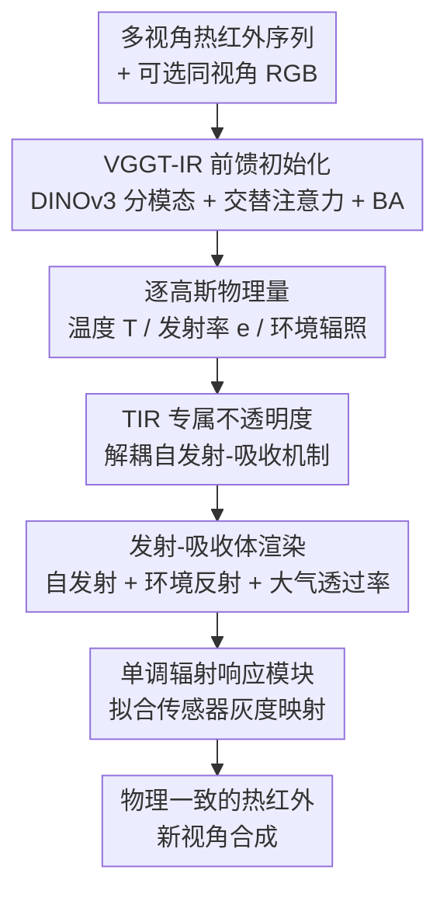

# PhysIR-Splat: Physically Consistent Thermal Infrared Radiative Transfer in 3D Gaussian Splatting

**会议**: CVPR 2026  
**论文**: [CVF Open Access](https://openaccess.thecvf.com/content/CVPR2026/html/Gao_PhysIR-Splat_Physically_Consistent_Thermal_Infrared_Radiative_Transfer_in_3D_Gaussian_CVPR_2026_paper.html)  
**代码**: https://github.com/JingyuanGao0919/physir-splat  
**领域**: 3D视觉  
**关键词**: 热红外重建, 3D高斯, 辐射传输, 新视角合成, 前馈位姿初始化

## 一句话总结
PhysIR-Splat 不再把 3DGS 颜色当作热辐射来糊，而是给每个高斯原语显式赋上温度、发射率、环境辐照三个物理量，并把"自发射 + 环境反射 → 大气透过率 → 辐射响应"这条热红外成像链直接嵌进渲染器；再配一个吃热红外（可选 RGB）的前馈初始化器 VGGT-IR 直接回归相机位姿与初始几何，解决了热红外弱纹理下 SfM 退化的老大难。

## 研究背景与动机
**领域现状**：热红外（TIR）3D 重建从多视角热图恢复表面辐射与温度分布，在医疗、工业检测、农业、建筑诊断等领域应用广泛。传统做法要么手工设几何与材料参数用辐射传输方程合成 TIR 图，要么先用 RGB 做 SfM/MVS 重建几何再把热图纹理映射上去。近来 3DGS 被快速搬到热红外（Veta-GS、ThermalGaussian、Thermal3D-GS）提升了新视角合成质量。

**现有痛点**：现有 3DGS 热红外方法大多**直接照搬可见光假设、把 3DGS 的"颜色"当成热辐射**，再外挂一个物理启发模块（如 ATF/TCM）去事后纠正渲染，物理一致性差。更要命的是，TIR 图像纹理低、辐射不一致、还有非均匀校正（NUC）残差，导致关键点检测与匹配不可靠，**SfM 位姿估计严重退化**，进而拖垮 3DGS 的初始化和收敛——典型表现是飘浮伪影（floaters）、边缘撕裂模糊。

**核心矛盾**：可见光的成像物理（颜色 = 反射光）和热红外的成像物理（灰度 = 物体自身温度驱动的自发射辐射，几乎不依赖外部照明）根本不同；把可见光那套假设硬套到 TIR，既建不准视角相关的热辐射和大气透过率，又因为弱纹理让 SfM 这个"地基"塌掉。

**本文目标**：(1) 让渲染遵循真正的红外辐射传输物理；(2) 让初始化在弱纹理、ghosting 场景下也稳健。

**切入角度**：作者从红外成像的物理本质出发——像素辐射 = 自发射（普朗克带积分）+ 环境反射，再经大气透过率衰减、最后过传感器的辐射响应非线性。既然物理链条清楚，就把它**逐项嵌进高斯原语和体渲染**，而不是事后纠正；同时用前馈大模型 VGGT 绕开基于关键点的 SfM。

**核心 idea**：给每个高斯赋温度/发射率/环境辐照物理量并把红外辐射传输写进渲染器（PhysIR-Splat），加一个 TIR 专属的前馈初始化器（VGGT-IR）一次前向直接回归位姿与几何，两者合力同时攻克"渲染物理真实性"与"初始化鲁棒性"双瓶颈。

## 方法详解

### 整体框架
系统由两个互补组件构成。**VGGT-IR** 吃 N 个红外视角（可选同视角 RGB），用蒸馏的 DINOv3 编码器分模态提特征、相加融合，再过交替注意力骨干一次前向直接回归相机位姿、深度和点图，绕开靠关键点的 SfM，并跑一次轻量 BA 精化，输出稳健的位姿与几何当 3DGS 的初值。**PhysIR-Splat** 在这套初值上，给每个高斯原语显式参数化温度 $T$、发射率 $e$、环境辐照，并沿光线做"自发射 + 环境反射 → 大气透过率 → 辐射响应"的发射-吸收体渲染，几何与 RGB 分支共享、只有辐射量和不透明度是 TIR 专属。

### 关键设计

**1. 逐高斯物理量 + 发射-吸收体渲染：把红外成像链嵌进渲染器**

针对"直接拿 3DGS 颜色当热辐射"的痛点，作者基于 TeV 分解把成像链写清楚。每个原语的辐射 $L_i=e_i\mathcal{B}(T_i)+(1-e_i)\mathcal{I}(n_i)$：第一项是自发射、第二项是环境反射（反射率 $r=1-e$）。自发射用带积分普朗克辐射 $\mathcal{B}(T)=\int_{\lambda_{min}}^{\lambda_{max}}B_\lambda(T)\,d\lambda$，作者**预计算一张 $\mathcal{B}(T)$ 及其导数的 LUT** 保证端到端可微和数值稳定；环境辐照用低阶球谐近似——把朗伯余弦核与球谐卷积得 $E_{irr}(n)\approx\sum_{l\le2,m}k_lc_{lm}Y_{lm}(n)$（$k_0=\pi,k_1=\tfrac{2\pi}{3},k_2=\tfrac{\pi}{4}$），定义约化辐照 $\mathcal{I}(n)=E_{irr}(n)/\pi$。沿光线用前到后累积的发射-吸收体渲染：像素辐射 $\tilde{\mathcal{S}}(u)=\sum_i T^{acc}_{i-1}\alpha_i^{IR}(u)T_{atm}(d_i)L_i$，其中 $T^{acc}_{i-1}=\prod_{j<i}(1-\alpha_j^{IR}(u))$，**干净地把局部吸收、路径透过率、发射三者分离开**。这样渲染本身就遵循红外辐射物理，而非可见光假设的事后纠偏。

**2. TIR 专属不透明度：解耦自发射-吸收机制，去掉跨模态纠缠**

可见光的不透明度只编码"挡光"，但热红外的"不透明度"应反映吸收-自发射机制，沿用共享不透明度会让跨模态纠缠。作者为 TIR 单独定义不透明度：单位峰值密度 $\rho_i(x)=\exp[-\tfrac12(x-\mu_i)^\top\Sigma_i^{-1}(x-\mu_i)]$ 沿光线积分得 $\tau_i(u)=s_iw_i(u)$，其中 $\sqrt{2\pi/A_i}$ 是等效厚度（$A_i=d^\top\Sigma_i^{-1}d$）、$w_i(u)$ 是足迹项编码光线-原语重叠。按几何归一化设场景常数等效消光：给定目标中心不透明度 $\alpha^\star$，$\bar\kappa=\tfrac{-\ln(1-\alpha^\star)}{\langle\sqrt{2\pi/A_i}\rangle_i}$、$s_i=\bar\kappa\sqrt{\tfrac{2\pi}{A_i}}$，最终 $\alpha_i^{IR}(u)=1-\exp[-s_iw_i(u)]$。这个不透明度**仅用于 TIR**，几何和 RGB 颜色仍共享。消融显示去掉它（退回共享不透明度）平均 PSNR 掉 2.3%、LPIPS 涨 8.0%，证明 TIR 专属不透明度有效缓解了跨模态纠缠。

**3. 大气透过率 + 单调辐射响应：补全远场衰减与传感器非线性**

完整辐射传输还要管两件事。一是**大气透过率**：均匀大气下 $T_{atm}(d_i)=\exp(-\beta d_i)$，$\beta$ 是可学消光系数、$d_i$ 是原语到相机距离，已经写进上面的体渲染公式里——它对长距离 TIR 采集尤其重要，能防止远场辐射被高估。二是**辐射响应**：完整辐射传输还含弱的近地路径发射 $L_{path}$，作者把它吸收到响应端，用全局偏置 $b$ 和一个单调逼近器 $\psi_\theta$（三层窄 MLP + Softplus，权重经 $W_\ell=\text{softplus}(\tilde W_\ell)$ 约束）：$\hat Y(u)=\psi_\theta(g_s\tilde{\mathcal{S}}(u)+b)$，保证一条**严格单调**的"辐射 → 灰度"映射，拟合传感器成像非线性。消融显示去掉大气透过率平均 PSNR 掉 2.1%、户外掉 3.0% 最明显，印证了远场建模的必要性。

**4. VGGT-IR：前馈红外初始化器，绕开弱纹理下退化的 SfM**

弱纹理、辐射不一致、NUC 残差让 TIR 上的 SfM 位姿估计严重退化，这是拖垮 3DGS 初始化的根因。VGGT-IR 以红外为中心、RGB 可选：用两个独立的蒸馏 DINOv3 ViT-L/16 编码器把 IR（和可选 RGB）映到共享潜空间（IR 通道权重取 RGB 三通道权重的均值初始化），各自层归一化后**相加融合**（无 RGB 时退化为纯 IR），再过 12 层交替注意力 Transformer 聚合跨视角信息；图像 token 经 DPT 块出稠密特征，两个轻量头分别回归相机参数 $g_i=[q_i,t_i,f_i]$ 和深度图/点图。最后跑一次轻量 BA 最小化重投影误差精化位姿与一个良观测子集 $\hat{\mathcal{X}}_{sub}$，输出当 3DGS 初值。训练时以 0.2 概率加入 RGB（保持 IR 为中心又能用上 RGB），并用 PID 扩散生成器把 BlendedMVS/ScanNet++/Mapillary 的 RGB 合成像素对齐的 IR、再混入真实多光谱数据。一次前向就回归位姿与几何，彻底绕开靠关键点检测匹配的 SfM。

### 损失函数 / 训练策略
总损失 $\mathcal{L}_{TIR}=(1-\lambda-\lambda_{smooth}-\lambda_{emis})\mathcal{L}_1+\lambda\mathcal{L}_{SSIM}+\lambda_{smooth}\mathcal{L}_{smooth}+\lambda_{emis}\mathcal{L}_{emis}$。平滑项是对响应后图像 $Y$ 的 4 邻域总变差惩罚；发射率稀疏-反射先验 $\mathcal{L}_{emis}=\tfrac1N\sum_k\phi([r_k-r_0]_+)$（$r_k=1-e_k$，$\phi$ 为 Huber 罚）鼓励高发射率、抑制过度反射。实现用 PyTorch + Adam + 余弦退火（学习率衰减到 $1.6\times10^{-6}$），每场景训 30k 迭代，IR 通道中心不透明度目标室内 $\alpha^\star=0.6$、室外 $0.4$，$\lambda=0.2,\lambda_{smooth}=\lambda_{emis}=0.05$。

## 实验关键数据

### 主实验
TI-NSD 数据集上与 IR-only 方法对比（Average 列，PSNR/SSIM 越高越好、LPIPS 越低越好）：

| 方法 | PSNR↑ | SSIM↑ | LPIPS↓ |
|------|------|------|--------|
| InstantNGP | 24.91 | 0.812 | 0.323 |
| 3DGS | 32.01 | 0.936 | 0.206 |
| Thermal3D-GS | 35.04 | 0.955 | 0.187 |
| Veta-GS | 35.97 | 0.958 | 0.169 |
| Ours | 36.47 | 0.960 | 0.158 |
| **Ours (VGGT-IR)** | **37.33** | **0.962** | **0.150** |

相比此前最佳 Veta-GS，PhysIR-Splat+VGGT-IR 平均 PSNR 从 35.97 提到 37.33 dB（+1.36 dB）、SSIM 0.958→0.962、LPIPS 0.169→0.150。

RGBT-Scenes 上与 IR+RGB 多模态方法对比（THERMAL/RGB 各自平均）：

| 方法 | THERMAL PSNR↑ | THERMAL LPIPS↓ | RGB PSNR↑ | RGB LPIPS↓ |
|------|------|------|------|------|
| ThermoNeRF | 22.42 | 0.297 | 17.86 | 0.294 |
| ThermalGaussian | 25.73 | 0.171 | 24.13 | 0.188 |
| Ours | 27.15 | 0.144 | 25.12 | 0.166 |
| **Ours (VGGT-IR)** | **29.09** | **0.119** | **27.44** | **0.142** |

位姿精度上，VGGT-IR 在 Multi-Spectral 数据集三段序列的绝对位姿误差（APE-Trans，米，越低越好）全面优于 COLMAP 和原版 VGGT，例如 desk1-xyz-dim2 上 0.3107(COLMAP)/0.2133(VGGT) → **0.0823**。

### 消融实验
TI-NSD 上逐组件消融（Average，相对 Full 的变化）：

| 配置 | PSNR↑ | SSIM↑ | LPIPS↓ | 说明 |
|------|------|------|--------|------|
| Full | **37.33** | **0.962** | **0.150** | 完整模型 |
| w/o VGGT-IR | 36.47 | 0.960 | 0.158 | 换回 COLMAP，PSNR↓2.3%、户外↓3.7% |
| w/o IR Opacity | 36.46 | 0.958 | 0.162 | 退回共享不透明度，PSNR↓2.3%、LPIPS↑8.0%、室内↓3.1% |
| w/o Atm. Atten. | 36.56 | 0.957 | 0.157 | 去大气透过率，PSNR↓2.1%、户外↓3.0% |

### 关键发现
- **三组件互补、各有侧重**：VGGT-IR 在户外长程弱纹理掉点最多，IR 专属不透明度在室内掉点最多（缓解跨模态纠缠），大气透过率在户外掉点最多（远场衰减建模）。
- **发射率估计物理合理**：在 RGB 视图上取 5×5 patch、沿光线对 top-16 高斯加权读出模型发射率，多数常见材料聚在理想对角线附近，仅玻璃/钢等强镜面材料偏离——与其材料特性和 TIR 成像固有限制一致。
- **位姿初始化是真正的地基**：单换初始化器（VGGT-IR vs COLMAP）就能带来全场景一致提升，印证作者"SfM 退化是 3DGS 热红外瓶颈"的判断。

## 亮点与洞察
- **范式转变：从"事后纠正颜色"到"把物理嵌进渲染器"**：以往热红外 3DGS 把颜色当辐射再外挂纠正模块，本文给每个高斯赋温度/发射率/环境辐照、把红外辐射传输写进体渲染，物理一致性是结构内生的而非补丁——这个思路可推广到其它非可见光模态（如偏振、SAR）。
- **TIR 专属不透明度是点睛之笔**：意识到"热红外不透明度该反映吸收-自发射而非挡光"，并与几何/RGB 解耦，单这一项就带来 LPIPS↑8.0% 的差距，体现了对成像物理的深刻理解。
- **用前馈大模型替代 SfM 治本**：与其在退化的 SfM 上打补丁，不如直接换成 VGGT-IR 一次前向回归位姿几何，并用扩散生成的对齐 IR 数据训练，干净绕开关键点匹配难题。
- **LUT + 单调约束保数值稳定**：普朗克积分预算成 LUT、响应映射用 softplus 约束权重保证严格单调，都是让物理建模端到端可微又稳定的实用工程 trick。

## 局限与展望
- **漫反射假设限制镜面材料**：方法假设清晰传播路径、低气溶胶、可忽略 LWIR/FIR 散射、目标以漫反射为主；玻璃、抛光钢等强镜面材料（发射率估计明显偏离对角线）建不准，作者已坦承这是当前模型固有局限。
- **依赖合成 IR 训练数据**：VGGT-IR 大量用 PID 扩散生成器从 RGB 合成像素对齐 IR 来训练，合成-真实域差对真实复杂场景的泛化影响未充分量化。⚠️
- **大气模型偏简化**：用均匀大气的指数透过率 $\exp(-\beta d_i)$，对非均匀大气、烟雾/气溶胶浓度变化的复杂场景可能不够（尽管摘要强调能用于烟雾遮挡环境）。
- **逐场景标定开销**：RGBT-Scenes 上需对伪彩 TIR 做一次性逐场景的颜色→温度标定，部署到新相机/新色条仍需人工配置。

## 相关工作与启发
- **vs Thermal3D-GS**：它给 3DGS 加大气透过率、热传导等物理启发模块 + 温度一致性损失来**事后纠正**渲染，仍把颜色当辐射；PhysIR-Splat 把辐射传输直接嵌进渲染器、给原语赋物理量，物理一致性更内生。
- **vs Veta-GS**：它用视锥掩码 + 视角相关形变场建模热变化；PhysIR-Splat 在强形变/大视差下飘浮伪影更少、边缘更锐，平均指标全面领先。
- **vs ThermalGaussian**：它用多模态 3DGS + 多模态初始化 + 跨模态正则联合重建热与 RGB；PhysIR-Splat 的 IR 专属不透明度做跨模态解耦，THERMAL/RGB 两路指标都更高。
- **vs ThermoNeRF / Thermal-NeRF**：NeRF 类靠 RGB 引导密度或结构化热约束，级联非端到端、易误差累积，弱纹理/标定偏差下物理一致性和鲁棒性有限；本文端到端、且用前馈初始化器治本。
- **vs 原版 VGGT**：VGGT 在可见光下前馈回归 3D 量，但直接用在 TIR 上长序列仍累积误差；VGGT-IR 用 DINOv3 分模态融合 + IR 中心训练，更适配低纹理低对比和 NUC 残差。

## 评分
- 新颖性: ⭐⭐⭐⭐⭐ 把红外辐射传输物理整链嵌进 3DGS 渲染器 + TIR 专属不透明度 + 前馈红外初始化器，三处都跳出了"照搬可见光"的窠臼
- 实验充分度: ⭐⭐⭐⭐ IR-only / IR+RGB 双设置对比、位姿精度、发射率物理性分析、逐组件消融都齐全；缺合成-真实域差的定量分析
- 写作质量: ⭐⭐⭐⭐ 物理推导与公式完整、动机清晰；公式排版在缓存里较密但逻辑自洽
- 价值: ⭐⭐⭐⭐⭐ 解决了热红外 3DGS 的物理一致性与 SfM 退化两大痛点，对夜间/低光/烟雾场景重建有直接落地价值，且已开源

<!-- RELATED:START -->

## 相关论文

- [\[CVPR 2026\] SplatSuRe: Selective Super-Resolution for Multi-view Consistent 3D Gaussian Splatting](splatsure_selective_super-resolution_for_multi-view_consistent_3d_gaussian_splat.md)
- [\[CVPR 2026\] AeroDGS: Physically Consistent Dynamic Gaussian Splatting for Single-Sequence Aerial 4D Reconstruction](aerodgs_physically_consistent_dynamic_gaussian_splatting_for_single-sequence_aer.md)
- [\[CVPR 2026\] Physically Inspired Gaussian Splatting for HDR Novel View Synthesis](physically_inspired_gaussian_splatting_for_hdr_novel_view_synthesis.md)
- [\[ECCV 2024\] Thermal3D-GS: Physics-induced 3D Gaussians for Thermal Infrared Novel-view Synthesis](../../ECCV2024/3d_vision/thermal3d-gs_physics-induced_3d_gaussians_for_thermal_infrared_novel-view_synthe.md)
- [\[CVPR 2026\] ST4R-Splat: Spatio-Temporal Referring Segmentation in 4D Gaussian Splatting](st4r-splat_spatio-temporal_referring_segmentation_in_4d_gaussian_splatting.md)

<!-- RELATED:END -->
