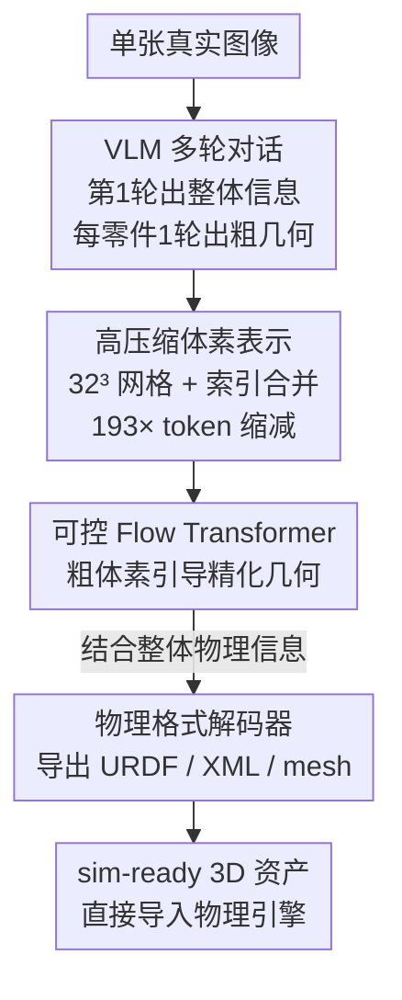

# PhysX-Anything: Simulation-Ready Physical 3D Assets from Single Image

**会议**: CVPR 2026  
**论文**: [CVF Open Access](https://openaccess.thecvf.com/content/CVPR2026/html/Cao_PhysX-Anything_Simulation-Ready_Physical_3D_Assets_from_Single_Image_CVPR_2026_paper.html)  
**代码**: 无（项目页 https://physx-anything.github.io/）  
**领域**: 3D视觉 / 具身智能  
**关键词**: 仿真就绪3D生成、VLM、体素表示、关节物体、URDF

## 一句话总结
给定一张真实场景照片，PhysX-Anything 用一个微调过的 VLM 通过多轮对话直接吐出物体的几何 + 关节结构 + 物理属性，并配套一种把几何 token 数压缩 193× 的体素表示，最终导出能直接丢进物理引擎跑的 URDF / XML 资产。

## 研究背景与动机
**领域现状**：3D 生成正从"好看的静态网格"转向"能在仿真器里跑的物理资产"。主流做法分两类：一类（Trellis、各种 feed-forward 扩散）只管全局几何和外观；另一类（part-aware 生成）建模零件层级结构。两者视觉上都很漂亮。

**现有痛点**：这些资产几乎都缺关键的物理与关节信息——密度、绝对尺寸、关节约束都没有，没法直接导入仿真器。而真正去做关节物体生成的工作，大多走"检索 + 贴运动"的路子（URDFormer、Articulate-Anything）：从已有库里捞一个网格再附上看似合理的运动，既给不出完整关节信息，又对 in-the-wild 图泛化很差。学物理形变的工作要么假设材料均质、要么忽略关键物理量。即便是能直接生成物理 3D 资产的 PhysXGen，也不支持即插即用地丢进标准仿真器。

**核心矛盾**：要让 VLM 来统一生成几何 + 物理，就撞上一个硬约束——**VLM 的 token 预算很有限，而细致 3D 几何展开成 token 序列极长**。已有的 mesh 文本序列化方案 token 数爆炸；用 3D VQ-GAN 压缩又得引入额外 special token 和定制 tokenizer，把训练和部署搞复杂。

**本文目标**：从单张真实图像，一步生成带显式几何、关节结构、物理属性、且能直接部署到物理引擎的 sim-ready 资产。

**核心 idea**：用一个 VLM 统一预测几何/关节/物理，配一种基于体素的高压缩率表示（193× token 缩减、不引入任何 special token），再用一个可控 flow transformer 把粗几何精化成高保真网格并导出 URDF/XML。

## 方法详解

### 整体框架
PhysX-Anything 走的是**全局到局部（global-to-local）**的多轮对话流水线。给定一张真实图像，微调后的 VLM 先在第一轮生成"整体信息"——物体名称、类别、尺寸、各零件的材料/密度/可供性/描述、以及关节分组与类型；随后**每个零件各起一轮独立对话**，只把共享的整体信息塞回 prompt（丢掉其它零件的几何，避免上下文过长导致遗忘），让 VLM 输出该零件在 $32^3$ 体素网格上的粗几何。所有零件的粗几何 + 整体信息组成一份"物理表示"，最后送进解码器：可控 flow transformer 把粗体素精化成高分辨率几何，再由格式解码器结合整体物理信息导出 URDF、XML、part-level mesh 等六种常用格式。

### 关键设计

**1. 高压缩率体素表示：把几何塞进 VLM 的 token 预算**

这一设计直接针对"VLM token 有限 vs 3D 几何序列太长"的核心矛盾。作者放弃 mesh 文本序列化（token 数爆炸）和 VQ-GAN（要加 special token + 新 tokenizer），改用**粗到细**的体素策略：VLM 只负责 $32^3$ 体素网格上的粗几何，细节交给下游解码器补。光是把 mesh 转成粗体素就已经把 token 数降了 74×。为进一步压缩稀疏体素里的冗余，作者把 $32^3$ 网格线性化成 $0$ 到 $32^3-1$ 的索引、**只序列化被占据的体素**，再把相邻占据索引用连字符 `-` 合并成连续区间（如 `199-216` 代替逐个列举），最终拿到 **193× 的 token 压缩率**，同时保留显式几何结构。整个过程不引入任何 special token，也不需要训练新 tokenizer，省掉了大规模 task-specific 预训练和定制 tokenizer 的开销——这是它和 ShapeLLM-Omni 等方案的关键区别。

**2. 树状物理表示：让 VLM 看得懂物理与关节**

整体信息用一种树状、对 VLM 友好的 JSON 风格表示（沿用 PhysXGen 的思路）。相比标准 URDF 文件，这种格式提供更丰富的物理属性和文本描述，便于 VLM 理解与推理。关键在于**关节-几何一致性**：作者把运动方向、转轴位置、运动范围等关键运动学参数统一转换到体素空间里，让关节结构和体素几何处在同一坐标系下，避免几何对了但关节飘了。每个零件还带材料、密度、绝对尺寸、可供性（affordance）等属性，使输出真正"物理完整"而非只有形状。

**3. 可控 Flow Transformer：用粗体素引导高保真几何精化**

VLM 给出的 $32^3$ 粗体素太糙，不能直接当资产用。作者借鉴 ControlNet 的思路，在 flow transformer 架构上加一个 transformer 控制模块，**把粗体素表示当作条件**去引导扩散模型合成细粒度体素几何。训练目标为
$$L_{geo} = \mathbb{E}_{t,x_0,\epsilon,c,V_{low}}\left\| f_\theta(x_t, c, V_{low}, t) - (\epsilon - x_0) \right\|_2^2,$$
其中 $V_{low}$ 是粗体素、$x_0$ 是细粒度体素目标、$\epsilon$ 是高斯噪声、$c$ 是图像条件、$t$ 是时间步、$f_\theta$ 是被 $\theta$ 参数化的可控 flow transformer，噪声样本通过插值 $x_t = (1-t)x_0 + t\epsilon$ 得到。拿到细体素后，再用一个预训练的结构化潜在扩散模型生成 mesh / 辐射场 / 3D Gaussian，并用最近邻算法按体素归属把网格切成零件级组件，最后结合全局结构信息导出 URDF / XML / part-level mesh。基座 VLM 用的是 Qwen2.5。

### 损失函数 / 训练策略
核心训练目标即上文的 $L_{geo}$（flow matching 形式的几何精化损失）。VLM 端在自建的 PhysX-Mobility 数据集上微调，通过定制的多轮对话同时学全局描述（整体物理与结构属性）和局部信息（零件级几何）。

## 实验关键数据

### 主实验
在 PhysX-Mobility 测试集上与 URDFormer、Articulate-Anything、PhysXGen 对比。最抢眼的是**绝对尺寸误差从 PhysXGen 的 43.44 降到 0.30**（相对改进 >99%），得益于 VLM 的强先验；同时因为 VLM 天生 text-friendly，描述质量也拿了最高分。

| 方法 | PSNR↑ | CD↓ | F-score↑ | 绝对尺寸↓ | 材料↑ | 可供性↑ | 运动学(VLM)↑ | 描述↑ |
|------|-------|-----|----------|-----------|-------|---------|--------------|-------|
| URDFormer | 7.97 | 48.44 | 43.81 | – | – | – | 0.31 | – |
| Articulate-Anything | 16.90 | 17.01 | 67.35 | – | – | – | 0.65 | – |
| PhysXGen | 20.33 | 14.55 | 76.3 | 43.44 | 6.29 | 9.75 | 0.71 | 12.89 |
| **PhysX-Anything** | **20.35** | **14.43** | **77.50** | **0.30** | **17.52** | **14.28** | **0.83** | **19.36** |

In-the-wild（约 100 张网络真实图）上，用 GPT-5 做 VLM 评测，几何与运动学两项都大幅领先：

| 方法 | 几何(VLM)↑ | 运动学参数(VLM)↑ |
|------|-----------|------------------|
| URDFormer | 0.29 | 0.31 |
| Articulate-Anything | 0.61 | 0.64 |
| PhysXGen | 0.65 | 0.61 |
| **PhysX-Anything** | **0.94** | **0.94** |

用户研究（14 名志愿者、1568 条有效评分、0–5 归一化）里，PhysX-Anything 在几何与各物理属性上都拿到接近满分的人类偏好（几何 0.98、绝对尺寸 0.95、运动学 0.94、描述 0.96），远超 PhysXGen（几何 0.61）。

### 消融实验
对比三种紧凑表示（原始 mesh 与顶点量化因 token 太多会 OOM、无法端到端训练，故不参与）。结果说明：**token 压缩率越高、保留显式结构越好，几何越完整**，而其它表示受 token 预算限制出现明显退化。

| 表示 | PSNR↑ | CD↓ | F-Score↑ | 绝对尺寸↓ | 材料↑ | 可供性↑ | 运动学(VLM)↑ | 描述↑ |
|------|-------|-----|----------|-----------|-------|---------|--------------|-------|
| PhysX-Anything-Voxel | 16.96 | 17.81 | 63.10 | 0.40 | 12.32 | 11.63 | 0.39 | 17.38 |
| PhysX-Anything-Index | 18.21 | 16.27 | 68.70 | 0.30 | 13.35 | 12.04 | 0.76 | 17.97 |
| **PhysX-Anything (完整)** | **20.35** | **14.43** | **77.50** | **0.30** | **17.52** | **14.28** | **0.94** | **19.36** |

### 关键发现
- **表示是性能主轴**：从纯 Voxel → Index → 完整的"索引 + 区间合并"表示，PSNR 从 16.96 一路升到 20.35、运动学(VLM) 从 0.39 升到 0.94，几乎所有指标单调改善，说明压缩策略不是单纯省 token，而是让 VLM 在有限预算内学到更完整的几何。
- **VLM 先验对物理属性增益最大**：绝对尺寸误差直接从 43.44 砍到 0.30，材料/可供性/描述也成倍提升，印证"text-friendly 的 VLM 更擅长把物理属性和零件语义对上"。
- **能真的跑仿真**：在 MuJoCo 风格仿真器里，生成的水龙头、柜子、打火机、眼镜等资产可直接导入，用于接触密集型机器人策略学习（如安全操作易碎的眼镜），验证了"sim-ready"不是口号。

## 亮点与洞察
- **把"压 token"当成几何建模的核心而非工程优化**：193× 压缩靠的是体素索引化 + 连续区间 `-` 合并这种极朴素的序列化技巧，却不引入 special token，绕开了 VQ-GAN 路线的训练复杂度——这个 trick 可迁移到任何想让 VLM 直接吐结构化几何/布局的任务。
- **多轮对话 + 只保留整体信息**：零件几何彼此独立、只共享全局上下文，既缓解长 prompt 的上下文遗忘，又天然支持任意零件数的物体，是个很实用的解耦设计。
- **关节参数转进体素空间**保证几何与运动学同坐标系，是"生成的资产能直接跑仿真"的关键细节，容易被忽略但很重要。

## 局限与展望
- 粗几何固定在 $32^3$ 体素，极细结构（薄片、细杆）可能在粗阶段就丢失，精化器能补多少存疑 ⚠️。
- PhysX-Mobility 虽把类别扩了 2×（47 类、2K+ 物体），但仍来自 PartNet-Mobility 的人工标注，真实世界长尾类别、柔性/非刚体物体的覆盖有限。
- 物理属性（密度、材料）由 VLM 文本推断而非物理测量，在罕见材质上的准确性需谨慎对待；论文也刻意避免让 VLM 在 in-the-wild 上评判具体物理属性，侧面说明这块不够稳。
- 改进方向：更高分辨率体素 / 自适应体素、对柔性与多材料物体的支持、把物理属性预测和真实物理仿真做闭环校正。

## 相关工作与启发
- **vs PhysXGen**: 都直接生成带物理属性的 3D 资产，但 PhysXGen 是扩散范式、输出不支持即插即用导入标准仿真器；本文用 VLM 范式 + 树状表示 + 体素几何，直接导出 URDF/XML，绝对尺寸误差从 43.44 降到 0.30，真正做到 sim-ready。
- **vs URDFormer / Articulate-Anything**: 它们走检索 + 贴运动，只给有限关节信息、对 in-the-wild 泛化差；本文是从零合成几何与物理，泛化显著更强（in-the-wild VLM 几何 0.94 vs 0.29/0.61）。
- **vs ShapeLLM-Omni / MeshLLM / LLaMA-Mesh**: 同为 VLM-based，但前者用 3D VQ-VAE 压 token 需引入 special token + 新 tokenizer，后者用简化 mesh；本文的体素索引表示压缩率更高且零 special token，训练更简单。

## 评分
- 新颖性: ⭐⭐⭐⭐⭐ 首个 single-image → sim-ready 物理 3D 生成范式，体素索引表示的 193× 压缩思路很巧。
- 实验充分度: ⭐⭐⭐⭐ 主实验 + in-the-wild + 用户研究 + 表示消融 + 仿真策略学习覆盖全面，但缺架构组件（如 flow transformer）的独立消融。
- 写作质量: ⭐⭐⭐⭐ 动机与表示设计讲得清楚，但缓存里图表 OCR 较乱、部分实现细节需对照原文。
- 价值: ⭐⭐⭐⭐⭐ 直接打通"单图 → 可仿真资产"，对具身智能与机器人策略学习有明确落地价值。

<!-- RELATED:START -->

## 相关论文

- [\[CVPR 2026\] PhysHead: Simulation-Ready Gaussian Head Avatars](physhead_simulation-ready_gaussian_head_avatars.md)
- [\[CVPR 2026\] ArtLLM: Generating Articulated Assets via 3D LLM](artllm_generating_articulated_assets_via_3d_llm.md)
- [\[CVPR 2026\] ReWeaver: Towards Simulation-Ready and Topology-Accurate Garment Reconstruction](reweaver_towards_simulation-ready_and_topology-accurate_garment_reconstruction.md)
- [\[NeurIPS 2025\] PhysX-3D: Physical-Grounded 3D Asset Generation](../../NeurIPS2025/3d_vision/physx-3d_physical-grounded_3d_asset_generation.md)
- [\[CVPR 2026\] Human Interaction-Aware 3D Reconstruction from a Single Image](human_interaction-aware_3d_reconstruction_from_a_single_image.md)

<!-- RELATED:END -->
