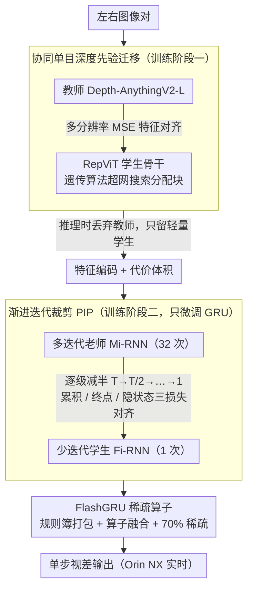

# PIP-Stereo: Progressive Iterations Pruner for Iterative Optimization based Stereo Matching

**会议**: CVPR 2026  
**arXiv**: [2602.20496](https://arxiv.org/abs/2602.20496)  
**代码**: [GitHub](https://github.com/XPENG-Aridge-AI)  
**领域**: 3D视觉  
**关键词**: 立体匹配, 迭代优化裁剪, 边缘部署, FlashGRU, 单目深度先验迁移

## 一句话总结
揭示迭代立体匹配中视差更新的空间稀疏性和时间冗余性，提出渐进迭代裁剪（PIP）将32次迭代压缩到1次、协同学习范式实现无需独立单目编码器的深度先验迁移、以及硬件感知的 FlashGRU 算子（7.28× 加速），使高精度迭代立体匹配首次在 Jetson Orin NX 上实现实时推理（75ms/帧，320×640）。

## 研究背景与动机
**领域现状**：迭代优化立体匹配方法（RAFT-Stereo、IGEV、MonSter）凭借 GRU（门控循环单元）的迭代精炼，在各基准上持续占据精度榜首。

**现有痛点**：
   - GRU 的循环结构在边缘设备上面临严重部署瓶颈：静态计算图中的迭代循环阻碍算子融合且对量化噪声敏感；高分辨率下内存带宽需求极高
   - 这些真实瓶颈**无法用 FLOPs 或参数量等简单标量指标捕捉**
   - 最新方法如 MonSter 在 Orin NX 上需要约 7.6s/帧（384×1344），远不满足实时需求
   - 现有实时方法通过完全去掉 RNN 来加速，但显著牺牲了泛化能力和精度

**核心矛盾**：迭代精炼带来的高精度和强泛化 vs RNN 在边缘硬件上的部署不友好

**关键观察**：通过分析 RAFT-Stereo 和 IGEV 在 Middlebury 上的迭代行为发现——视差更新是**高度稀疏**（到32次迭代时只有不到1%像素仍在更新）和**高度冗余**的（相邻迭代的更新位置重叠率 >0.99）

**核心 idea**：用逐步减半的迭代裁剪将多步递归压缩为近单步推理，辅以无独立编码器的单目先验迁移和硬件感知稀疏 GRU

## 方法详解

### 整体框架
论文要解决的核心矛盾是：迭代精炼带来高精度，但 GRU 的递归循环在边缘硬件上又慢又难量化。整套方法分两阶段训练再加一套推理算子。第一阶段做单目深度先验迁移，让立体匹配的特征编码器在训练时吸收一个单目深度大模型的知识，但推理时不必背着这个大模型。第二阶段做渐进裁剪微调，把原本 32 次的迭代逐步减半压到 1 次，只动 GRU 模块、冻结其余部分。最后推理时再换上专门设计的 FlashGRU 稀疏算子，把这唯一一次迭代也跑得更快。三块各自针对一个瓶颈：单目编码器太重、迭代次数太多、GRU 算子在 GPU 上访存太碎。

### 关键设计

**1. 协同单目深度先验迁移：训练时借大模型的力，推理时把它丢掉**

MonSter、DEFOM-Stereo 这类方法确实用上了单目深度先验，但代价是把一个完整的深度基础模型当独立编码器嵌进推理管线，开销极大。这里换成 Teacher-Student 的协同学习：教师是 Depth-AnythingV2-L，学生用 RepViT 块搭骨干，特征对齐用 MSE 损失同时作用在多分辨率上下文特征和代价体积嵌入两个层面。关键是学生的结构不是拍脑袋定的——用遗传算法做超网搜索，在四个分辨率层上优化 RepViT 块的分配，找高频细节和抽象语义之间的最佳配比。训练完学生吸收了教师的知识，推理时教师整个丢掉，于是先验迁过来了、推理却依旧轻量。这一步喂给后面 PIP 的，是一个已经带好单目深度先验、却足够轻的特征编码器与代价体积。

**2. 渐进迭代裁剪（PIP）：用蒸馏把 32 步递归压成 1 步，又不掉精度**

拿到轻量编码器后，真正的部署瓶颈是 GRU 的 32 次递归。直接把迭代从 32 次砍到 1 次会撞上精度悬崖，因为单步 GRU 学不会原本 32 步累积出来的更新。PIP 的做法是温和地、逐级减半——$T \to T/2 \to T/4 \to \cdots \to 1$，每一级都让"少迭代"的学生去逼近"多迭代"的老师。形式上，把多迭代 RNN（Mi-RNN）看成一个离散动力系统 $\mathbf{z}_{t+1} = \mathcal{F}_\theta(\mathbf{z}_t)$，要训练的少迭代 RNN（Fi-RNN）$\mathbf{z}_{s+1} = \mathcal{G}_\phi(\mathbf{z}_s)$ 则去近似它的 $r$ 步组合 $\mathcal{F}^{(r)}$——也就是让学生一步顶老师 $r$ 步。

跳步要等价，光对齐最终结果不够，论文用三个损失同时约束轨迹的累积量、终点和隐状态：

$$\mathcal{L}_{\text{cum}} = \sum_s \Big\|\sum_{k=1}^s \mathbf{d}_k^{\text{Fi}} - \sum_{k=1}^s \bar{\mathbf{d}}_k^{\text{Mi}}\Big\|_2^2,\quad \mathcal{L}_{\text{final}} = \|\mathbf{d}_S^{\text{Fi}} - \Psi(\mathbf{z}_T^{\text{Mi}})\|_2^2,\quad \mathcal{L}_{\text{hid}} = \sum_s \|\mathbf{z}_s^{\text{Fi}} - \mathbf{z}_{rs}^{\text{Mi}}\|_2^2$$

$\mathcal{L}_{\text{cum}}$ 对齐每一步累积的视差更新，保住"积分"轨迹的形状；$\mathcal{L}_{\text{final}}$ 直接钉住终点视差；$\mathcal{L}_{\text{hid}}$ 让学生第 $s$ 步的隐状态对上老师第 $rs$ 步。从动力系统的角度看，这相当于学一个粗粒度算子去近似细粒度算子的多步组合，又保留轨迹的积分特性，所以每减半一级只掉一点点精度。整个过程可以递归套用，一路裁到 1 次。

**3. FlashGRU：从 GPU 访存模式下手，把唯一一次 GRU 跑快**

这一步不是减计算量，而是 I/O 感知地重排稀疏 GRU 在 GPU 上的访存。它由三部分配合：其一是多分辨率规则簿，先用重要性图挑出真正需要更新的候选像素，建一张跨分辨率的静态双向索引映射表，把这些稀疏像素紧凑打包进连续的 GPU buffer，避免内存碎片；其二是循环算子融合，把展开后的递归计算实现成一个时序融合内核，借索引表把序列卷积的内存写回次数压到最小；其三是 70% 的稀疏度约束，只对 top-k 重要像素执行更新。三者叠起来，相比原生 ConvGRU，在 2K 分辨率下做到 **7.28× 加速**、**76.6% 内存峰值降低**、**80.9% 全局内存请求减少**。

### 损失函数 / 训练策略
PIP 阶段总损失是三项相加 $\mathcal{L} = \mathcal{L}_{\text{cum}} + \mathcal{L}_{\text{final}} + \mathcal{L}_{\text{hid}}$，且只微调 GRU 模块、冻结其余部分。训练集为 SceneFlow + CREStereo + TartanAir + SintelStereo + FallingThings + InStereo2K。

## 实验关键数据

### 主实验（域内性能，384×1344，Orin NX FP32）

| 方法 | 迭代数 | SceneFlow EPE↓ | ETH3D Bad-1↓ | KITTI15 D1-all↓ | 延迟(s)↓ |
|------|--------|---------------|-------------|----------------|---------|
| MonSter++ | 32 | 0.37 | 0.25 | 1.37 | 7.63 |
| DEFOM-Stereo | 32 | 0.42 | 0.70 | 1.33 | 5.05 |
| IGEV | 12 | 0.49 | 1.12 | 1.59 | 1.29 |
| RT-MonSter++ | 4 | 0.76 | 1.32 | 1.69 | 0.79 |
| **PipStereo** | **1** | **0.45** | **0.35** | **1.44** | **0.44** |

### 与实时方法对比

| 方法 | 迭代 | SceneFlow EPE↓ | ETH3D Bad-1↓ | KITTI15 D1-all↓ | 延迟(s)↓ |
|------|------|---------------|-------------|----------------|---------|
| CoEx | ✗ | 0.67 | 19.78 | 2.02 | 0.17 |
| HITNet | ✗ | 0.55 | 2.79 | 1.98 | 0.44 |
| FastACVNet+ | ✗ | 0.59 | 5.62 | 2.01 | 0.27 |
| **PipStereo** | 1 | **0.45** | **0.35** | **1.44** | 0.44 |

### 关键发现
- PipStereo 仅用1次迭代即达到接近 IGEV（12次迭代）的精度，ETH3D 上 Bad-1 从 1.12 降至 0.35（-73.4%），SceneFlow EPE 从 0.49 降至 0.45（-13.5%）
- 相比所有实时方法（去掉 RNN 的），PipStereo 在精度上遥遥领先
- 在 Jetson Orin NX 上处理 320×640 帧仅需 75ms（FP16），RTX 4090 上 19ms
- FlashGRU 在 2K 分辨率下实现 7.28× 加速，高分辨率收益更大

## 亮点与洞察
- **迭代冗余的实证分析非常有说服力**：通过可视化更新位置和计算 hit ratio，直观展示了迭代精炼在10次之后几乎不做有意义的工作。这个观察为后续裁剪提供了坚实的经验基础
- **渐进裁剪的动力系统视角**：将迭代裁剪形式化为学习粗粒度算子近似多步组合，不仅理论优雅，而且实际效果好——每次减半只带来微小精度损失
- **FlashGRU 的工程设计**：不是简单地减少计算量，而是深入分析了 GPU 内存访问模式（I/O感知），利用结构化稀疏和紧凑打包减少内存写回。这种硬件-算法协同设计的思路对边缘部署很有启发
- **无需独立单目编码器的先验迁移**：避免了将完整深度基础模型嵌入推理管线，真正做到了"训练时借力，推理时轻量"

## 局限与展望
- PIP 裁剪到1次迭代后在某些指标上不如多迭代方法（如 KITTI 2012 Out-2），说明极端压缩仍有精度代价
- FlashGRU 的加速效果在迭代次数很少时边际收益有限（当只剩1次迭代时 FlashGRU 意义不大）
- 超网搜索针对特定框架定制，迁移到其他立体匹配架构需要重新搜索
- 目前仅验证了 IGEV 系列作为基础架构，对 RAFT-Stereo（零初始化范式）的适用性需要进一步验证

## 相关工作与启发
- **vs RT-IGEV++ / RT-MonSter++**：它们通过截断迭代、降低 GRU 层数或缩小骨干来加速，但"简单截断"导致精度损失严重。PIP 通过蒸馏式渐进裁剪保持了精度
- **vs 实时方法（CoEx、HITNet 等）**：这些方法完全去掉 RNN 用定制架构替代，换来了速度但泛化能力差。PipStereo 保留迭代优化的本质但将其压缩到极致
- **vs MonSter / DEFOM-Stereo**：它们嵌入完整的单目深度基础模型，推理开销巨大。PipStereo 的协同学习在推理时完全不需要教师网络

## 评分
- 新颖性: ⭐⭐⭐⭐⭐ 迭代冗余分析+渐进裁剪+硬件感知GRU三位一体，从观测到设计逻辑完整
- 实验充分度: ⭐⭐⭐⭐⭐ 域内+域外+不同硬件+性能计数器分析，极其充分
- 写作质量: ⭐⭐⭐⭐ 文笔略显冗长，但技术细节扎实
- 价值: ⭐⭐⭐⭐⭐ 首次让迭代立体匹配在边缘设备上实时运行，对自动驾驶部署有直接价值

<!-- RELATED:START -->

## 相关论文

- [\[CVPR 2026\] Lite Any Stereo: Efficient Zero-Shot Stereo Matching](lite_any_stereo_efficient_zero-shot_stereo_matching.md)
- [\[CVPR 2025\] Consistency-aware Self-Training for Iterative-based Stereo Matching](../../CVPR2025/3d_vision/consistency-aware_self-training_for_iterative-based_stereo_matching.md)
- [\[CVPR 2026\] PromptStereo: Zero-Shot Stereo Matching via Structure and Motion Prompts](promptstereo_zero-shot_stereo_matching_via_structure_and_motion_prompts.md)
- [\[ECCV 2024\] TC-Stereo: Temporally Consistent Stereo Matching](../../ECCV2024/3d_vision/temporally_consistent_stereo_matching.md)
- [\[CVPR 2025\] DEFOM-Stereo: Depth Foundation Model Based Stereo Matching](../../CVPR2025/3d_vision/defom-stereo_depth_foundation_model_based_stereo_matching.md)

<!-- RELATED:END -->
