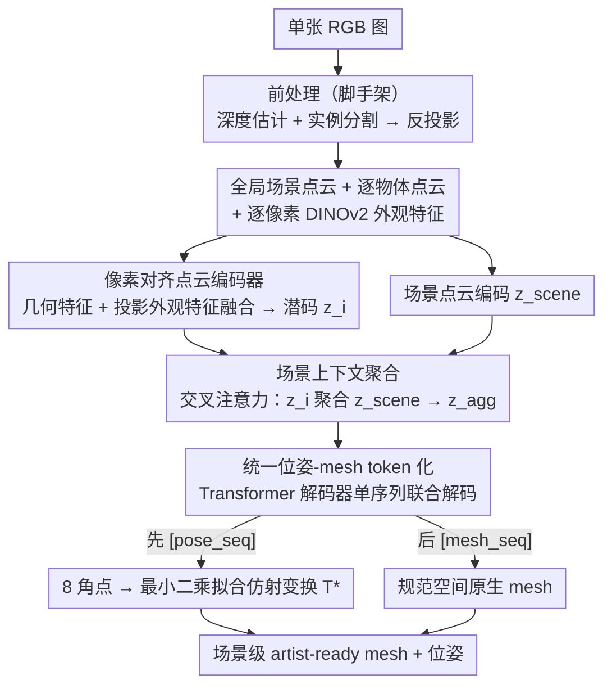

# PixARMesh: Autoregressive Mesh-Native Single-View Scene Reconstruction

**会议**: CVPR 2026  
**arXiv**: [2603.05888](https://arxiv.org/abs/2603.05888)  
**代码**: [项目主页](https://mlpc-ucsd.github.io/PixARMesh)  
**领域**: 3D视觉  
**关键词**: 单视图场景重建, 自回归mesh生成, 原生mesh, artist-ready, 组合式3D

## 一句话总结
提出 PixARMesh，首个在原生 mesh 空间（而非 SDF）中进行单视图场景重建的自回归框架，通过像素对齐图像特征和全局场景上下文增强点云编码器，在统一的 token 序列中同时预测物体位姿和mesh，在 3D-FRONT 上达到场景级 SOTA 且输出紧凑、可编辑的 artist-ready mesh。

## 研究背景与动机
**领域现状**：单视图3D场景重建是一个长期存在的病态问题。组合式生成范式近年因大规模物体级重建模型（TRELLIS、CLAY等）的进步而受到关注。

**现有痛点**：
   - 整体式方法（Panoptic3D、Uni-3D）受限于体素分辨率和前馈解码器表达力有限
   - 组合式方法（Gen3DSR、DeepPriorAssembly）需要先修复遮挡再生成，然后用优化方法估计布局——容易陷入局部最优
   - MIDI 避免了布局优化但在归一化场景坐标中直接生成，仍用 SDF
   - **所有现有方法都基于 SDF 表示**，需要 Marching Cubes 提取表面，产生过度三角化、过于光滑的高面数 mesh，不适合编辑

**核心矛盾**：mesh 生成模型（MeshGPT、EdgeRunner、BPT）只能做单物体级别输出，尚未有方法将它们扩展到场景级重建

**切入角度**：利用预训练的物体级自回归 mesh 生成器（EdgeRunner/BPT），增强其点云编码器以融入外观和全局上下文，用统一 token 序列实现位姿+mesh 联合预测

**核心 idea**：在单个自回归序列中联合预测物体位姿（tokenized 为包围盒角点）和原生mesh（tokenized 为顶点/面），避免 SDF 提取和后处理布局优化

## 方法详解

### 整体框架
PixARMesh 想做的事很直接：给一张普通 RGB 图，直接吐出整个场景里每个物体的原生 mesh，连带它们各自摆在哪、朝向如何，全程不碰 SDF、也不做事后的布局优化。它把这件事拆成两半——前半段是"把图像变成点云线索"，全靠现成模型搭起来：先用深度估计和实例分割把图切开，再把每个像素的深度反投影成 3D 点，于是得到一份全局场景点云和若干份逐物体点云，同时保留每个像素的 DINOv2 外观特征；后半段才是论文自己训练的部分——一个增强版的点云编码器把几何和外观揉到一起，再注入全局场景上下文，最后交给一个 Transformer 解码器，在一条 token 序列里先把物体位姿写出来、再把 mesh 顶点面片写出来。换句话说，整篇的核心是把"摆放"和"造型"两件事压进同一个自回归序列里联合解码。



### 关键设计

**1. 像素对齐点云编码器：让点云编码器看见图像里的外观线索**

原始的 EdgeRunner / BPT 是单物体 mesh 生成器，它们的点云编码器只吃坐标——这在完整扫描的单物体上够用，但搬到单视图场景里就不行了：场景中的物体被大面积遮挡，光靠那几个可见点的坐标根本推不出背面的完整几何。PixARMesh 的做法是把图像外观补回来。对实例点云 $P_i$ 里的每个 3D 点 $p$，用相机内参投影回图像平面 $(u,v)=\text{Proj}(K,p)$，取出落点像素的 DINOv2 特征 $\mathbf{f}_p^{\text{img}}$，和该点本身的几何特征 $\mathbf{f}_p^{\text{pc}}$ 拼接起来送进 Transformer 融合块；最后用一组可学习查询向量把融合后的逐点特征聚合成一个紧凑潜码 $\mathbf{z}_i$。这样物体的纹理、材质、语义类别这些只在图像里才有的线索，就被绑进了每个点的表征，编码器据此能更靠谱地脑补出遮挡部分。

**2. 场景上下文聚合：让每个物体在生成时还能"瞥见"整个房间**

只看一个物体自己那一小撮点，信息量是不够的——既猜不准它的完整造型，也定不准它的精确位姿。但场景里往往有同款或相似的物体（一排椅子、一对床头柜），邻居的几何就是很好的补充线索。为了用上这个，PixARMesh 先做一件容易被忽略的事：所有点云在**统一的场景坐标系**里归一化，而不是每个物体各归一化各的——这样物体之间的空间关系才不会被打乱。然后把全局场景点云编码成 $\mathbf{z}_{\text{scene}}$，每个物体的潜码通过交叉注意力去聚合它：

$$\mathbf{z}_i^{\text{agg}} = \text{CrossAttn}(q=\mathbf{z}_i,\ k=\mathbf{z}_{\text{scene}},\ v=\mathbf{z}_{\text{scene}})$$

聚合后的 $\mathbf{z}_i^{\text{agg}}$ 才是真正喂给解码器的条件。消融里这一步是贡献最大的模块（场景 CD 从 57.78 降到 39.30），尤其在严重遮挡下，靠邻居补全比靠图像外观更管用。

**3. 统一位姿-mesh token 化：用 mesh 自己的词汇表把"摆放"也写成 token**

要在一条自回归序列里同时输出位姿和 mesh，最省事的办法是别给位姿单独发明一套 token。PixARMesh 把物体位姿表示成一个重力对齐的 7-DoF 包围盒，再把这个盒子写成它 **8 个角点的 3D 坐标**——而坐标正好可以复用 mesh 生成器现成的坐标词汇表：EdgeRunner 每个点拆成 `<x><y><z>` 三个 token，8 个角点共 24 个；BPT 每个点拆成 `<block_id><offset_id>` 两个 token，共 16 个。于是整条序列长这样：

```
<bos> [pose_seq] <sep> [mesh_seq] <eos>
```

位姿段只占 16–24 个 token，相对动辄上千 token 的 mesh 段几乎可以忽略，却零成本地把布局信息塞进了同一个词汇空间。推理时反过来用：从解码出的 8 个角点最小二乘拟合出一个局部到全局的仿射变换 $\mathbf{T}^\star$，把规范空间里生成的 mesh 搬回场景里它该在的位置。这套设计的好处是位姿和 mesh 共享同一个解码器、互相做条件——后面消融会看到，联合解码确实比拆成两阶段更准。

### 损失函数 / 训练策略
全程只用一个 next-token 交叉熵：$\mathcal{L}_{\text{ce}} = -\sum_t \log p_\theta(s_t \mid s_{<t}, \mathbf{z}_{\text{agg}})$，位姿 token 和 mesh token 一视同仁地预测。训练时给深度值加 ±0.02 的 jitter，模拟单目深度估计的不准，让模型对上游误差更鲁棒。算力上 8×H100，EdgeRunner 变体约 2 天、BPT 变体约 18 小时。

## 实验关键数据

### 主实验（3D-FRONT 数据集）

| 方法 | 场景CD↓(×10⁻³) | 场景CD-S↓ | 场景F-Score↑ | 物体CD↓ | 物体F-Score↑ |
|------|---------------|-----------|-------------|---------|-------------|
| InstPIFu | 213.4 | 124.9 | 13.72% | 44.74 | 29.63% |
| MIDI | 156.3 | 79.3 | 24.83% | 6.71 | 72.69% |
| DepR | 153.2 | 56.4 | 25.00% | **2.57** | **89.66%** |
| **PixARMesh-ER** | **98.8** | **49.1** | **33.55%** | 4.04 | 82.27% |
| **PixARMesh-BPT** | **98.4** | **47.6** | 32.26% | 4.57 | 80.30% |

### 消融实验（联合位姿-mesh建模的必要性）

| 配置 | 场景CD↓ | 场景F-Score↑ | 物体CD↓ | 物体F-Score↑ |
|------|---------|-------------|---------|-------------|
| EdgeRunner-FT (无布局) | 119.8 | 27.81% | 4.75 | 80.57% |
| Two-stage (分离模型) | 99.8 | 33.32% | 4.75 | 80.85% |
| **PixARMesh (联合)** | **98.8** | **33.55%** | **4.04** | **82.27%** |

### 消融实验（模块贡献，使用GT输入）

| 图像特征 | 场景上下文 | 场景CD↓ | 场景F-Score↑ | 物体CD↓ |
|---------|----------|---------|-------------|---------|
| ✗ | ✗ | 57.78 | 41.02% | 5.29 |
| ✓ | ✗ | 55.44 | 42.84% | 5.56 |
| ✗ | ✓ | 39.30 | 44.67% | 3.64 |
| ✓ | ✓ | 39.88 | 46.15% | 4.04 |

### 关键发现
- 场景级指标上 PixARMesh 全面 SOTA，场景 CD 从 DepR 的 153.2 降至 98.4（-36%），F-Score 从 25% 提升至 33.6%
- 物体级 DepR 仍然更好（CD 2.57 vs 4.04），因为扩散模型生成的 SDF 几何精度更高。但 PixARMesh 输出的是紧凑 artist-ready mesh（每个物体仅数千面），而 SDF 方法输出的是密集三角化的高面数 mesh
- **场景上下文聚合是最关键模块**：加入后场景 CD 从 57.78 降至 39.30，贡献远大于图像特征
- 联合建模优于两阶段：物体 CD 从 4.75 降至 4.04，证明几何生成从位姿推理中受益
- EdgeRunner 变体强于 BPT 变体（因为更高的量化分辨率保留了更多几何细节）

## 亮点与洞察
- **首次将自回归 mesh 生成扩展到场景级别**：打破了"mesh 生成模型只能做单物体"的局限。通过简洁的 token 序列设计实现位姿和 mesh 的统一解码，无需后处理布局优化
- **词汇共享的位姿 token 化非常巧妙**：用包围盒角点坐标复用 mesh 词汇表，零额外词汇开销，仅增加16-24个 token。推理时通过最小二乘拟合仿射变换恢复布局
- **联合建模的涌现效应**：位姿预测和 mesh 生成互相促进——几何信息帮助定位，位姿上下文帮助补全几何。这在两阶段方案中无法实现
- **输出的 mesh 可以直接用于图形应用**（编辑、渲染、模拟），而 SDF 方法的 Marching Cubes 输出需要大量后处理

## 局限与展望
- 物体级几何精度不如 DepR 等扩散式 SDF 方法，自回归 mesh 在精细曲面细节上有天然劣势
- 目前仅在 3D-FRONT 室内家具场景上训练，物体种类有限
- 依赖 Grounded-SAM 分割和 Depth Pro 深度估计，上游模型的错误会级联传播
- 自回归解码在物体较多时速度会变慢（序列长度线性增长）

## 相关工作与启发
- **vs DepR**：DepR 用深度引导扩散在 SDF 空间生成，物体几何更精细（CD 2.57 vs 4.04），但场景布局不如 PixARMesh（场景 CD 153.2 vs 98.8），且输出需要 Marching Cubes 后处理
- **vs MIDI**：MIDI 在归一化场景空间直接生成 SDF 避免了布局优化，但仍需表面提取且场景精度不如 PixARMesh
- **vs EdgeRunner / BPT 原始模型**：它们只能做单物体生成，PixARMesh 通过注入像素对齐特征和场景上下文将它们扩展到场景级

## 评分
- 新颖性: ⭐⭐⭐⭐⭐ 首个 mesh-native 场景重建，位姿和 mesh 的统一 token 化设计优雅
- 实验充分度: ⭐⭐⭐⭐ 合成+真实数据，消融充分，但缺少与更多 mesh 生成基线的对比
- 写作质量: ⭐⭐⭐⭐⭐ 写作清晰，方法动机-设计-实验的逻辑链非常完整
- 价值: ⭐⭐⭐⭐⭐ 开辟了 mesh-native 场景重建的新范式，对后续工作有重要启发

<!-- RELATED:START -->

<div class="related-papers" markdown="1">

## 相关论文

- [\[ICLR 2026\] QuadGPT: Native Quadrilateral Mesh Generation with Autoregressive Models](../../ICLR2026/3d_vision/quadgpt_native_quadrilateral_mesh_generation_with_autoregressive_models.md)
- [\[CVPR 2026\] Coherent Human-Scene Reconstruction from Multi-Person Multi-View Video in a Single Pass](coherent_humanscene_reconstruction_from_multiperso.md)
- [\[CVPR 2026\] FlashMesh: Faster and Better Autoregressive Mesh Synthesis via Structured Speculation](flashmesh_faster_and_better_autoregressive_mesh_synthesis_via_structured_specula.md)
- [\[CVPR 2026\] MeshWeaver: Sparse-Voxel-Guided Surface Weaving for Autoregressive Mesh Generation](meshweaver_sparse-voxel-guided_surface_weaving_for_autoregressive_mesh_generatio.md)
- [\[CVPR 2026\] SmokeSVD: Smoke Reconstruction from A Single View via Progressive Novel View Synthesis and Refinement with Diffusion Models](smokesvd_smoke_reconstruction_from_a_single_view_via_progressive_novel_view_synt.md)

</div>

<!-- RELATED:END -->
