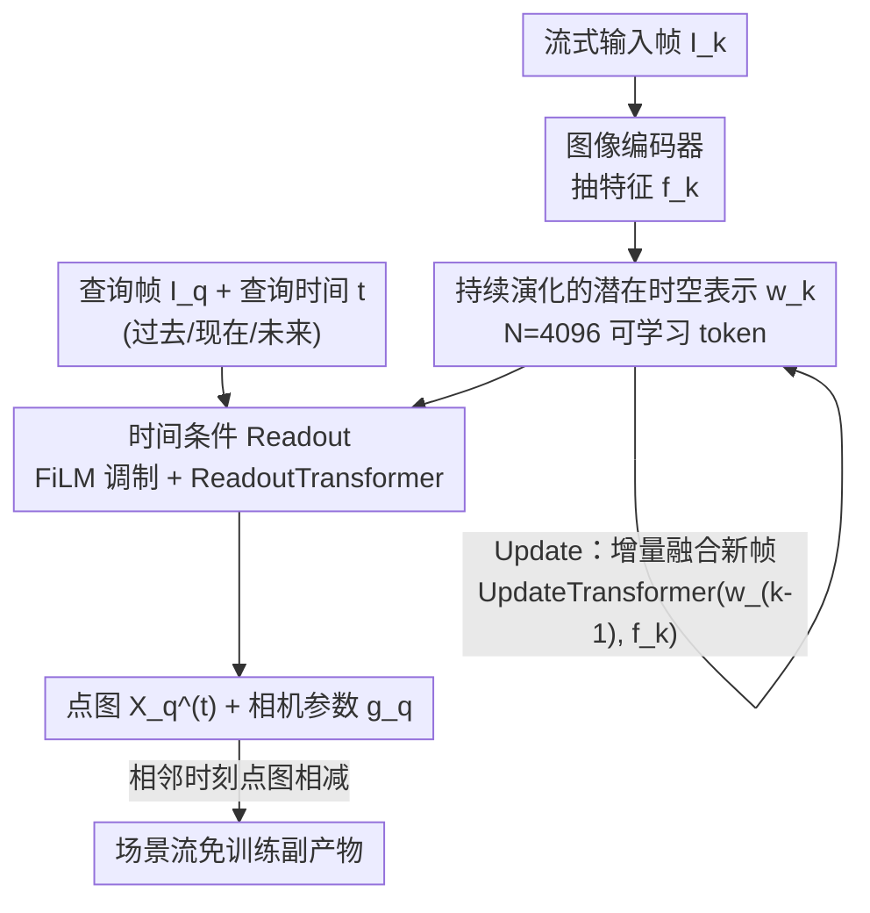

# Point4Cast: Streaming Dynamic Scene Reconstruction and Forecasting

**会议**: CVPR 2026  
**论文**: [CVF Open Access](https://openaccess.thecvf.com/content/CVPR2026/html/Liu_Point4Cast_Streaming_Dynamic_Scene_Reconstruction_and_Forecasting_CVPR_2026_paper.html)  
**代码**: 项目页 https://merl.com/research/highlights/point4cast （未明确开源代码）  
**领域**: 3D视觉  
**关键词**: 流式重建, 动态场景, 点图预测, 时空表示, 前馈3D

## 一句话总结
Point4Cast 用一个"持续演化的潜在时空表示"统一处理流式视频帧，既能重建过去/当前帧的 3D 点图，又能前馈式地**预测未来时刻**的点图与相机参数，并顺带免训练地导出场景流，在 PointOdyssey、TAPVid-3D 上同时刷新动态场景重建与新提出的"3D 点图预测"任务的 SOTA。

## 研究背景与动机
**领域现状**：前馈式 3D 重建近年进展很快。DUSt3R / MASt3R 从两张图直接回归同坐标系下的逐像素点图，FASt3R、VGGT 把它扩展到多视图与大规模训练，Cut3R、StreamingVGGT、Point3R 等又引入"记忆"机制支持流式输入。这些方法把"从 2D 帧恢复稠密 3D 几何"做得越来越好。

**现有痛点**：上述方法都只能重建**已观测时刻**的瞬时几何——给定到当前帧为止的观测，它们输出的是"此刻"的点图，无法回答"再过 0.5 秒场景会变成什么样"。而在自动驾驶、具身智能、AR/VR 里，光重建不够，智能体必须**预判未来**（比如行人会不会闯入车道）才能及时反应。

**核心矛盾**：重建（reconstruction）和预测（forecasting）一直被当成两件事。把它们拼起来的朴素做法是：先用视频生成模型外推未来 RGB 帧，再逐帧丢给重建模型；或者用最近两帧点图算场景流、把点云外插出去。但这两条流水线的误差都会**随时间快速累积**，且需要额外的生成器 / 光流模块 / 监督信号。

**本文目标**：用单一前馈框架同时做到——(1) 对任意已观测帧、任意查询时刻给出时间一致的点图；(2) 对超出最后观测时刻的**未来**给出合理预测；(3) 不额外训练就能产出场景流。

**切入角度**：作者的关键观察是，如果维护一个**跨时间持续演化的潜在表示**，让它编码场景的结构与动态，那么"重建"和"预测"就只是对同一个表示在不同查询时刻 $t$ 上的读出（readout）——过去、现在、未来在表示层面是统一的，差别只在查询时间。

**核心 idea**：维护一个随帧更新的潜在时空表示 $\mathbf{w}_k$，用"更新（Update）"吸收新观测、用"时间条件读出（Readout）"在任意 $t$ 解码点图，把重建与预测收进同一套机制。

## 方法详解

### 整体框架
Point4Cast 处理单目视频的连续帧流 $\{I_k\}$。系统始终维护一个潜在时空表示 $\mathbf{w}_k \in \mathbb{R}^{N\times C}$（$N=4096$ 个可学习 token，$C=1024$），它编码了"观测了前 $k$ 帧后，对场景在过去/现在/未来的理解"。整条流水线分两类操作：

- **Update（更新）**：每来一帧 $I_k$，先用图像编码器抽特征 $\mathbf{f}_k$，再用 UpdateTransformer 把它和上一时刻状态 $\mathbf{w}_{k-1}$ 融合，得到新状态 $\mathbf{w}_k = \text{Update}(\mathbf{w}_{k-1}, I_k)$。
- **Readout（读出）**：给定任意查询帧 $I_q$（$q\le k$）和任意查询时间 $t$（可早于、等于、晚于最后观测时刻），先用查询时间 $t$ 对 $\mathbf{w}_k$ 做 FiLM 式时间调制得到 $\mathbf{s}^{(t)}$，再用 ReadoutTransformer 融合查询帧特征与 $\mathbf{s}^{(t)}$，解出该时刻点图 $\hat{\mathbf{X}}_q^{(t)}$ 和相机参数 $\hat{\mathbf{g}}_q$。

由于不同时刻读出的点图对齐到同一坐标系，相邻时刻点图直接相减即得**场景流**，无需额外模块。

### 关键设计

**1. 持续演化的潜在时空表示：把"过去/现在/未来"装进同一组 token**

针对"重建只能给出此刻几何、无法外推未来"这一痛点，作者不再让模型为每帧单独输出点图，而是维护一个全局的潜在状态 $\mathbf{w}_k \in \mathbb{R}^{N\times C}$。它在观测开始前被随机初始化为 $\mathbf{w}_0$，之后每吸收一帧就演化一次。这个表示不绑定任何具体时刻，而是编码场景的**结构 + 动态**，因此"查询过去"和"查询未来"在它身上是对称的——都只是从同一状态读出不同时间切片。正是这一设计让重建与预测能被统一进同一框架，而不需要两套网络。

**2. Update：用交错自/交叉注意力增量吸收新观测**

要支持流式输入，状态必须能随帧在线刷新。Update 先用图像编码器（初始化自 VGGT 的 ViT 主干）把新帧编码为 $M$ 个图像 token $\mathbf{f}_k = \text{Encoder}(I_k)$，再喂给 UpdateTransformer：$\mathbf{w}_k = \text{UpdateTransformer}(\mathbf{w}_{k-1}, \mathbf{f}_k)$。该 transformer 在 $\mathbf{f}_k$ 与 $\mathbf{w}_{k-1}$ 之间交错使用自注意力和交叉注意力，实现新视觉证据与既有潜在状态的**双向信息交换**——既让新观测更新状态，也让既有状态约束如何解读新帧。这样的迭代精炼使表示在每帧后都反映对场景更新后的理解，且天然适配可变长度的帧流。

**3. 时间条件 Readout：用 FiLM 调制让一个状态读出任意时刻**

光有状态还不够，关键是怎么从它身上"读"出指定时刻 $t$ 的几何。Readout 先把查询时间嵌入 $e_t = \text{Embed}(t)$ 映射成缩放/平移参数 $\gamma = W_\gamma e_t,\ \beta = W_\beta e_t$，对状态做 FiLM 式条件归一化：

$$\mathbf{s}^{(t)}[i,:] = \gamma \odot \frac{\mathbf{w}_k[i,:] - \mu_i}{\sigma_i} + \beta,\quad \forall i\in\{1,\dots,N\}$$

调制后的状态 $\mathbf{s}^{(t)}$ 已被"拨"到查询时刻的场景配置；再把查询帧特征 $\mathbf{f}_q$ 和一个可学习位姿 token $\mathbf{z}$ 一起喂进 ReadoutTransformer 与 $\mathbf{s}^{(t)}$ 融合，最后由 $\text{Head}_{\text{map}}$ 解出点图、$\text{Head}_{\text{cam}}$ 解出相机参数。消融显示 FiLM 调制比"正弦/学习嵌入 + 交叉注意力"都更好（见实验），说明**灵活的时间条件化**是统一重建/预测的核心。

**4. 场景流免训练副产物：让运动从点图自然涌现**

因为不同 $t$ 读出的点图对齐到同一坐标系，相邻时刻的逐点位移可直接计算：

$$\mathbf{F}_q^{(t\rightarrow t+1)} = \hat{\mathbf{X}}_q^{(t+1)} - \hat{\mathbf{X}}_q^{(t)}$$

于是稠密、几何一致的场景流成了推理的天然产物，**无需任何专门的 flow head 或 flow 监督**。这既验证了潜在时空表示确实隐式建模了 3D 运动，也让方法能直接产出过去/现在/未来一致的 3D 点轨迹。

### 损失函数 / 训练策略
训练以"在线流式"方式进行，镜像推理行为：从 VGGT 预训练权重出发微调全部可训练模块。对视频 $V=\{I_k\}_{k=1}^T$，每步用新帧更新状态 $\mathbf{w}_k$，随后对所有已观测帧 $q\le k$ 与所有时刻 $1\le t\le T$ 读出点图与相机参数，用 $\ell_1$ 监督：

$$\mathcal{L}_q^{(t)} = \|\hat{\mathbf{X}}_q^{(t)} - \mathbf{X}_q^{(t)}\|_1 + \lambda_{\text{cam}}\|\hat{\mathbf{g}}_q - \mathbf{g}_q\|_1$$

总损失对所有帧/查询/时刻取平均。训练数据混合 Kubric、PointOdyssey、Stereo4D 以及作者用 Mixamo 动作 + BlenderKit 场景在 Blender 渲染的合成集；缺真值点云的数据用现成单目视频深度估计器生成伪深度监督。课程式训练：先学受控合成运动，再引入真实复杂场景。8 张 A100(80GB)、AdamW 训练。

## 实验关键数据

### 主实验
在 PointOdyssey（合成动态场景）和 TAPVid-3D（真实场景，且**不在训练集内、属零样本**）上评测。重建用 Chamfer 距离的 Accuracy(Acc.)/Completion(Comp.)（越低越好），相机用 Sim(3) 对齐后的相对平移/旋转误差 RTE/RRE。Point4Cast 可换 CUT3R 或 VGGT 两种主干。

| 数据集 | 指标 | 本文(VGGT) | VGGT(离线) | CUT3R(流式) | StreamVGGT |
|--------|------|-----------|-----------|------------|-----------|
| PointOdyssey | Acc.↓ | **0.428** | 0.464 | 0.530 | 0.525 |
| PointOdyssey | Comp.↓ | **0.472** | 0.491 | 0.557 | 0.569 |
| TAPVid-3D(零样本) | Acc.↓ | **0.711** | 0.757 | 0.869 | 0.817 |
| TAPVid-3D(零样本) | Comp.↓ | **0.476** | 0.491 | 0.657 | 0.569 |

无论用哪个主干，Point4Cast 的点图质量和相机误差都优于离线（MonST3R/VGGT）与流式（CUT3R/StreamVGGT）基线；在零样本的 TAPVid-3D 上提升尤其明显，说明泛化稳健。

**预测任务**：对每个基线构造两种预测变体——"帧生成"（先用视频生成模型外推 RGB 再重建）与"场景流外推"（用最近两帧点图外插）。Point4Cast 则靠时间条件读出**内生地**预测（Inherent），不需外部生成器。

| 数据集 | 时段 | 指标 | 本文(VGGT,内生) | 最佳基线变体 |
|--------|------|------|----------------|------------|
| PointOdyssey | 下一帧 | Acc.↓ | **0.481** | 0.509 (MonST3R 帧生成) |
| PointOdyssey | 未来10帧 | Acc.↓ | **0.533** | 0.603 (StreamVGGT 帧生成) |
| TAPVid-3D | 下一帧 | Acc.↓ | **0.810** | 0.881 (VGGT 帧生成) |
| TAPVid-3D | 未来10帧 | Acc.↓ | **1.259** | 1.271 (MonST3R 帧生成) |

基线的帧生成/场景流外推误差随时间快速累积，而 Point4Cast 因统一时空表示，预测更稳定。

**场景流**（PointOdyssey，EPE↓ / Acc↑，⚠️ 此处 Acc 为场景流准确率，越高越好，与重建任务的 Acc 含义不同）：Point4Cast(VGGT 主干) 估计 EPE 1.355 / Acc 0.848、预测 EPE 1.619 / Acc 0.766，**全面优于**最强基线 MonST3R（估计 EPE 2.058 / Acc 0.741），且自身未用任何 flow 监督。

### 消融实验
时间条件化方式的消融（PointOdyssey，Acc./Comp. 越低越好）：

| 时间嵌入 | 条件化方式 | Acc.↓ | Comp.↓ |
|---------|-----------|-------|--------|
| 正弦 | 交叉注意力 | 0.470 | 0.502 |
| 学习嵌入 | 交叉注意力 | 0.437 | 0.492 |
| 学习嵌入 | FiLM（本文） | **0.428** | **0.472** |

### 关键发现
- **时间条件化是关键**：学习嵌入优于正弦嵌入，FiLM 调制带来最大提升——灵活的时间条件化对重建与预测精度都至关重要。
- **主干无关**：换 CUT3R 或 VGGT 主干结果都稳健，框架是模块化的，可替换流式主干而不改架构。
- **零样本泛化强**：TAPVid-3D 未参与训练，仍领先所有基线，说明潜在时空表示学到了可迁移的动态先验。
- **运动随时段平滑退化**：预测越往后误差越大（符合长程预测难度），但 Point4Cast 退化比误差累积式基线平缓得多。
- **推理速度**：约 20fps，与 CUT3R 相当。

## 亮点与洞察
- **把重建和预测统一成"对同一状态的不同时间读出"**：这是最"啊哈"的设计——过去/现在/未来在潜在时空表示里是对称的，省去了视频生成器和单独的预测分支，从根上避免了流水线误差累积。
- **场景流白送**：因为点图跨时刻对齐到同一坐标系，相减即得流，0 额外训练/推理。这种"几何一致性自动产出运动"的思路可迁移到任何输出对齐点图/深度的时序模型。
- **FiLM 式时间调制**：用 $(\gamma,\beta)$ 把标量时间"拨"进归一化的状态，是一种轻量却有效的时间条件化，比交叉注意力更省且更准，值得在其他时序条件生成里复用。
- **模块化可换主干**：直接复用 VGGT 的 ViT/DPT/相机头初始化，证明该框架是"加在前馈重建器上的时空层"，工程上易落地。

## 局限与展望
- **未建模不确定性**：作者明确指出未来预测本质多模态，当前是确定性输出，计划引入不确定性建模。
- **预测精度随时段下降**：未来 10 帧误差显著高于下一帧，长程预测仍是开放难题。
- **依赖伪深度监督**：部分训练数据用现成单目深度估计器生成伪真值，预测质量受这些估计器精度影响（⚠️ 论文未量化这一影响）。
- **训练数据规模相对小**：作者承认混合数据远小于 VGGT 用的大规模语料，靠多样性弥补；更大规模训练可能进一步提升。
- **未公开是否开源代码**：仅给出项目页与 supplementary 中的 code stub。

## 相关工作与启发
- **vs VGGT / FASt3R（前馈重建）**：它们做大规模多视图前馈重建但只输出**此刻**几何，无法预测未来；本文在其主干上加时空表示与时间条件读出，把预测能力补齐。
- **vs CUT3R / StreamingVGGT（流式记忆）**：同样维护持久记忆做在线重建，但记忆只服务于"重建已观测帧"；本文的状态能被任意查询时间读出，从而内生支持未来预测。
- **vs MonST3R（动态场景重建）**：MonST3R 专为动态场景设计但仍是逐帧瞬时几何；本文统一了重建/预测/场景流三件事。
- **vs 视频帧预测 / 场景流预测**：前者在 2D 像素空间外推、后者从稀疏关键点外插；本文直接在**稠密 3D 点图**上预测，且能跟踪任意 3D 点轨迹而无需额外训练。

## 评分
- 新颖性: ⭐⭐⭐⭐⭐ 首次提出"流式 2D 帧 → 3D 点图预测"任务，并用统一时空表示优雅统一重建/预测/场景流
- 实验充分度: ⭐⭐⭐⭐ 两数据集 + 零样本 + 多任务 + 双主干，覆盖全面；但消融偏少（主要只消融了时间条件化），主表细粒度分析在 supplementary
- 写作质量: ⭐⭐⭐⭐ 动机清晰、公式完整、流程好懂；部分实现细节与统计放在补充材料
- 价值: ⭐⭐⭐⭐⭐ 为自动驾驶/具身/AR-VR 的"连续 3D 感知 + 预判"提供了可换主干、可落地的统一框架

<!-- RELATED:START -->

## 相关论文

- [\[CVPR 2026\] SLARM: Streaming and Language-Aligned Reconstruction Model for Dynamic Scenes](slarm_streaming_and_language-aligned_reconstruction_model_for_dynamic_scenes.md)
- [\[CVPR 2026\] Space-Time Forecasting of Dynamic Scenes with Motion-aware Gaussian Grouping](space-time_forecasting_of_dynamic_scenes_with_motion-aware_gaussian_grouping.md)
- [\[CVPR 2026\] AeroGS: Scale-Aware Gaussian Splatting for Pose-Free Dynamic UAV Scene Reconstruction](aerogs_scale-aware_gaussian_splatting_for_pose-free_dynamic_uav_scene_reconstruc.md)
- [\[CVPR 2026\] ReFlow: Self-correction Motion Learning for Dynamic Scene Reconstruction](reflow_self-correction_motion_learning_for_dynamic_scene_reconstruction.md)
- [\[CVPR 2026\] MOSAIC-GS: Monocular Scene Reconstruction via Advanced Initialization for Complex Dynamic Environments](mosaic-gs_monocular_scene_reconstruction_via_advanced_initialization_for_complex.md)

<!-- RELATED:END -->
