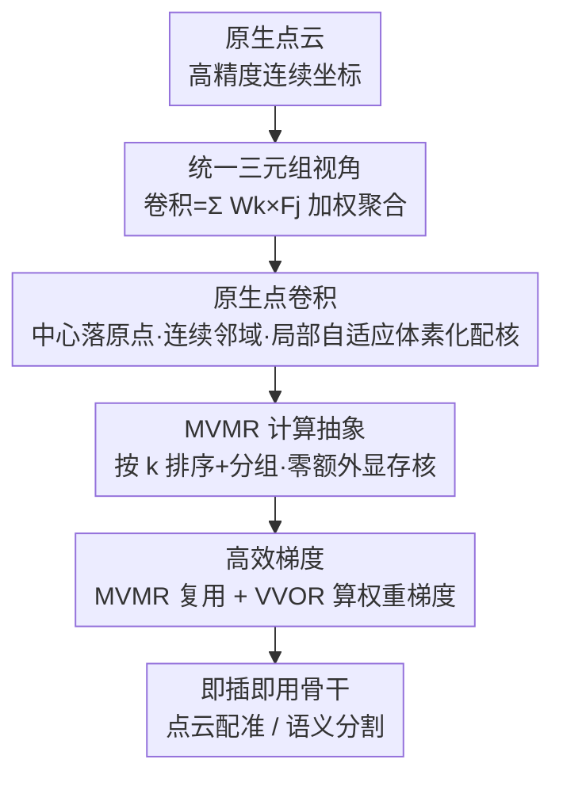

# PointCNN++: Performant Convolution on Native Points

**会议**: CVPR 2026  
**论文**: [CVF Open Access](https://openaccess.thecvf.com/content/CVPR2026/html/Li_PointCNN_Performant_Convolution_on_Native_Points_CVPR_2026_paper.html)  
**代码**: https://github.com/ant-research/pointelligence  
**领域**: 3D视觉  
**关键词**: 点云卷积, 稀疏卷积, GPU算子, 点云配准, 语义分割

## 一句话总结
PointCNN++ 把稀疏卷积从"体素"推广到"原生点"——卷积中心直接落在原始高精度坐标上、邻域在连续空间里搜、只在最后一步做局部自适应体素化来配对卷积核，并把整个计算抽象成 MVMR（矩阵-向量乘加归约）问题手写 GPU 核，做到零额外显存，因而在保住几何精度的同时比体素法更省显存、更快，作为骨干"即插即用"地把点云配准（KITTI Recall 99.8%）和语义分割（nuScenes mIoU 78.2%）都刷到 SOTA。

## 研究背景与动机
**领域现状**：点云卷积学习长期分裂成两条路线。一条是**体素法**（O-CNN、SPConv、MinkowskiEngine、TorchSparse 这一脉），先把整个连续空间全局体素化成稀疏体素格，再在格子上做稀疏卷积，靠稀疏性把性能做得很高；另一条是**点法**（PointCNN、KPConv、PointConv），尽量保住点的原始精度，但要先把不规则点"变换"成规则稠密张量再卷积（transform-then-convolve）。

**现有痛点**：两条路各有一个硬伤。体素法在流程**最开头**就做全局体素化，这是一个有损采样：原始点 $p$ 被迫吸附到体素中心、邻域用切比雪夫距离在量化后的格子上找（本该进邻域的点反而被排除）、卷积核精细度被全局体素大小**绑死**。体素尺寸一旦定下来，就划出了一条由它决定的"先验误差地板线"，对配准这种依赖亚体素级特征唯一性的任务是致命瓶颈。点法精度保住了，但那个"不规则→规则"的变换本身要引入额外计算、额外可学参数、还有大量 padding 和访存——而访存正是点云在 GPU 上低效的主因。

**核心矛盾**：精度与性能被当成一个"二选一"的永久妥协——要精度（点法）就慢，要快（体素法）就丢精度。

**本文目标**：把这个 trade-off 当成"可以通过整体计算设计来缓解的冲突"，而不是天命，同时拿到体素法的性能优势和点法的精度优势。

**切入角度**：作者用一个**统一的卷积三元组视角**重新看问题——任意卷积都是在一组三元组 $T=\{(i,j,k)\}$ 上做加权聚合，三元组只回答三个问题：卷积中心放哪、邻域怎么配、用哪个核。2D 图像卷积、3D 体素卷积都只是这个公式在"离散规则数据"上的特例。既然如此，体素卷积不过是"原生点卷积"被量化后的**退化特例**，那就没必要从一开始就退化。

**核心 idea**：把稀疏卷积从离散体素推广到连续原生点（中心、邻域都在原始坐标上做，只在最后一步做局部体素化配核），并把这个更通用的算子重写成 MVMR 计算原语 + 手写 GPU 核，让"高保真"同时"高性能"。

## 方法详解

### 整体框架
PointCNN++ 是算子与计算系统的**协同设计**：上层重新定义"卷积长什么样"（原生点卷积），下层重新设计"它怎么在 GPU 上跑得快"（MVMR 抽象 + 专用核），两者缺一不可——更通用的算子只有在足够 performant 时才有实用价值。

整体可以分成"统一视角 → 算子定义 → 计算抽象 → GPU 核 → 反向传播"几段。先用统一三元组公式

$$F^{out}_i = \sum_{(i,j,k)\in T} W_k \times F^{in}_j$$

把卷积抽象成在三元组集合 $T$ 上的加权求和（$F^{in}_j\in\mathbb{R}^{C_{in}}$ 是邻居特征，$W_k\in\mathbb{R}^{C_{out}\times C_{in}}$ 是核，$F^{out}_i\in\mathbb{R}^{C_{out}}$ 是输出）。不同卷积的本质差别只在"$T$ 怎么构造"。原生点卷积就是把 $T$ 的构造全部放在原始连续坐标上，只在配核那一步引入局部体素化；随后把这个 $T$ 上的计算落到 MVMR 原语，再用排序+分组的 GPU 核把访存压到极致，前向反向共用同一套核。

### 关键设计

**1. 原生点卷积：让中心、邻域都留在原始坐标上，只在最后一步局部体素化配核**

这一条直接针对体素法"开头就全局体素化"埋下的误差地板。原生点卷积按三步重构三元组 $T$：❶**卷积中心** $P^{out}_i\in\mathbb{R}^3$ 直接取原始高精度点坐标，不再吸附到体素中心；❷**邻域配对** $(i,j)$ 用这些精确中心在连续空间里按合适距离度量（论文用固定半径搜索而非 KNN，因为半径搜索的空间局部感受野更契合卷积）做近邻搜索；❸**核配对** $(j,k)$ 才在每个邻域内、以 $P^{out}_i$ 为中心做一次**局部自适应体素化**，把邻居点 $P^{in}_j$ 映射到对应的核 $W_k$。前两步全程保持原始精度，只有第三步引入量化，而且这个局部体素化是逐邻域自适应的、中心恰好对齐邻域中心，配对质量更高。

关键的解耦在于：**核的分辨率不再被全局体素大小绑死，而是由"核本身的精细度"决定局部体素化的分辨率**。同一个邻域，按需可以用 $3^3$ 也可以用 $5^3$ 的核；而体素卷积里若邻域已被量化成 $3^3$ 的粗体素，再上 $5^3$ 的核就是浪费——多出来的精细度无处落脚。由此作者证明：体素卷积是原生点卷积的退化特例，从原生点退化到体素需要三步退化（中心吸附到体素中心、邻域改在体素空间搜、核分辨率耦合到全局体素分辨率），每一步都丢精度。

**2. MVMR 抽象 + 按 k 排序分组：把"通用算子"做成零额外显存的高性能 GPU 核**

通用带来灵活，也带来计算难题。沿用图像卷积的 im2col 物化思路在这里行不通：把邻域物化成规则张量要给每个邻域 padding 到统一最大尺寸，额外显存约 $N_{in}\times K\times C_{in}$（$K$ 倍于原数据，$K=t^3$），点云邻域大小不齐会让这个开销远超图像卷积，完全不可接受。

作者转而把式 (1) 直接抽象成 **MVMR（Matrix-Vector Multiplication and Reduction）**：$W_k\times F^{in}_j$ 是矩阵-向量乘（MVM），其余是归约（Reduction），两者在 GPU 上都各有成熟高效解法。最朴素的"一个线程处理一个三元组"会反复从全局显存读 $W$，访存量约

$$|T|\times\big(\underbrace{C_{out}\times C_{in}}_{\text{读 }W}+\underbrace{C_{in}}_{\text{读 }F^{in}}+\underbrace{C_{out}}_{\text{原子写 }F^{out}}\big)$$

读 $W$ 是瓶颈。由于结果与三元组处理顺序无关，作者**把 $T$ 按 $k$ 排序**再切成长度 $L$ 的连续组：因为 $K\ll|T|$，由鸽笼原理每组里几乎所有三元组共享同一个 $k$（一组内不同 $k$ 的期望数约 $1+\tfrac{L\times K}{|T|}\to 1$），于是每组只需把对应的 $W_k$ 读进片上一次复用，全局访存降到原来的约 $O(1/L)$：

$$\tfrac{|T|}{L}\times C_{out}\times C_{in}+L\times C_{in}+L\times C_{out}$$

为什么选按 $k$ 排而不是按 $i$ 或 $j$：$K\ll N_{in}\simeq N_{out}$，按 $k$ 分组每组唯一值最接近 1，节省最大（按 $i/j$ 节省的是写 $F^{out}$/读 $F^{in}$，量级本就小得多）。在并行上，单线程扛不下整块 $C_{out}\times C_{in}$ 的片上内存，作者把核矩阵切成 $B_{out}\times B_{in}$ 的块、用一个 warp 处理一组的 MVM（借鉴 Tall-and-Skinny 矩阵乘的高效 GPU 算法）。Algorithm 1 据此只在 $j/k/i$ 真正变化时才访存或原子写，做到**零额外显存**——唯一的"额外"开销就是按 $k$ 排序，而 GPU 并行排序延迟可忽略（实现超参 $L{=}128,B_{out}{=}B_{in}{=}32$）。

**3. 共用核的高效反向：MVMR 复用 + VVOR 算权重梯度**

训练/微调要求反向也高效。对式 (1) 求导得到两类结构不同的梯度。对输入特征的梯度

$$\nabla_{F^{in}_j}L=\sum_{(i,j,k)\in T} W_k^{\top}\times\nabla_{F^{out}_i}L$$

形如"一组矩阵（转置后的权重）乘一组向量再归约"，**和前向是同一个 MVMR 结构**，于是直接复用前向那套高度优化的核。对权重核的梯度

$$\nabla_{W_k}L=\sum_{(i,j,k)\in T}\nabla_{F^{out}_i}L\otimes F^{in}_j$$

是上游梯度与输入特征的外积再归约，作者把它抽象成 **VVOR（Vector-Vector Outer product and Reduction）**，按和 MVMR 同样的排序-分组-warp 原则另写一个专用核。两个专用核把整条反向也压进"原生、零额外显存"的设计里，使训练全程高效，补完了这套整体系统设计。

## 实验关键数据

### 算子级性能（微基准）
在 ResNet-18 骨干、标准配置 $C_{in}{=}64,C_{out}{=}128,K{=}3^3$、S3DIS 10 个大场景、RTX 4090 上，单层卷积的显存与延迟对比点法/体素法基线：PointCNN++ 显存**始终最低**，比体素法明显更省、比点法低**一个数量级以上**（源于零额外显存核，绕开 padding/物化）；端到端前向+反向也比所有基线更快。一个意外发现：把本方法"退化"成体素变体反而又快了一点，作者推测是退化变体核矩阵使用更集中于空间"中心"核、cache 命中更好（⚠️ 原文承认确切原因未知，待进一步验证）。

### 下游任务一：点云配准（KITTI，即插即用替换 FCGF 骨干）
仅把经典 FCGF 的 MinkowskiEngine 骨干换成 PointCNN++、其余完全不动、零任务特定调参：

| 方法 | 架构 | RTE(m)↓ | RRE(°)↓ | Recall(%)↑ | Param |
|------|------|---------|---------|------------|-------|
| Regformer (2023) | PNpp+Attn | 0.22 | 0.058 | 94.6 | 3.12M |
| Predator (2021) | KP+GCN | 0.35 | 0.081 | 93.9 | 158.42M |
| DGR (2020) | MkEngine | 0.35 | 0.090 | 92.1 | 244.68M |
| UMEReg (2024) | MkEngine | 0.49 | 0.490 | 79.6 | 7.17M |
| **Ours** | **PointCNN++** | **0.19** | **0.060** | **99.8** | 8.75M |

RTE 几乎腰斩到 0.19m、Recall 拉到近乎满分的 99.8%，且平移/旋转标准差都是最低（最稳）。3DMatch 上同样在 5000→250 不同点密度下保持竞争力：FMR 稳定在 99.3% 左右（各密度第一），RR 在用"老骨干"的前提下接近为各任务定制架构的 GeoTrans。

### 下游任务二：语义分割（nuScenes，drop-in 替换 ResUNet2 算子）

| 算子 | mIoU(%)↑ | mAcc(%)↑ | 显存(GB)↓ | 每迭代耗时↓ |
|------|----------|----------|-----------|-------------|
| KPConv（点法） | - | - | 17.03 | 23.82 |
| MinkowskiEngine（体素法） | 74.4 | 81.7 | 2.61 | 0.131 |
| **PointCNN++（Ours）** | **78.2** | **85.3** | **2.43** | **0.102** |

同一框架内只替换核心卷积算子：mIoU 比体素法 MinkowskiEngine 高 **3.8%**（74.4→78.2），同时更省显存、更快；KPConv 训完一遍约需 116 天，基本不可用，只能报其显存/迭代耗时（均远高于本方法）。

### 关键发现
- **精度与性能不是二选一**：把卷积中心和邻域留在原始坐标、只在最后局部体素化，既保住几何细节又靠 MVMR 核拿到性能，配准/分割同时刷点且更省更快。
- **贡献来自"换引擎"而非任务定制**：所有下游增益都是在不改其余结构、不做任务特定调参的"即插即用"替换下取得的，说明算子本身够强。
- **核分辨率与感受野解耦**是配准这类高精度任务的关键——体素法把两者绑死，导致亚体素特征唯一性丢失。

## 亮点与洞察
- **"体素卷积是原生点卷积的退化特例"这个视角很提气**：把两条对立路线统一进同一个三元组公式，再指出体素法是被三步退化弱化的版本，于是"不退化"就成了顺理成章的目标——理论叙事干净。
- **算子与 GPU 核协同设计**：很多点法慢不是因为数学贵，而是访存/padding 贵。本文不在算子层硬优化，而是把计算抽象成 MVMR、用"按 k 排序+分组复用 $W$"把访存压到 $O(1/L)$，并做到零额外显存——这套"排序换访存局部性"的思路可迁移到其他不规则稀疏算子。
- **前向反向共用核**：发现输入特征梯度天然也是 MVMR 结构，直接复用前向核，只为权重梯度另写一个 VVOR 核，工程上很省。

## 局限与展望
- **依赖手写 GPU 核**：MVMR/VVOR 核基于 Triton 实现，超参（$L,B_{out},B_{in}$）固定，跨硬件/跨配置可能需要 auto-tuning（作者提到可按排序索引做自动调优），通用框架的可移植性不如成熟体素库。
- **退化变体反而更快的现象未解释清**：作者自己承认确切原因不明，只给了 cache 命中的猜测，留有疑点（⚠️ 以原文为准）。
- **下游只做"即插即用替换"**：刻意不与先进模块（如 GeoTrans 的几何 Transformer）融合，因此 3DMatch 上 IR/RR 仍略逊于专门定制架构；把本骨干与高级模块融合留作未来工作。
- KPConv 在 nuScenes 上因训练耗时过长（~116 天）未给精度，对比表里点法精度是缺位的，横向"精度"比较主要落在体素法之间。

## 相关工作与启发
- **vs 体素法（MinkowskiEngine / SPConv / TorchSparse）**：它们靠全局体素化 + 稀疏卷积换性能，本文证明"利用稀疏性"不必和"体素化"绑定——可以直接在原生点上利用稀疏性，绕开量化的精度损失，且显存/速度反而更优。
- **vs 点法（PointCNN / KPConv）**：它们用"不规则→规则"的变换（X-Transform、核点）保精度，但变换本身引入额外计算/参数/访存与 padding；本文取消变换，把高保真直接交给原生点卷积 + MVMR 核，精度不降而效率大涨。
- **vs cuDNN 的隐式 GEMM 思路**：作者明确受 cuDNN"在片上惰性物化以避免额外显存"启发，把同样的"零额外显存"目标搬到不规则点云的卷积上实现。

## 评分
- 新颖性: ⭐⭐⭐⭐⭐ 用统一三元组视角把体素卷积证成原生点卷积的退化特例，并配套 MVMR 零额外显存核，算子+系统协同设计很扎实。
- 实验充分度: ⭐⭐⭐⭐ 微基准 + 配准 + 分割三线验证、即插即用对比清晰；但点法精度缺位、退化变体加速未解释。
- 写作质量: ⭐⭐⭐⭐⭐ 三元组统一框架叙事清楚，访存复杂度与退化证明都讲得明白。
- 价值: ⭐⭐⭐⭐⭐ 给"高保真且高效"的点云学习开了新范式，骨干可即插即用替换，配准/分割直接受益。

<!-- RELATED:START -->

## 相关论文

- [\[CVPR 2026\] Linear Fundamental Matrix Estimation from 7 or 5 Points](linear_fundamental_matrix_estimation_from_7_or_5_points.md)
- [\[CVPR 2026\] PoseMaster: A Unified 3D Native Framework for Stylized Pose Generation](posemaster_a_unified_3d_native_framework_for_stylized_pose_generation.md)
- [\[CVPR 2026\] PixARMesh: Autoregressive Mesh-Native Single-View Scene Reconstruction](pixarmesh_autoregressive_mesh-native_single-view_scene_reconstruction.md)
- [\[CVPR 2026\] DirectFisheye-GS: Enabling Native Fisheye Input in Gaussian Splatting with Cross-View Joint Optimization](directfisheye-gs_enabling_native_fisheye_input_in_gaussian_splatting_with_cross-.md)
- [\[CVPR 2025\] Seurat: From Moving Points to Depth](../../CVPR2025/3d_vision/seurat_from_moving_points_to_depth.md)

<!-- RELATED:END -->
