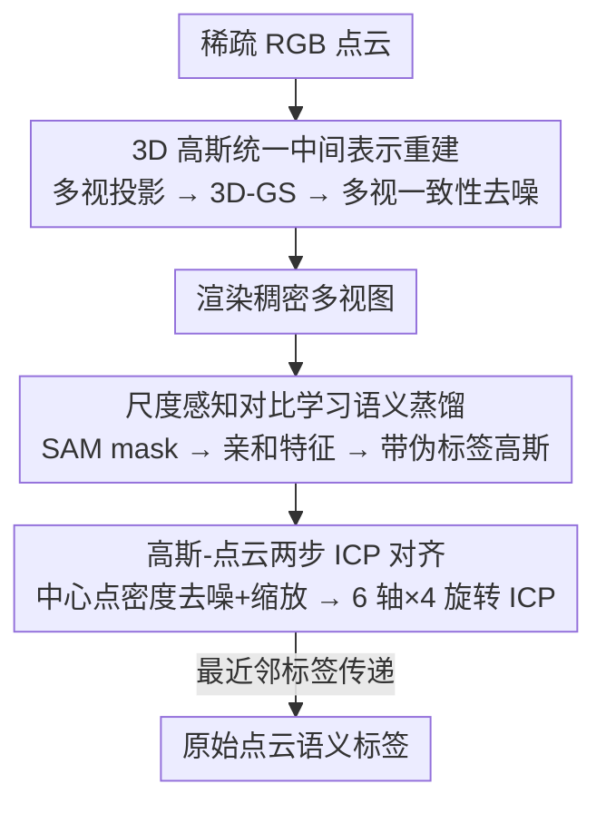

# PointGS: Semantic-Consistent Unsupervised 3D Point Cloud Segmentation with 3D Gaussian Splatting

**会议**: CVPR 2026  
**论文**: [CVF Open Access](https://openaccess.thecvf.com/content/CVPR2026/html/Song_PointGS_Semantic-Consistent_Unsupervised_3D_Point_Cloud_Segmentation_with_3D_Gaussian_CVPR_2026_paper.html)  
**代码**: https://github.com/SebastianYIXIAO/pointGS  
**领域**: 3D视觉  
**关键词**: 无监督点云分割, 3D 高斯泼溅, SAM, 跨模态语义蒸馏, ICP 配准

## 一句话总结
PointGS 把稀疏点云先重建成稠密的 3D 高斯场作为统一中间表示，在渲染图上用 SAM 抽 2D mask 并通过尺度感知对比学习把语义蒸馏到高斯基元，再经两步 ICP 把高斯对齐回原始点云做最近邻标签传递，在无标注、无点云预训练的前提下于 S3DIS（+2.8% mIoU）和 ScanNet-v2（+0.9% mIoU）上超过现有无监督方法。

## 研究背景与动机

**领域现状**：全监督点云分割方法已经很成熟，但依赖密集的逐点标注，对大规模室内场景成本极高。为摆脱标注负担，无监督方法走两条路线：一是基于超点/聚类（GrowSP、U3DS³、LogoSP），二是借 2D 预训练大模型（SAM、DINOv2）注入语义先验（P2P、PointDC、Segment3D）。

**现有痛点**：纯聚类方法只能抓局部几何相似性，无法区分"几何相似但语义不同"的物体——例如墙面和挂在墙上的告示板都是平面，却被聚到一起。而引 2D 先验的方法又撞上一个根本的模态错配：稀疏点云投影到 2D 时，因为缺乏遮挡和深度信息，前景点与背景点会在投影图上重叠（论文 Fig.1 的会议室例子），SAM 在这种语义混淆的投影图上直接出 mask，3D 分割自然很差。

**核心矛盾**：离散的 3D 点与连续的 2D 像素之间存在域差异。要么硬做复杂的点-像素对齐、要么额外做 3D 预训练来消歧，二者都增加复杂度并损害跨视图语义一致性。

**本文目标**：在不引入人工标注、不做点云预训练、不做复杂对齐的前提下，让 2D 语义先验能干净地搬到稀疏点云上。

**切入角度**：作者注意到 3D 高斯泼溅（3D-GS）天然有两条性质正好对症——其一，用连续覆盖的高斯椭球替代离散点，能填补空间空洞并显式编码遮挡，使渲染图前景挡住背景，避免 SAM 出"混语义" mask；其二，3D-GS 的可微渲染把原生 3D 空间关系保留进 2D 图像，蒸馏出来的语义天生带 3D 一致性。

**核心 idea**：把 3D-GS 当成桥接离散-连续鸿沟的统一中间表示——先重建、再在渲染图上蒸馏 SAM 语义、最后对齐回原始点云，整条 pipeline 不需要复杂的 2D-3D 对齐或额外 3D 预训练。

## 方法详解

### 整体框架
PointGS 输入是一帧带 RGB 的稀疏室内点云 $P=\{p_i\}_{i=1}^N,\ p_i\in\mathbb{R}^6$，输出是每个点的语义标签 $l_i\in\{1,\dots,K\}$，全程无人工监督。整条流水线分三步串行：① 把稀疏点云按预定视角投影成多视图，用 3D-GS 重建成稠密高斯场并做多视一致性去噪；② 从高斯场渲染稠密图、用 SAM 出 2D mask，再用尺度感知对比学习把语义蒸馏到每个高斯的亲和特征，得到带伪标签的高斯；③ 提取高斯椭球中心点，密度去噪+缩放后做两步 ICP 把高斯对齐回原始点云坐标系，最后用最近邻把标签从高斯传回每个原始点。

### 关键设计

**1. 3D 高斯作为统一中间表示：用连续高斯椭球补齐稀疏点云的空洞、消除投影语义混淆**

这一步直接针对"稀疏点投影会前后景重叠"的痛点。作者先按一组预定义视角把点云投影成多视图，再用 3D-GS 重建出稠密高斯场。3D-GS 的可微光栅化对像素 $u$ 用 alpha 合成算颜色 $C(u)=\sum_{i=1}^{|G_u|}\alpha_{g_i(u)}c_{g_i(u)}\prod_{j=1}^{i-1}(1-\alpha_{g_j(u)})$，其中深度排序的混合让前景高斯遮住背景信号——这正是关键：渲染图里前景挡住背景，SAM 不再被"混语义"的投影图骗到。为了去掉重建出的高斯噪声，作者借鉴 SuGaR 引入**多视一致性检查**：若某个高斯基元在超过三个相邻视图里都没参与渲染，就删掉它，从而减少背景对前景的语义干扰。相比直接投影稀疏点，渲染图更连续、更稠密，2D→3D 的语义迁移更可靠。

**2. 尺度感知对比学习蒸馏 SAM 语义：把视图特定的 2D mask 一致地搬到 3D 高斯**

SAM 在第 $v$ 个视图出一组二值 mask $M^{(v)}=\{M_j^{(v)}\}$，但它们是视图特定的，必须反传到 3D 高斯才能跨视图一致。作者沿用 SAGA 的思路，给每个高斯挂一个可学习的亲和特征 $f_g\in\mathbb{R}^D$，并用一个尺度门 $S(s)$（线性层+sigmoid）按粒度 $s$ 调制特征 $f_g^s=S(s)\odot f_g$，以解决"同一高斯在不同尺度下属于不同物体/部件"的多粒度歧义。监督来自按 3D 尺度 $s_{M}$ 排序的 mask 对应关系：若两像素共享某个 mask 则掩码相关 $\mathrm{Corr}_m=1$ 否则为 0，特征相关取门控特征余弦相似度 $\mathrm{Corr}_f(s,u_1,u_2)=\langle F^s(u_1),F^s(u_2)\rangle$，对比损失为 $L_{corr}=(1-2\cdot \mathrm{Corr}_m)\cdot\max(\mathrm{Corr}_f,0)$，并对渲染特征的范数加正则。其中尺度 $s_M=2\sqrt{\mathrm{std}(X)^2+\mathrm{std}(Y)^2+\mathrm{std}(Z)^2}$ 由 mask 反投影成 3D 点云后的坐标标准差算出（⚠️ 公式细节以原文为准）。这样语义就一致地蒸馏到高斯上，得到带伪标签的高斯。

**3. 高斯-点云两步 ICP 对齐 + 最近邻标签传递：跨坐标系把语义传回原始点**

重建/渲染让高斯坐标系与原始点云在尺度、朝向上都不一致，直接传标签会错位。作者先提取高斯椭球的几何中心点 $P_G$，再做两件事：其一**密度去噪+缩放**，用核密度 $\hat\rho_i=\sum_{j\neq i}\exp(-\|p_i-p_j\|_2^2/2h^2)$ 估每点密度，按阈值 $\tau$ 保留高密度的轮廓边缘点，再用直径比 $s=\mathrm{diam}(P_O)/\mathrm{diam}(P_G')$ 把高斯点缩放到与原点云同尺度；其二**两步 ICP**，先粗配准求 $(R^{(1)},t^{(1)})$，但室内场景点呈立方体式分布，单次 ICP 易陷局部最优，于是定义六个轴向 $\{\pm e_x,\pm e_y,\pm e_z\}$ 各配 $\{0°,90°,180°,270°\}$ 四种旋转，对全部 24 种组合重复 ICP 并按 RMSE 选最优解。对齐后用最近邻 $n^*(m)=\arg\min_n\|b_m-p_n\|_2$ 把高斯标签 $l_n^G$ 传给每个原始点 $b_m$。消融显示，正是这一步把"加了 3D-GS 但没对齐"的灾难性结果救了回来。

### 损失函数 / 训练策略
核心训练目标是高斯亲和特征上的尺度感知对比损失 $L_{corr}$（按采样像素对求和）加上渲染特征范数正则 $L_{norm}(u)=1-\|F(u)\|_2$。其余步骤（3D-GS 重建、多视一致性检查、ICP、最近邻传递）是几何处理而非可学习目标。效率上单 RTX 3090，3D-GS 约 43.27 it/s，SAM 约 0.35 fps，作者每场景跑 10,000 次 3D-GS 迭代以平衡速度与质量，投影分辨率 770×770。

## 实验关键数据

### 主实验
在两个室内基准上评测，均不使用官方多视图、只用点云自带 RGB 做投影；用匈牙利算法对齐预测簇与 GT 后报 mIoU/oAcc/mAcc。

| 数据集 | 指标 | PointGS | 之前最好 (LogoSP) | 提升 |
|--------|------|---------|--------------------|------|
| ScanNet-v2 val | mIoU(%) | 36.7 | 35.8 | +0.9 |
| S3DIS Area5 | mIoU(%) | 49.3 | 46.5 | +2.8 |
| S3DIS Area5 | mAcc(%) | 66.1 | 55.9 | +10.2 |
| S3DIS Area5 | oAcc(%) | 76.6 | 82.8 | −6.2 |

oAcc 反而低于 GrowSP/LogoSP，作者解释 oAcc 受天花板、墙、地板这类大点数类别主导；而 mIoU/mAcc 提升说明 PointGS 在小物体和近平面物体（如壁挂告示板）上定位更准，甚至能分出 GT 标注外的物体。

### 消融实验
S3DIS Area5 上逐模块叠加（Table 5）：

| 配置 | mIoU(%) | 说明 |
|------|---------|------|
| 基线投影（无 3D-GS 重建） | 13.1 | 直接投影稀疏点 |
| + 3D-GS（未对齐） | 3.3 | 坐标系未对齐，崩溃 |
| + 2-Step ICP | 27.5 | 对齐后救回 +24.2 |
| + Affinity Feature | 49.2 | 对比蒸馏，再 +21.7 |
| + 多视一致性检查（完整） | 49.3 | 去噪微调 +0.1 |

### 关键发现
- **两步 ICP 和亲和特征是两大支柱**：仅加 3D-GS 不对齐会从 13.1 暴跌到 3.3，证明高斯-点云对齐不可省；亲和特征（尺度感知对比蒸馏）单独带来 +21.7 mIoU，是语义来源的核心。
- **投影超参敏感**：视图数 $V$ 从 50→150 时 mIoU 由 35.9% 升到 49.3%，200 视图仅微增到 49.4%，故选 150；角度间隔在 $\Delta_{elev}=0.5°,\Delta_{azim}=7.5°$ 时最优，过大（0.9°/9.5°）会骤降到 36.2%；环绕式投影（49.3%）优于平铺式（45.9%）。
- **尺度门控随场景调**：Scale Gate=0.4 时 S3DIS 最优；ScanNet 因小物体多，0.3 更好——小值放大细粒度通道利于小物体但牺牲大物体一致性。

## 亮点与洞察
- **把 3D-GS 当"翻译中介"而非渲染目的**：通常 3D-GS 用于新视图合成，这里反过来用它的稠密性+遮挡编码来"修复"稀疏点云的投影歧义，让 SAM 在干净的渲染图上工作——这个视角转换很巧妙，本质是用重建质量换语义一致性。
- **6 轴×4 旋转的暴力 ICP 很务实**：室内场景立方体式分布让 ICP 易陷局部最优，与其设计复杂初始化，作者直接枚举 24 个朝向选 RMSE 最小，简单但消融证明它把分数从 3.3 救到 27.5。
- **可迁移性**：这套"重建成连续中介→在中介上蒸馏 2D 大模型语义→再对齐回原模态"的范式，对任何"稀疏/离散模态想借 2D 基础模型语义"的任务（如稀疏 LiDAR、医学点云）都有借鉴意义。

## 局限与展望
- **强依赖 3D-GS 重建质量与速度**：每场景要跑上万次 3D-GS 迭代 + SAM 渲染推理（SAM 仅 0.35 fps），整体偏重，难以实时或扩到室外大场景。
- **oAcc 偏低**：大类别（墙/地/天花板）上不如聚类法，说明对大面积平面的整体一致性还有欠缺，可能源于过度细粒度分割。
- **超参敏感**：视图数、角度间隔、Scale Gate 都需按数据集调，缺乏自适应机制；论文也承认 Scale Gate 要随场景手动调整。
- **仅室内**：只在 S3DIS / ScanNet 室内验证，室外、动态、户外大尺度场景未测。

## 相关工作与启发
- **vs LogoSP / GrowSP（聚类系无监督）**: 他们靠局部几何相似性做超点合并，区分不了几何相似但语义不同的物体；PointGS 引入 SAM 语义先验，在小物体和近平面物体上更准（mIoU/mAcc 更高），代价是 pipeline 更重、大类别 oAcc 略逊。
- **vs PointDC / P2P / Segment3D（2D 先验系）**: 这些方法直接在稀疏点投影图上用 2D 模型，受投影重叠和回插语义混淆之苦；PointGS 用 3D-GS 把离散点变连续高斯，从源头消除投影歧义，且无需复杂 2D-3D 对齐或额外 3D 预训练。
- **vs SAGA / GARField（高斯尺度感知特征）**: 借用了它们的尺度门控亲和特征，但把面向"用户提示分割"的场景改造成全自动无监督——用 SAM 自动 mask、不要用户 prompt，并把重点放在把语义传回原始点云。

## 评分
- 新颖性: ⭐⭐⭐⭐ 用 3D-GS 作离散-连续桥接中介解决投影语义混淆，视角新颖，但各组件多为已有技术（3D-GS、SAGA、SAM、ICP）的组合
- 实验充分度: ⭐⭐⭐⭐ 两基准 + 逐模块消融 + 多组超参敏感性分析较完整，但只有室内、且 SOTA 提升幅度 ScanNet 上仅 +0.9
- 写作质量: ⭐⭐⭐⭐ pipeline 三步叙述清晰、图示直观，公式略多处依赖附录
- 价值: ⭐⭐⭐⭐ "重建成连续中介再蒸馏 2D 大模型语义"的范式对稀疏模态借力 2D 基础模型有启发，代码开源

<!-- RELATED:START -->

## 相关论文

- [\[CVPR 2026\] Image-to-Point Cloud Feature Back-Projection for Multimodal Training of 3D Semantic Segmentation](image-to-point_cloud_feature_back-projection_for_multimodal_training_of_3d_seman.md)
- [\[CVPR 2026\] GeoFree-CoSeg: Unsupervised Point Cloud-Image Cross-Modal Co-Segmentation Without Geometric Alignment](geofree-coseg_unsupervised_point_cloud-image_cross-modal_co-segmentation_without.md)
- [\[CVPR 2026\] JOPP-3D: Joint Open Vocabulary Semantic Segmentation on Point Clouds and Panoramas](jopp3d_joint_open_vocabulary_semantic_segmentation.md)
- [\[CVPR 2025\] P-SLCR: Unsupervised Point Cloud Semantic Segmentation via Prototypes Structure Learning and Consistent Reasoning](../../CVPR2025/3d_vision/p-slcr_unsupervised_point_cloud_semantic_segmentation_via_prototypes_structure_l.md)
- [\[CVPR 2026\] Topology-aware Feature Propagation for Unsupervised Non-rigid Point Cloud Correspondence](topology-aware_feature_propagation_for_unsupervised_non-rigid_point_cloud_corres.md)

<!-- RELATED:END -->
