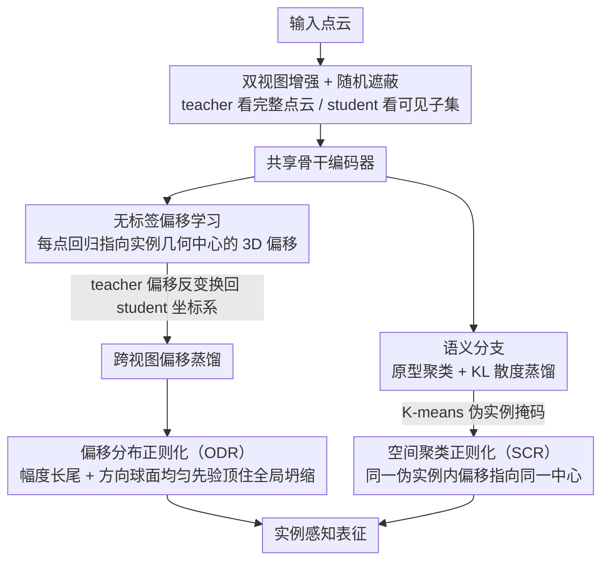

# PointINS: Instance-Aware Self-Supervised Learning for Point Clouds

**会议**: CVPR 2026  
**arXiv**: [2603.25165](https://arxiv.org/abs/2603.25165)  
**代码**: 无  
**领域**: 3D视觉  
**关键词**: 点云自监督学习, 实例感知, 几何推理, 偏移学习, 全景分割

## 一句话总结

PointINS 提出首个显式学习语义一致性和几何推理的点云自监督框架，通过无标签的偏移分支配合偏移分布正则化（ODR）和空间聚类正则化（SCR），在室内实例分割上平均提升 +3.5% mAP，室外全景分割提升 +4.1% PQ。

## 研究背景与动机

点云自监督学习（SSL）在语义分割上已取得显著进展，但现有方法（对比学习、掩码建模）本质上都在强化语义不变性——让同一语义类别的点特征尽可能相似。

**核心矛盾**：语义不变性与实例区分是矛盾的。要区分同类的不同实例（如两把相邻的椅子），需要保留细粒度的几何关系，而现有 SSL 方法恰恰在抑制这种几何敏感性（防止特征坍缩到法线/位姿等低级几何线索）。

**关键洞察**：作者认为实例感知所需的"几何接近性"是高层次的关系属性，不同于被视为shortcut的低级几何线索。这与有监督的实例/全景分割框架一致——语义分支负责类别，偏移分支负责实例聚类，两者协同增强整体理解。

## 方法详解

### 整体框架

PointINS 想解决的是一件别人都绕开的事：让点云自监督模型不只懂"这是什么类别"，还要懂"这是哪一个实例"。它沿用 teacher-student 自蒸馏的骨架——把一份点云做两次随机增强得到两个视图，再随机遮蔽掉一部分点，student 只看可见子集、teacher 看完整点云，用 teacher 的输出去监督 student。在原有的语义分支（原型聚类 + KL 散度蒸馏，负责把同类点拉近）之外，它额外挂了一条**偏移分支**：每个点都去预测一个指向自己所属实例几何中心的 3D 偏移向量。语义分支管"是什么"，偏移分支管"属于谁"，两条分支协同，模型才真正具备实例感知。难点在于偏移分支没有任何标签可学，论文用两个正则化（ODR 与 SCR）把它从坍缩里救出来。

### 关键设计

**1. 无标签偏移学习：让每个点学会"往实例中心走"**

实例感知的核心，是知道相邻的两把椅子虽然类别相同却属于不同实例——这恰恰是只盯着语义不变性的对比/掩码方法所抑制的能力。PointINS 把它转化成一个偏移回归问题：在 teacher-student 架构里给每个点接一个偏移头，把骨干特征映射成 3D 偏移向量，向量方向就是"这个点该朝哪走才能到达自己实例的几何中心"。一个棘手的细节是，两个视图各自经过了旋转/翻转/缩放等增强，同一个点在两视图里的"正确偏移方向"并不一致；论文因此追踪每次增强的变换矩阵，把 teacher 的偏移反变换回 student 的坐标系再做蒸馏目标，保证跨视图监督在几何上自洽。这里没有 ground-truth 中心，所以 teacher 的偏移要先经下面的 ODR 整形，才有资格当目标。

**2. 偏移分布正则化（ODR）：用场景统计先验顶住全局坍缩**

没有标签的偏移回归极易坍缩——所有偏移一起趋向零、或退化成同一个方向，loss 照样很低但学不到东西。ODR 的办法是从真实场景里挖两条稳定的统计规律当先验：其一，偏移**幅度**服从一个稳定的长尾分布（大量点离中心近、少量点离得远）；其二，偏移**方向**在单位球面上近似均匀分布（实例中心被点从四面八方包围）。把预测偏移的经验分布往这两条先验上对齐，就给了偏移分支一个全局约束：分布形状不对就受罚，零坍缩和单向坍缩都会破坏长尾或均匀性，于是被自然排除。先验来自数据本身、不需要任何人工标注，相当于一份零成本的全局监督。

**3. 空间聚类正则化（SCR）：让语义聚类反哺局部几何一致**

ODR 只管住了整体分布的形状，却管不到局部——同一个实例内部的点，偏移方向仍可能各指一方。SCR 来补这一刀：它直接拿语义分支的特征做 K-means 聚类，得到一批"伪实例掩码"，再在每个伪实例内部约束所有点的偏移指向同一个中心。这条约束把"是什么"的语义判断转成了"属于谁"的几何监督，让语义分支的聚类结果反过来给偏移分支提供局部一致性信号，两条分支因此形成正反馈而非各练各的。代价是伪实例来自无监督聚类、并不精确，在实例密集处尤其容易切错，这也是后文局限里点出的问题。

### 损失函数 / 训练策略

总损失 = 语义蒸馏损失（KL 散度）+ 偏移蒸馏损失 + ODR 损失 + SCR 损失，跨视图蒸馏对两个方向都计算。Teacher 由 student 以 EMA 方式更新。

## 实验关键数据

### 主实验

| 数据集 | 任务 | PointINS | 之前SOTA | 提升 |
|--------|------|----------|---------|------|
| ScanNet | 实例分割 mAP | +3.5% avg | Sonata/DOS | +2.5~4.6% |
| ScanNet200 | 实例分割 mAP | 显著提升 | — | — |
| nuScenes | 全景分割 PQ | +4.1% avg | Sonata/DOS | +3.4~4.8% |
| SemanticKITTI | 全景分割 PQ | 提升 | — | — |

在5个数据集上一致超越现有自监督方法。

### 消融实验

| 配置 | 室内 mAP | 室外 PQ | 说明 |
|------|---------|---------|------|
| 仅语义分支（基线） | 基线 | 基线 | 无实例感知 |
| + 偏移分支（无正则化） | 坍缩 | 坍缩 | 验证正则化必要性 |
| + 偏移 + ODR | 提升 | 提升 | 全局分布约束生效 |
| + 偏移 + ODR + SCR | 最优 | 最优 | 局部一致性进一步提升 |

### 关键发现

- ODR 和 SCR 都是必要的：ODR 防止坍缩，SCR 提供局部一致性，缺一不可
- 在 linear probing 设置下提升尤为显著，说明学到的表征质量本身更好，不仅仅是微调效果
- 语义分割性能不受影响甚至略有提升，说明几何推理能力的引入不会损害语义理解

## 亮点与洞察

- **语义-几何协同的洞察**：将有监督实例分割的双分支设计迁移到自监督学习中，从"模仿有监督架构"的角度设计自监督目标
- **统计先验作为免费监督**：偏移的分布特性（长尾幅度+均匀方向）是自然场景的内在属性，利用它们作为正则化相当于引入了零成本的监督信号
- **向 3D 基础模型迈进**：实例感知是 3D 基础模型不可或缺的能力，PointINS 为统一的 3D 表征学习开辟了重要方向

## 局限与展望

- K-means 聚类得到的伪实例掩码不够精确，尤其在实例密集区域
- 偏移的分布先验在不同场景类型间可能有差异（室内 vs 室外）
- 当前只在点云稀疏卷积和 Transformer 骨干上验证，未测试更多架构
- 未来可探索更精细的伪实例生成方法或引入时序信息

## 相关工作与启发

- **vs Sonata/DOS**: 这些方法注重语义一致性但忽略实例感知，PointINS 显式引入几何推理补足这一缺陷
- **vs 有监督实例分割**: PointINS 的偏移分支设计灵感来自 PointGroup 等有监督方法，但创新点在于无标签训练
- **vs 2D SSL (DINO/MAE)**: 3D SSL 面临额外的几何敏感性挑战，需要在避免低级 shortcut 和保留高级几何关系间取平衡

## 评分

- 新颖性: ⭐⭐⭐⭐⭐ 首个显式学习实例感知的3D自监督框架，ODR/SCR设计精巧
- 实验充分度: ⭐⭐⭐⭐⭐ 5个数据集、3种评估协议、充分消融
- 写作质量: ⭐⭐⭐⭐ 动机清晰，技术细节完整
- 价值: ⭐⭐⭐⭐⭐ 对3D基础模型有重要推进作用

<!-- RELATED:START -->

## 相关论文

- [\[CVPR 2026\] Towards Foundation Models for 3D Scene Understanding: Instance-Aware Self-Supervised Learning for Point Clouds](towards_foundation_models_for_3d_scene_understanding_instance-aware_self-supervi.md)
- [\[CVPR 2026\] Deformation-based In-Context Learning for Point Cloud Understanding](deformation-based_in-context_learning_for_point_cloud_understanding.md)
- [\[CVPR 2026\] GaussianGrow: Geometry-aware Gaussian Growing from 3D Point Clouds with Text Guidance](gaussiangrow_geometry-aware_gaussian_growing_from_3d_point_clouds_with_text_guid.md)
- [\[CVPR 2025\] Sonata: Self-Supervised Learning of Reliable Point Representations](../../CVPR2025/3d_vision/sonata_self-supervised_learning_of_reliable_point_representations.md)
- [\[CVPR 2026\] Vista4D: Video Reshooting with 4D Point Clouds](vista4d_video_reshooting_with_4d_point_clouds.md)

<!-- RELATED:END -->
