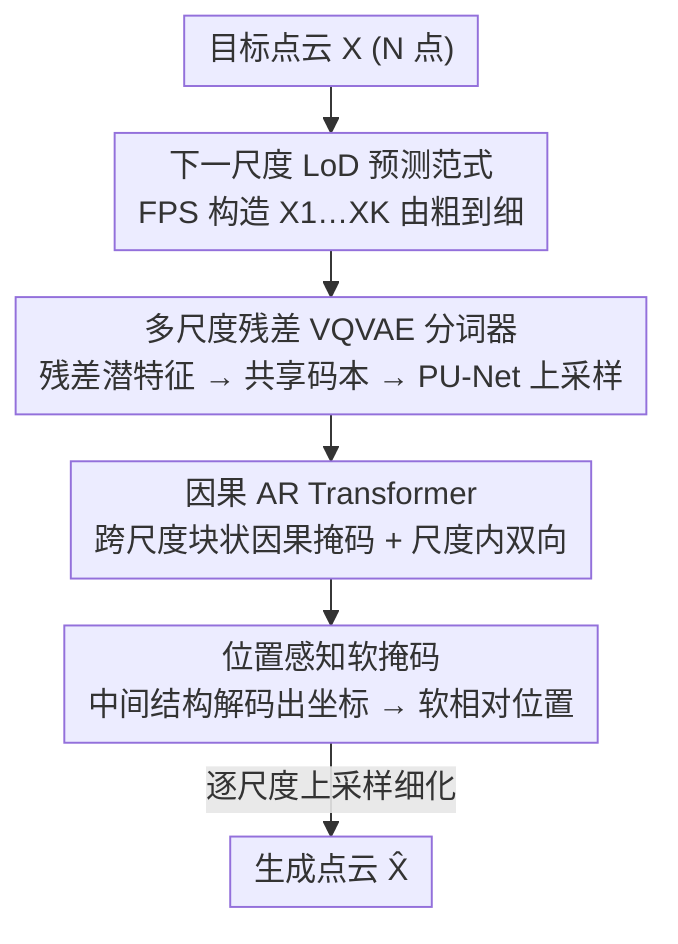

# PointNSP: Autoregressive 3D Point Cloud Generation with Next-Scale Level-of-Detail Prediction

**会议**: CVPR 2026  
**论文**: [CVF Open Access](https://openaccess.thecvf.com/content/CVPR2026/html/Meng_PointNSP_Autoregressive_3D_Point_Cloud_Generation_with_Next-Scale_Level-of-Detail_Prediction_CVPR_2026_paper.html)  
**代码**: https://pointnsp.pages.dev （项目主页）  
**领域**: 3D视觉  
**关键词**: 点云生成, 自回归, 下一尺度预测, 置换不变性, Level-of-Detail

## 一句话总结
PointNSP 把自回归点云生成从"逐点预测"改成"下一尺度 LoD 预测"——先在低分辨率定全局结构、再逐尺度细化几何，用多尺度 VQVAE + 块状因果掩码的因果 Transformer 实现，从而保持点集的置换不变性，在 ShapeNet 上首次让自回归范式达到生成质量 SOTA，并在参数/训练/采样效率上超过强扩散基线。

## 研究背景与动机

**领域现状**：3D 点云生成长期由扩散模型主导（PVD、LION、TIGER），质量强但要数百到上千步去噪、对噪声调度敏感、稠密点云时成本高。自回归（AR）模型采样步数少、效率有吸引力，但质量一直落后于扩散。

**现有痛点**：AR 模型必须给本质无序的点集强加一个人工顺序——PointGrow 按 z 轴排序、ShapeFormer 体素化后行优先展平、PointGPT 用 Morton 码、AutoSDF 当成随机置换的隐变量序列。这种"展平成 1D 序列"的做法把全局形状生成坍缩成局部预测。

**核心矛盾**：固定的序列顺序强加了单向依赖，强化了短程连续性却削弱了长程依赖建模能力，从而难以维持对称性、几何一致性、大尺度空间规律这些全局结构属性；更根本的是，它违反了点集的置换不变性——同一形状的点换个顺序就被建成不同的分布。

**本文目标**：能不能为 3D 点云生成做到置换不变的自回归建模？

**切入角度**：作者借形状建模里的 Level-of-Detail（LoD）原理——一个形状可以从粗到细分多个分辨率层级表达。如果每一步预测的不是"下一个点"而是"下一个尺度的完整形状"，那么每步对应一个给定 LoD 下的完整 3D 形状，既保结构连贯又天然置换不变，灵感来自图像领域 VAR 的"下一分辨率预测"。

**核心 idea**：用"下一尺度 LoD 预测"取代"下一点预测"，把自回归目标从 $\prod_i p(x_i\mid x_{<i})$ 改成 $\prod_k p(X_k\mid X_{<k})$（$X_k$ 是分辨率 $s_k$ 的全局形状），在每个尺度内做丰富的双向交互、跨尺度做因果依赖，从而对齐点集的置换不变本质、避开脆弱的固定顺序。

## 方法详解

### 整体框架
PointNSP 两阶段训练。**阶段一**用 FPS 把目标点云 $X$（$s_K=N$ 个点）逐级下采样成由粗到细的因果 LoD 序列 $X_1,\dots,X_K$，然后训练一个多尺度残差 VQVAE：用置换等变网络抽每尺度的残差潜特征，经共享码本量化成各尺度 token $Q=(q_1,\dots,q_K)$，再用 PU-Net 式上采样把各尺度贡献求和重建出 $\hat X$。**阶段二**在 token 序列 $([start],q_1,\dots,q_{K-1})$ 上训练因果 Transformer 去预测 $(q_1,\dots,q_K)$：跨尺度用块状因果掩码（尺度 $k$ 只能看 $<k$）、尺度内全双向注意力，并用"中间结构解码"得到的位置感知软掩码注入几何位置信息。生成时从最粗尺度起逐尺度上采样细化，等价于一个自回归上采样过程。

### 关键设计

**1. 下一尺度 LoD 预测范式：用置换不变的多尺度因式分解取代脆弱的逐点序列**

这是全文的根。逐点 AR 的分布 $p(x_1,\dots,x_N)=\prod_i p(x_i\mid x_{<i})$ 依赖 token 顺序，不满足 $p(\pi(x_1,\dots,x_N))=p(x_1,\dots,x_N),\forall\pi\in S_N$。PointNSP 改为先构造由粗到细的因果序列 $X_1,\dots,X_K$（$X_k\in\mathbb{R}^{s_k\times3}$ 是分辨率 $s_k$ 的全局形状），再学 $p(X_1,\dots,X_K)=\prod_{k=1}^K p(X_k\mid X_{<k})$，其中上采样率满足 $r_{K-1}\times\cdots\times r_1\times s_1=s_K$。关键在于用 **FPS** 迭代构造 $X_{k-1}=\mathrm{FPS}(X_k),X_K=X$：FPS 只靠点对欧氏距离、与输入点序无关，因此天然保置换不变，且能在每个尺度做全空间均匀覆盖；FPS 的随机性还能为同一点云造多条 LoD 轨迹做数据增强。这样每步都是"一个完整 3D 形状在某 LoD 下的表达"，既不坍缩 3D 结构成 1D 序列、又比扩散的反复加噪去噪走更结构化高效的生成轨迹。

**2. 多尺度残差 VQVAE 分词器：让每个尺度只编"上一尺度没编到的"互补信息**

为把 LoD 序列变成离散 token，作者在潜特征空间而非 3D 坐标空间学分词器。先用任意置换等变网络（PointNet/PointNet++/PointNeXt/PVCNN 皆可）抽逐点特征 $f^0$，再以**残差**方式抽各尺度潜特征 $f_k=\mathrm{query}(f^{k-2}-\tilde f_{k-1},X_k)$，逼每个尺度只捕获更粗层未表达的互补信息、避免冗余。各尺度用**共享码本** $Z\in\mathbb{R}^{V\times d}$ 量化成 token $q_k^i=\arg\min_v\|z_v-f_k[i]\|_2$，节省码本利用。每尺度贡献 $\tilde f_k=\phi_k(\mathrm{upsampling}(z_k,s_K))$ 经 PU-Net 式上采样（复制+reshape：$z_k(s_k\times d)\to z_k(s_k r\times d)$）升到最高分辨率，最后所有尺度贡献求和 $\hat f=\sum_k\tilde f_k$ 经 MLP 解码出 $\hat X$。这种"复制+reshape"的上采样保持置换等变；消融显示它优于体素式上采样。

**3. 块状因果掩码 + 位置感知软掩码：在尺度间做因果、尺度内做双向且注入几何位置**

3D 结构有强局部几何归纳偏置，标准因果 Transformer 同时抓尺度内/尺度间依赖很吃力。**跨尺度**作者构块对角因果掩码 $M=\mathrm{diag}[M_1,\dots,M_K]$，每个对角块 $M_k$（$s_k\times s_k$）全开放——即尺度内全双向、把 $q_k$ 当一个完整形状互相看，但尺度 $k$ 只能注意 $q_{<k}$，防止未来尺度信息泄漏；再给每尺度一个 one-hot 尺度嵌入。**尺度内**因双向 Transformer 不带位置信息、堆层会稀释相对位置，作者加位置感知软掩码 $M_k^p=\mathrm{Softmax}((P_kW_p)(P_kW_p)^T)$ 编码软相对位置。难点是此阶段还没有显式 3D 坐标，作者用**中间结构解码**：用截至第 $k$ 步的真值 token 解出中间形状 $X_k=D(\sum_{m=1}^k\phi_m(\mathrm{upsampling}(z_m,s_m)))$，再据其坐标用三角函数算绝对位置编码 $P_k$（推理时用预测 token $\hat q_k$ 代替真值）。注意不能用基于 token 索引的位置编码，否则破坏置换等变性。损失为逐 token 交叉熵，先尺度内平均 $L_k=\frac1{s_k}\sum_i L_k^i$ 再尺度间平均 $L_{total}=\frac1K\sum_k L_k$。

### 损失函数 / 训练策略
阶段一 VQVAE 重建损失 $L_{recon}=L_{CD}(X,\hat X)+L_{EMD}(X,\hat X)+\sum_{k=1}^K\|f_k-\mathrm{sg}(z_k)\|_2^2$，其中 CD/EMD 从互补角度衡量点云相似度，stop-gradient $\mathrm{sg}[\cdot]$ 让重建用的潜特征 $f_k$ 与量化向量 $z_k$ 保持一致。阶段二为下一尺度 token 的交叉熵。提供两个规模变体 PointNSP-s / PointNSP-m。

## 实验关键数据

### 主实验
ShapeNetv2（PointFlow 预处理），标准 2048 点设置，主指标 **1-NN 准确率**（用 1 近邻分类器同时衡量质量与多样性，越接近 50% 越好），距离矩阵分别用 CD（Chamfer Distance）和 EMD（Earth Mover's Distance）算。下表为标准随机划分单类生成（数值越接近 50 越好，↓ 表示越低越好）：

| 模型 | 类型 | Mean CD ↓ | Mean EMD ↓ |
|------|------|-----------|------------|
| TIGER | 扩散 | 60.46 | 57.08 |
| LION | 扩散 | 61.75 | 57.59 |
| PointGPT | 自回归 | 63.44 | 62.24 |
| CanonicalVAE | 自回归 | 68.72 | 66.29 |
| **PointNSP-m** | 自回归 | **59.65** | **56.13** |

PointNSP-m 不仅刷新自回归 SOTA（较 PointGPT Mean CD 63.44→59.65），还反超最强扩散基线 TIGER（60.46）。在 LION 划分上 Mean CD 58.04 同样最优。轻量版 PointNSP-s 也已具竞争力。

### 消融实验
ShapeNet 上对架构组件逐项消融（Table 4，CD/EMD 越低越好）：

| 上采样 | 位置掩码 | FPS 增强 | 嵌入 | Mean CD ↓ | Mean EMD ↓ |
|--------|---------|----------|------|-----------|------------|
| Voxel | ✓ | | SE | 64.25 | 60.53 |
| PU-Net | ✓ | | SE | 63.86 | 59.95 |
| PU-Net | ✓ | | SE+A-PE | 62.19 | 58.23 |
| PU-Net | ✓ | ✓ | SE+L-PE | 60.62 | 57.34 |
| PU-Net | ✓ | ✓ | SE+A-PE（完整） | **59.65** | **56.13** |

### 关键发现
- **PU-Net 上采样优于体素**：因其置换等变设计（64.25→63.86 起步即更好），是保结构的关键选择。
- **位置感知软掩码 + 绝对位置编码（A-PE）贡献显著**：加上 FPS 增强后从 62.19 一路降到 59.65，说明给尺度内双向注意力补几何位置确实重要；基于索引的位置编码（会破坏置换等变）被明确禁用。
- **稠密与多类场景优势更大**：8192 点稠密生成时 PointNSP 领先幅度更明显；55 类无类别条件生成中（Table 2 右）大幅超 PVD/PointGPT/LION/TIGER，泛化更强。
- **效率全面领先**：2048 点下 PointNSP-s 训练 125 GPU-h、采样 3.21s、仅 22M 参数，远优于 LION（550 GPU-h / 31.2s / 60M）、TIGER（164/23.6/55M）、PointGPT（185/5.32/46M）；PointNSP-m 以第二高效拿下最高质量。

## 亮点与洞察
- **把 VAR 的"下一分辨率"迁到 3D 点云并真正用对了置换不变性**：图像里 VAR 的下一分辨率预测本是为效率，作者点出它对"无序数据"恰好天然契合——每个尺度内双向、尺度间因果，正好让点集摆脱固定顺序，这是把 2D 范式迁到 3D 的"啊哈"点。
- **FPS 既造 LoD 又当数据增强**：用 FPS 构造层级序列保证置换不变，又借其随机性给同一形状造多条轨迹做增强，一举两得，设计很经济。
- **中间结构解码解决"没坐标却要位置编码"的鸡生蛋问题**：阶段二还没有显式 3D 几何，作者用截至当前尺度的 token 先解出中间形状再算位置编码，思路巧妙，可迁移到其它"先 token 后几何"的生成任务。
- **效率与质量同时拿下**：AR 范式终于在质量上追平甚至反超扩散，同时保持采样步数少、参数小，对资源受限的 3D 生成有实际价值。

## 局限与展望
- **依赖 VQVAE 离散化质量**：两阶段管线里码本/量化误差会传导到生成，码本大小 $V$、尺度数 $K$、上采样率等需调。
- **位置编码依赖中间结构解码的准确度**：推理时用预测 token 解中间形状，若早期尺度预测偏差，位置编码会带噪，存在误差累积风险（⚠️ 论文未深入分析该传播）。
- **仅在 ShapeNet 合成物体级点云验证**：场景级、真实扫描（带噪声/缺失）、大规模 LiDAR 未测，scalability 仅在 8192 点内展示。
- **置换不变性的理论保证放在附录**：正文只给设计直觉，严格证明依赖 Appendix 6，读者需自行核验。

## 相关工作与启发
- **vs 扩散系（PVD / LION / TIGER）**: 他们靠数百-上千步去噪、对噪声调度敏感、稠密时昂贵；PointNSP 走结构化的由粗到细上采样轨迹，质量反超 TIGER 的同时采样快近 10 倍（3.21s vs 23.6s）、参数小一半多。
- **vs 逐点自回归（PointGrow / PointGPT / CanonicalVAE）**: 他们把点云展平成 1D 序列（z 轴排序 / Morton 码 / 球面螺旋），破坏置换不变、坍缩全局结构；PointNSP 每步预测整尺度形状，保结构保置换不变，质量从 63.44（PointGPT）提到 59.65。
- **vs VAR（图像下一分辨率预测）**: 借其多尺度因果范式，但 VAR 面向有序的图像/网格，PointNSP 专门为无序点集设计 FPS-LoD 构造、PU-Net 置换等变上采样、禁用索引位置编码，让"下一尺度"真正适配点云。

## 评分
- 新颖性: ⭐⭐⭐⭐⭐ 首次让自回归点云生成在质量上达到 SOTA，下一尺度 LoD 范式 + 置换不变设计是实打实的范式级贡献
- 实验充分度: ⭐⭐⭐⭐⭐ 标准/稠密/多类生成 + 补全/上采样下游 + 效率 + 组件消融全覆盖，两种划分两个规模都验证
- 写作质量: ⭐⭐⭐⭐ 动机推导清晰、图示分阶段，但符号密集、部分依赖附录（如位置编码推导、置换不变证明）
- 价值: ⭐⭐⭐⭐⭐ 同时拿下质量与效率，给 AR 3D 生成开新路线，有作为基础模型的潜力，项目主页公开

<!-- RELATED:START -->

## 相关论文

- [\[NeurIPS 2025\] ARMesh: Autoregressive Mesh Generation via Next-Level-of-Detail Prediction](../../NeurIPS2025/3d_vision/armesh_autoregressive_mesh_generation_via_next-level-of-detail_prediction.md)
- [\[CVPR 2026\] RayNova: Scale-Temporal Autoregressive World Modeling in Ray Space](raynova_scale-temporal_autoregressive_world_modeling_in_ray_space.md)
- [\[CVPR 2026\] Repurposing 3D Generative Model for Autoregressive Layout Generation](repurposing_3d_generative_model_for_autoregressive_layout_generation.md)
- [\[CVPR 2026\] Extend3D: Town-Scale 3D Generation](extend3d_town-scale_3d_generation.md)
- [\[CVPR 2026\] OLATverse: A Large-scale Real-world Object Dataset with Precise Lighting Control](olatverse_a_large-scale_real-world_object_dataset_with_precise_lighting_control.md)

<!-- RELATED:END -->
