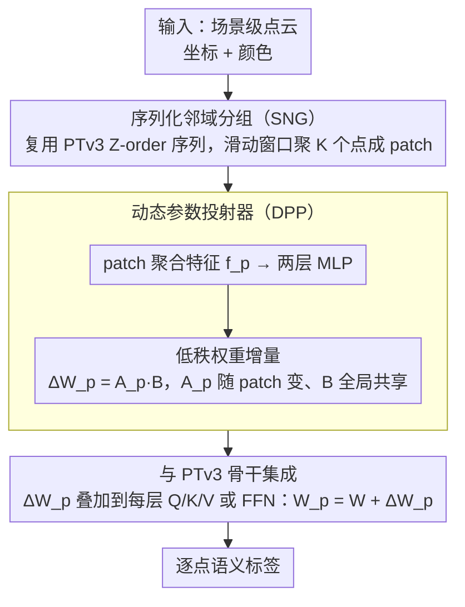

# PointTPA: Dynamic Network Parameter Adaptation for 3D Scene Understanding

**会议**: CVPR 2026  
**arXiv**: [2604.04933](https://arxiv.org/abs/2604.04933)  
**代码**: [https://github.com/H-EmbodVis/PointTPA](https://github.com/H-EmbodVis/PointTPA)  
**领域**: 3D视觉 / 点云理解  
**关键词**: 点云语义分割, 测试时参数自适应, 动态网络, 参数高效微调, 场景级理解

## 一句话总结

提出 PointTPA 框架，通过序列化邻域分组（SNG）和动态参数投射器（DPP）两个轻量模块在推理时为每个输入场景生成定制化的网络参数，仅增加 <2% 参数量即在 ScanNet 上达到 78.4% mIoU，超越现有参数高效微调（PEFT）方法。

## 研究背景与动机

**领域现状**：场景级点云理解（如室内语义分割）是 3D 视觉的核心任务。随着 Point Transformer v3 (PTv3)、Sonata 等强大的预训练骨干网络出现，一个自然的范式是"预训练+微调"——在大规模数据上预训练，然后在目标任务上微调。参数高效微调（PEFT）方法（如 LoRA、Adapter、VPT 等）从 NLP/2D 视觉迁移到 3D 点云领域，旨在用少量可训练参数适配预训练模型。

**现有痛点**：(1) 现有 PEFT 方法（包括 DAPT、PointGST、IDPT 等 3D 专用方法）在训练完成后使用**静态参数**进行推理——所有测试样本共享同一组适配参数，无法针对不同场景的特性做动态调整；(2) 场景级点云的挑战在于每个场景的几何复杂度、类别分布、空间布局差异巨大——有些场景以大面积平面（如空空的会议室）为主，有些则充满细碎物体（如杂乱的厨房）；(3) 静态参数在面对这种场景间的高度变异性时表现出次优的适应能力，因为同一组参数无法同时对简单和复杂场景都最优。

**核心矛盾**：参数高效微调追求的是"用少量参数获得近似全参数微调的效果"，但静态参数的固有局限使得少量参数无法覆盖所有场景的变异——解决这个矛盾需要让参数本身变成输入的函数。

**本文目标**：设计一种测试时参数自适应（test-time parameter adaptation）机制，使网络参数能根据输入场景的特性动态调整，同时保持极低的参数开销。

**切入角度**：作者观察到场景级点云可以被分解为局部一致的 patch——每个 patch 内的点具有相似的几何和语义属性。如果能为每个 patch 生成定制化的网络权重，就能在局部级别实现精细的自适应，同时通过权重共享机制保持参数效率。

**核心 idea**：通过动态参数投射器根据每个输入 patch 的特征生成该 patch 专用的网络权重增量，实现"一个场景一套参数"的推理时自适应。

## 方法详解

### 整体框架

PointTPA 建立在 PTv3 骨干网络之上。输入是场景级点云（带坐标、颜色等特征），首先通过序列化邻域分组（SNG）将点云组织为局部一致的 patch 序列。然后在骨干网络的每一层，动态参数投射器（DPP）根据当前 patch 的特征动态生成该层的参数增量（weight delta），叠加到预训练权重上实现自适应推理。输出是逐点的语义标签。整个过程中 SNG 和 DPP 两个模块的可训练参数量仅占骨干参数的 <2%。

### 关键设计

**1. 序列化邻域分组（SNG）：用一个几乎零成本的方式把场景切成"局部一致"的 patch**

要为每个局部生成专属参数，第一步得先把无序点云切成粒度合适的块。SNG 没有去跑 FPS + kNN 这类额外的聚类——那会显著增加计算量；它直接复用 PTv3 本来就在做的序列化（如 Z-order 填充曲线）：点云一旦被填充曲线排成一维序列，空间上相邻的点在序列里也大体相邻，于是只要在序列上开一个滑动窗口、把相邻的 $K$ 个点聚成一个 patch，就能得到几何属性相似的局部块。之所以选 patch 这个粒度，是因为两端都不合适：在单点级别生成参数计算量爆炸、且单点特征太单薄不足以指导参数生成；在整场景级别又太粗，一个空会议室和一个杂乱厨房显然需要不同的参数。Patch 恰好卡在中间——既有足够的局部上下文，计算复杂度也仍然可控。

**2. 动态参数投射器（DPP）：让网络权重变成"输入的函数"而非固定常量**

这是 PointTPA 区别于所有静态 PEFT 的核心。对每一层、每个 patch 的聚合特征 $\mathbf{f}_p \in \mathbb{R}^{d}$，DPP 用一个轻量投射网络（两层 MLP + 激活）把它映射成一个权重增量 $\Delta W_p = \text{MLP}(\mathbf{f}_p) \in \mathbb{R}^{d_{\text{out}} \times d_{\text{in}}}$，推理时该 patch 内所有点用的权重就是基础权重叠加这个增量：

$$W_p = W + \Delta W_p$$

为了把参数量压到极致，DPP 进一步做低秩分解，只让 patch 相关的那一半随输入变化、另一半全局共享：

$$\Delta W_p = A_p B,\quad A_p \in \mathbb{R}^{d_{\text{out}} \times r},\ B \in \mathbb{R}^{r \times d_{\text{in}}},\ r \ll d$$

和 LoRA 的对照很说明问题：LoRA 的 $\Delta W = AB$ 训练完就钉死，对所有测试样本一视同仁；DPP 里的 $A_p$ 是当前 patch 特征算出来的，因此面对几何复杂的 patch（椅子腿交叉处）会生成更精细的提取参数，面对简单的 patch（大平面上的点）则给出更平滑的参数。正是这种"按需变形"让同样少的参数能覆盖更宽的场景变异。

**3. 与 PTv3 骨干的集成：贴着窗口注意力的结构插入，不改架构**

DPP 生成的增量被加到 PTv3 每个 self-attention 层的 Q/K/V 投影矩阵或前馈网络权重上。这里有个顺势而为的巧合：PTv3 的序列化窗口注意力本身就假设了空间局部性，同一窗口内的点恰好属于同一或相邻 patch，所以参数增量的应用直接对齐窗口，不需要再单独做一次分组。反向传播时梯度既流过 DPP 的投射网络（学"怎么根据特征生成参数"），也可选地流过骨干被解冻的若干层（部分微调）。整套自适应模块就这样嵌进去，骨干架构一行没改。

### 损失函数 / 训练策略

使用标准的语义分割交叉熵损失 $\mathcal{L} = -\frac{1}{N}\sum_{i=1}^{N}\sum_{c=1}^{C} y_{ic} \log \hat{p}_{ic}$，其中 $N$ 是点数，$C$ 是类别数。训练时冻结预训练骨干的大部分参数，仅训练 SNG 和 DPP 模块（<2% 参数）。支持两种微调模式：(1) **Linear Probing + PointTPA**——冻结骨干，只训练分类头和 PointTPA 模块；(2) **Decoder Probing + PointTPA**——微调解码器和 PointTPA 模块。预训练权重来自 Sonata（一种基于 PTv3 的大规模 3D 预训练模型）。

## 实验关键数据

### 主实验（多基准对比）

| 数据集 | 方法 | 类型 | mIoU (%) ↑ | 可训练参数 |
|--------|------|------|-----------|-----------|
| ScanNet val | Linear Probing | 基线 | ~73 | 仅分类头 |
| ScanNet val | LoRA | PEFT | ~75 | <3% |
| ScanNet val | DAPT | 3D PEFT | ~76 | <3% |
| ScanNet val | PointGST | 3D PEFT | ~76 | <3% |
| ScanNet val | **PointTPA (Lin)** | **动态PEFT** | **78.4** | **<2%** |
| ScanNet val | Full Fine-Tuning | 全参数 | ~79 | 100% |
| ScanNet200 val | Linear Probing | 基线 | ~30 | 仅分类头 |
| ScanNet200 val | **PointTPA (Lin)** | **动态PEFT** | **大幅提升** | **<2%** |
| S3DIS Area5 | **PointTPA** | **动态PEFT** | **有竞争力** | **<2%** |
| ScanNet++ val | **PointTPA** | **动态PEFT** | **有竞争力** | **<2%** |

### 消融实验

| 配置 | ScanNet mIoU (%) | 参数量 | 说明 |
|------|-----------------|--------|------|
| PTv3 + Linear Probing | ~73 | 最少 | 冻结骨干基线 |
| + SNG only | ~74.5 | 极少增加 | 仅加分组，无动态参数 |
| + DPP only (全局) | ~76 | <1.5% | 动态参数但无局部分组 |
| **+ SNG + DPP (PointTPA)** | **78.4** | **<2%** | **完整模型** |
| DPP rank r=4 | ~77.5 | <1.5% | 更低秩的参数投射 |
| DPP rank r=16 | ~78.4 | <2% | 默认设置 |
| DPP rank r=32 | ~78.5 | <3% | 更高秩但提升有限 |

### 关键发现

- **PointTPA 以 <2% 参数达到了接近全参数微调（~79%）的效果**——缩小了 PEFT 和 FFT 之间的差距
- **SNG 和 DPP 的贡献互补**：SNG 提供合理的局部分组，DPP 在分组上生成自适应参数，两者缺一不可
- **动态参数 vs 静态参数的优势在复杂场景中更明显**：在 ScanNet200（200 类细粒度分割）上，PointTPA 相对静态 PEFT 方法的提升更大——因为更多类别意味着更多场景变异
- **推理时间开销可控**：DPP 的参数生成只增加约 5-10% 推理时间，因为投射网络是轻量的两层 MLP
- rank r 的选择存在甜蜜点——r=16 时精度和参数量达到最佳平衡，继续增大收益递减

## 亮点与洞察

- **动态参数的核心洞察具有普适性**：将网络参数从"静态常量"变为"输入的函数"，这个思路不仅适用于 3D 点云，也可以迁移到 2D 视觉、NLP 等领域的 PEFT 方法中
- **SNG 的无开销分组设计巧妙**：通过复用 PTv3 已有的序列化顺序避免了额外的聚类计算，这种"利用已有结构的设计"值得学习
- **接近 FFT 的参数效率**：78.4% vs ~79% mIoU，参数量相差 50 倍——在存储和计算受限的边缘部署场景中很有价值
- **与 HyperNetwork 思想的联系**：DPP 本质上是一个 HyperNetwork——用一个小网络生成大网络的参数。PointTPA 的贡献在于将这一思想成功应用到 3D PEFT 场景并证明了其有效性

## 局限与展望

- 当前仅验证了语义分割任务，3D 目标检测、实例分割、点云配准等任务有待探索
- DPP 生成的参数增量维度受限于低秩假设——对于需要高秩参数变化的极端场景分布，可能需要更灵活的参数生成机制
- SNG 的分组方式依赖 PTv3 的序列化策略——换用其他骨干（如 MinkowskiNet、SparseConvNet）时需要重新设计分组方案
- 测试时参数自适应引入了输入相关的计算路径，使得推理过程不再完全确定——相同输入的不同 patch 分组可能导致微小的结果差异
- 与 test-time training（TTT）和 test-time augmentation（TTA）的关系和组合有待探索

## 相关工作与启发

- **vs LoRA (Hu et al. 2022)**：LoRA 使用固定的低秩增量矩阵 $\Delta W = AB$，参数与输入无关。PointTPA 的 DPP 可以看作"输入条件化的 LoRA"——$A$ 矩阵变成了输入的函数
- **vs DAPT (Zhou et al. 2024)**：DAPT 也关注 3D 点云的 PEFT，但使用静态 adapter。PointTPA 通过动态参数在相同参数预算下取得更好效果
- **vs HyperNetwork (Ha et al. 2017)**：HyperNetwork 用小网络生成大网络参数，PointTPA 将这一思想局部化——只在 patch 级别生成参数增量而非整个网络的参数
- 启发：动态参数的思路可以与 prompt tuning 结合——不仅动态调整网络权重,还可以动态生成输入 prompt

## 评分

- **新颖性**: ⭐⭐⭐⭐ 将测试时动态参数自适应与 3D PEFT 结合是新颖的；SNG 和 DPP 的设计巧妙但概念上不算复杂
- **实验充分度**: ⭐⭐⭐⭐⭐ 4 个数据集、多种微调模式对比、详细消融、参数效率和推理时间分析全面
- **写作质量**: ⭐⭐⭐⭐ 方法描述清晰，实验覆盖全面
- **价值**: ⭐⭐⭐⭐ 为 3D 场景理解的高效微调提供了新思路，动态参数机制有广泛的迁移潜力

<!-- RELATED:START -->

## 相关论文

- [\[CVPR 2026\] Lifting Unlabeled Internet-level Data for 3D Scene Understanding](lifting_unlabeled_internet-level_data_for_3d_scene_understanding.md)
- [\[CVPR 2025\] PMA: Towards Parameter-Efficient Point Cloud Understanding via Point Mamba Adapter](../../CVPR2025/3d_vision/pma_towards_parameter-efficient_point_cloud_understanding_via_point_mamba_adapte.md)
- [\[CVPR 2026\] LightSplat: Fast and Memory-Efficient Open-Vocabulary 3D Scene Understanding in Five Seconds](lightsplat_fast_and_memory-efficient_open-vocabulary_3d_scene_understanding_in_f.md)
- [\[CVPR 2026\] Fast SceneScript: Fast and Accurate Language-Based 3D Scene Understanding via Multi-Token Prediction](fast_scenescript_fast_and_accurate_language-based_3d_scene_understanding_via_mul.md)
- [\[CVPR 2026\] Masking Matters: Unlocking the Spatial Reasoning Capabilities of LLMs for 3D Scene-Language Understanding](masking_matters_unlocking_the_spatial_reasoning_capabilities_of_llms_for_3d_scen.md)

<!-- RELATED:END -->
