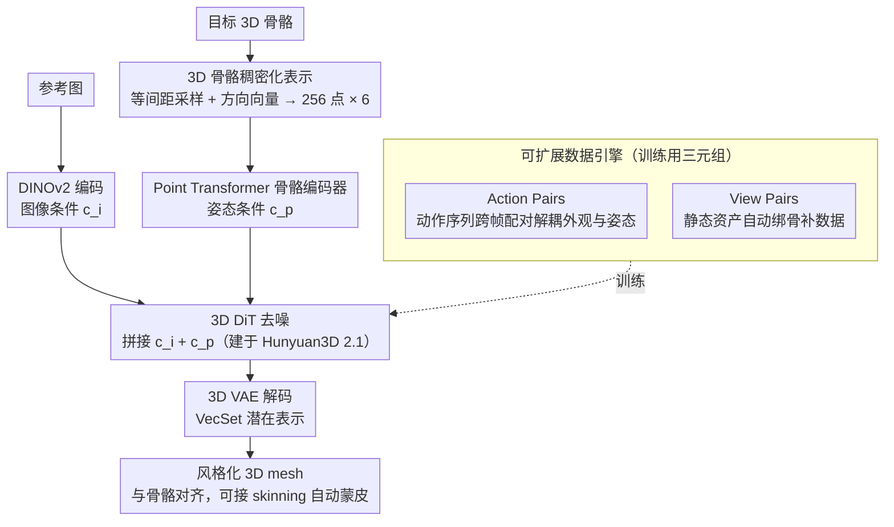

# PoseMaster: A Unified 3D Native Framework for Stylized Pose Generation

**会议**: CVPR 2026  
**arXiv**: [2506.21076](https://arxiv.org/abs/2506.21076)  
**代码**: 无（暂未开源）  
**领域**: 3D视觉 / 图像生成  
**关键词**: 3D姿态风格化、骨骼编码器、3D原生生成、数据引擎、端到端

## 一句话总结
PoseMaster 提出了一个将姿态风格化与 3D 生成统一在端到端框架中的 3D 原生方法，直接使用 3D 骨骼作为姿态控制信号（而非 2D 骨骼图），设计了骨骼稠密化策略和 Point Transformer 编码器提取精细的空间拓扑特征，并通过大规模"Image-Skeleton-Mesh"三元组数据引擎训练，在姿态规范化和任意姿态风格化上达到 SOTA。

## 研究背景与动机

**领域现状**：3D 姿态风格化（pose stylization）的目标是生成保持角色身份的同时严格遵循目标姿态的 3D 资产。当前主流方法采用级联范式（cascade pipeline）：先用 2D 基础模型（如 ControlNet）根据 2D 骨骼图生成姿态风格化的图像，再用 3D 重建模型（如 LRM）将图像提升为 3D 资产。代表方法包括 CharacterGen、StdGen 和 SKDream。

**现有痛点**：(1) **误差传播不可避免**：2D 生成阶段引入的伪影、遮挡和不一致性会被 3D 重建阶段直接放大，导致几何畸变；(2) **2D 骨骼图存在固有歧义**：2D 投影丢失了关键的深度信息和空间关系，无法解决自遮挡或复杂拓扑结构，严重限制了最终 3D 姿态的精度——一个 2D 姿态可以对应无数种 3D 姿态。

**核心矛盾**：现有方法本质上是"先在 2D 空间操控姿态，再试图恢复 3D"，但 2D 操控本身就丢失了 3D 信息，这种信息损失在 lifting 阶段无法弥补。需要的是"直接在 3D 空间中做姿态控制"。

**本文目标** (1) 消除 2D-to-3D 级联导致的误差累积；(2) 提供无歧义的 3D 空间姿态控制；(3) 解决大规模 Image-Skeleton-Mesh 训练数据匮乏的问题。

**切入角度**：将 3D 骨骼直接作为扩散模型的条件信号注入 3D 原生生成流程，用一个统一的端到端模型同时完成姿态风格化和 3D 几何生成。

**核心 idea**：用 3D 骨骼替代 2D 骨骼作为姿态条件，在 3D 原生生成框架中端到端实现姿态风格化，消除级联误差。

## 方法详解

### 整体框架
PoseMaster 想解决的事很直接：给一张角色参考图和一套目标 3D 骨骼，一步到位生成既保留角色身份、又严格摆出目标姿态的 3D mesh，而不走"先用 2D 模型摆好姿态再 lift 成 3D"的老路。整条流水线建在 Hunyuan3D 2.1 上，骨架是一个 3D VAE（把 mesh 编成 VecSet 潜在表示）加一个 3D Diffusion Transformer (DiT)。参考图由 DINOv2 抽成图像条件 $c_i$，目标骨骼由一个专门的骨骼编码器抽成姿态条件 $c_p$，两套 token 拼接后一并喂进 DiT 去噪。关键在于姿态控制从头到尾都发生在 3D 空间里——骨骼是 3D 的、生成是 3D 原生的，中间没有任何 2D 投影这道有损环节。

### 关键设计

**1. 3D 骨骼稠密化表示：让稀疏关节点携带拓扑朝向，消除复杂姿态的歧义**

标准 3D 骨骼只是一串关节坐标，对 A-pose、T-pose 这种简单姿态够用，但碰到手指交叉、腿部缠绕这类复杂关节，光凭几个孤立的点根本说不清"哪根骨头压在哪根上"。PoseMaster 的做法是把每段骨骼"涂满"：沿起止关节等间距（约 0.005）插值采样，采样点数随骨长走以保证密度均匀，再把这段骨骼的方向向量（起点指向终点）赋给该段上所有采样点。于是每个点都带 3D 坐标加 3D 朝向，整套骨骼变成 $P \in \mathbb{R}^{N \times 6}$，最后用 FPS 降采样到固定 256 个点。举个具体的：一条大腿骨原本只有髋、膝两个端点，稠密化后会沿骨长铺上几十个都标着"朝下"方向的点，网络一眼就能读出这段骨头的走向和归属，而不必从两个孤立坐标里猜。方向向量是这里的关键——它把"点属于哪段骨骼、骨骼朝哪"这条拓扑信息显式写进了输入。

**2. Point Transformer 骨骼编码器：在 3D 空间里直接建模点间关系，给扩散模型无歧义的几何先验**

有了稠密点云，还需要一个编码器把它压成 DiT 能用的条件。PoseMaster 先对坐标部分 $P_c$ 做位置编码 PE，与方向特征 $P_f$ 拼接后线性投影到 1024 维，再过 2 个堆叠的 Point Transformer Block 得到姿态条件：

$$c_p = \phi_2(\phi_1(\mathcal{T}([PE(P_c), P_f])))$$

选 Point Transformer 而非普通 MLP，是看中它的自注意力天然擅长捕捉点与点之间的空间关系。这一步和 2D 姿态方法形成鲜明对比：后者把骨骼用 Openpose 渲染成一张 2D 图再喂 ControlNet，本质上还是在啃投影后的信息；PoseMaster 全程在 3D 坐标系里建模，深度和拓扑都没丢，给到 DiT 的是没有歧义的几何先验。

**3. 可扩展数据引擎：用静态资产 + 自动绑骨补足"姿态解耦"训练数据的稀缺**

端到端训练需要大量"同一角色、不同姿态"的 Image-Skeleton-Mesh 三元组，而现成的可动画 3D 资产（如 ReadyPlayerMe）又少又风格单一，这是落地的真正瓶颈。PoseMaster 用两条互补路线凑数据。动态路线（Action Pairs）从 ReadyPlayerMe、VRoid、Playbox 等可动画数据集出发，对角色播放一段动作序列渲染多帧，再交叉配对——拿帧 A 的图像配帧 B 的骨骼和 mesh，强行把"外观"和"姿态"解耦开，逼模型学会按骨骼而非按图像里的姿态去生成。静态路线（View Pairs）则去 Objaverse、Objaverse-XL、HumanRig 等海量静态数据集，渲染多视角图像，自带骨骼的直接提取、没有的用自动绑骨模型补出来，再把某个视角图像配上完整 3D 骨骼和 mesh。所有 mesh 都先水密化，并把归一化参数同步施加到骨骼上以保证空间对齐。两条路线合起来攒出 500K+ 独特人形物体——静态资产的体量远大于可动画资产，自动绑骨把它们"激活"进训练集，数据规模和风格多样性的天花板一下就抬高了。

### 损失函数 / 训练策略
训练用条件 Flow Matching 目标 $\mathbb{E}_{t,x_0,x_1,c_i,c_p}\|v_\theta(x,t,c_i,c_p) - (x_1-x_0)\|_2^2$，冻结图像编码器和 VAE，只联合优化 DiT 和骨骼编码器，学习率 $1 \times 10^{-5}$。数据增强方面，图像以 15% 概率随机旋转（±30°），3D 骨骼随机平移/缩放/旋转、并把同样变换同步施加到 mesh 表面点以保持对齐。一个值得留意的细节是 CFG：骨骼条件 $c_p$ 在 dropout 中始终保留，只对图像条件 $c_i$ 做 drop，等于强制让骨骼无条件地掌控姿态、图像只负责外观。

## 实验关键数据

### 主实验（姿态规范化 - VRoid 测试集）

| 方法 | MAE↓ | SIM↑ | Uni3D-I↑ | ULIP-I↑ |
|------|------|------|----------|---------|
| CharacterGen | 6.38 | 0.905 | 0.343 | 0.146 |
| StdGen | 4.97 | 0.930 | 0.398 | 0.160 |
| Trellis* | 5.39 | 0.926 | 0.398 | 0.157 |
| Hunyuan3D 2.1* | 5.89 | 0.920 | 0.398 | 0.150 |
| **PoseMaster** | **4.59** | **0.938** | **0.402** | **0.161** |

### 消融实验（任意姿态风格化 + 骨骼引导效果）

| 方法 | MAE↓ | SIM↑ | Uni3D-I↑ | 说明 |
|------|------|------|----------|------|
| Trellis（给目标姿态图像） | 7.20 | 0.904 | 0.306 | baseline 有目标姿态图像优势 |
| Hunyuan3D 2.1（给目标姿态图像） | 6.75 | 0.911 | 0.285 | 同上 |
| **PoseMaster（给源姿态图像+3D骨骼）** | **5.28** | **0.935** | **0.313** | 即使 baseline 有信息优势仍超越 |
| Hunyuan3D 2.1（无骨骼引导） | 6.56 | 0.916 | 0.301 | 骨骼引导效果的基线 |
| **PoseMaster（有骨骼引导）** | **4.82** | **0.946** | **0.315** | +骨骼显著提升几何精度 |

### 关键发现
- **PoseMaster 在姿态规范化上全面超越级联方法**：MAE 从 StdGen 的 4.97 降到 4.59，关键优势是避免了 2D 规范化阶段的结构畸变——StdGen 生成的 A-pose 图像经常出现严重的身体结构错误
- **任意姿态风格化的对比极具说服力**：baseline 方法直接拿到目标姿态的图像（信息优势极大），PoseMaster 只拿到源姿态图像+3D 骨骼，但仍然显著优于 baseline（MAE 5.28 vs 6.75-7.20），证明纯图像输入无法解决自遮挡带来的拓扑歧义
- **稠密骨骼表示 vs 稀疏关节点**：从定性结果看，稀疏关节无法传达复杂关节动作，导致生成错误的拓扑结构；稠密点云+方向向量显著提升了复杂姿态的控制精度
- **骨骼引导在标准 image-to-3D 任务中也有增益**：即使是同姿态重建（非姿态转换），加上骨骼仍将 MAE 从 6.56 降到 4.82，说明骨骼作为几何锚点能缓解单目 3D 重建的深度歧义

## 亮点与洞察
- **将骨骼条件设为 CFG 中的"必选"条件（不做 dropout）**的设计很巧妙：$\hat{v}_\theta = v_\theta(x_t,t,c_p,\emptyset) + \lambda(v_\theta(x_t,t,c_p,c_i) - v_\theta(x_t,t,c_p,\emptyset))$，确保骨骼始终对生成过程施加控制，图像条件仅影响外观。这保证了姿态精度不会被身份保持任务所稀释
- **生成的 mesh 天然可用于动画**：由于 mesh 与骨骼严格空间对齐，可以直接接入 skinning 模型（如 UniRig）做自动蒙皮，省去了传统流程中繁琐的骨骼重定向步骤。这使 PoseMaster 既是生成模型也是可控绑骨模型
- **数据引擎的 Action Pairs + View Pairs 组合策略**解决了可动画资产稀缺的核心瓶颈：静态资产数量远大于可动画资产，通过自动绑骨将它们纳入训练，极大扩充了数据规模和风格多样性

## 局限与展望
- **仅支持人形角色**：数据引擎和骨骼编码器都围绕人形骨骼设计，不支持动物或非人形角色的姿态风格化
- **依赖 Hunyuan3D 2.1 预训练权重**：框架的泛化能力可能受限于基础 3D 生成模型的能力上限
- **未能处理手指级别的精细控制**：骨骼稠密化策略对大骨段有效，但手指等极短骨段的采样点太少，精细度不够
- **缺少纹理质量评估**：指标（MAE、SIM、Uni3D-I）主要评估几何质量，纹理保真度和光照一致性未被量化

## 相关工作与启发
- **vs CharacterGen/StdGen**: 这两者都是级联方法（2D 姿态转换 → 3D 重建），PoseMaster 的端到端范式从根本上消除了中间步骤的误差传播
- **vs SKDream**: SKDream 也用了 2D ControlNet 式的骨骼控制，但仍受限于 2D 投影歧义。PoseMaster 的 3D 骨骼提供了显式的深度和拓扑信息
- **vs CraftsMan/Trellis**: 这些 3D 原生生成模型缺乏姿态控制能力，PoseMaster 通过加入骨骼编码器赋予了它们精确的姿态可控性
- **启发**：3D 骨骼作为条件信号的思路可以推广到其他 3D 可控生成任务，如基于手部骨骼的手势生成、基于全身运动序列的 4D 人体生成

## 评分
- 新颖性: ⭐⭐⭐⭐⭐ 3D 骨骼直接条件化 + 端到端姿态风格化的范式开创性强，骨骼稠密化设计简洁有效
- 实验充分度: ⭐⭐⭐⭐ 对比设置公平（给 baseline 信息优势仍超越），消融分析到位，但缺少用户研究
- 写作质量: ⭐⭐⭐⭐ 动机清晰、方法描述详尽，图表质量高
- 价值: ⭐⭐⭐⭐⭐ 开创了 3D 姿态风格化的新范式，可动画 mesh 生成的应用价值很高

<!-- RELATED:START -->

## 相关论文

- [\[ICLR 2026\] QuadGPT: Native Quadrilateral Mesh Generation with Autoregressive Models](../../ICLR2026/3d_vision/quadgpt_native_quadrilateral_mesh_generation_with_autoregressive_models.md)
- [\[CVPR 2026\] PixARMesh: Autoregressive Mesh-Native Single-View Scene Reconstruction](pixarmesh_autoregressive_mesh-native_single-view_scene_reconstruction.md)
- [\[AAAI 2026\] FantasyStyle: Controllable Stylized Distillation for 3D Gaussian Splatting](../../AAAI2026/3d_vision/fantasystyle_controllable_stylized_distillation_for_3d_gaussian_splatting.md)
- [\[CVPR 2026\] RnG: A Unified Transformer for Complete 3D Modeling from Partial Observations](rng_a_unified_transformer_for_complete_3d_modeling_from_partial_observations.md)
- [\[CVPR 2026\] NimbusGS: Unified 3D Scene Reconstruction under Hybrid Weather](nimbusgs_unified_3d_scene_reconstruction_under_hybrid_weather.md)

<!-- RELATED:END -->
