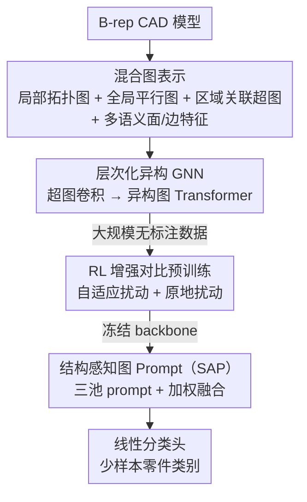

# PP-Brep: Few-Shot B-rep Classification with Hybrid Graph Representation

**会议**: CVPR 2026  
**论文**: [CVF Open Access](https://openaccess.thecvf.com/content/CVPR2026/html/Hao_PP-Brep_Few-Shot_B-rep_Classification_with_Hybrid_Graph_Representation_CVPR_2026_paper.html)  
**代码**: 无  
**领域**: 3D视觉 / CAD / 图神经网络  
**关键词**: B-rep 分类, 少样本学习, 混合图表示, 对比预训练, 图 prompt

## 一句话总结
把 CAD 的 B-rep 模型拆成「局部拓扑图 + 全局平行图 + 区域关联超图」三层混合图，配一个层次化异构 GNN，再用 RL 自适应扰动的对比预训练学通用表征、用结构感知的图 prompt 做少样本微调，在 TraceParts-11 / FabWave-31 两个零件数据集上以 1/3/5-shot 显著超过通用图 prompt 方法。

## 研究背景与动机
**领域现状**：工业制造里要按几何和拓扑给 3D CAD 零件分类（便于设计复用与自动化）。CAD 模型天然以 B-rep（边界表示，boundary representation）存储——由面、边、顶点及它们的邻接关系构成。主流做法要么多视角渲染后用 2D CNN，要么直接把 B-rep 解析成图后喂 GNN（UV-Net、BRepNet、AAGNet 等），但都依赖大量带标注样本做监督训练。

**现有痛点**：工业场景里新零件类别的标注数据极度稀缺，监督管线无法快速适配。近年转向「无监督预训练」从无标注数据里学通用表征，但评估时仍用 linear probing，下游还是要大量标签——本质上没解决「只给几个样本就要认出新类」的少样本问题。

**核心矛盾**：B-rep 的结构信息是多层次的（单面局部邻接、跨面的对称/对齐这类远程约束、孔/凸台/凹槽这类功能单元级结构），但已有图表示往往只建模「面-面邻接」这一层，丢掉了远程几何关系和功能级结构；同时已有「预训练+下游」路线走的是生成式预训练 + 传统微调，少样本下微调会灾难性过拟合，而「对比预训练 + 参数高效 prompt 微调」这条路线在 B-rep 少样本分类上还没被验证过。

**本文目标**：(1) 设计能同时刻画局部、全局、区域三层结构的 B-rep 图表示；(2) 构建一个不靠重训整个 backbone 的少样本分类框架。

**切入角度**：既然单层邻接图信息不足，就用三种互补的图把不同尺度的拓扑都显式编码出来；既然少样本下微调会过拟合，就冻结 backbone、只学轻量的结构感知 prompt。

**核心 idea**：用「混合多层图表示 + RL 增强对比预训练 + 结构感知图 prompt」把大规模无标注 CAD 预训练和少样本下游分类桥接起来。

## 方法详解
整个系统分两大块：先把一个 B-rep 模型转成**混合图表示**（三层图拓扑 + 多语义几何特征），再用 **PP-Brep 框架**（层次化异构 GNN backbone + RL 对比预训练 + 结构感知 prompt 微调）完成少样本分类。预训练在 17 万个无标注模型的 DeepCAD 上做，下游只用每类 1/3/5 个样本。

### 整体框架
输入是一个 B-rep CAD 模型，输出是它的零件类别。中间流程是：①把 B-rep 解析成混合图（三种拓扑边 + 面/边特征）；②层次化异构 GNN 在超图卷积和异构图 Transformer 两阶段上提取节点表征；③在大规模无标注数据上用 RL 自适应扰动的对比学习预训练 backbone；④冻结 backbone，针对每个下游少样本任务只训练结构感知 prompt（SAP）和一个线性分类头。

### 关键设计

**1. 混合图表示：用三层互补图 + 多语义特征补足单层邻接图丢失的结构**

这是针对「单层面-面邻接图信息不足」的核心补救。作者把一个 B-rep 编码成三种图叠在一起：

- **局部拓扑图 $G_{adj}$**：以面为节点、边为图边建邻接图，再用面质心两两欧氏距离作权重、跑 Kruskal 最小生成树（MST），把原始邻接图简化成一棵 MST，降低模型复杂度同时保留基本拓扑骨架。
- **全局平行图 $G_{par}$**：捕捉在 $G_{adj}$ 里相隔很远、但几何上强相关（对称、对齐）的远程约束。遍历所有非相邻平面面对 $(F_i, F_j)$，算它们法向量夹角，当夹角小于阈值（如 $1^\circ$）就在两面间加一条平行边。
- **区域关联超图 $H_{reg}$**：表达功能单元级（孔、凸台、凹槽）结构。把所有面质心当 3D 点云，用最远点采样（FPS）选 $K$ 个种子点 $S=[S_1,\dots,S_K]$，每个种子做 Ball Query 聚拢邻近面节点；再做拓扑一致性修正（剔除与簇内其它节点都不连通的孤立节点），剩下的节点组成一条超边；最后做全邻接闭包推断——若某边界节点的整个邻域都已属于某超边，就把它也并进去。

三层图分别覆盖「局部骨架 → 远程约束 → 功能区域」，从局部到全局形成层次化拓扑。配套的**多语义几何特征编码**给面和边各编参数化与非参数化两类特征：面的非参数特征 $F_{np}$ 是 UV 域上 $8\times32\times32$ 网格采样经 2D CNN 压到 128 维；参数特征 $F_p$ 把 16 维标量按「曲面类型/面积/结构属性/微分几何属性」分四组各自线性嵌入成 32 维再拼成 128 维；最终面描述子 $F_{face}=\mathrm{Concat}(F_p, F_{np})$。邻接边特征 $E_{adj}$ 同理拼非参数（1D CNN 编 UV 路径采样）和参数（凸性/长度/曲线类型）；平行边只带语义信息，直接把 8 维标量经 MLP 映射成 256 维 $E_{par}$。

**2. 层次化异构 GNN（Hierarchical HeteroGNN）：超图卷积 + 异构图 Transformer 双阶段融合三种边**

混合图里有三类异质的边（邻接边、平行边、超边），普通 GNN 没法统一处理。作者设计两阶段 backbone：第一阶段对超图做 $n$ 层超图卷积，更新节点 $X_{i+1}=\mathrm{ReLU}(\mathrm{HypergraphConv}(X_i, H_{reg}))$，先把功能区域级信息融进节点。第二阶段把结果 $X_n$ 送进 $m$ 层异构图 Transformer，用 TransformerConv 在局部拓扑图和全局平行图上分别传播：$X'_{adj}=\mathrm{TransformerConv}(X_n^j, G_{adj}, E_{adj})$，$X'_{par}=\mathrm{TransformerConv}(X_n^j, G_{par}, E_{par})$，再用可学习归一化权重加权融合两支：

$$X_n^{j+1}=\mathrm{ReLU}\big(\alpha_{adj}^{(j)} X'_{adj}+\alpha_{par}^{(j)} X'_{par}\big)$$

末层节点表征 $\bar X$ 在预训练阶段经全局平均池化得到图级表征。这个 backbone 同时被预训练和 prompt 微调共享。推理时输入的是 $X_0+p$（prompt 增强的节点特征）而非 $X_0$。

**3. RL 增强对比预训练：用 Actor-Critic 自适应调扰动强度 + 原地扰动省显存**

预训练沿用 SimGRACE（对同一样本的锚点视图 $z_1$ 和扰动 backbone 得到的增强视图 $z_2$ 做 InfoNCE 对比）：

$$\mathcal{L}_{CL}=-\frac{1}{B}\sum_{i=1}^{B}\log\frac{\exp(\mathrm{sim}(z_{1,i}, z_{2,i})/\tau)}{\sum_{k=1}^{B}\exp(\mathrm{sim}(z_{1,i}, z_{2,k})/\tau)}$$

但直接用 SimGRACE 有两个问题。其一，固定扰动强度对结构复杂度差异大的 B-rep 不合适，所以作者用 Actor-Critic 当扰动控制器 $C$：以锚点视图 $z_1$ 作状态 $s$，Actor 据此输出扰动强度 $\rho$，平滑后的负对比损失 $-\mathrm{EMA}(\mathcal{L}_{CL})$ 作奖励 $r$（奖励越高说明当前扰动诱导的任务难度越合适），优化目标为 $\mathcal{L}_{RL}=-A\cdot\log\pi(\rho|s)+(r-V(s))^2$，其中优势函数 $A=r-V(s)$。其二，SimGRACE 造增强视图要完整复制整个 backbone，大规模下显存和算力爆炸。作者设计「**原地扰动（in-place perturbation）**」：先缓存原参数 $\theta_{orig}$，按 RL 给的强度 $\rho$ 给当前参数加高斯噪声得 $\theta'$，在 `torch.no_grad()` 下算出 $z_2$，再用缓存恢复回 $\theta_{orig}$，最后开梯度算 $z_1$——这样对比损失的梯度只经 $z_1$ 回传更新原参数，不必复制模型。实测在 batch=8192 时单 epoch 从约 1104s 降到 19.31s，让 DeepCAD 这种 17 万模型规模的对比学习变得可行。

**4. 结构感知图 Prompt（SAP）：冻结 backbone，给每个节点生成上下文专属 prompt 做少样本微调**

针对「少样本下微调灾难性过拟合」，作者冻结预训练好的 backbone，只学一个轻量 prompt。SAP 维护三个独立可学习的 token 池 $P_{adj}, P_{par}, P_{reg}$（Kaiming 均匀初始化），分别承载局部、全局、区域三种结构上下文知识。对初始节点嵌入 $X_0$ 的每个节点 $i$，先在 $G_{adj}, G_{par}, H_{reg}$ 上分别做邻域聚合得到上下文感知特征 $h_{adj}, h_{par}, h_{reg}$；再仿照 All-in-One，以这些特征为 query 从对应 token 池生成三个结构专属 prompt 向量 $p_{adj}, p_{par}, p_{reg}$；最后用可学习权重融合：

$$p=\alpha_{adj}\,p_{adj}+\alpha_{par}\,p_{par}+\alpha_{reg}\,p_{reg}$$

其中 $[\alpha_{adj}, \alpha_{par}, \alpha_{reg}]$ 是对可学习参数 $w_{fusion}\in\mathbb{R}^3$ 做 Softmax 得到的。生成的 $p$ 逐元素加到 $X_0$ 上，$(X_0+p)$ 喂进冻结的 backbone，图级输出送一个从头训练的线性分类器。关键在于 $p$ 不是通用静态向量，而是针对每个节点的局部/全局/区域上下文定制的「动态指令」，因而能在参数高效的前提下做到结构感知的少样本适配。

### 损失函数 / 训练策略
两阶段：预训练阶段联合优化对比损失 $\mathcal{L}_{CL}$（更新 backbone $\theta$）和 RL 损失 $\mathcal{L}_{RL}$（每 $k$ 步更新控制器 $\phi$，奖励用 EMA 平滑）；下游阶段冻结 backbone，只训 SAP 的 token 池、融合权重和线性分类头。

## 实验关键数据

### 主实验
预训练用 DeepCAD（约 17 万 B-rep 模型）；下游评估用 FabWave-31（31 类 2775 个）和 TraceParts-11（11 类 943 个），采用 Full-set K-Shot（K=1/3/5），指标取 5 次随机采样的均值 ± 标准差，报告 Accuracy / F1 / AUROC。

TraceParts-11 上 1-shot 结果：

| 方法 | Accuracy(%) | F1(%) | AUROC(%) |
|------|-------------|-------|----------|
| PSP | 34.85 | 28.36 | 61.21 |
| sim+EP | 61.06 | 58.32 | 87.03 |
| sim+GPF | 60.19 | 59.54 | 90.67 |
| MultiGprompt | 68.63 | 68.02 | 89.89 |
| GCoT | 63.46 | 65.51 | 86.04 |
| **Ours** | **73.35** | **73.18** | **94.79** |

更难的 FabWave-31 上 1-shot 结果（通用 baseline 普遍掉点，本文几乎不掉）：

| 方法 | Accuracy(%) | F1(%) | AUROC(%) |
|------|-------------|-------|----------|
| PSP | 33.23 | 21.44 | 73.48 |
| sim+EP | 38.91 | 33.30 | 85.35 |
| sim+GPF | 38.18 | 31.36 | 83.92 |
| MultiGprompt | 60.09 | 59.54 | 90.75 |
| GCoT | 64.34 | 59.63 | 90.57 |
| **Ours** | **72.98** | **72.75** | **91.82** |

K 增大时本文扩展性最强：FabWave-31 上从 1-shot 72.98% 提到 5-shot 87.55%（净增 14.57%），而 MultiGprompt 仅约 +10%、GCoT 仅 +6.2%；5-shot 时本文在 TraceParts 上超最佳 baseline 13.7%、FabWave 上超 17.0%。

### 消融实验
均在 DeepCAD 预训练、FabWave-31 1-shot 下评估。

混合图组件累加（Table 3）：

| 配置 | Accuracy(%) | F1(%) | AUROC(%) |
|------|-------------|-------|----------|
| 仅节点特征（No Edges） | 51.43 | 34.57 | 62.18 |
| + $G_{adj}$ | 57.08 | 45.87 | 70.34 |
| + $G_{par}$ | 60.95 | 64.57 | 88.02 |
| 完整（+ $H_{reg}$） | 72.89 | 72.60 | 91.53 |

预训练策略与下游微调（Table 4 / 5）：

| 维度 | 配置 | Accuracy(%) | 说明 |
|------|------|-------------|------|
| 预训练 | GraphMAE2 | 45.76 | 生成式，最差 |
| 预训练 | GraphCL | 59.66 | 对比式（图增强） |
| 预训练 | SimGRACE | 67.50 | 对比式（模型扰动） |
| 预训练 | **Ours(RL)** | **72.89** | RL 自适应扰动最优 |
| 微调 | Fine-Tuning | 43.82 | 灾难性过拟合 |
| 微调 | Non-Context prompt | 70.30 | 无上下文 prompt |
| 微调 | **Ours(SAP)** | **72.89** | 结构感知 +2.6% |

原地扰动效率（Table 7，单 epoch 秒数）：batch=8192 时完整复制 1104.23s vs 本文 19.31s；且下游性能（Table 6）几乎不变（72.39% vs 72.89%）。

### 关键发现
- **区域关联超图贡献最大**：在 $G_{adj}+G_{par}$ 基础上加 $H_{reg}$ 准确率猛增 +11.9%，说明功能单元（孔/凸台/凹槽）级结构对 CAD 零件分类至关重要。
- **微调 vs prompt 差距巨大**：直接 Fine-Tuning 仅 43.82%（过拟合），而 SAP 达 72.89%，证明少样本下「冻结 backbone + 轻量 prompt」是正解。
- **原地扰动是工程关键**：57 倍提速且不掉点，让 17 万模型规模的对比预训练真正可跑。
- **失败模式**：螺纹零件易混——螺纹在 $G_{par}$ 里引入大量近似平行的噪声边，而真正有判别力的头部几何信号被淹没。

## 亮点与洞察
- **三层异构图的设计很对症**：局部 MST 给骨架、平行图给远程对称/对齐、超图给功能区域，恰好对应 CAD 零件「靠局部细节+整体对称性+特征孔洞」来区分的人类直觉，消融也证明超图最关键。
- **原地扰动是可复用的 trick**：SimGRACE 复制整个 backbone 造增强视图的显存瓶颈，被「缓存参数→加噪→no_grad 前传→恢复」绕过，57 倍提速，这套思路可迁移到任何「扰动模型参数做对比」的自监督场景。
- **用 RL 控制扰动强度**：把「增强强度」从固定超参变成 Actor-Critic 据样本难度动态决策，奖励直接挂对比损失的 EMA，是把课程学习思想塞进对比预训练的巧妙做法。

## 局限与展望
- 作者承认螺纹等含密集近平行边的零件会让全局平行图充满噪声边、判别信号被淹没，是当前失败主因。
- 平行图阈值（如 $1^\circ$）、FPS 种子数 $K$、Ball Query 半径等图构造超参对不同零件分布的敏感性未充分分析（⚠️ 正文未给消融）。
- 只在 CAD/B-rep 两个数据集上验证，方法是否能迁到 mesh/点云等其它 3D 表示未知；评估类别数偏少（11/31 类）。
- 改进方向：对全局平行图加去噪/降权机制抑制螺纹类噪声边；探索把混合图表示用于 B-rep 分割、检索等更多下游任务。

## 相关工作与启发
- **vs UV-Net / BRepNet / AAGNet**：它们直接建模 B-rep 的面-面邻接图做监督分类，本文额外引入全局平行图和区域超图补足远程约束与功能级结构，且走「对比预训练+prompt」少样本路线而非全监督。
- **vs Jones et al.（隐式-显式自监督预训练）**：同样用无标注 B-rep 预训练，但他们走「生成式预训练 + 传统微调」，本文走「对比预训练 + 参数高效 prompt 微调」，少样本下避免微调过拟合。
- **vs SimGRACE / GraphCL**：本文以 SimGRACE 为基座，但用 RL 把固定扰动改成自适应、用原地扰动解决复制 backbone 的显存瓶颈，对比消融中均优于二者。
- **vs MultiGprompt / GCoT 等通用图 prompt**：通用 prompt 在更难的 FabWave-31 上掉点严重、K 增大时快速饱和，本文结构感知 prompt（三池+融合）扩展性显著更强。

## 评分
- 新颖性: ⭐⭐⭐⭐ 三层混合图 + RL 自适应扰动 + 结构感知 prompt 的组合在 B-rep 少样本分类上是新路线，单个组件多为已有思想的巧妙改造。
- 实验充分度: ⭐⭐⭐⭐ 两数据集 × 1/3/5-shot + 4 组消融 + 效率对比较完整，但仅 CAD 域、类别数偏少，图构造超参敏感性缺失。
- 写作质量: ⭐⭐⭐⭐ 框架图清晰、公式齐全、失败案例诚实，少量笔误（如 related work 小写）。
- 价值: ⭐⭐⭐⭐ 工业 CAD 少样本分类是真实刚需，原地扰动这一工程优化尤其实用可复用。

<!-- RELATED:START -->

## 相关论文

- [\[CVPR 2026\] SCOPE: Scene-Contextualized Incremental Few-Shot 3D Segmentation](scope_scene-contextualized_incremental_few-shot_3d_segmentation.md)
- [\[CVPR 2026\] Few-Shot Incremental 3D Object Detection in Dynamic Indoor Environments](few-shot_incremental_3d_object_detection_in_dynamic_indoor_environments.md)
- [\[CVPR 2026\] EmoTaG: Emotion-Aware Talking Head Synthesis on Gaussian Splatting with Few-Shot Personalization](emotag_emotion-aware_talking_head_synthesis_on_gaussian_splatting_with_few-shot_.md)
- [\[CVPR 2026\] CLIPoint3D: Language-Grounded Few-Shot Unsupervised 3D Point Cloud Domain Adaptation](clipoint3d_language-grounded_few-shot_unsupervised_3d_point_cloud_domain_adaptat.md)
- [\[ECCV 2024\] CaesarNeRF: Calibrated Semantic Representation for Few-Shot Generalizable Neural Rendering](../../ECCV2024/3d_vision/caesarnerf_calibrated_semantic_representation_for_few-shot_generalizable_neural_.md)

<!-- RELATED:END -->
