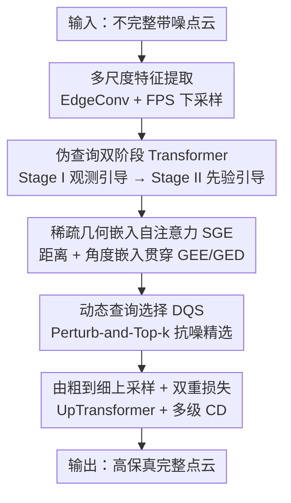

# PQDT: Pseudo-Query Dual Transformer for Robust Point Cloud Restoration

**会议**: CVPR 2026  
**论文**: [CVF Open Access](https://openaccess.thecvf.com/content/CVPR2026/html/Wu_PQDT_Pseudo-Query_Dual_Transformer_for_Robust_Point_Cloud_Restoration_CVPR_2026_paper.html)  
**代码**: https://github.com/ins-uni-bonn/PQDT  
**领域**: 3D视觉  
**关键词**: 点云修复, 伪查询, Transformer, 几何嵌入, 动态查询选择

## 一句话总结
PQDT 用一个"伪查询双阶段 Transformer"统一处理点云补全、去噪、形变三类退化——先用观测引导生成一批抗噪的伪查询锚点，再用形状先验对它们做精修，配合稀疏几何嵌入注意力和动态查询选择，在 ShapeNet-55/34 及作者新建的三个退化数据集上全面刷新 SOTA。

## 研究背景与动机

**领域现状**：现实中的点云因为传感器精度、自/互遮挡，常常同时带着不完整、噪声、离群点、密度不均等多种退化。主流的点云补全方法走的是 encoder-decoder 路线：先用 PointNet/PointNet++ 把局部点抽成一个全局特征（bottleneck），再从这个全局码解码出完整形状（PCN、FoldingNet 等）；后续 SnowflakeNet、SeedFormer、PoinTr 把任务建模成 set-to-set 翻译，AnchorFormer 进一步用判别性 anchor 替代全局投影。

**现有痛点**：从全局 bottleneck 解码会把细粒度几何"池化"掉，导致局部细节丢失；而 seed/query 类方法虽然保住了局部，但它们的 seed 是直接从输入点导出的——一旦输入本身有噪声、离群点或几何畸变，seed 就被污染，重建质量随输入质量剧烈波动，鲁棒性差。

**核心矛盾**：现有方法要么过度依赖输入（输入坏了就跟着坏），要么过度依赖全局先验（细节糊掉）。在"忠于观测"和"依赖学到的形状先验"之间缺乏一个能随输入质量自适应调节的机制。

**本文目标**：造一个**纯点云输入**的统一骨干网络，在补全、形变、去噪任意组合退化下都能自适应地恢复高质量几何，无需 2D 图像辅助。

**切入角度**：作者观察到，与其让 query 直接从被污染的输入里长出来，不如先生成一批"中间代理实体"——它们既参考观测又不被观测绑死，再分两步把它们净化、精修。

**核心 idea**：引入辅助实体"伪查询（pseudo-queries）"，把 Transformer 拆成**观测引导**和**先验引导**两个互补阶段，配合动态查询选择在"输入证据"与"形状先验"之间动态调权。

## 方法详解

### 整体框架
给定一个不完整且带噪的输入点云 $\mathcal{P}^f_{src}$，PQDT 先用一个轻量 transition-down 模块（DGCNN 的 EdgeConv 头 + 轻量 Transformer，逐层 FPS 下采样）抽出粗层级点特征 $\mathcal{F}^c_{src}$，得到源查询 $\mathcal{Q}_{src}=\{\mathcal{P}^c_{src},\mathcal{F}^c_{src}\}$。随后进入双 Transformer：**Stage I（观测引导）** 以球面采样点 $\mathcal{Q}_{sph}$ 作为静态查询初始化，用几何嵌入编码器 GEE（$M_{E_1}$）编码输入、几何嵌入解码器 GED（$M_{D_1}$）做 DETR 式解码，生成中间实体；再经动态查询选择 $S_1$ 过滤，得到伪查询 $\mathcal{Q}_{ps}=\{\mathcal{P}_{pq},\mathcal{F}_{pq}\}$。**Stage II（先验引导）** 把 $\mathcal{Q}_{ps}$ 送入第二个编码器 $M_{E_2}$，并用随机采样的输入点做增广，再经 $S_2$ 精选，聚合两个编码器的全局池化特征 $f_{g1},f_{g2}$ 得到固化查询 $\mathcal{Q}$。最后 GED 解码器 $M_{D_2}$ 把 $\mathcal{Q}$ 和精修特征 $\mathcal{V}$ 解成点代理 $\mathcal{H}$，再经由粗到细的 UpTransformer 逐级上采样出精细点云 $\mathcal{P}^f_{pred}$。

### 关键设计

**1. 伪查询双阶段 Transformer：把"忠于观测"与"信任先验"拆成两步**

这是全文核心，针对"输入坏了 seed 就跟着坏"的痛点。普通做法是 query 直接由全局特征/输入 seed 生成，一步到位地解码；PQDT 把这个翻译过程拆成两个功能互补的阶段，用公式表达为：$\mathcal{Q}_{ps}=S_1(M_{D_1}(\mathcal{Q}_{sph}, M_{E_1}(\mathcal{Q}_{src})), \mathcal{P}^c_{src})$，$\mathcal{V},\mathcal{Q}=S_2(M_{E_2}(\mathcal{Q}_{ps}), \mathcal{P}^f_{src})$，最终 $\mathcal{H}=M_{D_2}(\mathcal{Q},\mathcal{V})$。Stage I 让查询广泛 attend 到编码后的输入，从畸变观测里"稳住"粗几何，产物是伪查询——之所以叫"伪"，是因为它们**不直接拿去解码**，而是作为中间锚点继续被净化。Stage II 在更强的形状先验影响下精修这些查询，并通过聚合 $f_{g1},f_{g2}$ 做"重采样与平衡"：当输入稀疏/严重损坏时网络更多依赖伪查询里的形状先验，当输入相对干净时则保留更多输入点作为查询以保细节。这种"先稳后精、按输入质量动态调权"正是它比 AnchorFormer 等单阶段方法更鲁棒的原因。

**2. 稀疏几何嵌入自注意力（SGE）：给 Transformer 装上变换不变的空间感**

针对点云 Transformer 里"位置编码不充分、几何关系学不准"的问题。作者不用绝对/相对坐标编码，而是构造稠密几何结构嵌入 $r_{i,j}=\mathbf{r}^D_{i,j}\mathbf{W}^D+\max_x\{\mathbf{r}^A_{i,j,x}\mathbf{W}^A\}$，其中 $\mathbf{r}^D$ 编码成对距离、$\mathbf{r}^A$ 编码三元组角度，两者都是变换不变量。但稠密形式要算所有点对/三元组、开销过大，于是限制到每点的 $k$ 近邻得到稀疏版 $\mathcal{R}_s$，把嵌入规模从 $\mathbb{R}^{M\times M\times C_e}$ 压到 $\mathbb{R}^{M\times k\times C_e}$（$k\ll M$）。注意力分数为 $\text{head}=\text{softmax}\!\left(\frac{Q(K_f+K_r)^\top}{\sqrt{d_h}}\right)(V_f+V_r)$，其中 $K_r=\mathcal{R}_s W_{Kr}$、$V_r=\mathcal{R}_s W_{Vr}$ 把几何线索直接注入键值。几何注意力头和特征注意力头相加后再与 EdgeConv 残差融合输出。它贯穿 $M_{E_1},M_{E_2},M_{D_1},M_{D_2}$ 四个模块，是双阶段能稳定捕捉局部+全局结构的底座。

**3. 动态查询选择（DQS）：用扰动 Top-k 挑出最有代表性的点**

由于解码输出 $\mathcal{H}$ 的质量完全取决于查询集 $\mathcal{Q}$ 和伪查询 $\mathcal{Q}_{ps}$ 的好坏，DQS（$S_1,S_2$）负责自适应过滤冗余或带噪的候选点；同时由于作者会混入一部分输入点作为"padding 查询"来保几何保真，DQS 还要平衡预测点与输入点的比例。关键在于它**不用**可学习的 Gumbel-Top-k，而用一个简单的非可学习 **Perturb-and-Top-k**：先把候选特征标准化为 $Z_{cand}=(\text{MLP}(X_{cand})-\mu)/\sigma$，加 Gumbel 噪声 $g_i=-\log(-\log(\text{Uniform}(0,1)))$ 得 $s_i=z_i+\beta g_i$（噪声尺度 $\beta$ 从 1.0 退火到 0），再取 $I=\text{Top-}k(\{s_i\})$，用直通估计器（straight-through）回传梯度。相比确定性 Top-k 会反复选同几个高分点而过拟合，这种受控随机性鼓励探索、是一个低方差的有偏估计器兼数据相关正则项，提升了鲁棒性和泛化。

**4. 由粗到细上采样与双重损失：稳住粗阶段、再展开细节**

得到高维点代理 $\mathcal{H}$ 后，作者把它当作上采样初始特征 $\mathcal{H}^\uparrow_0$、把查询坐标 $\mathcal{P}_Q$ 当 seed，逐级用 UpTransformer 做 $\mathcal{P}^\uparrow_{l+1},\mathcal{H}^\uparrow_{l+1}=\text{UpTrans}(\mathcal{P}_Q,\mathcal{P}^\uparrow_l,\mathcal{H}^\uparrow_l)$——刻意避开 folding/MLP 投影那种独立生成 patch、忽视局部几何关系的做法，用带几何上下文精炼的由粗到细方式恢复细节。训练上用多级 $L_1$ Chamfer 距离监督：$\mathcal{L}_{rec}=\sum_{i=1}^{L}\text{CD}_{\ell 1}(\mathcal{P}^\uparrow_i,\text{FPS}(\mathcal{G},|\mathcal{P}^\uparrow_i|))$，其中 GT 用 FPS 下采样到与预测同点数，避免粗阶段被反向 CD 项过度惩罚而失稳；伪查询点另加独立约束 $\mathcal{L}_{pq}=\text{CD}_{\ell 1}(\mathcal{P}_{pq},\text{FPS}(\mathcal{G},|\mathcal{P}_{pq}|))$，总损失 $\mathcal{L}=\mathcal{L}_{rec}+\mathcal{L}_{pq}$ 让伪查询本身也朝真实几何对齐。

## 实验关键数据

> 评测指标：**CD**（Chamfer Distance，点云到 GT 的双向最近点距离，越小越好；表中 CD-S/M/H 为 Simple/Moderate/Hard 三种不完整度下的 $\text{CD}_{\ell 2}\times1000$）；**F-Score@1%**（在 1% 阈值下的几何匹配 F 分数，越大越好）。

### 主实验

ShapeNet-55/34（55 类全集、34 已见类、21 未见类）补全任务上 PQDT 全面领先，CD-H（最难设定）相比此前最好的 AnchorFormer 提升 0.13：

| 数据集设定 | 指标 | PQDT | AnchorFormer | AdaPoinTr | SeedFormer |
|------------|------|------|--------------|-----------|------------|
| 55 类·平均 | $\text{CD}_{\ell 2}$ ↓ | **0.68** | 0.76 | 0.81 | 0.92 |
| 55 类·平均 | F1 ↑ | **0.570** | 0.558 | 0.503 | 0.472 |
| 55 类·Hard | CD-H ↓ | **1.13** | 1.26 | 1.24 | 1.49 |
| 34 已见类 | $\text{CD}_{\ell 2}$ ↓ | **0.60** | 0.70 | 0.73 | 0.83 |
| 21 未见类 | $\text{CD}_{\ell 2}$ ↓ | **0.99** | 1.19 | 1.23 | 1.34 |

在作者新建的三个退化数据集上同样领先，尤其工业自由曲面 PFS 上优势巨大——$\text{CD}_{\ell 2}$ 比次优降 **76.8%**，F1/F0.5 分别提升 27.1%/40.1%：

| 数据集 | 指标 | PQDT | 次优基线 |
|--------|------|------|----------|
| ShapeNet-Deform | $\text{CD}_{\ell 2}$ ↓ / F1 ↑ | **1.01 / 0.290** | 1.03 / 0.288 (AdaPoinTr) |
| ShapeNetCar-Occ | $\text{CD}_{\ell 2}$ ↓ / F1 ↑ | **0.82 / 0.261** | 0.85 / 0.251 (AdaPoinTr) |
| PFS | $\text{CD}_{\ell 2}$ ↓ / F1 ↑ | **0.16 / 0.834** | 0.69 / 0.603 (AdaPoinTr) |

### 消融实验

在 ShapeNetCar-Occ 上从 vanilla Transformer 逐步加组件：

| 配置 | Query | Seed | PE | $\text{CD}_{\ell 2}$ ↓ | F1 ↑ |
|------|-------|------|----|----|----|
| A（baseline） | 普通 | Linear Proj. | 坐标 | 0.857 | 0.243 |
| B（+伪查询+DQS） | Pseudo | Linear Proj. | 坐标 | 0.840 | 0.255 |
| C（+查询式 seed 解码） | Pseudo | Query Dec. | 坐标 | 0.827 | 0.258 |
| PQDT（+几何嵌入） | Pseudo | Query Dec. | GE | **0.818** | **0.261** |

### 关键发现
- **伪查询 + DQS 贡献最大**：从 A 到 B 单这一步就把 CD 降 0.017、F1 涨 0.012，验证了双阶段结构的有效性。
- **查询式 seed 解码（替代线性投影）** 让 CD 进一步降到 0.827，说明从球面先验解码 seed 坐标更稳定。
- **几何嵌入（GE）替代坐标位置编码** 带来最后一档提升，三者叠加缺一不可。
- **注意力可视化**：AnchorFormer 注意力弥散、定位弱；PQDT Stage I 的伪查询大致捕捉全局形状，Stage II 精修后注意力高度集中在几何相关区域，直观印证"先粗后精"的查询精修机制确实增强了局部特征聚合。

## 亮点与洞察
- **"伪查询"是个可迁移的中间表示思路**：不让 query 一步从被污染的输入长出来，而是先生成一批"半成品"锚点再净化——这种"延迟承诺、分阶段净化"的设计，对任何输入质量参差的生成/重建任务都有借鉴价值。
- **非可学习的 Perturb-and-Top-k 反而更稳**：作者明确指出比可学习的 Gumbel-Top-k 子集采样稳定且性能更好，Gumbel 噪声从 1.0 退火到 0 充当了数据相关正则项，是个干净好用的离散选择 trick。
- **稀疏几何嵌入把距离+角度的变换不变量直接注入注意力键值**，并用 $k$ 近邻把 $O(M^2)$ 嵌入压成 $O(Mk)$，在保几何关系的同时控住开销，可复用到其他点云 Transformer。
- **统一三类退化 + 三个新数据集**：补全/形变/去噪用一个骨干搞定，并配套 ShapeNet-Deform、ShapeNetCar-Occ、PFS 三个 benchmark，PFS 来自汽车白车身工业场景，落地导向明确。

## 局限与展望
- **纯点云输入，主动排除多模态方法**：实验里特意略去需要 2D 图像的 SuperPC、PCDreamer，对比是在"无图像"赛道内进行；当 2D 信息可用时 PQDT 是否仍占优、能否融合 2D，未讨论。
- **退化数据集多为合成**：ShapeNet-Deform 用 Gabor 噪声、ShapeNetCar-Occ 用合成遮挡物 + LiDAR 式光线投射生成，虽更贴近真实，但真实传感器采集下的泛化仍待验证（⚠️ 真实-合成 gap 论文未量化）。
- **双阶段 + 双 DQS 的推理开销** 相比单阶段方法应有增加，论文正文未给出运行时/参数量对比，效率代价不明确。
- **改进方向**：把伪查询机制扩展到带颜色/语义的点云、或与扩散式生成结合，可能进一步提升极端缺失下的补全能力。

## 相关工作与启发
- **vs AnchorFormer**: 都用判别性中间实体替代全局投影，但 AnchorFormer 是单阶段从输入直接生成 anchor，对噪声敏感；PQDT 用双阶段把 anchor（伪查询）先稳后精，并用 DQS 动态平衡输入与先验，鲁棒性显著更强（CD-H 0.99 vs 1.12）。
- **vs AdaPoinTr**: AdaPoinTr 在解码端加辅助去噪任务来抗噪+补全；PQDT 则从架构层面用伪查询双阶段 + 动态查询选择系统性地处理多类退化，在三个退化数据集上全面超出。
- **vs PoinTr**: PoinTr 首次把补全建模成 set-to-set 翻译、用 Transformer 做 seed-to-fine；PQDT 沿用 set-to-set 范式但把翻译拆成观测引导与先验引导两段，并用几何嵌入注意力替代普通位置编码。
- **vs SuperPC（扩散式多模态）**: SuperPC 用扩散框架 + 2D/3D 条件统一处理补全/上采样/去噪/上色，需要图像输入；PQDT 是纯点云骨干，赛道不同，作者据此把扩散类方法排除在对比之外。

## 评分
- 新颖性: ⭐⭐⭐⭐ 伪查询双阶段 + Perturb-and-Top-k DQS 是有想法的组合创新，但每块都建立在已有点云 Transformer 之上
- 实验充分度: ⭐⭐⭐⭐⭐ 既在 ShapeNet-55/34 标准集，又自建三个退化数据集，主实验+消融+注意力可视化齐全
- 写作质量: ⭐⭐⭐⭐ 方法叙述清晰、图示到位，但部分符号（双阶段公式、DQS 流程）需对照图才好懂
- 价值: ⭐⭐⭐⭐ 统一三类退化的纯点云鲁棒骨干，PFS 工业数据集和大幅提升有实际落地意义

<!-- RELATED:START -->

## 相关论文

- [\[CVPR 2026\] GGPT: Geometry-Grounded Point Transformer](ggpt_geometry_grounded_point_transformer.md)
- [\[CVPR 2026\] LitePT: Lighter Yet Stronger Point Transformer](litept_lighter_yet_stronger_point_transformer.md)
- [\[CVPR 2026\] MORE-STEM: Long-Short MemOry REcall and Spatio-TEmporal Consistency Model for Query-Driven 3D/4D Point Cloud Segmentation](more-stem_long-short_memory_recall_and_spatio-temporal_consistency_model_for_que.md)
- [\[CVPR 2026\] SuP: Sub-cloud Driven Point Cloud Registration](sup_sub-cloud_driven_point_cloud_registration.md)
- [\[CVPR 2026\] Towards Visual Query Localization in the 3D World](towards_visual_query_localization_in_the_3d_world.md)

<!-- RELATED:END -->
