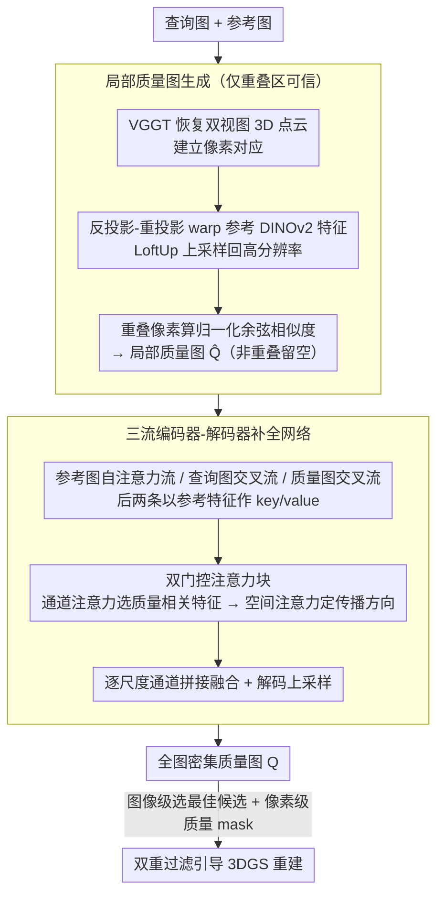

# PR-IQA: Partial-Reference Image Quality Assessment for Diffusion-Based Novel View Synthesis

**会议**: CVPR 2026  
**arXiv**: [2604.04576](https://arxiv.org/abs/2604.04576)  
**代码**: [https://github.com/Kakaomacao/PR-IQA](https://github.com/Kakaomacao/PR-IQA)  
**领域**: 3D视觉 / 图像质量评估  
**关键词**: 图像质量评估, 跨参考, 新视角合成, 3D高斯喷射, 扩散模型

## 一句话总结

本文提出 PR-IQA，一种跨参考图像质量评估方法，先在多视图重叠区域计算几何一致的局部质量图，再通过参考条件化的交叉注意力网络将质量信息"补全"到非重叠区域，生成逼近全参考精度的密集质量图，集成到 3DGS 流水线中通过双重过滤策略显著提升稀疏视角 3D 重建质量。

## 研究背景与动机

**领域现状**：扩散模型在稀疏视角新视角合成（NVS）中日益重要——它们可以生成伪真值图像来弥补 3DGS 等 3D 重建管线中缺少的视角。然而，扩散生成的图像经常包含光度和几何不一致性，直接用它们做监督会损害重建质量。

**现有痛点**：全参考 IQA（FR-IQA，如 PSNR/SSIM/LPIPS）需要像素对齐的真值图像，在 NVS 场景中不可用。无参考 IQA（NR-IQA）不需要参考但难以捕捉扩散生成图像中的高级几何不一致。跨参考 IQA（CR-IQA）利用不同位姿的参考图评估，但现有方法要么仅做 patch 级别的简单相似度（如 CrossScore 用 SSIM）缺乏语义理解，要么仅在重叠区域有效（如 MEt3R）留下评估盲区。

**核心矛盾**：CR-IQA 面临两难——在重叠区域可以通过几何对齐获得可靠的质量估计，但非重叠区域无法直接评估。简单的 patch 相似度方法不依赖重叠但精度低；几何一致的方法精度高但覆盖不全。

**本文目标** 设计一种能同时利用重叠区域的几何可靠性和非重叠区域的上下文推理能力的 CR-IQA 方法，生成全图密集质量图。

**切入角度**：将非重叠区域的质量评估重新建模为"质量图补全"问题——类似图像修复（inpainting）的思路，但补全的不是像素值而是质量分数。通过参考图像提供跨视图上下文来引导补全。

**核心 idea**：先在重叠区域计算可靠的局部质量图，再用参考条件化的交叉注意力网络将局部质量"补全"为全图密集质量图，实现无真值条件下的全参考级精度。

## 方法详解

### 整体框架

PR-IQA 想解决的核心难题是：在没有像素对齐真值的情况下，给一张扩散生成的新视角图打出全图密集的质量分。它的破题思路是把整张图拆成"能直接评"和"评不了"两部分分别处理。第一阶段先在查询图与参考图的**几何重叠区域**算出一张可靠但只覆盖局部的质量图 $\hat{Q}$——重叠区有真实参考可对齐，质量估计可信；第二阶段再把这张残缺的质量图当作"锚点"，用一个三流编码器-解码器网络，借参考图提供的跨视图上下文，把非重叠区域的质量分"补全"出来，最终输出全图密集质量图 $Q$。整个流程读起来像图像修复，只不过补的不是像素而是质量分数。

### 关键设计

**1. 局部质量图生成：在能对齐的重叠区先拿到可信的质量锚点**

非重叠区之所以难评，是因为没有对得上的参考；那就反过来，先把能对齐的重叠区做扎实。具体做法是用 VGGT 同时恢复查询图和参考图的密集 3D 点云，借此建立两视图的像素对应，再通过反投影-重投影把参考图的 DINOv2 特征 warp 到查询视图坐标系下，并用 LoftUp 把特征上采样回高分辨率。对每个重叠像素 $i$，质量分就是 warp 后参考特征与查询特征的归一化余弦相似度：

$$\hat{Q}(i) = \text{CosSim}\big(F_q^{\text{DINO}}(i),\, F_{r \to q}^{\text{DINO}}(i)\big)$$

非重叠像素则留空。之所以可信，是因为几何对齐保证了比较发生在空间一致的同名点上，而 DINOv2 特征又带来高级语义判别力——两者叠加让重叠区的质量估计足够可靠，成为后续补全唯一的"地面真值"。消融里去掉这条分支会让 SRCC 从 0.622 崩到 0.464，正说明它是整套方法的地基。

**2. 三流编码器-解码器补全网络：把跨视图对齐和质量传播拆成两件事分别学**

光有重叠区的质量分还不够，得把它扩散到整张图。网络为此开了三条编码流：参考图走自注意力编码器 $\text{Enc}_{\text{self}}^r$ 提取自身上下文，查询图走交叉注意力编码器 $\text{Enc}_{\text{cross}}^q$，局部质量图走交叉注意力编码器 $\text{Enc}_{\text{cross}}^p$。后两条交叉注意力都以参考图特征作 key/value，等于在每个尺度上都显式注入一次"参考视图怎么看"的证据；每个阶段结束后再把查询特征与质量图特征做通道拼接融合，解码器逐级上采样还原出全分辨率质量图。这样设计的好处是把"跨视图对齐"（靠参考图分支）和"质量传播"（靠局部质量图分支）解耦——网络可以分别学这两种能力，而融合操作又把质量传播牢牢锚定在几何验证过的区域，避免补全时凭空乱编。

**3. 双门控注意力块（Dual-Gated Attention Block）：先选对质量相关的特征，再决定往哪里传**

补全质量分本质上要回答两个问题——"哪些特征跟质量有关"和"该把可靠区域的质量往哪些位置送"。这个块借鉴 CBAM，把两个问题拆开依次解：先做通道注意力（max/avg pooling 后过 MLP 重标定各通道权重）筛出与质量相关的特征通道，再做空间注意力（Q/K/V 投影后 softmax 做空间细化）确定传播方向，每步注意力后都接归一化、残差和 FFN。把"什么特征"和"传到哪"解耦，比让一个注意力同时背两个任务更稳，也让非重叠区的质量分能沿着语义相关的路径从重叠区流过去。

### 损失函数 / 训练策略

总损失由三部分组成：$\mathcal{L} = 0.5 \cdot \mathcal{L}_1^{\text{IQA}} + 1.0 \cdot \mathcal{L}_{\text{JSD}} + 0.25 \cdot \mathcal{L}_{\text{PLCC}}$。其中 $\mathcal{L}_1^{\text{IQA}}$ 确保像素级精度，Jensen-Shannon 散度 $\mathcal{L}_{\text{JSD}}$ 对齐全局分数分布，Pearson 相关系数损失 $\mathcal{L}_{\text{PLCC}}$ 强制线性一致性。训练两个变体：以 DINOv2 相似度图或 SSIM 图为目标。训练数据使用 MFR 数据集，对每帧用 VDM 生成 3 个变体，共 120k 训练对。

## 实验关键数据

### IQA 性能主实验（PLCC/SRCC，越高越好）

| 方法 | 类型 | Mip-NeRF 360 PLCC | Mip-NeRF 360 SRCC | Tanks&Temples PLCC | Tanks&Temples SRCC |
|------|------|-----------|-----------|-----------|-----------|
| LPIPS | FR-IQA† | 0.557 | 0.472 | 0.591 | 0.590 |
| PIQE | NR-IQA | 0.144 | 0.161 | 0.194 | 0.201 |
| PaQ-2-PiQ | NR-IQA | -0.088 | -0.107 | 0.039 | 0.118 |
| CrossScore | CR-IQA | 0.094 | 0.090 | 0.237 | 0.272 |
| PuzzleSim | CR-IQA | 0.304 | 0.327 | 0.351 | 0.369 |
| MEt3R* | CR-IQA | 0.105 | 0.129 | 0.142 | 0.153 |
| **Ours (DINOv2)** | CR-IQA | **0.555** | **0.622** | **0.573** | **0.650** |

### IQA 引导 3DGS 重建

| IQA 方法 | Mip-NeRF PSNR↑ | Mip-NeRF SSIM↑ | Mip-NeRF LPIPS↓ | T&T PSNR↑ | T&T SSIM↑ |
|---------|----------------|----------------|-----------------|-----------|-----------|
| Vanilla 3DGS | 16.08 | 0.461 | 0.415 | 15.30 | 0.509 |
| ViewCrafter（无IQA） | 16.18 | 0.474 | 0.453 | 15.77 | 0.523 |
| CrossScore | 16.31 | 0.476 | 0.431 | 15.86 | 0.537 |
| PuzzleSim | 16.35 | 0.482 | 0.423 | 15.94 | 0.541 |
| **Ours (DINOv2)** | **16.76** | **0.493** | **0.414** | **16.24** | **0.551** |
| DINOv2† (FR) | 17.18 | 0.498 | 0.399 | 16.78 | 0.562 |

### 消融实验

| 变体 | Mip-NeRF PLCC | Mip-NeRF SRCC | T&T PLCC | T&T SRCC | 说明 |
|------|--------------|--------------|----------|----------|------|
| 反转注意力顺序 | 0.540 | 0.609 | 0.517 | 0.584 | 通道→空间顺序更优 |
| 去掉通道注意力 | 0.554 | 0.611 | 0.571 | 0.633 | 通道注意力有帮助 |
| 去掉参考图分支 | 0.544 | 0.613 | 0.553 | 0.637 | 参考图提供有用上下文 |
| 去掉局部质量图分支 | 0.421 | 0.464 | 0.452 | 0.438 | **最关键组件** |
| 完整模型 | 0.555 | 0.622 | 0.573 | 0.650 | - |

### 关键发现

- **局部质量图是最关键的输入**：去掉它导致 SRCC 从 0.622 降到 0.464（-25.4%），远超去掉参考图分支的影响（-1.4%），证明几何对齐的重叠区域质量估计是整个方法的基石
- **PR-IQA 接近全参考精度**：在 Mip-NeRF 360 上 SRCC 0.622 vs LPIPS（FR）的 0.472，PR-IQA 甚至在相关性上超过了部分 FR 指标，说明跨视图信息的有效利用可以弥补无真值的劣势
- **NR-IQA 在 NVS 场景中基本无效**：PaQ-2-PiQ 的相关性甚至为负，说明通用的无参考质量指标无法检测扩散生成图像中的几何不一致
- **3DGS 重建中 PR-IQA 显著优于其他 CR 方法**：在 T&T 上 PSNR 16.24 vs PuzzleSim 15.94，且接近 FR-IQA (DINOv2) 引导的上界 16.78

## 亮点与洞察

- **"质量图补全"的问题重建模**非常巧妙。把 CR-IQA 的核心困难（非重叠区域无法直接评估）转化为类似图像修复的问题，但补全的是质量分数而非像素。这一建模方式使得成熟的修复技术（交叉注意力、多尺度融合等）可以直接复用
- **双重过滤策略**将 IQA 与 3DGS 训练紧密结合——图像级选择最佳候选 + 像素级质量 mask 只监督高置信区域。这种粗-细结合的过滤在实际应用中非常实用
- **三流编码器设计**将"跨视图对齐"和"质量传播"解耦，使网络可以独立学习两种能力。特别是参考条件化的交叉注意力在每个尺度注入跨视图证据，比仅在最高层融合更有效

## 局限与展望

- 依赖 VGGT 做3D对应和 DINOv2 做特征提取，这些预训练模型的质量直接影响局部质量图的可靠性
- 质量图补全网络需要针对不同 FR 指标（DINOv2-SIM 或 SSIM）分别训练，缺乏统一的质量表示
- τ=50 的质量阈值是启发式设定的，不同场景可能需要不同的阈值——自适应阈值策略有待探索
- 仅在视频扩散模型（ViewCrafter）生成的伪真值上验证，对其他扩散模型（如 Zero123++、SV3D）的适用性未知

## 相关工作与启发

- **vs MEt3R**：MEt3R 也使用几何对齐做 CR-IQA，但仅限于重叠区域。PR-IQA 通过质量补全网络将评估扩展到全图，消除了评估盲区，在 SRCC 上大幅领先（0.622 vs 0.129）
- **vs CrossScore**：CrossScore 使用交叉注意力估计 SSIM 图，但设计上是 patch 级别的，缺乏几何感知。PR-IQA 在 SSIM 目标上也显著优于 CrossScore（0.556 vs 0.325）
- **vs PuzzleSim**：PuzzleSim 使用特征级余弦相似度，与 DINOv2 目标有一定相关性但精度不足。PR-IQA 的几何对齐+补全策略提供了更准确的质量估计

## 评分

- 新颖性: ⭐⭐⭐⭐ 将 CR-IQA 重建模为质量图补全问题的思路新颖，三流编码器+参考条件化交叉注意力设计合理
- 实验充分度: ⭐⭐⭐⭐⭐ 三个数据集、两个 FR 目标、全面的 IQA 对比 + 3DGS 应用验证 + 详细消融
- 写作质量: ⭐⭐⭐⭐ 方法描述清晰，可视化对比直观，问题动机充分
- 价值: ⭐⭐⭐⭐ 直接面向扩散生成视图的质量评估这一实际痛点，3DGS 集成展示了清晰的应用路径

<!-- RELATED:START -->

## 相关论文

- [\[CVPR 2026\] QD-PCQA: Quality-Aware Domain Adaptation for Point Cloud Quality Assessment](qd-pcqa_quality-aware_domain_adaptation_for_point_cloud_quality_assessment.md)
- [\[CVPR 2026\] DMAligner: Enhancing Image Alignment via Diffusion Model Based View Synthesis](dmaligner_enhancing_image_alignment_via_diffusion_model_based_view_synthesis.md)
- [\[CVPR 2026\] GeodesicNVS: Probability Density Geodesic Flow Matching for Novel View Synthesis](geodesicnvs_probability_density_geodesic_flow_matching_for_novel_view_synthesis.md)
- [\[AAAI 2026\] 3D-Free Meets 3D Priors: Novel View Synthesis from a Single Image with Pretrained Diffusion Guidance](../../AAAI2026/3d_vision/3d-free_meets_3d_priors_novel_view_synthesis_from_a_single_image_with_pretrained.md)
- [\[CVPR 2025\] MVGD: Zero-Shot Novel View and Depth Synthesis with Multi-View Geometric Diffusion](../../CVPR2025/3d_vision/zero-shot_novel_view_and_depth_synthesis_with_multi-view_geometric_diffusion.md)

<!-- RELATED:END -->
