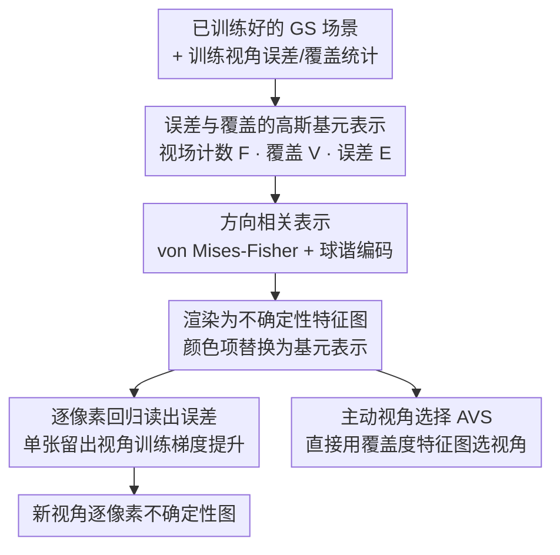

# PRIMU: Uncertainty Estimation for Novel Views in Gaussian Splatting from Primitive-Based Representations of Error and Coverage

**会议**: CVPR 2026  
**论文**: [CVF Open Access](https://openaccess.thecvf.com/content/CVPR2026/html/Gottwald_PRIMU_Uncertainty_Estimation_for_Novel_Views_in_Gaussian_Splatting_from_CVPR_2026_paper.html)  
**代码**: https://osvia.org/PRIMU  
**领域**: 3D视觉  
**关键词**: 高斯泼溅, 不确定性估计, 新视角合成, 主动视角选择, 后处理

## 一句话总结
PRIMU 是一套针对高斯泼溅（Gaussian Splatting, GS）的**后处理**不确定性估计框架：它把训练视角下的渲染误差、覆盖度、视场统计反投影到每个高斯基元上，构造一组可被任意新视角渲染出来的"不确定性特征图"，再用单张留出视角训练的梯度提升回归直接预测逐像素误差，在 RGB 和深度不确定性估计上都刷新 SOTA，并能直接拿覆盖度特征图去做主动视角选择。

## 研究背景与动机

**领域现状**：高斯泼溅用一堆可学习的 3D 高斯基元（位置、协方差、不透明度、颜色）替代 NeRF 的神经网络，渲染快、表示显式，已成新视角合成主流。但要把 GS 部署到机器人、医学成像这类安全攸关场景，必须知道"渲染出来的这张新视角图哪里靠谱、哪里可能错"——也就是不确定性估计（UE）。

**现有痛点**：现有 GS 的 UE 方法绝大多数是**逐基元估计参数不确定性**：要么用 Fisher 信息（FisherRF）、要么学习高斯参数上的分布再多次采样取方差（var3DGS、manifold），再靠渲染过程把它们变成逐像素不确定性。这些方法要么需要改动标准 GS 的训练/渲染管线、推高计算和运行时开销、甚至牺牲渲染质量；要么估的是"参数有多模糊"而非"渲染误差有多大"。

**核心矛盾**：参数不确定性和我们真正关心的**预测误差**（渲染色彩/深度到底差多少）并不等价；而且 GS 的高斯基元常与真实几何错位（外观看着对、深度却偏），单纯量化参数模糊度抓不住这种误差。

**本文目标**：做一个**纯后处理、不动 GS 管线、不降渲染质量**的 UE，并且直接预测渲染/深度误差本身，让它天然对齐下游任务（误差估计、视角选择）。

**切入角度**：作者注意到不确定性其实来自两个可解释的来源——**训练视角覆盖不足**（某区域没几个训练视角看到过）和**训练视角里的重建误差**。把这两类信息从 2D 训练视角"投影"回 3D 高斯基元上，就能得到既可解释、又能从任意新视角重新渲染的表示。

**核心 idea**：用"基于基元的误差与覆盖度表示"替代逐基元参数方差——把误差/覆盖/视场统计反投影到基元、渲染成不确定性特征图、再用轻量回归读出逐像素误差。

## 方法详解

### 整体框架
PRIMU 在 GS 训练**完成之后**运行，全程不修改渲染或优化。流程分四步：① 从训练视角统计每个高斯基元被多少视角看到（视场计数）、覆盖得多强（覆盖度）、贡献了多少重建误差（误差），把这些 2D 统计反投影到 3D 基元上，得到**高斯基元表示**；② 把覆盖度/误差表示扩展成**方向相关**版本（用 von Mises-Fisher 球面分布 + 球谐编码），让 UE 能感知视角方向；③ 渲染时把 GS 渲染公式里的颜色项 $c_k$ 换成上述某个基元表示，就能在任意新视角"渲染"出一张**不确定性特征图**；④ 把一组特征图喂给逐像素**回归模型**（梯度提升），用一张留出视角的真实误差当标签训练，之后即可对任意新视角输出稠密的逐像素不确定性。整套表示共 13 张手工特征图（1 张视场计数 + 6 张覆盖 + 6 张误差）。

### 关键设计

**1. 误差与覆盖的高斯基元表示：把不确定性的两个来源反投影到基元上**

这是全文的根基，针对"逐基元参数方差抓不住真实误差"的痛点。作者定义三类基元级标量。**视场计数** $F(k)=|\Omega_k|$，记录第 $k$ 个基元落在多少个训练视角的视锥内（$\Omega_k$ 为这些视角集合）——看到它的视角越少，越不可信。**覆盖度表示** $V(k)=\max_{v\in\Omega}\text{agg}_{\bar x\in v(k)}\alpha_k(\bar x)T_k(\bar x)$，用基元在可见像素上的贡献因子（不透明度 $\alpha_k$ × 累积透射率 $T_k$，即 GS 渲染里那项权重）做聚合（$\text{agg}\in\{\max,\text{sum},\text{mean}\}$），再对所有训练视角取最大，衡量这个基元在至少一个训练视角里被覆盖得有多强。**误差表示** $E(k)=\text{mean}_{v\in\Omega}\text{agg}_{\bar x\in v(k)} e_{\bar x}\,\alpha_k(\bar x)T_k(\bar x)$，把每个贡献项再乘上像素级 $\ell_1$ 重建误差 $e_{\bar x}$，刻画基元对整体渲染误差的贡献。覆盖和误差表示都可以选择性地**去掉不透明度项 $\alpha_k$**，以突出那些低不透明度却仍影响重建的半透明高斯。这一步的关键在于：把 2D 训练视角的误差/覆盖信息"焊"到 3D 基元上，使它们能随场景一起被任意新视角重新渲染出来。

**2. 方向相关表示：让不确定性随视角方向变化**

针对"同一基元从不同方向看、覆盖和误差并不一样"（GS 颜色本就是视角相关的）。作者用 von Mises-Fisher 分布——球面上的正态分布类比 $f(\vec x;\vec\nu,\kappa)=\frac{\kappa}{2\pi\sinh(\kappa)}e^{\kappa\vec\nu^\top\vec x}$，其中 $\vec\nu$ 是均值方向、$\kappa$ 控制集中程度——把它归一化到峰值为 1，去给覆盖/误差的贡献加权。得到方向相关版 $V^*(k,\vec d)=\max_{v\in\Omega}\text{agg}\,\alpha_k T_k\, e^{\kappa\vec\nu_v^\top\vec d-\kappa}$ 和 $E^*(k,\vec d)$ 同理，其中 $\vec\nu_v$ 是训练视角 $v$ 的方向、$\vec d$ 是评估方向。直观上等于在每个基元周围、沿其观测过的训练视角方向放一个缩放后的 vMF 分布。为了高效渲染，这些方向相关表示用**球谐函数**编码，和 GS 自己的颜色编码方式保持一致。实验显示方向相关版（PRIMU*）在渲染 UE 上带来小而稳定的提升，对深度 UE 则几乎无差别——说明深度不确定性本身更接近方向无关。

**3. 渲染成特征图 + 逐像素回归：用单张留出视角把特征图读成误差**

针对"基元级标量怎么变成新视角逐像素不确定性"。作者复用 GS 的渲染公式 $C(\bar x)=\sum_k c_k(\vec d)\alpha_k(\bar x)T_k(\bar x)$，只把颜色项 $c_k$ 替换成某个基元表示，就能在任意位姿渲染出一张**不确定性特征图**。把选定的一组特征图当输入，喂给逐像素回归模型（默认梯度提升回归），用真实误差 $e_{\bar x}=\|R(\bar x)-\hat R(\bar x)\|_1$（GT 与渲染值之差）当标签，只在**单张留出视角**上训练，之后就能泛化到其他新视角乃至新场景。作者特意指出标准回归指标 $R^2$ 因输入/目标范围漂移不适用，所以用 AUSE 和 Pearson 相关来评。消融发现梯度提升明显优于线性回归（尤其物体中心设定下，暗示存在更强的非线性关系），且 13 张特征图全用通常给出最佳平均性能、删减反而难稳定提升。

**4. 主动视角选择（AVS）：直接拿覆盖度特征图选下一个训练视角**

针对"如何在有限训练视角下挑出最能提升重建质量的视角"。常规做法是训一个 UE 回归器再按不确定性最大选视角，但训回归器至少要多一张视角。PRIMU-AVS 干脆**跳过回归器**，只用一张方向相关、max 聚合、去不透明度的覆盖度特征图 ${V^{(\alpha=1)}_{\max}}^*$：它的目标是让被选训练视角覆盖到的高斯基元总量最大化。选新视角时，对所有候选视角渲染这张覆盖图，选**像素均值最低**的那个——也就是当前已选视角覆盖最差的方向。max 聚合简单且与基元空间尺度无关，去掉不透明度是为了把半透明基元也算进覆盖。它在 MipNeRF360 上不靠任何留出数据就超过了显式建模不确定性/信息增益的 FisherRF 和 manifold。

### 损失函数 / 训练策略
PRIMU 不引入新的 GS 训练损失（纯后处理，GS 用原始重建损失训练）。唯一被"训练"的是逐像素回归器，它在单张（或少数几张）留出视角上以真实 $\ell_1$ 误差为目标做梯度提升回归；GS 的 PSNR/SSIM/LPIPS 完全不受影响，这也是后处理方法相对随机采样类方法的核心优势。

## 实验关键数据

> 评测指标：**AUSE**（Area Under the Sparsification Error，按不确定性/真实误差排序逐步剔除高误差像素时两条 MAE 曲线间的面积，越小说明不确定性与真实误差越对齐）；**Pears.**（不确定性图与误差图的 Pearson 线性相关，越大越好）；PSNR/SSIM/LPIPS 反映底层 GS 渲染质量（后处理方法均不影响）。

### 主实验（渲染误差 UE）

在 LF、MipNeRF360、LLFF 三个数据集上，PRIMU 在 AUSE 和 Pearson 上全面优于现有 GS UE 方法，且因为是后处理，渲染质量与标准 GS 一致：

| 数据集 | 指标 | PRIMU* | PRIMU | FisherRF | manifold | var3DGS |
|--------|------|--------|-------|----------|----------|---------|
| LF | AUSE ↓ | **0.286** | 0.291 | 0.753 | 0.435 | 0.688 |
| LF | Pears. ↑ | **0.351** | 0.337 | -0.13 | 0.099 | 0.102 |
| MipNeRF360 | AUSE ↓ | **0.378** | 0.391 | 0.738 | 0.52 | 0.52 |
| LLFF | AUSE ↓ | **0.281** | 0.284 | 0.988 | 0.545 | 0.476 |

深度 UE（LF 数据集）上优势更夸张，Pearson 高达 0.72，远超 FisherRF 和 NeRF 类的 BayesRays：

| 方法 | AUSE ↓ | Pears. ↑ |
|------|--------|----------|
| PRIMU* | **0.118** | **0.728** |
| PRIMU | 0.115 | 0.722 |
| BayesRays | 0.173 | 0.243 |
| FisherRF | 0.305 | 0.105 |
| manifold | 0.436 | 0.036 |

### 消融实验（场景分离 + 主动视角选择）

物体中心 vs 整场景、单视角 vs 多视角、梯度提升 vs 线性回归的分离研究（节选 LF/TUM）：

| 设定 | 模型 | 渲染 UE AUSE ↓ | 深度 UE AUSE ↓ |
|------|------|----------------|----------------|
| 整场景·1 视角 | PRIMU (grad.) | 0.244 | 0.112 |
| 物体中心·1 视角 | PRIMU (grad.) | **0.072** | **0.071** |
| 物体中心·1 视角 | reg. FisherRF (grad.) | 0.119 | 0.133 |
| 物体中心·多视角 | PRIMU (grad.) | 0.06 | 0.099 |
| 物体中心·1 视角 | PRIMU (lin.) | 0.254 | 0.202 |

主动视角选择（MipNeRF360，迭代选 20 个训练视角后看最终渲染质量）：

| 方法 | PSNR ↑ | SSIM ↑ | LPIPS ↓ |
|------|--------|--------|---------|
| PRIMU-AVS | **20.721** | **0.625** | **0.34** |
| FisherRF | 20.392 | 0.586 | 0.363 |
| manifold† | 20.102 | 0.610 | 0.351 |

### 关键发现
- **物体中心设定显著优于整场景**：物体中心下单张留出视角就能达到 AUSE < 0.1、Pearson > 0.8，说明聚焦中心物体时特征图与误差关系更干净。
- **梯度提升 > 线性回归**，尤其物体中心场景差距明显，暗示不确定性与特征间存在较强非线性关系。
- **视场计数图 + max 聚合（去不透明度）覆盖图最有信息量**：逐步后向回归一致地把这两张特征图保留到最后——FoV 反映区域被多少训练视角看到，去不透明度覆盖图突出相关但半透明的高斯，二者互补。
- **跨场景泛化**：回归器能迁移到没见过的场景，意味着特征图把 UE 相关信息压到了很低的维度。
- **方向相关只在渲染 UE 上有小幅稳定增益**，深度 UE 上几乎无差别。

## 亮点与洞察
- **"把 2D 误差反投影回 3D 基元再重渲染"是个优雅的后处理范式**：不动 GS 管线、不降渲染质量，却能在任意新视角生成不确定性图——这种"用渲染本身当 UE 的传播器"的思路可迁移到其他可微渲染表示。
- **直接预测误差而非参数方差**：作者明确区分 predictive uncertainty 与 parameter uncertainty，前者天然对齐下游误差估计/视角选择任务，是相对 FisherRF 一类的本质差异。
- **AVS 不需要训练回归器、不需要额外留出数据**：只用一张覆盖度特征图、选覆盖最差的视角，就能超过显式建模信息增益的方法，简单到近乎"免费"却很有效。
- **13 张手工特征图 + 轻量梯度提升**：整个 UE 不引入深度网络、不增加 GS 训练负担，工程上极易落地到已有 GS 流程后面。

## 局限与展望
- **依赖手工特征图设计**：13 张特征图（视场/覆盖/误差 × 聚合方式 × 是否带不透明度 × 是否方向相关）是人工构造的，组合空间靠后向回归筛选，缺乏端到端学习，换数据集时最优组合可能需重调。
- **整场景设定下性能明显弱于物体中心**：AUSE 从 <0.1 涨到 0.24+，说明背景/复杂全景下 UE 仍有较大提升空间。
- **TUM 数据集的运动模糊**会带来更高渲染误差，作者也承认这些 2D 不一致会影响标签质量（⚠️ 标签噪声对回归的影响论文未单独量化）。
- **改进方向**：把特征图构造或聚合方式做成可学习的、或与方向相关表示联合优化，可能进一步提升整场景与背景区域的 UE。

## 相关工作与启发
- **vs FisherRF（Jiang et al.）**: FisherRF 用 Fisher 信息矩阵对角线估逐基元参数不确定性，也是后处理；PRIMU 直接预测渲染/深度误差（predictive uncertainty）而非参数模糊度，在它自己的 AVS 评测设定里都被 PRIMU 超过。
- **vs var3DGS / manifold（随机 GS）**: 这两者在高斯参数上学分布、多次采样取方差，需要改 GS 训练/渲染、增计算且可能损渲染质量；PRIMU 纯后处理、不动管线、不降质量，AUSE/Pearson 还更好。
- **vs BayesRays（NeRF）**: BayesRays 是 NeRF 的贝叶斯后处理、只适用深度 UE，且 NeRF 渲染质量本就低于 GS，其较好的 AUSE 被低渲染质量打了折扣；PRIMU 面向 GS 且 RGB/深度通吃。
- **vs Wilson et al. / 方向相关 preprint**: Wilson 等扩展 FisherRF 建参数间相关性但不提供方向相关不确定性表示；某 preprint 虽建方向相关不确定性却把它塞进 GS 训练、不是后处理——PRIMU 同时做到方向相关 + 纯后处理。

## 评分
- 新颖性: ⭐⭐⭐⭐ "误差/覆盖反投影到基元再重渲染"的后处理 UE 范式有清晰新意，但建立在 GS 渲染机制和已有 UE 概念之上
- 实验充分度: ⭐⭐⭐⭐⭐ 四数据集、RGB+深度、场景分离、特征图组合、AVS、跨场景泛化，消融极其详尽
- 写作质量: ⭐⭐⭐⭐ 动机和方法层次清楚，但 13 张特征图的命名与众多表格密集，初读需要反复对照
- 价值: ⭐⭐⭐⭐ 不动管线、不降质量的即插即用 UE，对机器人/医学等安全攸关 GS 部署很实用

<!-- RELATED:START -->

## 相关论文

- [\[CVPR 2026\] Coverage Optimization for Camera View Selection](coverage_optimization_for_camera_view_selection.md)
- [\[CVPR 2026\] Guardians of the Hair: Rescuing Soft Boundaries in Depth, Stereo, and Novel Views](guardians_of_the_hair_rescuing_soft_boundaries_in_depth_stereo_and_novel_views.md)
- [\[CVPR 2026\] Learning Compact 3D Representations from Feed-Forward Novel View Synthesis](learning_compact_3d_representations_from_feed-forward_novel_view_synthesis.md)
- [\[CVPR 2026\] Uncertainty-driven 3D Gaussian Splatting Active Mapping via Anisotropic Visibility Field](uncertainty-driven_3d_gaussian_splatting_active_mapping_via_anisotropic_visibili.md)
- [\[CVPR 2026\] HeroGS: Hierarchical Guidance for Robust 3D Gaussian Splatting under Sparse Views](herogs_hierarchical_guidance_for_robust_3d_gaussian_splatting_under_sparse_views.md)

<!-- RELATED:END -->
