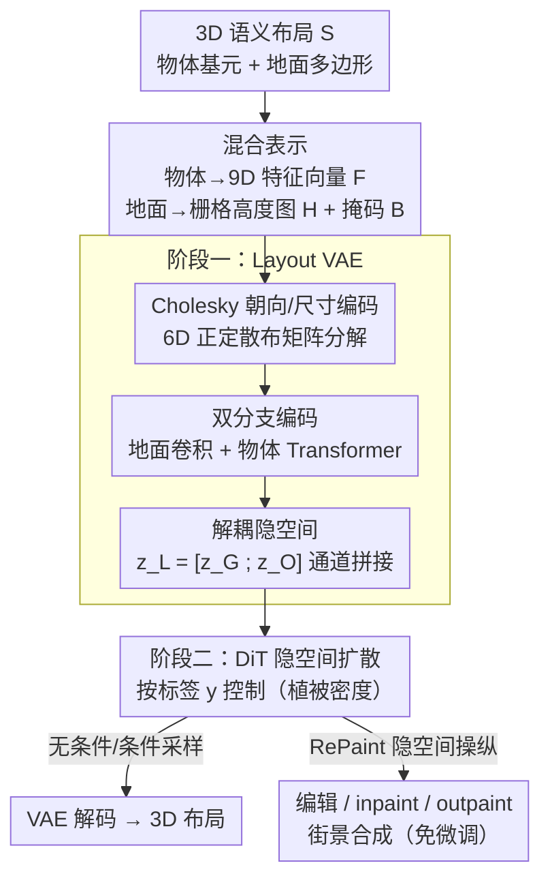

# PrITTI: Primitive-based Generation of Controllable and Editable 3D Semantic Urban Scenes

**会议**: CVPR 2026  
**arXiv**: [2506.19117](https://arxiv.org/abs/2506.19117)  
**代码**: https://raniatze.github.io/pritti/ (有，项目主页含源码)  
**领域**: 3D视觉 / 扩散模型  
**关键词**: 3D语义场景生成, primitive表示, 隐空间扩散, 可编辑性, 自动驾驶仿真

## 一句话总结
PrITTI 用「向量化的物体几何体（cuboid/ellipsoid）+ 栅格化的地面」混合表示替代体素，先用 Layout VAE 把 3D 城市语义布局压成结构化的 2D 隐空间，再训练隐空间扩散 Transformer 做可控生成，在 KITTI-360 上以更低显存、更快推理和更强可编辑性达到 SOTA，并天然支持场景编辑 / inpainting / outpainting / 街景合成等下游任务。

## 研究背景与动机

**领域现状**：大规模、带语义结构的 3D 城市场景生成是数字世界建模和自动驾驶仿真的基础——它能造出用于安全验证、长尾场景测试、感知/规划数据合成的虚拟世界。现有方法绝大多数把 3D 城市环境建模成**体素网格**或分层体素结构（如 SemCity、PDD、XCube）。

**现有痛点**：体素表示有三个根本缺陷。① 显存随分辨率立方增长，大场景代价高得不可承受；② 固定空间分辨率导致细节受限，高的物体（楼、树）经常被「截断」或扭曲；③ 难以编辑——哪怕只是平移一辆车，都要找出并更新所有相关体素、再填补腾空区域，而 car vs. road 这类物体/背景边界本身就模糊，编辑极其麻烦。

**核心矛盾**：体素天生是**密集、定分辨率、无物体语义**的表示，而城市场景生成真正需要的是**紧凑、可组合、支持局部直观编辑**的表示——表示形式的选择直接决定了可控性和可编辑性能做到什么程度，两者存在根本张力。

**本文目标**：找一种内存高效、组合式、且支持实例级局部编辑的表示，并在其上做可控、可编辑的 3D 语义城市场景生成。

**切入角度**：作者主张回到 primitive（基元）——用少量语义明确的 3D 元素（长方体、椭球、地面多边形）来拼装场景。primitive 在形状抽象和场景解析里早有应用，但在**生成式**设定、尤其是 3D 语义城市场景生成里几乎没人探索。难点在于：cuboid/ellipsoid 可以统一参数化，但地面多边形形状任意、顶点数不定，无法统一编码。

**核心 idea**：用「混合表示」破局——**物体用参数化 primitive（向量），地面用栅格化 BEV 高度图（图像）**；再用两阶段「Layout VAE 压成 2D 隐空间 → 隐空间扩散」生成，并让隐空间在通道维度上把地面/物体解耦，从而解锁可控生成与无需微调的局部编辑。

## 方法详解

### 整体框架
PrITTI 把一个 3D 语义布局 $\mathcal{S}$ 拆成两类元素分别表示：物体实例编码成基元特征向量 $\mathbf{F}$，地面多边形栅格化成高度图 $\mathbf{H}$ 和占用掩码 $\mathbf{B}$。整条流水线是两阶段：第一阶段训练一个 **Layout VAE（LVAE）**，用「栅格分支 + 向量分支」两套编码器/解码器把布局压进一个紧凑的 2D 联合隐空间 $\mathbf{z}_\mathcal{L}$；第二阶段在这个冻结的隐空间上训练一个 **DiT 扩散 Transformer**，按场景标签 $y$ 做可控生成。推理时扩散模型采样隐码（无条件或条件于 $y$），再由 VAE 解码成新的 3D 布局。基于 RePaint 的隐空间操纵策略让 inpainting / outpainting / 编辑等下游任务**无需任何微调**即可复用同一个预训练模型。

### 关键设计

**1. 物体向量 + 地面栅格的混合表示：让任意形状的地面与可参数化的物体各取所长**

痛点是「cuboid/ellipsoid 能统一参数化，但地面多边形形状任意、顶点数不定，没法统一编码」。PrITTI 不强行用一种表示包打天下，而是分而治之。**地面**有 5 个语义类（road、sidewalk、parking、terrain、ground），它沿重力方向做光线投射，把挤出的 3D 多边形栅格化成 BEV 视角的高度图 $\mathbf{H}\in\mathbb{R}^{H\times W\times 5}$ 和二值占用掩码 $\mathbf{B}\in\{0,1\}^{H\times W\times 5}$，正好适合卷积网络处理。**物体**用 11 类基元（植被 cuboid/ellipsoid、大/小车辆、两轮车、人、大/小建筑、杆、交通管制、其他），每个基元用一个 9 维特征向量 $\mathbf{f}_i\in[0,1]^9$ 表示，由归一化 3D 中心 $\mathbf{t}_i\in\mathbb{R}^3$ 和 6D Cholesky 参数 $\mathbf{c}_i\in\mathbb{R}^6$ 组成。整个布局即 $\boldsymbol{\mathcal{L}}=\{\mathbf{H},\mathbf{B},\mathbf{F}\}$，其中 $\mathbf{F}\in\mathbb{R}^{M\times 9}$ 存所有 $M$ 个物体基元。相比体素，这种表示分辨率无关、显存恒定且低（每场景仅 2.52 MB，其中栅格 2.50 MB、基元仅 0.02 MB），且物体是实例级的，平移/缩放/旋转都能直接操作单个 primitive。

**2. 基于 Cholesky 分解的朝向 + 尺寸编码：用 6D 唯一参数化消除旋转对称带来的歧义**

物体的朝向和尺寸如果用四元数或特征分解来编码，会因为旋转对称性产生**多解歧义**（如四元数的符号歧义 $q$ 与 $-q$ 等价），训练时损失曲面出现不连续，优化不稳定。PrITTI 把物体的 3D 范围表示成一个正定散布矩阵，对它做 Cholesky 分解得到 6 维参数 $\mathbf{c}_i\in\mathbb{R}^6$，**联合编码朝向与尺寸**。Cholesky 分解对正定矩阵是唯一的，因此天然消除了旋转对称导致的歧义，提升训练稳定性。论文用「单个零中心、随机尺度和偏航角的车辆基元」做合成实验：随训练样本量增大，Cholesky 编码的 mean IoU3D 持续上升且稳定，而四元数基线会饱和甚至**随数据增多反而退化**（归因于符号歧义造成的损失不连续）。

**3. 通道维解耦的联合隐空间 + 双分支 VAE：把地面和物体分到不同通道组，解锁地面条件下的物体生成**

LVAE 用两个编码器处理两种模态。**地面编码器** $\mathcal{E}_\mathcal{G}$（卷积）把栅格图编码成 $\mathbf{z}_\mathcal{G}\in\mathbb{R}^{h\times w\times c}$（$h=H/2^d$）。**物体编码器** $\mathcal{E}_\mathcal{O}$ 先把每个基元的特征向量补上 10D 可学习类别嵌入和二值 padding 标志（为支持批训练和定长集合预测，按类别 padding 到固定数量），得到 $\boldsymbol{\mathcal{F}}\in\mathbb{R}^{N\times 20}$，过 Transformer 编码器建模基元间关系，再用 **scatter-mean** 按每个基元归一化后的 2D 中心位置散布到一个 2D 隐格上、重叠项取平均——这既保持了置换不变性，又在隐空间里保留了空间结构。两路隐码沿通道拼接成 $\mathbf{z}_\mathcal{L}=[\mathbf{z}_\mathcal{G};\mathbf{z}_\mathcal{O}]\in\mathbb{R}^{h\times w\times 2c}$。**解码**时把隐码沿通道切回地面/物体两部分：地面用卷积解码器 $\mathcal{D}_\mathcal{G}$ 重建栅格图，物体用 DETR 式 Transformer 解码器 $\mathcal{D}_\mathcal{O}$——把 $\mathbf{z}_\mathcal{O}$ patch 化成 token 作 key/value，每类用一组可学习 object query 输出 $\boldsymbol{Q}\in\mathbb{R}^{N\times d_L}$，再过类别专属 FFN 预测中心 $\hat{\mathbf{t}}_i$、Cholesky 参数 $\hat{\mathbf{c}}_i$ 和存在概率 $\hat{p}_i$。这种「地面/物体分通道」的解耦设计的关键收益是：可以**只对物体通道做 inpaint、固定地面通道**，从而免监督地实现「给定地面、条件生成物体」（如让车生成在路上）。

**4. RePaint 式隐空间操纵：同一个预训练扩散模型免微调地做 inpainting / outpainting / 编辑**

第二阶段在冻结 LVAE 的隐空间上训练扩散模型 $\epsilon_\theta(\mathbf{z}_\mathcal{L}^t,t,y)$，$y$ 是控制植被密度（低/中/高）的场景标签，用 Transformer backbone + adaLN-Zero 注入条件，MSE 预测高斯噪声。下游编辑借鉴 **RePaint**：在 2D 隐空间里用一个二值掩码指定可编辑区域，采样时把未知区域的去噪与已知区域的加噪版本**同步**，从而在保持全局结构的前提下做局部编辑（如只重画场景左半、右半不变）。**Outpainting** 用滑窗策略扩展布局——每个新生成块与相邻块重叠 50% 以保证空间一致，先沿四个主方向并行扩展、再补角区，可迭代生成任意大的 3D 场景。所有这些都复用同一套隐空间操纵机制，无需为每个任务单独微调。

### 损失函数 / 训练策略
第一阶段（LVAE）的目标函数把栅格损失、向量损失和联合隐空间上的 KL 散度组合起来。**地面栅格**：高度图用 L1 损失（只在被占用像素上平均），占用掩码用二值交叉熵 BCE。**物体基元**：预测实例与真值先在**每个类别内**用匈牙利算法做匹配，匹配代价由 (i) 存在概率的 BCE、(ii) 中心位置的 L1、(iii) Cholesky 参数的 L1 三项组成；匹配后按类别计算对应损失，并按 batch 内真实真值实例数归一化、再跨 batch 平均。第二阶段（DiT）：从冻结 LVAE 抽联合隐码训练扩散模型，DiT-B backbone + DDPM 噪声调度，采样用 250 步 DDPM。布局重建时把各类高度图融合成单一高度场、挤出三角网格，存在概率超阈值的物体基元按预测中心和 Cholesky 参数摆放，从而同时处理稀疏和密集场景。

## 实验关键数据

数据集：KITTI-360，每个布局覆盖以自车为中心的 $64\,\text{m}\times 64\,\text{m}$，按语义和尺度相似性归并为 16 类，划分出 **61,913 训练 / 1,233 测试** 位姿；补充材料另有 Argoverse 2 结果。实现上栅格图分辨率 $H=W=256$，下采样因子 $d=8$、隐通道 $c=32$；物体编/解码器各 6 层 Transformer，解码器处理 $N=514$ 个 object query；扩散用 DiT-B + DDPM。Baseline 为体素方法 SemCity、PDD、XCube。

### 主实验（阶段一：3D 语义场景重建，最细分辨率 $256^2\times 32$）

| 方法 | Size (MB)↓ | IoU↑ | mIoU↑ |
|------|-----------|------|-------|
| SemCity | 8.00 | 81.75 | 70.52 |
| SemCity-1M（1M 查询点） | 8.00 | **97.69** | **93.81** |
| XCube | 3.05 | **99.97** | 79.47 |
| **PrITTI（voxelized）** | **2.52** | 90.58 | 70.27 |

PrITTI 每场景仅需 2.52 MB（栅格 2.50 + 基元 0.02），显著低于 SemCity 的 8.00 MB 和 XCube 的 3.05 MB。注意 PrITTI 原生是 primitive 表示，为了和体素方法比较被**强行体素化**（引入了体素原生方法没有的额外误差），即便如此重建质量仍有竞争力。体素方法在低分辨率下虽更省内存（如 SemCity $128^2\times16$），但无法 scale 到高分辨率——高分辨率要么显存爆炸、要么上采样产生严重伪影，存在明显的「内存 vs. 重建质量」权衡；PrITTI 则**分辨率无关、显存恒定且低**。

### 主实验（阶段二：3D 语义场景生成）

生成用 Precision / Recall / FID / Inception Score 衡量保真度和多样性：参考集与生成集都渲染成 $256^2$ 的俯视语义图，用训练集作参考、生成等量样本、250 步 DDPM 采样；PrITTI 按低/中/高三类各采等量样本、不用 classifier-free guidance，而所有 baseline 是无条件生成。论文报告 PrITTI 在生成质量、多样性、可编辑性上**超过体素 baseline**，并兼具更低显存和更快推理。⚠️ 具体的 FID / IS / Prec. / Rec. 数值在本次抽取的文本（截断）中未取到，以原文 Tab. 3 为准。

### 消融实验（Tab. 2：LVAE 隐空间切分与联合训练）

| 配置 | Raster MSE ($\times10^{-2}$)↓ | IoU↑ | AP3D↑ | AP3D@50↑ | 说明 |
|------|------|------|-------|----------|------|
| Default（完整） | 0.75 | 99.96 | **62.12** | **46.96** | 联合隐空间 + 解码时切分 |
| w/o latent split | 3.55 | 99.70 | 53.78 | 39.09 | 两个解码器都用联合隐 $\mathbf{z}_\mathcal{L}$ |
| w/o objects | 0.59 | 99.96 | — | — | 只训地面分支 |
| w/o ground | — | — | 60.28 | 46.37 | 只训物体分支 |

### 关键发现
- **隐空间切分最关键**：去掉「分通道切分」后 AP3D 从 62.12 掉到 53.78、Raster MSE 从 0.0075 恶化到 0.0355，说明每个解码器都受益于各自的领域专属特征，地面/物体共用同一隐表示会互相干扰。
- **联合训练换来语义对齐**：和「地面、物体分开独立训练」相比，分开训练虽让高度图 MSE 略好（0.0059 vs. 0.0075），但联合训练的 AP3D 更高（62.12 vs. 60.28）——共享隐空间促进了两分支的语义对齐，让物体能**上下文感知地摆放**（如车摆在路上）。
- **Cholesky 完胜四元数**：合成实验里随训练数据增多，Cholesky 的 mean IoU3D 持续上升且更稳定，四元数基线则饱和甚至退化（符号歧义→损失不连续），印证了用唯一参数化消除旋转对称歧义的价值。

## 亮点与洞察
- **「物体向量 + 地面栅格」的混合表示**是全文最巧的地方：它没有教条地坚持单一表示，而是承认「可参数化的物体」和「任意形状的地面」本质不同，让二者各用最合适的载体，再在 VAE 里统一到 2D 隐格——既拿到了 primitive 的紧凑/可编辑，又规避了多边形难以统一编码的硬伤。
- **用 Cholesky 分解编码 6D 朝向+尺寸**是一个可直接迁移的 trick：任何需要回归 3D box 朝向/尺寸的任务（3D 检测、布局生成、姿态估计），都可以用「正定散布矩阵的 Cholesky 分解」替代四元数来消除旋转对称歧义、稳定训练。
- **通道维解耦让一个能力「白送」**：把地面和物体编到不同通道组，本是为了避免互相干扰，却顺带免监督地解锁了「给定地面条件生成物体」——这是表示设计带来的涌现式能力，而非额外训练目标换来的。
- **生成与编辑共用一套隐空间机制**：借 RePaint 把编辑/inpaint/outpaint 全部转化为「隐空间局部去噪」，预训练一次、下游任务零微调，工程上非常省心。

## 局限与展望
- **被迫体素化才能和体素方法比重建**：PrITTI 原生是 primitive，重建对比时要先体素化、引入额外误差，因此 Tab. 1 的重建指标对它并不公平；它的真正优势体现在生成和编辑，重建只是「不掉队」。
- **表示是抽象语义层、非外观/几何细节**：PrITTI 刻意强调「可控语义布局」而非外观或几何保真度，生成的是 cuboid/ellipsoid 拼出的抽象场景，照片级街景要靠下游合成补上，不能直接当高保真 3D 资产用。
- **可控性目前主要演示植被密度**：条件标签 $y$ 主论文聚焦植被密度（低/中/高），虽声称可推广到其他类别及组合（见补充），但主实验的可控维度较单一。
- **依赖 primitive 标注**：方法需要有 3D primitive 标注的数据集（KITTI-360 / Argoverse 2），缺乏此类标注的场景需要额外的标注或拟合流程。
- ⚠️ 由于本次仅取到截断的正文，生成主表（FID/IS/Prec./Rec.）的精确数值未纳入，落地复现时请以原文 Tab. 3 与补充材料为准。

## 相关工作与启发
- **vs 体素方法（SemCity / PDD / XCube）**：它们用体素网格或分层体素 + (三平面)隐扩散，受限于立方显存、固定分辨率、难编辑；PrITTI 用 primitive + 栅格混合表示，分辨率无关、显存恒定、实例级可编辑。XCube 用自定义 CUDA 稀疏体素省内存，但仍继承体素的可编辑性差与定分辨率缺陷。
- **vs 2D 抽象的驾驶仿真布局生成（最接近的是 SLEDGE）**：这类方法用 agent bounding box、车道图等做 2D 抽象布局；PrITTI 直接建模 **3D** 场景，primitive 类型更丰富、语义类更多、地面几何也比 2D 折线更灵活。
- **vs 室内/物体级 primitive 生成（SPAGHETTI / SALAD 等）**：以往 primitive 生成多在单物体或室内、做部件级抽象/解析；PrITTI 把每个 primitive 对应一个**物体实例**用于 3D 语义布局生成，支持场景级操作（物体排布等），是 primitive 在户外大规模生成式设定下的首次系统探索。
- **vs 外观驱动的 3D 场景生成（NeRF / 3DGS / 全景两阶段方法）**：它们追求照片级真实但把场景当作整体、缺乏物体级显式结构；PrITTI 优先可控的语义布局，换来实例级控制与高层操纵能力。

## 评分
- 新颖性: ⭐⭐⭐⭐⭐ 首个用粗 3D 包围基元做城市级可控可编辑 3D 语义场景生成的框架，混合表示 + Cholesky 编码 + 解耦隐空间三点都有想法
- 实验充分度: ⭐⭐⭐⭐ KITTI-360 主实验 + Argoverse 2 + 多组消融较完整，但本次未取到生成主表精确数值（⚠️ 以原文为准）
- 写作质量: ⭐⭐⭐⭐ 动机推导清晰、表示设计讲得透；混合表示与隐空间细节稍密集
- 价值: ⭐⭐⭐⭐⭐ 低显存、可编辑、免微调下游应用，对自动驾驶仿真和数字世界建模有直接实用价值

<!-- RELATED:START -->

## 相关论文

- [\[CVPR 2026\] WeatherCity: Urban Scene Reconstruction with Controllable Multi-Weather Transformation](weathercity_urban_scene_reconstruction_with_controllable_multi-weather_transform.md)
- [\[CVPR 2026\] DepthFocus: Controllable Depth Estimation for See-Through Scenes](depthfocus_controllable_depth_estimation_for_see-through_scenes.md)
- [\[CVPR 2026\] VAD-GS: Visibility-Aware Densification for 3D Gaussian Splatting in Dynamic Urban Scenes](vad-gs_visibility-aware_densification_for_3d_gaussian_splatting_in_dynamic_urban.md)
- [\[CVPR 2026\] Multimodal Semantic Bias Mitigation for Diverse Text-To-3D Generation](multimodal_semantic_bias_mitigation_for_diverse_text-to-3d_generation.md)
- [\[CVPR 2026\] MajutsuCity: Language-driven Aesthetic-adaptive City Generation with Controllable 3D Assets and Layouts](majutsucity_language-driven_aesthetic-adaptive_city_generation_with_controllable.md)

<!-- RELATED:END -->
