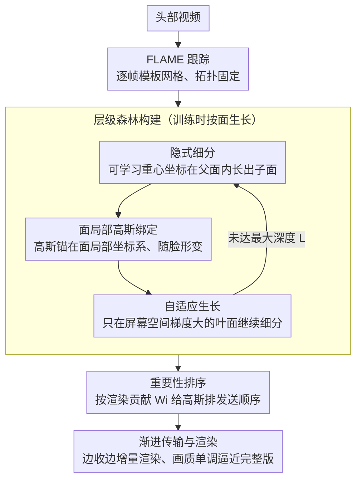

# ProgressiveAvatars: Progressive Animatable 3D Gaussian Avatars

**会议**: CVPR 2026  
**arXiv**: [2603.16447](https://arxiv.org/abs/2603.16447)  
**代码**: [GitHub](https://ustc3dv/ProgressiveAvatars)  
**领域**: 3D视觉  
**关键词**: 渐进式3D表示, 可动画化头部Avatar, 3D高斯溅射, 流式传输, 自适应细分

## 一句话总结
提出 ProgressiveAvatars，一种基于模板网格自适应隐式细分构建层级3DGS的渐进式头像表示，支持在不同带宽和算力约束下渐进传输和渲染——仅传输5%数据（2.6MB）即可获得可用头像，后续增量加载平滑提升质量至与 SOTA 方法可比。

## 研究背景与动机
**领域现状**：高保真实时头部 Avatar 是沉浸式交互的关键技术。3DGS 因其高效渲染已成为主流显式表示。GaussianAvatars、FlashAvatar、MeGA 等方法实现了高质量可动画化头像。

**现有痛点**：
   - 在社交 VR 等多用户动态场景中，以传统静态资产方式传输高保真 Avatar 会导致严重启动延迟和带宽尖峰，用户必须等待完整下载才能看到任何渲染
   - 现有 3DGS Avatar 缺少增量加载机制，无法在传输过程中平滑累积细节
   - 已有 LOD 方法（LoDAvatar、ArchitectHead）依赖离散 LOD 切换范式，需要存储多个独立模型副本，存在严重存储冗余和资源切换延迟
   - 均匀细分（LoDAvatar）在平滑区域过度细化而在高频区域细化不足，浪费资源

**核心矛盾**：如何在一个统一资产中实现渐进式传输和渲染，支持任意传输比例下的即时可动画化渲染，同时不引入离散资产切换和存储冗余

**切入角度**：在 FLAME 模板网格上构建面局部坐标系的层级3DGS，通过自适应隐式细分按需增长细节，按重要性排序实现连续流式传输

**核心 idea**：通过模板网格面上的自适应隐式细分构建层级森林，利用每个面的重要性评分实现增量加载的渐进传输和渲染

## 方法详解

### 整体框架
这篇论文想解决的是：怎么把一个高保真 3DGS 头像做成"边下边看"的资产，让用户在只收到一小部分数据时就能渲染出可用的头像，再随着数据流入平滑变清晰，而不是像传统做法那样等整份资产下载完才出画面。整条管线从一段头部视频出发，先用 FLAME 跟踪出每帧的模板网格；训练时把 3D 高斯绑到 FLAME 三角面上，靠屏幕空间梯度判断哪些面需要长出更多细节，由此在每个面上递归生出一棵层级树；推理/传输时则给所有高斯预算好重要性评分，按评分从高到低发送，接收端每收到一批就增量加进场景并立即重渲染。最终一份资产同时承载了"5% 的粗版"到"100% 的精版"的全部中间形态。

### 关键设计

**1. 隐式细分：用可学习重心坐标在父面内部"长"出子面，而不是显式加顶点**

均匀细分的麻烦在于它把每个三角面无脑切成固定形状的子面，既不知道该细化哪里，也无法适应面部不同区域的几何。本文改成隐式细分：对一个父面 $f=(i,j,k)$，新顶点不是放在边中点，而是用一组重心坐标插值出来 $\mathbf{p}=\beta_1\mathbf{v}_i+\beta_2\mathbf{v}_j+\beta_3\mathbf{v}_k$，重心权重初始化为 $(1/3,1/3,1/3)$，并在训练里于单纯形约束（三者非负且和为 1）下一起优化。所谓"隐式"，是指它不真的去创建一套新顶点和拓扑，而是让这个可学习的重心点在父面内部自由滑动，落到当前面部区域最该加细节的位置；换表情、换姿态时，同一组重心映射会在形变后的网格上重新算出细分点的新位置，从而天然跟着脸动。

**2. 面局部高斯绑定：把每个高斯锚在所属面的局部坐标系里，让它随脸一起变形**

要让任意传输阶段的头像都能动起来，高斯就不能用世界坐标硬编码，否则一旦表情或头部姿态变化，绑定关系就散了。本文把层级中每个面都当成一个局部坐标系，高斯的旋转、缩放、中心都相对这个面来定义：$\mathbf{R}=\Delta\mathbf{R}\,\mathbf{r}$、$\mathbf{S}=\Delta\mathbf{S}\,s$、$\boldsymbol{\mu}=s\,\mathbf{r}\,\Delta\boldsymbol{\mu}+\mathbf{t}$，其中 $\mathbf{r}$ 是与面法向对齐的旋转、$\mathbf{t}$ 是面重心、$s$ 是三边均长，而 $\Delta\mathbf{R},\Delta\mathbf{S},\Delta\boldsymbol{\mu}$ 是可训练的残差量。这样当面随 FLAME 形变时，$\mathbf{r},\mathbf{t},s$ 跟着更新，绑在上面的高斯就自动平移旋转，不同层级之间也能保持一致的外观——这正是渐进传输能成立的前提：先收到的粗层和后收到的细层共用同一套绑定逻辑。

**3. 自适应生长：只在屏幕空间梯度大的叶面上继续细分，把预算砸到高频区域**

如果对所有面一律细分到底，五官和额头会得到同样多的高斯，显然是浪费——平滑的脸颊不需要那么多细节，眼睛、嘴巴、胡须才需要。自适应生长的做法是：训练中只在当前最细层级 $\ell_{\max}$ 上累积每个面的屏幕空间梯度 $g_i$，每隔 $k$ 次迭代挑出 $g_i>\varepsilon$ 的叶面去细分，给新长出的子面绑定高斯，如此循环直到触达最大深度 $L$。梯度大意味着这块区域当前重建误差还在被强烈优化、信息密度高，于是层级树就在高频区域长得更深、在平滑区域保持浅层，用一棵不均匀的树换来更好的质量-成本权衡。

**4. 重要性排序与渐进传输：按渲染贡献给高斯排好发送顺序，保证每多收一点画质就单调变好**

层级结构解决了"细节该长在哪"，但流式传输还要回答"先发哪个"。本文给每个面算一个重要性评分，等于它绑定的所有高斯在全部像素上的渲染贡献之和：$W_i=\sum_{j\in\mathcal{G}_i}\sum_p \alpha_{j,p}T_{j,p}$（$\alpha$ 是不透明度、$T$ 是透射率，乘积即该高斯对像素的实际着色权重）。传输时按 $W_i$ 从大到小发送，贡献最大的高斯最先到达接收端。这样做的好处是把部分渲染与完整渲染之间的颜色漂移压到最小——先到的就是对画面影响最大的那些点，所以每收到一批增量，画质都是朝着完整版单调逼近，而不是忽好忽坏。论文对比了随机顺序传输（Fig. 3），重要性优先在相同预算下明显更好。

### 损失函数 / 训练策略
- 多层级联合监督：$\mathcal{L}_{\text{rgb}} = \sum_{\ell \in \mathcal{S}} w_\ell [(1-\lambda_s)\mathcal{L}_1 + \lambda_s \mathcal{L}_{\text{ssim}}]$
- 粗到细优化：初始化深度上限为1，每50k迭代提升上限并触发自适应细分
- 正则化：$\mathcal{L}_{\text{scale}}$（缩放约束）+ $\mathcal{L}_{\text{pos}}$（位置约束），防止高斯偏离绑定面
- 总损失：$\mathcal{L} = \mathcal{L}_{\text{rgb}} + \lambda_{\text{scale}}\mathcal{L}_{\text{scale}} + \lambda_{\text{pos}}\mathcal{L}_{\text{pos}}$
- Adam 优化器，60k 迭代，每2k次自适应扩展

## 实验关键数据

### 主实验（NeRSemble 数据集，不同传输预算）

| 传输比例 | NVS PSNR↑ | NVS SSIM↑ | NVS LPIPS↓ | #高斯 | 传输数据 | FPS |
|---------|----------|----------|-----------|-------|---------|-----|
| 5% (Base) | 27.89 | 0.851 | 0.186 | 10,144 | 2.60MB | 291 |
| 25% | 29.14 | 0.892 | 0.080 | 37,302 | 9.56MB | 278 |
| 50% | 30.03 | 0.904 | 0.073 | 84,132 | 21.56MB | 258 |
| 100% | 31.47 | 0.929 | 0.068 | 169,438 | 43.42MB | 260 |
| GaussianAvatars | 31.10 | 0.937 | 0.064 | 163,829 | 41.90MB | 271 |

### 与 SOTA 对比

| 方法 | NVS PSNR↑ | NVS LPIPS↓ | NES PSNR↑ | NES LPIPS↓ |
|------|----------|-----------|----------|-----------|
| PointAvatar | 25.8 | 0.097 | 23.4 | 0.102 |
| GaussianAvatars | 31.1 | 0.064 | 25.8 | 0.076 |
| Ours (5%) | 27.9 | 0.186 | 25.1 | 0.176 |
| **Ours (100%)** | **31.5** | 0.068 | **25.9** | 0.080 |

### 关键发现
- 仅5%数据（2.6MB）即可获得可用头像（PSNR 27.89），GaussianAvatars 必须等待几乎全部数据才能渲染
- 100%传输时 PSNR 31.47 超过 GaussianAvatars 的 31.10，NES（新表情合成）也略优
- 帧率始终保持在 258-291 FPS（4090, 550×802），高斯数量增加未导致明显帧率下降
- 自适应细分优于均匀细分：同等高斯数量下重建质量更高（Fig. 6），高频区域（胡须）获得更深的细分
- 多层级监督对渐进传输至关重要：仅监督最细层时，低层级无法学到完整头像（Tab. 3 中去掉多层级监督后35%预算下 PSNR 从 29.87 降至 20.06）

## 亮点与洞察
- **从离散 LOD 到连续渐进流**：核心范式转变。传统 LOD 需要多个独立模型且有切换延迟，ProgressiveAvatars 的单一连续资产支持任意传输比例下的即时渲染。对 Social VR 等延迟敏感场景有直接价值
- **自适应隐式细分比均匀细分高效得多**：高频区域（眼睛、嘴巴、胡须）获得更深细分，平滑区域保持浅层细分，实现更好的质量-成本权衡
- **重要性排序保证了渐进质量的单调提升**：先传输高贡献高斯，确保每一步增量都能最大化渲染质量改善
- **面局部绑定+重心映射**保证了在任意传输阶段Avatar都可动画化，这是技术路线选择的关键

## 局限与展望
- 100%传输时的 LPIPS（0.068）略逊于 GaussianAvatars（0.064），感知质量上仍有小差距
- 最大层级深度 $D=4$ 限制了最终能达到的精细度
- 仅在 NeRSemble 数据集上验证，泛化到更多角色/更复杂场景未知
- 重要性评分在训练时预计算且固定，无法根据运行时视角动态调整
- 多人场景中多个Avatar的渐进传输优先级策略未讨论

## 相关工作与启发
- **vs GaussianAvatars**：GPU们共享相似的面绑定高斯设计，但 GaussianAvatars 没有层级结构和渐进传输能力。ProgressiveAvatars 以可比质量实现了从2.6MB即可渲染的渐进体验
- **vs LoDAvatar**：LoDAvatar 也在模板网格上做 LOD，但用均匀细分+手工 mask 选择性密实化。ProgressiveAvatars 的自适应生长更优雅且质量更好
- **vs GA+LightGaussian（离散压缩）**：GA+LG 需要 227.2MB 存10个 LOD 级别，而 ProgressiveAvatars 仅需 43.4MB 的 single asset 支持连续任意比例渲染

## 评分
- 新颖性: ⭐⭐⭐⭐ 从离散LOD到连续渐进流的范式转换有创新性，自适应隐式细分设计精巧
- 实验充分度: ⭐⭐⭐⭐ 渐进传输模拟、消融充分，但仅在一个数据集上验证
- 写作质量: ⭐⭐⭐⭐ 问题动机清晰，方法描述详尽
- 价值: ⭐⭐⭐⭐ 对 VR/远程呈现等延迟敏感的3D头像传输场景有重要实用价值

<!-- RELATED:START -->

## 相关论文

- [\[CVPR 2026\] Motion-Aware Animatable Gaussian Avatars Deblurring](motion-aware_animatable_gaussian_avatars_deblurring.md)
- [\[CVPR 2026\] HyperGaussians: High-Dimensional Gaussian Splatting for High-Fidelity Animatable Face Avatars](hypergaussians_high-dimensional_gaussian_splatting_for_high-fidelity_animatable_.md)
- [\[CVPR 2026\] FlexAvatar: Flexible Large Reconstruction Model for Animatable Gaussian Head Avatars with Detailed Deformation](flexavatar_flexible_large_reconstruction_model_for_animatable_gaussian_head_avat.md)
- [\[CVPR 2026\] PhysHead: Simulation-Ready Gaussian Head Avatars](physhead_simulation-ready_gaussian_head_avatars.md)
- [\[CVPR 2026\] Zero-Shot Reconstruction of Animatable 3D Avatars with Cloth Dynamics from a Single Image](zero-shot_reconstruction_of_animatable_3d_avatars_with_cloth_dynamics_from_a_sin.md)

<!-- RELATED:END -->
