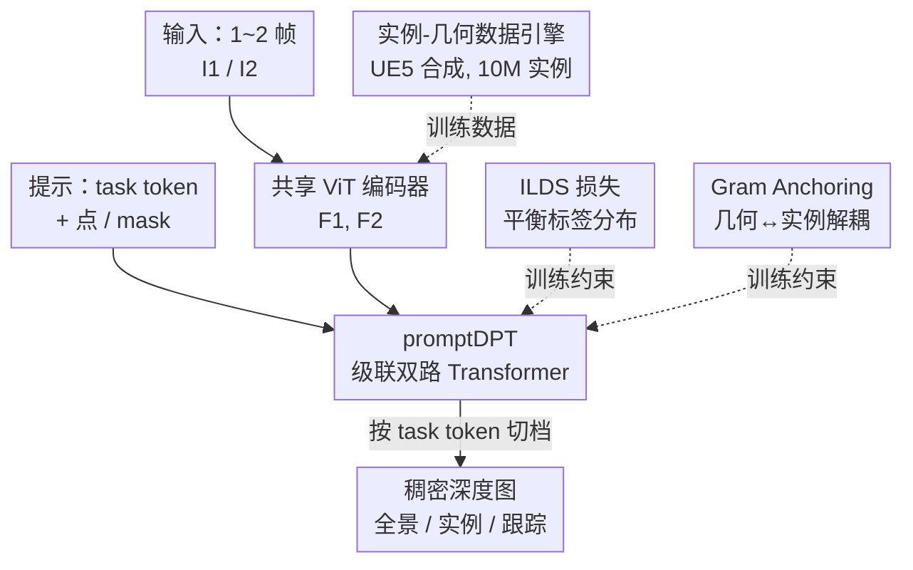

# PromptDepth: Efficient and Promptable Geometric 3D Vision Model for Embodied Intelligence

**会议**: CVPR 2026  
**论文**: [CVF Open Access](https://openaccess.thecvf.com/content/CVPR2026/html/Wang_PromptDepth_Efficient_and_Promptable_Geometric_3D_Vision_Model_for_Embodied_CVPR_2026_paper.html)  
**代码**: https://promptdepth.github.io （项目页，承诺开源）  
**领域**: 3D视觉  
**关键词**: 几何3D感知, 深度估计, 可提示模型, 具身智能, 实例感知

## 一句话总结
PromptDepth 把"场景全景深度、实例深度、跟踪深度、立体深度"统一成一个**可提示**的稠密预测任务——一张前馈网络只学几何表示，靠不同的 task token / 点 / mask 提示就能切换输出，配合 ILDS 损失和 Gram Anchoring 解决全景与实例深度的训练冲突，仅用合成数据训练就在多个深度/分割/跟踪基准上达到 SOTA 且推理快一倍以上，专为具身智能体的实时 3D 理解设计。

## 研究背景与动机

**领域现状**：具身智能体（机器人抓取、导航）需要在算力受限的平台上实时理解 3D 场景并与物体交互。一次 "Go-to-Grasp-and-Place" 就要串起建图、定位、实例识别、目标跟踪等一连串视觉任务，且都得在可容忍的延迟内完成。现有几何 3D 模型（DUSt3R、VGGT、MapAnything、Depth Anything 等）在深度估计、稠密点云重建、3D 点跟踪上性能很强。

**现有痛点**：这些模型对具身场景"不实用"，体现在两点。其一是**效率**：很多 SOTA 需要聚合一长串序列帧才能做一次前向（适合离线而非在线），而且为多任务挂了一堆冗余的预测头，每个头各算一遍，与实时系统"最小预测"的诉求正好相反。其二是**缺实例交互**：大量基础模型只懂几何、不懂实例，而实例恰恰是具身系统里真正"可操作"的对象。把 3D 模型和 SAM 这类可提示分割模型简单拼成"专家混合"，又会引入显著延迟，把效率毁掉；diffusion / 高斯泼溅类的实例感知 3D 建图，无论是迭代过程还是隐式投影，都不 run-time 友好。

**核心矛盾**：几何表示和实例表示之间存在本质冲突。几何表示要保留纹理、保留同一物体内部几何上相距很远的部位之间的细粒度对应；而强实例表示要求同一物体的特征彼此相似，这会把几何上本不该靠近的特征硬拉到一起，破坏几何对应、导致全景深度退化。多个预测头还存在功能重叠——点图(point map)和深度图(depth map)装的都是几何信息，重复算就是浪费。

**本文目标**：做一个**既高效又灵活**、同时具备几何 3D 理解和实例级交互的统一视觉模型，能根据提示快速吐出场景/实例/跟踪等各种稠密深度图。

**核心 idea**：遵循"最小预测(minimal prediction)"原则——网络只负责学一种几何表示，把"具体要预测什么"留给**提示**来激活。用一个可提示稠密预测 Transformer (promptDPT) 取代冗余多头解码器；再用 ILDS 损失 + Gram Anchoring 化解全景与实例深度在标签分布与隐空间上的双重冲突；缺真实"几何-实例"配对数据就自建合成数据引擎。

## 方法详解

### 整体框架
PromptDepth 是一个前馈网络，输入至多两张对应图像 $I_1, I_2 \in \mathbb{R}^{w\times h\times 3}$（只给 $I_1$ 时退化为单目，给两帧则做立体），输出与深度相关的稠密图 $d_1, d_2 \in \mathbb{R}^{w\times h}$。整条管线是：一个**参数完全共享的对称视觉编码器**（DINO 主干）把图像编成视觉特征 $F_1, F_2$；一个**提示编码器**（沿用 SAM 的 prompt encoder）把点 $p_i$、mask $m_j$ 等视觉线索编成稀疏表示 $F_p$ 和稠密表示 $F_m$；核心的 **promptDPT 解码器**用级联双路 Transformer 把图像特征和 `[task token, 提示]` 联合处理，最后以稀疏嵌入与稠密嵌入做点积输出深度图。训练侧再用 **ILDS 损失**平衡标签分布、**Gram Anchoring** 约束几何与实例表示别打架。数据侧用合成**实例-几何数据引擎**喂养。

关键在于：同一套权重、同一个解码头，靠送进去的 task token（单目/立体/实例/跟踪）和点/mask 提示来"切档"，从而无额外计算开销地完成全景深度、实例深度、跟踪深度等不同任务。

### 关键设计

**1. promptDPT：用"最小预测 + 可提示"取代冗余多头解码器**

针对"多预测头功能重叠、每个任务各算一遍"的低效痛点，作者主张网络只学**一种几何表示**，把具体预测什么留给提示来激活。具体做法是引入一组可学习的 **task token** $F_t$，分别代表四种任务：单目、立体、实例查询、跟踪。解码器是一个**级联双路 Transformer**：先一个"稠密双路块"负责立体视图间的隐式几何对齐与 mask 跟踪，把 $F_1,F_2$ 通过交叉注意力联合推理成对齐特征 $\hat F_1, \hat F_2$（单目时直接令 $F_2=F_1$，稠密双路块自然退化为自注意力）；再一个"稀疏双路块"管点/任务这类稀疏交互。整体写成 $(F'_t, F'_p),(F'_1,F'_2)=\text{PromptDPT}([F_t,F_p],(F_1,F_2))$。最终输出**不用 DPT 那种从头训练的卷积头**，而是把任务稀疏嵌入 $F'_t$ 和稠密嵌入 $(F'_1,F'_2)$ 做**点积**得到 $\hat d$。这样切任务只是换 token，不增计算。

值得一提的是两种提示注入方式：给 mask 时，稠密块通过 Hadamard 积融合 $F_1$ 与 $F_m$ 实现物体跟踪，并把 $F_t$ 指向"跟踪 token"；给点时，把 $F_p$ 与实例 token 拼成 $[F_t,F_p]$ 前馈构建 $F'_1$，但最终输出只用 $F_t$。所有输出都被统一表达成"深度图"形态。

**2. ILDS 损失：给单张深度图自适应加权，压平实例深度的零值偏置**

全景深度和实例深度放进一个统一头训练，会被严重的**标签分布失衡**坑到——实例深度图里背景是大片零值，主导了本就不均衡的稠密预测。分割里常用的 Dice 损失能缓解前景-背景失衡，但对稠密回归"根本不成立"。作者从常用的尺度-平移不变损失 $L_{ssi}(d,\hat d)=\frac{1}{h*w}\sum_{i,j}|d^*-\hat d^*|$ 出发（$d^*,\hat d^*$ 是按中位数和尺度归一化后的 GT 和预测），引入"标签分布平滑"。

不同于在整个数据集上统计频率，ILDS 在**单张深度图内**统计值的频率来做平衡：对单图定义平滑密度 $\tilde f_D(d_g)=\int_{d^*_m} k(d^*_m,d_g)p(d^*_m)\,d^*_m$，其中 $k$ 是对称核（高斯/拉普拉斯）；为应对训练早期大量假阳性，用 $d^*_m=\max(d^*,\hat d^*)$ 代替 $d^*$。每个 $d^*_m$ 由其最近的密度中心 $d_g$ 得到自适应权重 $w(d^*_m)=1/\tilde f_{norm}(\arg\min_{d_g}|d^*_m-d_g|)$。最终损失把权重乘进 ssi：

$$L_{ilds}=\frac{1}{h*w}\sum_{i,j} w(d^*_m)\,|d^*-\hat d^*|.$$

直观上，稀疏的实例图里高密度前景像素被抬权、背景零值被抑制，使实例深度与全景深度在 logit 空间同步（同一物体两次推理别给出两个深度），从而稳住这个复杂多任务目标的训练。

**3. Gram Anchoring：在隐空间约束"只对齐 patch 相似度"，让几何与实例表示不互相摧毁**

ILDS 解决了标签分布层面的冲突，但隐空间里还有第二重冲突：联合训练几何与实例表示时，几何表示保纹理，而高层语义会破坏这些细节，导致表示坍塌。作者借鉴 DINOv3 那类"图像级损失 vs patch 级特征学习冲突"的处理思路，用 Gram Anchoring 做几何-实例级正则。

实现上走**课程学习**：先只用全景深度监督，单独训出几何表示 $X_G$；进入实例相关训练阶段后，把中间视觉编码器特征 $X_S$ 向 $X_G$ 对齐以维持几何表示。关键是**只约束 patch 之间的相似度（Gram 矩阵），而不锁死特征本身**，允许特征自由移动：$L_{gram}=|X_G^T X_G - X_S^T X_S|$。最终目标 $L_{total}=L_{ilds}+\lambda L_{gram}$，$\lambda=2$。消融显示，去掉 $L_{gram}$ 训练会直接坍塌。

**4. 实例-几何数据引擎：用 UE5 离线渲染补齐真实世界没有的"几何-实例"配对**

真实世界几乎没有对齐良好的几何-实例配对数据（Hypersim/VKITTI 多样性有限，CoCo/BlendedMVS 缺实例-深度对，TartanAir 的语义标签因 AirSim 限制不可用）。作者基于 Unreal Engine 的 Movie Render Queue (MRQ) 搭了一个合成数据引擎：离线渲染高保真照片级图像的同时，同步产出**像素级精确对齐**的实例 mask、深度图、光流、相机位姿等多种 GT pass，还能改相机参数、注入动态行人车辆，并吃 UE5 社区海量素材。最终收集了横跨 100 个不同环境、超过 **1000 万个唯一物体实例**、最高 4K 分辨率的数据集。模型**仅用合成数据训练**，却在真实基准上展现出鲁棒的零样本能力。

### 损失函数 / 训练策略
两阶段课程学习。阶段一是几何学习：只用全景深度图做全监督，学好几何表示。阶段二是交互式微调：开启实例/立体跟踪的可提示预测。对每一对样本，同时打包 8 张实例提示图、8 张立体跟踪图，加上单目与立体全景图，一对数据共 **19 张图**一起喂，省下大量重处理开销并增强表示鲁棒性。优化器 AdamW，初始学习率 5e-5；视觉编码器降到 5e-6 做正则，提示编码器与级联双路 Transformer 用 4e-5 应对复杂交互。输入短边 resize 到 518、无其他增强。训练/推理都在 4×48GB RTX 4090 上进行。

## 实验关键数据

### 主实验

单目相对深度估计（零样本，本文用 ViT-B 对打别人的 ViT-L/ViT-G）：

| 数据集 | 指标 | 本文(ViT-B) | 次优 | 说明 |
|--------|------|------|------|------|
| KITTI | rel ↓ | **0.075** | 0.075 (DAv2 ViT-G) | 持平最佳，但主干小得多 |
| Sintel | rel ↓ | **0.191** | 0.235 (DA-AC) | 大幅领先，OOD 泛化强 |
| NYU | σ1.25 ↑ | **98.0** | 98.0 (VGGT/DAv2) | 持平最佳 |
| ETH3D | σ1.25 ↑ | **98.3** | 97.6 (MapAnything) | SOTA |
| Diode | σ1.25 ↑ | **95.5** | 95.4 (DAv2 ViT-G) | SOTA |

在线立体深度估计（相邻帧对，强迫预测天然对齐）：

| 数据集 | 指标 | 本文(ViT-B) | VDA(ViT-B) | 说明 |
|--------|------|------|------|------|
| KITTI | RMSE ↓ | **3.338** | 3.710 | 全指标超 VDA |
| Sintel | RMSE ↓ | **2.668** | 4.657 | 大幅削减误差 |
| Sintel | δ1 ↑ | **0.756** | 0.732 | 也超 ViT-G 的 VGGT(0.672) |

零样本视频目标跟踪（J&F-Mean）：DAVIS-17 上本文 81.2 / 加合成数据(+MRQ) 83.3；YouTube-VOS 上 75.0 / 76.8，在零样本类别里有竞争力（监督类 SAM2 为 90.7）。

### 消融实验

ILDS 与 Gram Anchoring 的作用（KITTI 深度 + 交互分割 mIoU）：

| 配置 | Abs rel ↓ | δ1 ↑ | mIoU ↑ | 说明 |
|------|-----------|------|--------|------|
| 单任务(Lssi / Ldice) | 0.081 | 0.942 | 67.0 | 各自单独训 |
| 多任务 w/o $L_{gram}$ | 0.091 | 0.924 | 62.4 | 训练坍塌，几何/实例打架 |
| 多任务 w/o $L_{ilds}$ | 0.085 | 0.927 | 66.8 | 标签失衡未解 |
| Full | **0.075** | **0.945** | **67.1** | 超过单任务，互相促进 |

延迟对比（RTX 4090, float32）：单目本文 39.09ms vs SAM+DAv2 的 95.53ms（快 ~2.4×）；立体本文 44.92ms vs SAM2+VDA 的 188.46ms（快 ~4×）。在机器人抓取数据集 GraspNet 上，点提示交互分割本文 J&F 0.8424 远超同尺寸 SAM 的 0.6483；接入 GraspNet 做真实抓取时本文约 26 FPS，而 VGGT+SAM <10 FPS。

### 关键发现
- **去掉 Gram Anchoring 直接坍塌**：多任务里 $L_{gram}$ 是防止几何/实例表示互相摧毁的关键，去掉后深度和分割同时掉点（mIoU 67.1→62.4，Abs rel 0.075→0.091），它比 ILDS 更"保命"。
- **小主干打赢大主干**：ViT-B 在多数深度基准上压过 ViT-L/ViT-G 的 VGGT、MapAnything、DAv2，说明收益来自统一表示 + 高质量合成数据，而非堆参数。
- **统一模型反超组合专家**：在 GraspNet 上本文交互分割竟超过同尺寸 SAM，作者归因于数据引擎收集的大规模实例级数据更聚焦"整体实例"。
- **合成数据训练带来真实零样本泛化**：仅合成数据训练即在真实基准 SOTA，且 +MRQ 高保真渲染数据进一步提升跟踪。

## 亮点与洞察
- **"最小预测 + 可提示"是真正的效率杠杆**：把多任务从"多个预测头"重构为"一个几何表示 + 提示切档"，切任务零额外计算，这是它能比"3D 模型 + SAM"组合快 2~4 倍的根本原因，思路可迁移到任何被多头拖累的稠密预测系统。
- **单图内统计的标签平滑很巧**：ILDS 不在全数据集统计频率而在单张深度图内统计，并用 $\max(d^*,\hat d^*)$ 抗早期假阳性，专治实例深度"大片背景零值"的失衡，是把分布平滑思想搬到稠密回归的漂亮一招。
- **Gram 矩阵"只约束相似度不锁特征"**：用 $|X_G^TX_G - X_S^TX_S|$ 保 patch 相似关系、放特征自由移动，恰好化解"几何要细节 / 实例要相似"的冲突，是表示对齐里值得复用的正则形式。
- **合成数据引擎把"数据缺口"变成可控资产**：UE5+MRQ 同步产出像素级对齐的多 GT pass，绕开真实世界几何-实例配对稀缺，且分辨率/动态对象可调，复现门槛低。

## 局限与展望
- 作者承认：为实时推理**牺牲了长期记忆**，在关键点跟踪和用于 3D 重建的稠密特征匹配上仍有挑战。
- 仅用合成数据训练，虽展现零样本能力，但 ⚠️ 合成-真实域差仍可能在更复杂的真实光照/材质下暴露，论文主要在公开基准评测，对长时序具身闭环任务的鲁棒性论证有限。
- 跟踪只有"短时"能力（无长期记忆），对遮挡后重识别、长视频跨帧关联这类场景或较弱；可考虑引入轻量记忆模块在不毁实时性的前提下补长程关联。
- 实例提示当前以点/mask 为主，是否能扩到文本/语言提示与具身指令直接耦合，是个自然的延伸方向。

## 相关工作与启发
- **vs 多视图立体(MVS, 如 VGGT/MapAnything)**：它们靠聚合多视图、离线计算稠密几何，延迟高、不适合动态低延迟环境；本文只用相邻两帧、优先保证立体精度，换来实时能力，且 ViT-B 反超它们的大主干。
- **vs "3D 模型 + SAM"专家混合**：组合方案虽能拿到几何+实例，但天然引入大延迟（本文实测快 2~4 倍）；PromptDepth 用单一可提示头把两者融成一次前馈。
- **vs 实例感知深度估计（生成式/判别式）**：判别式前馈更适合实时，但简单多任务学习难挖掘任务互促；本文用 ILDS+Gram 显式化解几何与实例的标签/隐空间冲突，证明"互相促进"可达成。
- **vs DUSt3R / DPT**：架构受 DUSt3R 启发，但去掉 DPT 从头训的卷积头、改用稀疏×稠密点积输出，并把"任务"参数化为 token，实现无额外开销的任务切换。

## 评分
- 新颖性: ⭐⭐⭐⭐⭐ "最小预测+可提示"重构稠密 3D 感知，ILDS 与 Gram Anchoring 针对性化解几何-实例冲突，切入角度新。
- 实验充分度: ⭐⭐⭐⭐ 覆盖单目/立体深度、跟踪、交互分割、延迟与真实抓取，消融清晰；但多为公开基准，长时序具身闭环验证较少。
- 写作质量: ⭐⭐⭐ 思路清楚、图示丰富，但行文有不少语法/拼写瑕疵，部分公式表述需对照原文确认。
- 价值: ⭐⭐⭐⭐⭐ 为具身智能提供一个高效灵活的统一几何 3D 基座，数据引擎与可提示范式都很可复用。

<!-- RELATED:START -->

## 相关论文

- [\[CVPR 2026\] GeoCodeBench: Benchmarking PhD-Level Coding in 3D Geometric Computer Vision](benchmarking_phd-level_coding_in_3d_geometric_computer_vision.md)
- [\[CVPR 2026\] Landscape-Awareness for Geometric View Diffusion Model](landscape-awareness_for_geometric_view_diffusion_model.md)
- [\[CVPR 2026\] SAGE: Scalable Agentic 3D Scene Generation for Embodied AI](sage_scalable_agentic_3d_scene_generation_for_embodied_ai.md)
- [\[CVPR 2026\] Pano360: Perspective to Panoramic Vision with Geometric Consistency](pano360_perspective_to_panoramic_vision_with_geometric_consistency.md)
- [\[CVPR 2026\] Zero-Shot Depth Completion with Vision-Language Model](zero-shot_depth_completion_with_vision-language_model.md)

<!-- RELATED:END -->
