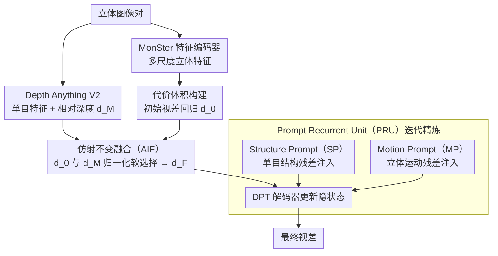

# PromptStereo: Zero-Shot Stereo Matching via Structure and Motion Prompts

**会议**: CVPR 2026  
**arXiv**: [2603.01650](https://arxiv.org/abs/2603.01650)  
**代码**: [GitHub](https://github.com/Windsrain/PromptStereo)  
**领域**: 3D视觉  
**关键词**: 零样本立体匹配, 单目深度先验, Prompt迭代精炼, DPT解码器, 仿射不变融合

## 一句话总结
提出 Prompt Recurrent Unit (PRU)，将单目深度基础模型的 DPT 解码器作为迭代精炼模块（替代 GRU），通过 Structure Prompt 和 Motion Prompt 将单目结构和立体运动线索以残差方式注入，在不破坏单目先验的情况下实现零样本 SOTA 立体匹配（Middlebury 2021 上误差降低近50%）。

## 研究背景与动机
**领域现状**：零样本立体匹配近年受到越来越多关注。得益于 Depth Anything V2 等单目深度基础模型的强泛化能力，最新方法通过适配预训练特征来提升泛化性能。

**现有痛点**：
   - 现有方法（MonSter、DEFOM-Stereo、BridgeDepth）主要利用单目模型提取鲁棒特征构建代价体积和初始化视差，但**迭代精炼阶段**仍依赖传统 GRU，这一阶段对零样本泛化同样至关重要却被忽视
   - GRU 的三个根本局限：(a) 独立于视觉基础模型训练，无法继承强先验；(b) 隐状态被限制在窄范围内（tanh/sigmoid），难以处理极端视差变化；(c) 通过直接卷积融合输入和隐状态，既扭曲原始状态信息又压缩外部输入

**核心矛盾**：如何让迭代精炼模块也能继承单目深度基础模型的强先验，同时有效融合立体匹配特有的运动线索

**切入角度**：注意到 DPT 解码器也是多尺度的精炼结构，与 GRU 的粗到细更新有结构相似性。可以直接用预训练的 DPT 解码器作为迭代单元

**核心 idea**：用预训练 DPT 解码器替代 GRU 作为迭代精炼单元，通过 prompt（残差加法）注入立体匹配特有的结构和运动线索，不修改解码器架构即可继承单目先验

## 方法详解

### 整体框架
以 MonSter 为基线。输入立体图像对 → Depth Anything V2 提取单目特征+相对深度 → MonSter 特征编码器提取多尺度立体特征 → 代价体积构建+初始视差回归 → 仿射不变融合（AIF）把初始视差和单目深度拼成可靠起点 → PRU 迭代精炼（每步由 Structure Prompt 与 Motion Prompt 以残差方式注入结构与运动线索）→ 输出最终视差。

### 关键设计

**1. 仿射不变融合（Affine-Invariant Fusion, AIF）：把局部精准但全局漂移的初始视差，和全局正确但有尺度歧义的单目深度拼成一个靠谱的起点**

迭代精炼好不好，很大程度取决于喂进去的初始视差质量。代价体积回归出的初始视差 $\mathbf{d}_0$ 局部匹配精度高，却缺乏全局一致性；Depth Anything V2 给出的单目相对深度 $\mathbf{d}_M$ 反过来——全局结构对、但有未知的仿射变换（尺度和平移都不定）。AIF 先把两者放到同一个尺度下再融合：对每个深度做仿射不变归一化 $\hat{\mathbf{d}} = (\mathbf{d} - t(\mathbf{d})) / s(\mathbf{d})$，其中 $t$ 取中位数、$s$ 取中位绝对偏差（MAD）——用稳健统计量而非均值方差，是为了抗离群点。归一化后把单目深度投影回视差空间 $\mathbf{d}_M' = s(\mathbf{d}_0) \cdot \hat{\mathbf{d}}_M + t(\mathbf{d}_0)$，消掉了它的仿射歧义。最后用 $\mathbf{d}_0$ warp 右特征、与左特征拼接预测出一张逐像素置信图 $\mathbf{c}$，按置信度软选择 $\mathbf{d}_F = \mathbf{c} \odot \mathbf{d}_0 + (1-\mathbf{c}) \odot \mathbf{d}_M'$：哪里匹配可信就听代价体积的，哪里匹配失效（弱纹理、遮挡）就让单目结构兜底。

**2. Prompt Recurrent Unit (PRU)：把单目模型的 DPT 解码器直接搬来当迭代单元，让精炼阶段也继承基础模型的强先验**

这是全文最关键的一步。现有方法只在特征提取和初始化时用单目基础模型，迭代精炼仍交给传统 GRU，而 GRU 有三个硬伤：它独立于视觉基础模型训练、继承不到任何先验；隐状态被 tanh/sigmoid 压在窄区间里，遇到近距离物体的极端视差就表达不动；它还用一次卷积把输入和隐状态硬融，既扭曲原状态又压缩外部输入。作者注意到 DPT 解码器本身就是多尺度、由粗到细的精炼结构，和多级 GRU 的更新方式高度同构，于是干脆用 Depth Anything V2 的 4 级 DPT 精炼层替换 GRU，并用其预训练权重初始化——不改架构就把单目先验搬进了迭代环节。隐状态也换了初始化方式：用 $\mathbf{d}_0$ warp 右特征后与左特征拼接，比 GRU 只用左特征更早建立起立体对应。更新规则上去掉了 reset gate，只留 update gate $\mathbf{z}_k = \sigma(\text{ConvBlock}([\cdot]))$，按 $\mathbf{h}_{k+1}^i = (1-\mathbf{z}_k) \odot \mathbf{h}_k^i + \mathbf{z}_k \odot \hat{\mathbf{h}}_k^i$ 更新，且不再对隐状态做值域钳制，这样极端视差场景下表达空间才够用。

**3. Structure Prompt (SP)：用残差加法而非卷积，把单目结构线索“轻轻”注入 PRU，注入信息又不毁掉已有先验**

PRU 继承了 DPT 的单目先验，可一旦在精炼过程中再用传统的卷积融合把新信息塞进去，就会把这份好不容易继承来的表示给扭乱——这正是 GRU 的第三个毛病。SP 改成 prompt 式注入：先算当前视差与单目深度在归一化尺度下的差异 $\mathbf{D} = |\hat{\mathbf{d}}_k - \hat{\mathbf{d}}_M|$（指出哪里偏离了单目结构），把它和冻结的单目特征 $\mathbf{F}_M$ 一起编码成结构 prompt $\mathbf{P}_S$，再以残差加法写回隐状态 $\mathbf{h} = \mathbf{h} + \text{ConvBlock}(\mathbf{P}_S)$。残差加法只是在原表示上叠一个引导信号，不会像卷积那样重写整个隐状态，所以单目先验得以保全，结构信息又被引入。

**4. Motion Prompt (MP)：DPT 解码器只懂单目、不懂立体，再用同样的残差方式补上立体匹配特有的运动线索**

光有单目结构还不够——立体匹配真正的信号来自左右图的对应关系，而 DPT 解码器天生没有这部分信息。MP 把当前局部代价体积 $\mathbf{V}_k$ 和当前视差 $\mathbf{d}_k$ 编码成运动 prompt $\mathbf{P}_M^k = \text{Encoder}(\mathbf{V}_k, \mathbf{d}_k)$，沿用和 SP 一致的残差注入 $\mathbf{h} = \mathbf{h} + \text{ConvBlock}(\mathbf{P}_M^k)$。这样 SP 负责“结构对不对”、MP 负责“匹配准不准”，两路 prompt 各补一块短板，又都不破坏 PRU 的预训练表示。

### 损失函数 / 训练策略
- 跟随 IGEV-Stereo：$\mathcal{L} = \|\mathbf{d}_0 - \mathbf{d}_{gt}\|_{\text{smooth}} + \sum_{k=1}^K \gamma^{K-k} \|\mathbf{d}_k - \mathbf{d}_{gt}\|_1$，$\gamma = 0.9$
- 训练16次迭代，推理32次
- 冻结 DINOv2 编码器+单目特征分支，保持单目先验不被破坏
- 4×RTX 4090，AdamW，one-cycle LR 2e-4

## 实验关键数据

### 主实验——零样本泛化基础基准（SceneFlow 训练）

| 方法 | KITTI12 EPE↓ | KITTI15 Bad3↓ | Midd-T Bad2↓ | Midd-2021 Bad2↓ | ETH3D Bad1↓ |
|------|-------------|-------------|-------------|----------------|------------|
| RAFT-Stereo | 0.90 | 5.68 | 11.07 | 11.11 | 2.61 |
| IGEV-Stereo | 1.03 | 6.03 | 9.95 | 10.00 | 4.05 |
| MonSter | 0.93 | 5.52 | 8.97 | 15.55 | 3.20 |
| BridgeDepth | 0.83 | 4.69 | 7.84 | 15.92 | 1.26 |
| DEFOM-Stereo | 0.83 | 4.99 | 6.77 | 8.62 | 2.40 |
| **PromptStereo** | **0.79** | **4.59** | **6.03** | **8.26** | **1.56** |

### 主实验——无限训练集

| 方法 | Midd-T Bad2↓ | Midd-2021 Bad2↓ | ETH3D Bad1↓ |
|------|-------------|----------------|------------|
| FoundationStereo† | 3.11 | 7.14 | 0.67 |
| MonSter | 5.51 | 12.43 | 1.25 |
| BridgeDepth | 3.36 | 13.66 | 1.22 |
| **PromptStereo** | **3.90** | **5.97** | **0.97** |

### 关键发现
- 相比基线 MonSter，PromptStereo 在 Middlebury 2021 上误差降低近 50%（15.55→8.26，SceneFlow设定；12.43→5.97，无限设定），这是最具挑战的数据集（手机拍摄、不完美矫正）
- 在 SceneFlow 训练设定下几乎所有指标排名第一，在无限训练设定下 Midd-2021 和 ETH3D 上超越了 FoundationStereo（后者需要显著更多的计算资源训练不可公平比较）
- PRU 继承了 DPT 预训练权重，提供了 GRU 无法获得的视觉理解能力和表示容量
- Prompt（残差加法）方式注入信息不破坏预训练先验，优于直接卷积融合

## 亮点与洞察
- **用解码器当循环单元的思路非常巧妙**：DPT 解码器和多级 GRU 在结构上都是多分辨率精炼，这个类比使得替换成为自然设计。预训练权重赋予了 PRU 视觉 foundation model 的表征能力
- **Prompt 式信息注入**：残差加法 $\mathbf{h} = \mathbf{h} + \text{ConvBlock}(\mathbf{P})$ 比直接卷积融合更温和，不会扭曲已有表示。Structure Prompt 中仿射不变差异的使用避免了尺度歧义
- **去掉 reset gate 并放开隐状态范围**：简化了 GRU 结构同时提供了更灵活的表示空间，这在极端视差场景（近距离物体）下尤其重要
- **AIF 的仿射不变归一化**：用 median + MAD 做归一化是鲁棒统计的经典做法，应用于视差-深度融合非常自然

## 局限与展望
- PRU 使用 DPT 解码器，推理速度是否与 GRU 可比？论文称"comparable or faster"但未给出详细的逐模块时间对比
- Booster 数据集（反射/透明表面）上仅用 SceneFlow 训练时效果有限，说明 PRU 的泛化能力仍受训练数据覆盖度限制
- 仅冻结了 DINOv2 编码器和单目分支，DPT 解码器本身被微调——如果训练数据有偏差可能破坏预训练先验
- 结构和运动 prompt 仅在最高分辨率层注入，其他层是否也能从 prompt 中受益未探索

## 相关工作与启发
- **vs MonSter**：MonSter 用 Depth Anything V2 做特征提取和初始化，但迭代精炼仍用 GRU。PromptStereo 将单目先验扩展到迭代精炼阶段，在 Midd-2021 上误差减半
- **vs BridgeDepth**：BridgeDepth 也用单目先验引导 GRU 迭代，但受限于 GRU 的表达能力。PRU 直接用 DPT 解码器替代 GRU，容量和先验都更强
- **vs FoundationStereo**：FoundationStereo 依赖大规模数据集和大模型训练（不可公平比较），PromptStereo 在可比设置下达到同等甚至更好的泛化性能

## 评分
- 新颖性: ⭐⭐⭐⭐⭐ 用预训练DPT解码器替代GRU是一个具有范式意义的设计，prompt注入方式优雅
- 实验充分度: ⭐⭐⭐⭐⭐ 5+数据集、多训练设定、消融充分、代码开源
- 写作质量: ⭐⭐⭐⭐ 问题分析深入，GRU局限性的三点总结很精准
- 价值: ⭐⭐⭐⭐⭐ 指明了零样本立体匹配中迭代精炼的新方向，成果显著

<!-- RELATED:START -->

## 相关论文

- [\[CVPR 2026\] Lite Any Stereo: Efficient Zero-Shot Stereo Matching](lite_any_stereo_efficient_zero-shot_stereo_matching.md)
- [\[CVPR 2025\] FoundationStereo: Zero-Shot Stereo Matching](../../CVPR2025/3d_vision/foundationstereo_zero-shot_stereo_matching.md)
- [\[CVPR 2026\] Fast-FoundationStereo: Real-Time Zero-Shot Stereo Matching](fast-foundationstereo_real-time_zero-shot_stereo_matching.md)
- [\[CVPR 2026\] What Makes Good Synthetic Training Data for Zero-Shot Stereo Matching?](what_makes_good_synthetic_training_data_for_zero-shot_stereo_matching.md)
- [\[CVPR 2026\] PIP-Stereo: Progressive Iterations Pruner for Iterative Optimization based Stereo Matching](pip-stereo_progressive_iterations_pruner_for_iterative_optimization_based_stereo.md)

<!-- RELATED:END -->
