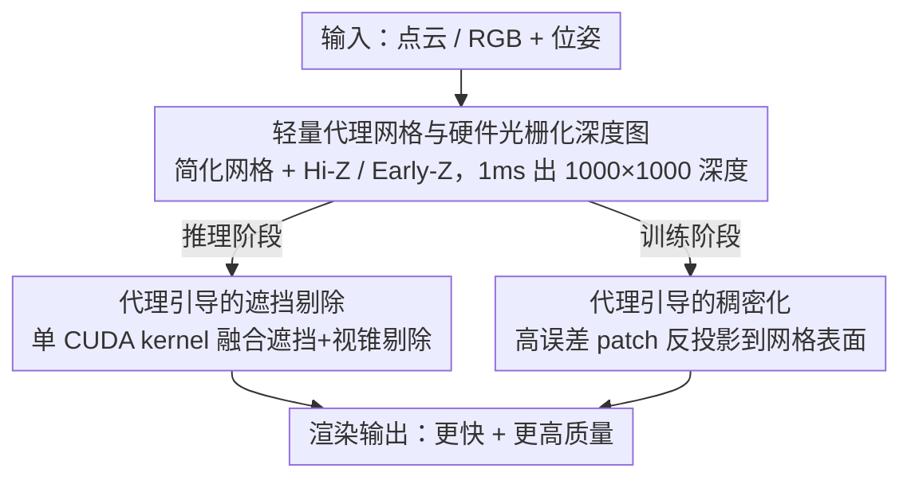

# Proxy-GS: Unified Occlusion Priors for Training and Inference in Structured 3D Gaussian Splatting

**会议**: CVPR 2026  
**论文**: [CVF Open Access](https://openaccess.thecvf.com/content/CVPR2026/html/Gao_Proxy-GS_Unified_Occlusion_Priors_for_Training_and_Inference_in_Structured_CVPR_2026_paper.html)  
**代码**: 待确认  
**领域**: 3D视觉  
**关键词**: 高斯泼溅, 遮挡剔除, 代理网格, 层次细节, 大场景渲染

## 一句话总结
Proxy-GS 用一张「轻量代理网格 + 硬件光栅化」在 1 ms 内产出的遮挡深度图，既在推理时剔除被遮挡的锚点/高斯加速渲染、又在训练时把锚点稠密化引导到可见表面上，从而在重遮挡的大规模城市场景里相比 Octree-GS 取得 3× 以上的 FPS 提升且渲染质量不降反升。

## 研究背景与动机
**领域现状**：3D Gaussian Splatting（3DGS）以显式高斯基元实现实时照片级渲染，后续 Scaffold-GS、Octree-GS 等结构化 MLP 变体进一步用「锚点 + MLP 解码器」按视角动态生成高斯属性，大幅提升了细节与视角相关效果的表达能力，并用八叉树支持层次细节（LOD）来缩减远景锚点数量。

**现有痛点**：MLP 解码在每帧推理时带来额外开销，场景越大、基元越多，这个解码 + 光栅化的代价越突出。已有的剪枝（pruning）会牺牲质量，LOD 只按相机距离裁远景，但**对遮挡完全无感**——真实城市街道、多房间室内场景充满遮挡，大量锚点落在被墙体/建筑挡住的区域，它们既不贡献最终画面，又白白增加解码负担。

**核心矛盾**：作者可视化发现，参与解码的锚点和「直觉上真正需要渲染的锚点」之间存在严重错配——很大比例锚点对应重遮挡区域。换言之，现有结构化高斯的锚点选择只优化去拟合 RGB 图像，从不显式建模「谁挡住了谁」，于是冗余解码与空间上不一致的锚点-高斯绑定同时存在。

**本文目标**：用一种**统一**的遮挡先验，同时解决两件事——推理时剔除被遮挡的锚点/高斯以提速，训练时避免在被遮挡区域生长出无效锚点以提质。

**切入角度**：作者观察到消费级 GPU 自带专用硬件光栅化单元（ROP/深度测试），如果有一张粗糙的「代理网格」，就能用近乎免费的硬件 depth-only pass 拿到一张保守的 Z-buffer，作为逐像素的可见性先验。

**核心 idea**：构造一张轻量代理网格，用硬件光栅化在 1 ms 内渲染出 1000×1000 的遮挡深度图，并让这同一张深度图同时服务于「推理剔除」和「训练稠密化」两个环节。

## 方法详解

### 整体框架
Proxy-GS 建立在 MLP-based Octree-GS 之上，输入是大场景的点云/RGB+位姿，输出是更快且质量更高的新视角渲染。整条管线围绕一个「代理系统」展开：先离线构造一张粗糙的代理网格，渲染每帧时用硬件光栅化把它快速烧成一张遮挡深度图（<1 ms）；这张深度图随后被一图两用——**推理阶段**喂给 CUDA kernel 做遮挡剔除，把挡在物体后面的锚点直接丢掉再送进 MLP 解码；**训练阶段**则用它指导锚点稠密化，把新锚点反投影生长到代理网格表面上，避免在遮挡区域里长出永远不会被解码的废锚点。

### 关键设计

**1. 轻量代理网格与硬件光栅化深度图：让遮挡查询近乎免费**

整套方法的前提，是要在不引入明显时间代价的前提下拿到「从任意视角看谁被谁挡」的关系。作者的做法是构造一张**粗糙代理网格**：户外大场景直接用已有/COLMAP 生成的稠密点云转网格，室内纹理缺失导致 SfM 失败时则借助大重建模型 MapAnything（输入 COLMAP 位姿 + RGB）得到稠密点云再转网格，最后做表面简化只保留粗几何结构。这张代理足够喂饱硬件固定功能单元做高速 depth-only 渲染。为了进一步加速，网格被切成细粒度簇，配合层次 Z-buffer（Hi-Z）剔除快速丢掉不可见簇，fragment 阶段开启 Early-Z 并把 fragment shader 精简到只写深度。整套流水线能在复杂城市场景里把获取 $1000^2$ 分辨率深度图的时间压到 **1 ms 以内**，且深度图全程留在 GPU 上、直接被后续 CUDA 剔除消费，避免 GPU-CPU-GPU 往返开销。

**2. 代理引导的遮挡剔除：把遮挡剔除和视锥剔除融进同一个 CUDA kernel**

有了深度图，推理时就能把遮挡剔除和原有的视锥剔除合并到单个 CUDA kernel 里。对每个锚点/点，先把它的 NDC 坐标 $(x_{ndc}, y_{ndc}, z_{ndc})$ 做有效性检查：相机后方或贴近近裁剪面的点（$z_h \le \tau,\ \tau=10^{-4}$）直接判为无效；再映射到离散像素索引 $(u,v)$，落在图像边界外的丢弃。对有效像素，从深度图取硬件深度 $z_{hw}\in[0,1]$ 并用近/远平面换算成线性相机空间深度 $d_{mesh}$，加一个小安全余量 $\gamma$ 得到 $\hat d$。最终的剔除判据是一个深度测试：

$$\text{Cull}(p) = \begin{cases} \text{true}, & z_h > \hat d(x_{pix}, y_{pix}) \\ \text{false}, & z_h \le \hat d(x_{pix}, y_{pix}) \end{cases}$$

即「相机空间深度落在对应像素深度图之后」的点被剔除——这就在图像平面上完成了逐像素遮挡剔除。天空等深度无效区域则保守地不剔除。相比 OccluGaussian 那种按簇划分场景再粗粒度推理遮挡的做法，这里是**逐像素**过滤，更贴合实际渲染代价、也保住了细节。

**3. 代理引导的稠密化：把新锚点生长引到可见表面上**

只在推理时剔除还不够——如果训练时锚点仍按原始「大梯度处生长」策略繁殖，会在代理网格深度之后（即被遮挡处）长出一堆因遮挡而永远不解码的废锚点，造成锚点-高斯绑定的空间不一致。作者因此把代理先验**再用一次**于训练：受 Mvg-splatting 多视深度稠密化启发，显式把锚点投影到代理网格表面。由于代理深度图是预计算的，可按 patch 度量逐块 L1 误差，挑出渲染误差异常大的区域。具体地，先算每个 patch 的平均像素损失 $\ell_P$ 和整帧均值 $\bar\ell$，选出满足 $\ell_P > \tau,\ \tau = 3\bar\ell$ 的高误差 patch；对每个选中 patch 取其中心像素，读硬件深度并换算 $d_{mesh}$，把该像素反投影回 3D 作为新锚点位置 $\hat p_P$。为防止 3D 空间冗余，维护一个 cell 尺寸为 $h$ 的代理网格，每个 cell 最多允许 $K$ 个锚点（用计数 $\kappa[\cdot]$ 控制插入）。这样新锚点既长在真正需要、且可见的高误差表面上，又不会扎堆。

### 损失函数 / 训练策略
方法整体复用 Octree-GS 的默认初始化与 LOD 策略，训练 40k 迭代；为公平对比把各 baseline 的稠密化阈值统一降到 $10^{-4}$ 以逼近 Octree-GS 的画质。训练在单张 A100-40GB 上完成，推理则故意切到消费级 RTX 4090 以贴近真实部署场景。

## 实验关键数据

### 主实验
在重遮挡的大规模城市数据集 MatrixCity（把 8477 张街景图分成 5 个 block）上，Proxy-GS 在画质和速度上同时碾压基线。以遮挡最重的 Block 5 为例：

| 数据集 (Block 5) | 方法 | PSNR↑ | SSIM↑ | LPIPS↓ | FPS↑ |
|--------|------|------|------|------|------|
| MatrixCity | 3DGS | 20.70 | 0.697 | 0.425 | 121 |
| MatrixCity | Octree-GS | 21.41 | 0.731 | 0.375 | 48 |
| MatrixCity | **Proxy-GS** | **21.68** | **0.744** | **0.362** | **151** |

相比 MLP-based 的 Octree-GS，PSNR 提升 0.27、FPS 从 48 飙到 151（约 3.1×）。在真实世界数据上同样成立——遮挡较重的 Small City 街景里相对 Octree-GS 提速 2.73×（FPS 51→139）且 PSNR 略升（23.03→23.09）；而在遮挡轻微的 Berlin、CUHK-LOWER 航拍场景里，Proxy-GS 几乎不引入额外开销（FPS 甚至略高于 Octree-GS），验证了「有遮挡才发力、没遮挡不拖累」。

### 消融实验
在 Block 5 上拆解训练/推理策略（Average anchor = 场景平均解码锚点数）：

| ID | 配置 | PSNR↑ | FPS↑ | Avg anchor | 说明 |
|------|------|------|------|------|------|
| 1 | Octree-GS 基线 | 21.41 | 48 | 719k | 无任何代理 |
| 2 | 仅测试时代理剔除 | 19.06 | 165 | 82k | 提速 3× 但训练-推理不一致致画质暴跌 |
| 3 | + 训练时也用代理渲染 | 21.50 | 147 | 93k | 一致性恢复，质量超基线 |
| 4 | + 代理引导稠密化（Full） | **21.68** | 143 | 106k | 质量再升，FPS 与 ID 3 相当 |

### 关键发现
- **训练-推理一致性是关键**：只在测试时套遮挡剔除（ID 2）虽然把锚点从 719k 砍到 82k、FPS 冲到 165，但训练时锚点仍按旧逻辑生长，锚点-高斯绑定与推理时剔除不一致，PSNR 暴跌到 19.06。把代理渲染也放进训练（ID 3）立刻把质量拉回并超过基线。
- **稠密化进一步提质**：ID 4 的代理引导稠密化让锚点更多长在可见高误差表面，PSNR 再升到 21.68，而 FPS 相比 ID 3 几乎不变。
- **对代理质量鲁棒**：把代理网格从 108MB 降到 824KB（仅 1% 分辨率）对画质影响甚微——城市场景以大面积近平面（墙、立面、路）为主，粗代理也能保住可见性结构；但给顶点加噪声会破坏全局几何与遮挡边界，导致画质明显下降。⚠️ 噪声对应的具体 PSNR 数值原文以折线图给出，此处不逐点引用。
- **可与其他加速器叠加**：在 Block 1 上把默认 3DGS 渲染器换成 FlashGS 仅微升，换硬件光栅器则在略损质量下再加约 40 FPS，说明 Proxy-GS 主要优化锚点、可与 3DGS 内核级加速正交叠加。

## 亮点与洞察
- **一张深度图、训推两用**：同一份代理遮挡深度图既做推理剔除又做训练稠密化引导，把「加速」和「提质」这两个常被分别处理、还常互相打架的目标统一在一个遮挡先验下，思路非常干净。
- **借力硬件固定功能单元**：不去手写 CUDA 软渲染深度，而是把粗代理交给消费级 GPU 自带的硬件光栅化（Hi-Z + Early-Z + depth-only），把 $1000^2$ 深度压到 1 ms，这种「让被忽视的图形硬件干脏活」的工程嗅觉很值得借鉴。
- **遮挡感知 vs LOD 是正交维度**：作者点破了既有 LOD 只裁远景、对遮挡无感这一盲区——遮挡剔除可以叠加在任何 LOD/剪枝框架之上，是一个被长期低估的加速维度。

## 局限与展望
- **依赖代理网格质量**：方法对顶点噪声敏感（噪声破坏遮挡边界即明显掉点），室内场景还要依赖 MapAnything 等大重建模型先生成稠密点云再转网格，若几何重建本身失败，遮挡先验也会失真。
- **增益高度场景相关**：在遮挡稀疏的航拍/少房间室内场景里，提升幅度有限——方法本质是「省掉被遮挡的冗余」，场景没遮挡就没多少可省。
- **保守剔除的取舍**：天空等无效深度区一律不剔除是保守安全的，但在某些半透明/边界场景下可能漏剔；安全余量 $\gamma$、patch 阈值 $3\bar\ell$、每 cell 锚点上限 $K$ 等超参的跨场景泛化性原文讨论有限。

## 相关工作与启发
- **vs Octree-GS / Scaffold-GS**：它们用锚点结构 + LOD 缩减远景锚点，但锚点选择只为拟合 RGB、对遮挡无感；Proxy-GS 在其之上叠加遮挡先验，既提速 3× 又提质，是对结构化高斯的正交增强而非替换。
- **vs 剪枝类（pruning）方法**：剪枝靠减少高斯数提速但不可避免损质；Proxy-GS 剔除的是「被遮挡因而无贡献」的锚点，是无损甚至增益的删减。
- **vs OccluGaussian**：后者按簇划分场景做粗粒度遮挡推理；Proxy-GS 用代理深度图做逐像素过滤，更贴合真实渲染代价、保住细节。
- **vs Ye et al.（预渲染深度引导）**：他们用 surfel 渲染获取深度，效率低于本文基于轻量代理 + 硬件光栅化的方案。

## 评分
- 新颖性: ⭐⭐⭐⭐ 「代理深度图训推两用 + 借硬件光栅化做近免费遮挡先验」组合很巧，但代理网格、遮挡剔除各自有渊源。
- 实验充分度: ⭐⭐⭐⭐ 覆盖城市/航拍/室内多场景，消融清晰拆出一致性与稠密化贡献，并测了代理质量鲁棒性。
- 写作质量: ⭐⭐⭐⭐ 动机与可视化（锚点错配）很有说服力，公式完整；个别附录引用与图注表述略潦草。
- 价值: ⭐⭐⭐⭐ 对大场景实时 3DGS 部署（AR/VR 城市漫游）有直接工程价值，且可与现有加速器叠加。

<!-- RELATED:START -->

## 相关论文

- [\[CVPR 2026\] NVGS: Neural Visibility for Occlusion Culling in 3D Gaussian Splatting](nvgs_neural_visibility_for_occlusion_culling_in_3d_gaussian_splatting.md)
- [\[CVPR 2026\] 3D Gaussian Splatting at Arbitrary Resolutions with Compact Proxy Anchors](3d_gaussian_splatting_at_arbitrary_resolutions_with_compact_proxy_anchors.md)
- [\[CVPR 2026\] Unified Primitive Proxies for Structured Shape Completion](unified_primitive_proxies_for_structured_shape_completion.md)
- [\[CVPR 2026\] Urban-GS: A Unified 3D Gaussian Splatting Framework for Compact and High-Fidelity Aerial-to-Street Reconstruction](urban-gs_a_unified_3d_gaussian_splatting_framework_for_compact_and_high-fidelity.md)
- [\[CVPR 2026\] SV-GS: Sparse View 4D Reconstruction with Skeleton-Driven Gaussian Splatting](sv-gs_sparse_view_4d_reconstruction_with_skeleton-driven_gaussian_splatting.md)

<!-- RELATED:END -->
