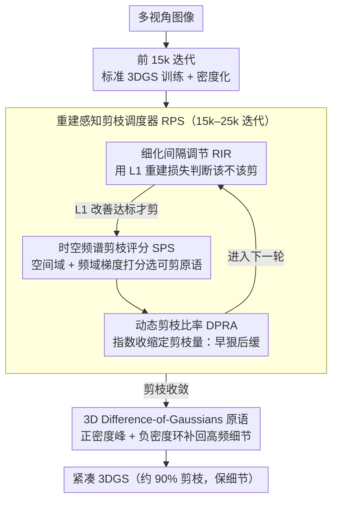

# Prune Wisely, Reconstruct Sharply: Compact 3D Gaussian Splatting via Adaptive Pruning and Difference-of-Gaussian Primitives

**会议**: CVPR 2026  
**arXiv**: [2602.24136](https://arxiv.org/abs/2602.24136)  
**作者**: Haoran Wang, Guoxi Huang, Fan Zhang, David Bull, Nantheera Anantrasirichai (University of Bristol)  
**代码**: 即将公开  
**领域**: 3D视觉  
**关键词**: 3D Gaussian Splatting, 模型剪枝, Difference-of-Gaussians, 紧凑表示, 新视角合成

## 一句话总结

提出自适应重建感知剪枝策略（RPS）和 3D DoG 原语，在保持渲染质量的同时实现 90% 的高斯点裁减。

## 背景与动机

3D Gaussian Splatting (3DGS) 实现了实时高保真渲染，但通常需要大量高斯原语，导致冗余表示和高资源消耗。现有剪枝方法在固定迭代次数处剪枝、使用统一的细化间隔，忽略了重建过程的动态特性，导致优化不稳定：过早剪枝会移除必要的原语，过晚剪枝则收效甚微。此外，光滑的高斯核在紧凑配置下难以捕获精细细节。

## 核心问题

1. **何时剪枝**：固定剪枝时间表未考虑不同场景的重建难度差异
2. **剪多少**：固定剪枝比率忽略了冗余度随训练变化的事实
3. **如何评估重要性**：仅基于空间域的评分忽略了频域中对边缘和纹理至关重要的信息
4. **如何保持细节**：激进剪枝后标准高斯原语的平滑性限制了细节表示

## 方法详解

### 整体框架

这篇要解决的是 3DGS 在激进剪枝（目标 90%）下"既要少点、又不丢细节"的两难。整条流水线分三段：前 15k 迭代做标准 3DGS 训练 + 密度化，把场景先建起来；15k 之后启动重建感知剪枝调度器（RPS）做渐进的"剪枝–细化"循环，最多到 25k 迭代；剪枝收敛后再引入 3D-DoG 原语并优化两类原语的混合比例，把激进剪枝丢掉的高频细节补回来。RPS 回答"何时剪、剪多少、剪哪些"——分别由 RIR、DPRA、SPS 三个组件承担，3D-DoG 回答"剪完怎么保细节"。

### 关键设计

**1. 细化间隔调节 RIR：用重建损失决定何时剪，而不是固定时间表**

固定迭代步剪枝不管场景难易，过早剪会误删必要原语、过晚剪又收效甚微。RIR 改用 L1 重建损失当信号自适应触发：当

$$L_1^{(t)} \leq \beta \cdot L_1^{(t-1)}, \quad \beta = 0.95$$

成立（质量确有改善）才执行下一轮剪枝，否则继续细化，直到满足条件或撞到最大间隔 $Iter_{\max} = 2000$，每 500 次迭代检查一次。剪枝时机于是跟着每个场景自己的收敛节奏走。

**2. 动态剪枝比率 DPRA：早期狠剪、后期收手**

冗余度会随训练下降，全程用固定比率要么前期不够狠、要么后期伤元气。DPRA 让每轮目标数量按指数收缩

$$N^{(t)} = N_{\text{current}} - (N_0 - N_{\text{target}}) \cdot \frac{1}{2^t}, \qquad R^{(t)} = \frac{N_{\text{current}} - N^{(t)}}{N_{\text{current}}}$$

于是早期一次剪掉一大批冗余、后期只小幅修剪，兼顾压缩效率和最终质量。

**3. 时空频谱剪枝评分 SPS：把频域信息也纳入重要性判断**

只看空间域梯度会漏掉对边缘、纹理至关重要的高频原语，一剪就糊。SPS 把空间域和频域梯度合起来打分

$$\tilde{U}_i^* = \lambda_s \cdot \frac{(\nabla_{g_i} I_{\mathcal{G}})^2}{\|\tilde{U}\|_2} + \lambda_f \cdot \frac{(\nabla_{g_i} \text{FFT}(I_{\mathcal{G}}))^2}{\|\tilde{U}^f\|_2}$$

其中频域项用径向频率加权 $w(\omega) = (\|\omega\| / \omega_{\max})^{\gamma_f}$ 强调高频，确保支撑尖锐结构的高斯不被误剪。这是首次把 FFT 梯度引入 3DGS 的重要性评估。

**4. 3D Difference-of-Gaussians 原语：用负密度环弥补剪枝后的细节损失**

平滑的高斯核在稀疏配置下天生画不出锐利细节。借鉴经典图像处理里 DoG 做边缘检测的思路，本文设计了能同时建模正、负密度的新原语

$$\text{DoG}(x) = G(x) - G_p(x)$$

伪高斯 $G_p$ 与主高斯共享中心和旋转，但有独立的不透明度因子 $f^\alpha$ 和缩放因子 $[f_x^s, f_y^s, f_z^s]$，仅额外引入 4 个可学习参数，且所有因子 $<1.0$ 保证正峰仍主导辐射。"正密度峰 + 负密度环"带来内在的对比度增强，对边缘和纹理更敏感。配套的密度控制在剪枝后激活 DoG，并迭代监控伪高斯不透明度 $\alpha_p$，一旦低于阈值就把该 DoG 退化为标准高斯，自适应平衡两类原语的比例。

## 实验关键数据

| 方法 | Size (MB) ↓ | PSNR ↑ | SSIM ↑ | LPIPS ↓ | 训练时间 ↓ |
|------|------------|--------|--------|---------|-----------|
| 3DGS | 645.2 | 27.47 | 0.826 | 0.201 | 17m1s |
| MaskGaussian | 280.7 | 27.43 | 0.811 | 0.227 | 24m11s |
| PuP-3DGS | 90.6 | 26.67 | 0.786 | 0.271 | - |
| Speedy-Splat | 73.9 | 26.84 | 0.782 | 0.296 | 16m30s |
| **Ours** | **65.3** | **27.16** | **0.789** | **0.285** | **13m48s** |

*Mip-NeRF 360 数据集，90% 剪枝率*

| 消融变体 | RIR | DPRA | SPS | DoG | PSNR | SSIM | FPS |
|---------|-----|------|-----|-----|------|------|-----|
| 3DGS (100%) | ✗ | ✗ | ✗ | ✗ | 27.47 | 0.826 | 143.5 |
| V1 | ✓ | ✗ | ✗ | ✗ | 26.03 | 0.742 | 362.4 |
| V2 | ✓ | ✓ | ✗ | ✗ | 26.17 | 0.751 | 363.2 |
| V3 | ✓ | ✓ | ✓ | ✗ | 26.99 | 0.771 | 361.9 |
| **完整** | ✓ | ✓ | ✓ | ✓ | **27.16** | **0.789** | 289.0 |

## 亮点

- 自适应剪枝时机 + 动态比率：摆脱手动调参，适应不同场景复杂度
- SPS 频域评分：首次将 FFT 梯度引入 3DGS 重要性评估
- 3D-DoG 负密度环：巧妙利用 DoG 的「边缘增强」特性弥补剪枝后的细节损失
- 90% 剪枝后仍接近原始质量，训练速度提升 1.23×，推理 FPS 提升 2×

## 局限与展望

- 在 Bicycle 等复杂场景中 90% 剪枝目标下仍有轻微性能下降
- DoG 激活时有短暂 PSNR 抖动（25k 迭代处），需后续迭代恢复
- 未在动态场景或大规模场景上验证
- 额外的 FFT 计算和 DoG 对 FPS 有一定影响（289 vs 362 FPS）

## 与相关工作的对比

- vs **Mini-Splatting**：Mini-Splatting 聚合混合权重作为剪枝评分，本文的 SPS 额外纳入频域信息
- vs **PuP-3DGS**：PuP 评估空间灵敏度，但使用固定剪枝时间表；本文自适应调度
- vs **MaskGaussian**：MaskGaussian 学习自适应 mask，但模型尺寸 4× 大于本文
- vs **LightGaussian**：LightGaussian 基于 2D 投影面积 × 不透明度，本文在频域更鲁棒

## 启发与关联

- DoG 是经典图像处理中边缘检测的灵感来源（LoG 近似），将其引入 3DGS 原语设计是跨领域的创新
- 频域剪枝评分可推广到其他基于点的表示（点云压缩等）
- 自适应剪枝策略可与模型量化、编码方法结合，进一步压缩存储

## 评分

- 新颖性: ⭐⭐⭐⭐ — DoG 原语和频域评分是有趣的设计
- 实验充分度: ⭐⭐⭐⭐ — 三个标准数据集 + 详细消融
- 写作质量: ⭐⭐⭐⭐ — 结构清晰，公式推导完整
- 价值: ⭐⭐⭐⭐ — 对 3DGS 紧凑化有实际意义

<!-- RELATED:START -->

## 相关论文

- [\[CVPR 2026\] CGHair: Compact Gaussian Hair Reconstruction with Card Clustering](cghair_compact_gaussian_hair_reconstruction_with_card_clustering.md)
- [\[CVPR 2026\] Off The Grid: Detection of Primitives for Feed-Forward 3D Gaussian Splatting](off_the_grid_detection_of_primitives_for_feed-forward_3d_gaussian_splatting.md)
- [\[CVPR 2026\] UTrice: Unifying Primitives in Differentiable Ray Tracing and Rasterization via Triangles for Particle-Based 3D Scenes](utrice_unifying_primitives_in_differentiable_ray_tracing_and_rasterization_via_t.md)
- [\[CVPR 2026\] DropAnSH-GS: Dropping Anchor and Spherical Harmonics for Sparse-view Gaussian Splatting](dropping_anchor_and_spherical_harmonics_for_sparse-view_gaussian_splatting.md)
- [\[ICLR 2026\] MEGS2: Memory-Efficient Gaussian Splatting via Spherical Gaussians and Unified Pruning](../../ICLR2026/3d_vision/megs2_memory-efficient_gaussian_splatting_via_spherical_gaussians_and_unified_pr.md)

<!-- RELATED:END -->
