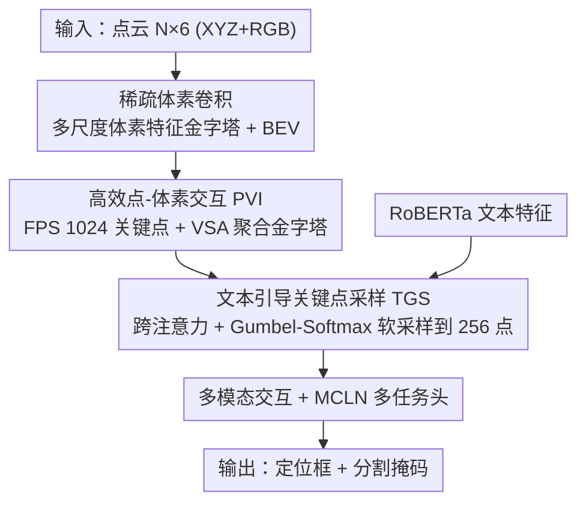

# PV-Ground: Text-Guided Point-Voxel Interaction for 3D Visual Grounding

**会议**: CVPR 2026  
**论文**: [CVF Open Access](https://openaccess.thecvf.com/content/CVPR2026/html/Shang_PV-Ground_Text-Guided_Point-Voxel_Interaction_for_3D_Visual_Grounding_CVPR_2026_paper.html)  
**代码**: https://github.com/AaNnWwTt/PV-Ground  
**领域**: 3D视觉  
**关键词**: 3D视觉定位, 体素卷积, 关键点采样, 文本引导, 多模态融合

## 一句话总结
PV-Ground 指出现有 3D 视觉定位（3D VG）普遍用点云骨干、需把 5 万点暴力降采样到 2048 点造成细节瓶颈，于是改用稀疏体素卷积保留高分辨率特征、再用紧凑关键点把体素特征金字塔聚合下来与文本交互，并提出文本引导的可微软采样把关键点自适应集中到文本相关物体上，在 ScanRefer/ReferIt3D 上把定位精度提升约 5%。

## 研究背景与动机
**领域现状**：3D 视觉定位（给一句自由文本，在 3D 场景里定位目标物体）的典型模型由「3D 场景编码器 + 文本编码器 + 多模态交互模块 + 定位头」四部分组成。学界绝大部分精力都投在后端的多模态交互上——设计复杂注意力、图神经网络、多任务策略，而前端的场景特征表示反而长期被忽视。

**现有痛点**：主流方法仍用 PointNet++ 这类点云骨干编码场景，而后续多层注意力交互在计算上要求把原始约 50,000 点**激进地降采样**到 2048 甚至更少的关键点。这一步降采样虽然让后续注意力可行，却制造了严重的信息瓶颈：细粒度几何细节被丢掉，对小物体、部分遮挡物体、靠细微线索区分同类实例的定位尤其致命。

**核心矛盾**：稀疏体素卷积在检测/分割里早已主流，能保住高分辨率空间细节且推理高效——看似是点云骨干的理想替代。但直接搬到 3D VG 行不通：标准上采样解码器的体素数量近乎**指数增长**，这种稠密高分辨率特征图与文本做注意力交互在计算上不可行。于是形成两难——点云骨干「能交互但丢细节」，体素骨干「保细节但没法交互」。

**本文目标**：设计一个既能享受体素高保真表示、又能保持关键点式多模态融合计算便利的架构，把两者优势合一。

**切入角度**：作者主张「体素负责保真、关键点负责交互」——用稀疏体素卷积抽取高分辨率场景特征金字塔，再用一小撮紧凑关键点作为聚合锚点把金字塔蒸馏下来，只让关键点去和文本深度交互。更进一步，他们观察到 3D VG 是**文本条件**任务，没必要像检测那样让关键点空间均匀铺满全场景，应该把表示能力集中到文本描述的相关区域。

**核心 idea**：用体素骨干 + 关键点聚合打通「保真↔可交互」，再用文本引导的可微软采样把关键点自适应聚拢到文本相关物体上，过滤干扰物。

## 方法详解

### 整体框架
PV-Ground 把一个体素骨干和一个关键点聚合-交互机制拼在一起。输入是 $N\times 6$ 的点云（XYZ + RGB），先体素化喂进多层稀疏 3D 卷积，每个卷积块以 stride 2 下采样形成多尺度**体素特征金字塔**（并把 8× 下采样特征沿 Z 轴堆叠成 BEV 图补充进金字塔），保住点云骨干会丢掉的细粒度几何与上下文。接着用 FPS 取一组关键点作为聚合锚点，通过 Voxel Set Abstraction（VSA）把大体素金字塔蒸馏成紧凑、信息丰富的关键点特征（PVI 模块）。然后文本引导采样（TGS）模块借 RoBERTa 文本特征把关键点从均匀分布的 1024 个软采样到 256 个**目标相关**关键点。最后这些关键点与文本做深度多模态交互，送入沿用 MCLN 的多任务头同时输出定位框与分割掩码。

### 关键设计

**1. 高效点-体素交互 PVI：用关键点把体素金字塔蒸馏成可交互的紧凑表示**

这是打通「保真」与「可交互」的核心机制。模型先对输入点云 $P\in\mathbb{R}^{N\times 6}$ 体素化成 $L_v\times W_v\times H_v$ 网格，喂进稀疏体素卷积，每块 stride 2 下采样得到体素特征金字塔，再把 8× 下采样图沿 Z 轴堆叠成 BEV 补进金字塔。但稠密体素金字塔 $F_{vox}$ 直接做跨模态注意力不可行，于是引入 Voxel-to-Keypoint 聚合：用 FPS 从原始点云取 $N$ 个关键点 $P'\in\mathbb{R}^{N\times 3}$ 当聚合锚点，借 VSA 模块去查询金字塔。对每个关键点 $kp_i$，在每个金字塔层 $l$ 定义半径 $r_l$ 的球形查询区，把半径内的体素特征 $\{v_j^l\}$（满足 $\lVert v_j^l - kp_i\rVert^2 < r_l$）连同相对坐标一起收集成集合 $S_i^l$，再过一个 PointNet 得到该层固定维特征：$f_i^l = \text{maxpool}(\text{MLP}(\mathcal{M}(S_i^l)))$，其中 $\mathcal{M}(\cdot)$ 是对邻域体素的随机采样。把各层特征拼成点-体素特征 $f_i^{pv}$，再与原始点云特征 $f_i^{raw}$、BEV 特征 $f_i^{bev}$ 拼接、经 MLP 融合成最终关键点特征 $f_i^g$。这样体素金字塔被压成 $\mathcal{V}=\{f_i^g\}\in\mathbb{R}^{N\times C}$ 的紧凑关键点集，既继承体素高保真、又可高效与文本交互。相比 TSP3D 那种「硬剪枝」掉文本无关体素（有误删风险），这里是**软聚合**，不丢信息。

**2. 文本引导关键点采样 TGS：把均匀关键点自适应聚拢到文本相关物体上**

FPS 采的关键点空间均匀，适合检测这种要覆盖全场景的任务，但对文本条件的 3D VG 是次优的——当描述是「桌子旁边的白色冰箱」时，大量不属于桌子/冰箱的均匀点其实都是干扰物。TGS 用文本引导把关键点分布聚到文本相关候选物体周围。具体流程：先让 VSA 输出的初始点特征 $V$ 与文本特征 $T$ 做跨注意力得到文本增强视觉特征 $V_t = \text{CrossAtt}(V, \text{SelfAtt}(T))$，让每个关键点评估自身与文本的相关性；再过自注意力让关键点间交换信息，接 FC 预测每个关键点的文本引导采样权重 $SW\in\mathbb{R}^{N\times n}$（$n$ 为目标关键点数）。关键一步是用 **Gumbel-Softmax** 重参数化把离散采样变成可微软分配：给定 Gumbel 噪声 $g$，软采样权重 $SW_{gs}=\text{softmax}((\log(SW)+g)/\tau)$（沿关键点维做 softmax，$\tau$ 为退火温度）。最后用这组可微权重对原始 $N$ 个关键点及特征做加权软采样，得到 $n\ll N$ 个目标相关关键点 $P_k=(SW_{gs})^\top P'$、$V_k=(SW_{gs})^\top V_t$。相比 EDA/3D-SPS 那种 Top-K「硬选择」（被丢的点不可回传梯度、信息不可逆丢失），软采样让模型能利用全部潜在特征学习每个点的任务相关性，端到端可训。

**3. 多任务目标回归头：复用 MCLN 同时出框与掩码**

TGS 产出的关键点特征 $V_k$ 可无缝接进现有点云式框架做解码与目标回归。本文直接采用 MCLN 的解码器与预测头作为主架构——选它是因为性能强且是多任务设计，能同时预测包围框和分割掩码，从而在多个下游任务上更全面地评估 PV-Ground 的表征质量（多任务头与损失细节沿用 MCLN）。作者也验证了把同一套关键点特征喂进 BUTD-DETR、EDA 等其他解码器同样能带来增益，说明 PV-Ground 是一个可插拔的前端表征改进，而非绑死某个特定解码器。

### 损失函数 / 训练策略
模型在单张 RTX 4090 上以 batch size 10 训练。输入点云 XYZ 裁剪到 $[-8,-8,-0.2]\sim[8,8,3.8]$ m，体素分辨率 0.02 m；FPS 先选 $N=1024$ 个均匀关键点，VSA 在金字塔各层用半径 $r_l=[0.2,0.4,0.8,1.6]$ m 聚合，TGS 再软采样出 $n=256$ 个目标相关关键点；Gumbel 采样温度 $\tau=1.0$ 以鼓励早期探索潜在相关区域。多任务损失沿用 MCLN。

## 实验关键数据

### 主实验
在 ScanRefer 上以点云式 MCLN 为主基线（†），单阶段管线提升尤为明显：

| 数据集 | 配置 | 方法 | Acc@0.25 | Acc@0.5 |
|--------|------|------|------|------|
| ScanRefer | 单阶段 Overall | MCLN† | 54.30 | 42.64 |
| ScanRefer | 单阶段 Overall | TSP3D | 56.45 | 46.71 |
| ScanRefer | 单阶段 Overall | **PV-Ground** | **59.31 (+5.0)** | **47.77 (+5.1)** |
| ScanRefer | 两阶段 Overall | MCLN† | 57.17 | 45.53 |
| ScanRefer | 两阶段 Overall | **PV-Ground** | **59.87 (+2.7)** | **47.56 (+2.0)** |

在 ReferIt3D 上同样显著：单阶段 Nr3D 51.3 对 MCLN 45.7（+5.6）、Sr3D 56.5；两阶段 Nr3D 62.1 对 59.8（+2.3）。指代分割（ScanRefer）上 PV-Ground 取 62.2/54.8、mIoU 47.9，相比 MCLN（58.7/50.7、44.7）在 Acc@0.5 上 +4.1、mIoU +3.2。

### 消融实验
单阶段、ScanRefer，逐步叠加 PVI 与 TGS（基线为点云式 MCLN）：

| ID | PVI | TGS | 定位 0.25 | 定位 0.5 | 分割 mIoU |
|------|------|------|------|------|------|
| (a) | | | 54.30 | 42.64 | 43.49 |
| (b) | ✓ | | 56.33 | 45.19 | 44.75 |
| (c) | | ✓ | 58.15 | 47.23 | 46.72 |
| (d) | ✓ | ✓ | **59.31** | **47.77** | **47.73** |

### 关键发现
- **两个模块各自有效、叠加最优**：单加 PVI（b）定位 0.25 从 54.30 升到 56.33；单加 TGS（c）升到 58.15；二者全开（d）到 59.31，分割 mIoU 同步从 43.49 升到 47.73。
- **TGS 单独贡献甚至大于 PVI**：(c) 仅开 TGS 就比 (b) 仅开 PVI 更高（58.15 vs 56.33），印证「把关键点聚到文本相关区域、过滤干扰物」对文本条件任务的价值——TGS 在 (c) 中即便用 PointNet++ 骨干（PVI 关闭）也带来大幅提升。⚠️ 此处 TGS 关闭时以 EDA 的 Top-K 选择替代、PVI 关闭时以 PointNet++ 替代，故消融是相对替换而非纯增删。
- **难场景增益更大**：提升集中在单阶段管线与更难的「multiple」（同类多干扰物）设定，正是细粒度细节与去干扰最吃紧的场景。
- **可视化佐证**：FPS 种子点均匀铺满含大量文本无关区域，TGS 后的关键点精确聚到描述物体（沙发、门、水槽、马桶）附近，直观解释了精度提升来源。

## 亮点与洞察
- **重新审视被忽视的前端**：当大家都在堆后端交互模块时，本文把矛头指向「场景特征表示」这一长期被冷落的瓶颈，是一个有辨识度的切入点。
- **点-体素互补的巧妙拼接**：体素保真 + 关键点可交互，用 VSA 把指数膨胀的体素金字塔蒸馏成固定数量关键点，绕开「体素直接与文本注意力不可行」的死结——这套「重表示、轻交互锚点」的思路可迁移到其他需高分辨率场景特征又要做跨模态融合的任务。
- **软采样替代硬选择**：用 Gumbel-Softmax 把离散关键点选择做成可微软分配，让被「未选中」的点仍能回传梯度、参与学习，从根上缓解 Top-K 式硬剪枝的信息不可逆丢失。
- **可插拔前端**：关键点特征能直接替换 BUTD-DETR/EDA 等现有解码器的查询特征并带来类似增益，工程上易落地。

## 局限与展望
- **依赖现成多任务头**：解码与回归直接复用 MCLN，本文贡献集中在前端表征，端到端定位头本身未做创新，部分性能受基线框架天花板限制。
- **额外计算未充分量化**：体素卷积 + VSA + TGS 相比纯点云骨干的实际显存/延迟代价，正文给出的对比有限（多放在补充材料），是否真比点云骨干「更高效」需更细的吞吐对比。⚠️ 以原文/补充材料为准。
- **超参与温度敏感性**：FPS 关键点数 1024、目标 256、各层聚合半径、Gumbel 温度 $\tau=1.0$ 等超参的跨数据集鲁棒性原文讨论不多。
- **场景规模有限**：实验集中在 ScanNet 室内场景，向室外大场景、开放词表描述的泛化尚待验证。

## 相关工作与启发
- **vs MCLN（主基线）**：MCLN 用点云骨干 + 多任务头，受制于激进降采样的细节瓶颈；PV-Ground 替换前端为体素 + 文本引导关键点，在定位与分割上全面超越，证明瓶颈在表示而非交互。
- **vs TSP3D**：同样想用体素，但 TSP3D 靠文本引导**硬剪枝**保留少量相关体素，有误删风险；PV-Ground 用关键点软聚合 + 软采样，不丢信息且端到端可微，单阶段 ScanRefer 上 59.31 对其 56.45。
- **vs EDA / 3D-SPS（文本引导关键点）**：它们用 Top-K 硬选择文本相关关键点，梯度只过被选点；PV-Ground 借 MICAS 式可微软分配思想做 3D VG 专用适配，让全部点都参与学习。
- **vs 点云骨干（PointNet++）**：本文核心论点即点云骨干的暴力降采样是 3D VG 的系统性瓶颈，体素骨干能保住小物体/细线索所需的高分辨率细节。

## 评分
- 新颖性: ⭐⭐⭐⭐ 首个点-体素框架做 3D VG，+ 文本引导可微软采样，组合新颖；但 VSA、Gumbel 软采样各有出处。
- 实验充分度: ⭐⭐⭐⭐ 覆盖 ScanRefer/ReferIt3D 双数据集、定位+分割双任务、单/两阶段，消融清晰；效率对比偏弱。
- 写作质量: ⭐⭐⭐⭐ 动机（信息瓶颈）与可视化（关键点聚焦）很有说服力，公式完整；部分关键结果留在补充材料。
- 价值: ⭐⭐⭐⭐ 把「前端表示」拉回 3D VG 讨论中心，且前端可插拔进现有框架，实用价值高。

<!-- RELATED:START -->

## 相关论文

- [\[CVPR 2025\] Text-Guided Sparse Voxel Pruning for Efficient 3D Visual Grounding](../../CVPR2025/3d_vision/text-guided_sparse_voxel_pruning_for_efficient_3d_visual_grounding.md)
- [\[CVPR 2026\] S$^2$-MLLM: Boosting Spatial Reasoning Capability of MLLMs for 3D Visual Grounding with Structural Guidance](s2-mllm_boosting_spatial_reasoning_capability_of_mllms_for_3d_visual_grounding_w.md)
- [\[CVPR 2026\] GaussianGrow: Geometry-aware Gaussian Growing from 3D Point Clouds with Text Guidance](gaussiangrow_geometry-aware_gaussian_growing_from_3d_point_clouds_with_text_guid.md)
- [\[CVPR 2026\] MonoVLM: Monocular 3D Visual Grounding with Vision Language Models](monovlm_monocular_3d_visual_grounding_with_vision_language_models.md)
- [\[CVPR 2026\] ORD: Object-Relation Decoupling for Generalized 3D Visual Grounding](ord_object-relation_decoupling_for_generalized_3d_visual_grounding.md)

<!-- RELATED:END -->
