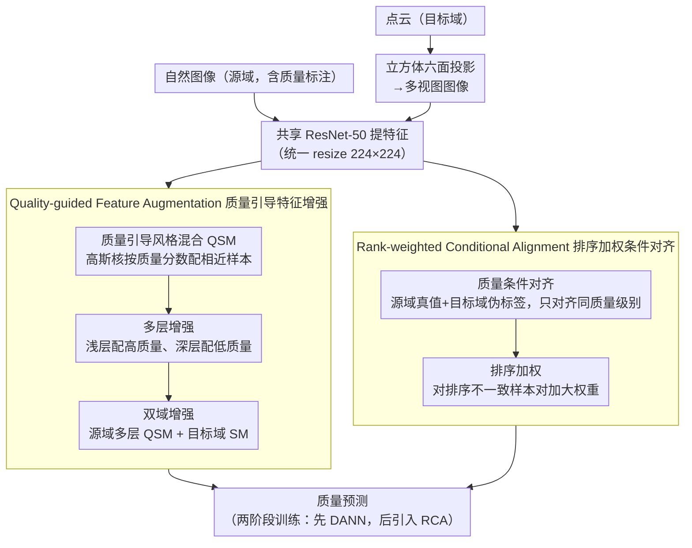

# QD-PCQA: Quality-Aware Domain Adaptation for Point Cloud Quality Assessment

**会议**: CVPR 2026  
**arXiv**: [2603.03726](https://arxiv.org/abs/2603.03726)  
**作者**: Guohua Zhang, Jian Jin, Meiqin Liu, Chao Yao, Weisi Lin (北京交大, NTU, 北科大)  
**代码**: 待确认  
**领域**: 3D视觉  
**关键词**: 点云质量评估, 无监督域适应, 质量感知特征对齐, 跨域迁移

## 一句话总结

提出质量感知域适应框架 QD-PCQA，通过 Rank-weighted Conditional Alignment 和 Quality-guided Feature Augmentation 两大策略，将图像域的质量评估先验迁移到点云域。

## 背景与动机

无参考点云质量评估 (NR-PCQA) 面临标注数据稀缺导致的泛化性问题。人类视觉系统 (HVS) 对质量的感知不依赖于媒体类型，因此可通过无监督域适应 (UDA) 将图像域已标注的质量先验迁移到点云域。然而，现有 UDA-based PCQA 方法（如 IT-PCQA）直接继承图像分类任务的特征对齐策略，忽略了质量评估的特殊性：

- **质量无关的特征对齐**：语义相似但质量不同的样本可能被错误对齐
- **质量无关的特征增强**：Style Mixup 随机混合不考虑质量信息
- **层无关的特征增强**：仅在最终层做增强，忽略层级互补性
- **增强不平衡**：仅增强源域特征，反而扩大域差距

## 核心问题

如何在域适应过程中保持质量感知——既确保特征对齐时质量级别一致，又使模型对质量排序敏感。

## 方法详解

### 整体框架

QD-PCQA 要解决的是无参考点云质量评估（NR-PCQA）标注稀缺、泛化差的问题：思路是把图像域已标注的质量先验，通过无监督域适应迁移到点云域，但迁移时要时刻保持"质量感知"。具体流程：先把 3D 点云投影到立方体六个面生成多视图图像，与自然图像统一 resize 到 $224 \times 224$、共享一个 ResNet-50 提特征；训练时一边用 Quality-guided Feature Augmentation（QFA）按质量分数做增强、一边用 Rank-weighted Conditional Alignment（RCA）做质量条件对齐，让源域（图像）的质量知识在质量级别一致的前提下迁到目标域（点云）。

### 关键设计

**1. Quality-guided Feature Augmentation：增强时不打乱质量信息**

现有方法直接套图像分类的 Style Mixup，随机混合、只在最后一层、还只增强源域，结果把质量不同的样本混到一起、又扩大了域差距。QFA 用三件事修正：其一，Quality-guided Style Mixup（QSM）不再随机配对，而是用高斯核按质量分数找相近样本

$$P((x_s^{i^*}, y_s^{i^*}) \mid (x_s^i, y_s^i)) \propto \exp\!\Big(-\frac{(y_s^i - y_s^{i^*})^2}{2\tau^2}\Big)$$

再混合风格统计量和标签 $f_s^{\text{mix}} = \sigma(f)^{\text{mix}} \frac{f_s^i - u(f_s^i)}{\sigma(f_s^i)} + u(f)^{\text{mix}}$，保证增强后质量一致。其二，Multi-Layer Extension 按质量分数分层施加 QSM——Stage 1 配高质量样本（浅层对低级失真更敏感）、Stage 2-3 配中质量、Stage 4 配低质量（深层捕获高级语义），利用层级互补。其三，Dual-Domain Augmentation 对源域做 QSM 多层增强、对目标域在 Stage 4 后用普通 SM，缓解只增强源域带来的不平衡，顺带加大判别器难度、逼出更鲁棒的域不变特征。

**2. Rank-weighted Conditional Alignment：对齐相同质量级别，并重点纠正排序错误**

普通全局对齐会把语义相似但质量不同的样本错误拉到一起。RCA 建在条件算子差异（COD）之上，但加了一个排序权重矩阵

$$\tilde{\mathbf{K}}_X^{st}(i,j) = k(f_s^i, f_t^j) \cdot (1 + \mathbf{W}^{st}(i,j)), \qquad \mathbf{W}^{st}(i,j) = \max\big(0, -(\hat{y}_s^i - \hat{y}_t^j) \cdot \text{sign}(y_s^i - y_t^j)\big)$$

一方面用源域真实标签和目标域伪标签作条件，只对齐相同质量级别的特征；另一方面对"预测排序与真实排序不一致"的样本对加大权重，把域迁移里的排序偏差重点掰正。

### 损失函数 / 训练策略

训练分两阶段，避免早期不可靠的伪标签污染 RCA：阶段一（前 5000 次迭代）只用 DANN 做初始特征对齐、不引入伪标签；阶段二待模型稳定后再加入 RCA，用此时较可靠的伪标签做精细对齐。总损失把质量预测、域判别、排序三项合起来

$$\mathcal{L}_{\text{all}}^{\text{mix}} = \lambda_1 \mathcal{L}_P(\hat{y}_s^{\text{mix}}, y_s^{\text{mix}}) + \lambda_2 \mathcal{L}_D(f_s^{\text{mix}}, f_t^{\text{mix}}) + \lambda_3 \mathcal{L}_R(y_s, y_t, f_s, f_t)$$

以 $p > 0.5$ 的概率应用混合版本，否则用原始版本。

## 实验关键数据

| 方法 | 模式 | TID2013→SJTU-PCQA PLCC | SROCC | TID2013→WPC PLCC | SROCC |
|------|------|----------------------|-------|-----------------|-------|
| No Adapt | I-to-PC | 0.548 | 0.444 | 0.320 | 0.296 |
| DANN | I-to-PC | 0.596 | 0.512 | 0.325 | 0.296 |
| IT-PCQA | I-to-PC | 0.693 | 0.636 | 0.429 | 0.403 |
| COD | I-to-PC | 0.712 | 0.611 | 0.426 | 0.396 |
| **QD-PCQA** | **I-to-PC** | **0.842** | **0.753** | **0.563** | **0.572** |

| 方法 | KADID→SJTU-PCQA PLCC | SROCC | KADID→WPC PLCC | SROCC |
|------|---------------------|-------|---------------|-------|
| IT-PCQA | 0.703 | 0.641 | 0.432 | 0.402 |
| **QD-PCQA** | **0.843** | **0.724** | **0.553** | **0.534** |

*QD-PCQA 在 SJTU-PCQA 上超越 IT-PCQA 约 21%（PLCC）*

## 亮点

- **质量感知贯穿全流程**：从特征增强到特征对齐均以质量分数为引导
- **分层增强设计合理**：利用不同层对不同质量级别的互补敏感性
- **排序加权机制**：关注"排序不一致"的难样本对，精准纠正域迁移中的排序偏差
- **两阶段训练**：避免早期不可靠伪标签对 RCA 的负面影响

## 局限与展望

- 点云投影为六个正交视图可能丢失 3D 结构信息
- 伪标签质量依赖第一阶段模型水平，可探索更好的伪标签生成策略
- 仅在 SJTU-PCQA 和 WPC 两个点云数据集验证，规模有限
- 质量分层使用固定分位数（33%/67%），可探索自适应分层

## 与相关工作的对比

- vs **IT-PCQA**：IT-PCQA 仅用 DANN 做全局对齐，忽略质量条件；QD-PCQA 加入质量条件对齐 + 排序加权
- vs **StyleAM**：StyleAM 引入 SM 但随机混合不考虑质量；QD-PCQA 用 QSM 保持质量一致性
- vs **COD**：COD 条件对齐但等权处理所有样本对；QD-PCQA 强调排序偏差样本

## 启发与关联

- 质量感知域适应的思路可推广到其他回归型跨域任务（如跨域年龄估计、跨域评分预测）
- 分层特征增强的设计对多尺度特征的利用有普适性启示
- 排序敏感的权重策略可结合 Learning-to-Rank 思路进一步发展

## 评分

- 新颖性: ⭐⭐⭐⭐ — 质量感知域适应在 PCQA 领域是有意义的创新
- 实验充分度: ⭐⭐⭐ — 数据集偏少，缺乏大规模点云数据集验证
- 写作质量: ⭐⭐⭐⭐ — 问题定义清晰，模块动机充分
- 价值: ⭐⭐⭐⭐ — 提供了 PCQA 泛化性的新思路

<!-- RELATED:START -->

## 相关论文

- [\[CVPR 2026\] PR-IQA: Partial-Reference Image Quality Assessment for Diffusion-Based Novel View Synthesis](pr-iqa_partial-reference_image_quality_assessment_for_diffusion-based_novel_view.md)
- [\[AAAI 2026\] Multi-Modal Assistance for Unsupervised Domain Adaptation on Point Cloud 3D Object Detection](../../AAAI2026/3d_vision/multi-modal_assistance_for_unsupervised_domain_adaptation_on_point_cloud_3d_obje.md)
- [\[CVPR 2026\] Mamba Learns in Context: Structure-Aware Domain Generalization for Multi-Task Point Cloud Understanding](mamba_learns_in_context_structure-aware_domain_generalization_for_multi-task_poi.md)
- [\[CVPR 2026\] CLIPoint3D: Language-Grounded Few-Shot Unsupervised 3D Point Cloud Domain Adaptation](clipoint3d_language-grounded_few-shot_unsupervised_3d_point_cloud_domain_adaptat.md)
- [\[CVPR 2026\] MV2UV: Generating High-quality UV Texture Maps with Multiview Prompts](mv2uv_generating_high-quality_uv_texture_maps_with_multiview_prompts.md)

<!-- RELATED:END -->
