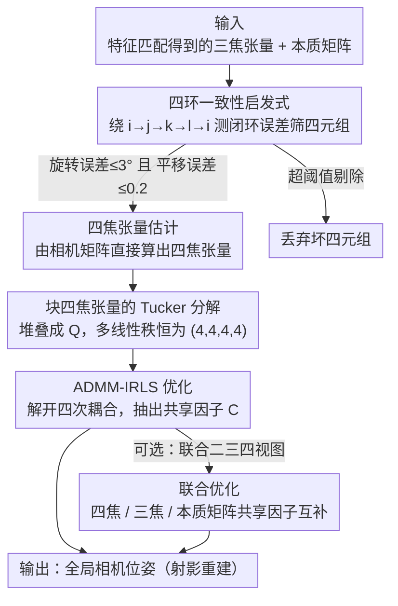

# QuadSync: Quadrifocal Tensor Synchronization via Tucker Decomposition

**会议**: CVPR 2026  
**arXiv**: [2602.22639](https://arxiv.org/abs/2602.22639)  
**代码**: 无  
**领域**: 3D视觉  
**关键词**: 四焦张量, Tucker分解, Structure from Motion, 全局同步, 多视图几何

## 一句话总结

首次提出四焦张量(quadrifocal tensor)的全局同步算法 QuadSync，通过构造块四焦张量并证明其承认多线性秩为 (4,4,4,4) 的 Tucker 分解，利用 ADMM-IRLS 优化框架从四视图测量中恢复相机位姿，在密集视图场景下取得优于两视图/三视图方法的同步精度。

## 研究背景与动机

### 1. 领域现状

Structure from Motion (SfM) 是 3D 计算机视觉的核心课题。传统 SfM 流水线包含特征检测匹配、相对位姿估计、同步和重建等步骤。全局同步方法通过同时处理所有相机避免增量方法的误差累积问题。现有全局方法主要基于双视图测量（基础矩阵/本质矩阵），近年来也有少量基于三焦张量的工作（如 TrifocalSync）。

### 2. 痛点

- **双视图信息有限**：基础矩阵/本质矩阵仅编码两个视图之间的几何关系，约束较弱
- **共线退化**：当相机中心共线时，多视图基础矩阵 $\mathcal{F}^n$ 的秩从 6 降至 4，三焦张量的多线性秩也发生退化，导致位姿恢复失败
- **高阶信息未被利用**：四焦张量虽然编码了更丰富的四视图几何关系，但长期被认为"仅有理论意义，不具有实用价值"

### 3. 核心矛盾

高阶张量（四焦张量）理论上蕴含更强的几何约束，能编码四个视图之间的完整关系并包含两视图和三视图的信息，但缺乏有效的同步理论框架和实用算法。

### 4. 要解决什么

- 建立块四焦张量的代数约束理论（低秩分解结构）
- 从四焦张量集合中全局恢复相机位姿
- 联合利用二、三、四视图测量提高同步精度

### 5. 切入角度

从张量分解（Tucker decomposition）的视角出发，证明块四焦张量具有多线性秩 (4,4,4,4) 的低秩结构，且因子矩阵恰好是堆叠的相机矩阵，从而将同步问题转化为带约束的张量分解优化问题。

### 6. 核心 idea

构造块四焦张量 $\mathcal{Q}^n \in \mathbb{R}^{3n \times 3n \times 3n \times 3n}$，证明它承认 Tucker 分解 $\mathcal{Q}^n = \mathcal{G}_Q \times_1 C \times_2 C \times_3 C \times_4 C$，其中 $C \in \mathbb{R}^{3n \times 4}$ 是堆叠相机矩阵。相比双视图（秩 6）和三视图（多线性秩 (6,4,4)），四焦张量四个模态共享同一因子矩阵 $C$，且核张量 $\mathcal{G}_Q$ 是固定稀疏张量，约束最强。

## 方法详解

### 整体框架

1. **输入**：从特征匹配估计的三焦张量和本质矩阵
2. **四焦张量估计**：通过三焦张量的四环一致性启发式筛选可靠四元组，再由相机矩阵直接计算四焦张量
3. **构造块四焦张量**：将所有四焦张量按索引堆叠成 $\mathcal{Q}^n$
4. **QuadSync 优化**：ADMM-IRLS 框架求解尺度和相机矩阵
5. **（可选）联合优化**：同时同步块四焦张量、块三焦张量和块本质矩阵
6. **输出**：全局相机位姿（射影重建）

### 关键设计

**1. 块四焦张量的 Tucker 分解：把同步问题翻译成一道张量分解题**

整个方法能成立，全靠一个代数事实：把所有四焦张量按视图索引堆叠成块张量 $\mathcal{Q}^n$ 后，它恰好承认一个干净的 Tucker 分解。四焦张量的每个元素本质是四个相机投影矩阵某些行拼成的 $4\times4$ 行列式 $(Q_{ijkl})^{pqrs} = \det[P_i^p;\, P_j^q;\, P_k^r;\, P_l^s]$，把这些块拼起来正好写成

$$\mathcal{Q}^n = \mathcal{G}_Q \times_1 C \times_2 C \times_3 C \times_4 C$$

四个模态共用同一个因子矩阵 $C \in \mathbb{R}^{3n\times 4}$——它就是堆叠起来的相机矩阵，而核张量 $\mathcal{G}_Q \in \mathbb{R}^{4\times4\times4\times4}$ 是元素只取 $\{-1,0,1\}$ 的固定稀疏张量。这一步的意义是：恢复相机位姿 = 从给定块张量里抽出那个共享因子 $C$，同步问题被改写成带约束的低秩分解问题。更关键的是多线性秩恒为 $(4,4,4,4)$，只要相机不共心就成立——这正是它压过低阶方法的地方：双视图的秩在共线时从 6 掉到 4、三视图从 $(6,4,4)$ 掉到 $(5,4,4)$ 都会退化，而四焦张量这套秩结构对共线天然免疫。

**2. ADMM-IRLS 优化：把四次耦合的非凸问题拆成一串好解的子问题**

有了分解形式，难点变成怎么从带噪声、带未知尺度的测量里把 $C$ 解出来。原问题对 $C$ 是四次的（四个模态都乘 $C$），又因每个块四焦张量带一个未知尺度 $\Lambda$ 而非凸，直接优化几乎无从下手。这里的做法是引入辅助变量 $C_1=C_2=C_3=C_4=B$ 把四次耦合人为解开，再套两层迭代：外层 IRLS 负责鲁棒性，把目标里的 L1 范数转成加权最小二乘、逐轮重算权重压低异常块的影响；内层 ADMM 把等式约束 $C_i=B$ 松弛进增广拉格朗日，交替更新各个变量。拆开之后每个子问题要么有闭式解、要么是简单凸优化，整体就从一个棘手的四次非凸问题变成一串能稳定迭代的小问题。

**3. 联合优化：让二、三、四视图张量共用一套相机矩阵互相补位**

单靠四焦张量有个现实矛盾——它约束最强，但也最难估、最稀疏；双视图数据最多却约束最弱。联合优化的思路是把三种阶的信息塞进同一个目标里同步求解，靠的是它们共享因子：块四焦张量和块三焦张量共用堆叠相机矩阵 $C$，块三焦张量和块本质矩阵又共用线投影矩阵 $\mathcal{P}$。于是优化目标写成三项损失的加权和，每项用各自张量的观测块数做归一化常数，让数据量悬殊的三种测量被放到可比的尺度上。这样高阶约束负责精度、低阶数据负责覆盖面，在稀疏处由二、三视图补上四焦张量够不到的相机。

**4. 四环一致性启发式：没有直接鲁棒估计器，就借三焦张量替四焦张量把关**

四焦张量本身缺一个像 RANSAC 那样的直接鲁棒估计器，坏的四元组会污染整个块张量。这里绕道用三焦张量来间接评估：给定四个三焦张量 $T_{ijk}, T_{jkl}, T_{kli}, T_{lij}$，沿着 $i\to j\to k\to l\to i$ 逐步对齐射影坐标系绕一圈，回到起点时测量相机的旋转、平移闭环不一致度——环闭得越差说明这组四元组越烂。旋转误差 $>3°$ 或平移误差 $>0.2$ 的四元组直接剔除，只把通过的可靠四焦张量喂进同步。

### 损失函数/训练策略

- **QuadSync 损失**：$\sum_{(i,j,k,l) \in \Omega} \| \Lambda_{ijkl} \tilde{\mathcal{Q}}^n_{ijkl} - \llbracket \mathcal{G}_Q; C, C, C, C \rrbracket_{ijkl} \|_F$（L1 范数，降低异常值影响）
- **约束**：尺度 $\Lambda$ 对称且归一化 $\|\Lambda\|_F^2 = 1$（避免平凡解）
- **初始化**：HOSVD 提取前 4 个奇异向量作为相机矩阵初始估计
- **超参数**：$\rho = 0.01$（QuadSync），IRLS 4 轮，ADMM 1 轮/IRLS；联合优化 $\rho = 0.00001$，IRLS 2 轮

## 实验关键数据

### 主实验

**表1：ETH3D 数据集平均位置误差（11个场景）**

| 方法 | 最优/接近最优场景数 | 特点 |
|------|---------------------|------|
| NRFM | - | 双视图基础矩阵同步 |
| MPLS+LUD | - | 旋转+位置分步同步 |
| MPLS+BATA | - | 旋转+鲁棒位置同步 |
| TrifocalSync | - | 三焦张量同步 |
| MPLS+Cycle-Sync | - | 旋转+高阶环同步（SOTA） |
| **QuadSync** | **7/11** | 四焦张量同步 |
| **Joint Opt.** | **7/11** | 联合二三四视图同步 |

**表2：EPFL 数据集平均位置误差（6个场景）**

| 方法 | 最优/接近最优场景数 | 特点 |
|------|---------------------|------|
| TrifocalSync | - | 三视图基线 |
| MPLS+Cycle-Sync | - | 当前SOTA |
| **QuadSync** | **4/6** | 密集图下表现最优 |
| **Joint Opt.** | **4/6** | 与QuadSync互补 |

### 消融实验

- **密度依赖性**：当四焦张量观测率 >70% 时，QuadSync/Joint Opt. 显著优于SOTA；<30% 时性能下降
- **共线配置**：在 ETH3D SLAM 的 plant_scene_1 近共线子序列上，QuadSync 成功恢复位姿，而双视图方法（基础矩阵）完全失败
- **随机采样加速**：随机采样 $m = O(1)$ 列求解 $C_i$ 的行更新，可显著加速而不损失精度（因低秩独立于相机数目）

### 关键发现

1. 四焦张量同步在密集视图图上（观测率 >70%）的位置精度一致优于或持平于所有基线方法
2. 联合优化进一步利用了不同阶信息的互补性，在部分稀疏场景中弥补了 QuadSync 的不足
3. 四焦张量对共线退化具有天然免疫性——多线性秩 (4,4,4,4) 不受相机共线影响
4. HOSVD 初始化虽然问题非凸，但经验上足够好，无需像双视图方法那样依赖复杂初始化

## 亮点与洞察

1. **理论贡献扎实**：完整建立了块四焦张量的 Tucker 分解理论，证明了多线性秩、投影秩、尺度可确定性等一系列代数性质，是四焦张量同步的第一个理论框架
2. **共线退化免疫**：这是相比双视图和三视图方法最本质的优势——四焦张量的四个模态对称地共享同一因子矩阵，在共线情况下不退化
3. **约束强度递增的优美结构**：$\text{codim}(Q) = \Omega(n^4) > \text{codim}(T) = \Omega(n^3) > \text{codim}(E) = \Omega(n^2)$，高阶测量对低秩集合的约束指数级增长
4. **联合框架的统一视角**：通过共享因子矩阵将二/三/四视图张量的同步整合为一个优化问题，优雅地利用了不同阶信息

## 局限与展望

1. **依赖密集视图图**：四焦张量的估计需要四个视图共享足够内点特征，稀疏场景下观测率过低导致性能下降
2. **四焦张量估计间接**：当前通过三焦张量间接估计四焦张量，引入额外噪声。直接从点/线对应鲁棒估计四焦张量仍是开放问题
3. **计算开销大**：块四焦张量为 $3n \times 3n \times 3n \times 3n$ 的四阶张量，变量维度为 $O(n^4)$，对大规模场景不友好
4. **分布式方法缺失**：论文提到可通过分布式同步扩展到大规模数据集，但未提供完整方案
5. **仅验证射影/标定场景**：实验限于标定相机，未标定场景下的效果未知

## 相关工作与启发

- **TrifocalSync** [35]：本文的直接前驱，建立了块三焦张量的 Tucker 分解和同步框架。QuadSync 是自然的四阶推广
- **COLMAP/GLOMAP** [42, 39]：主流增量/全局 SfM 流水线，本文方法可作为其同步模块的替代
- **Cycle-Sync** [32]：最新 SOTA 位置同步方法，利用高阶环一致性。与本文思想相近但不直接操作高阶张量
- **NRFM** [45]：经典多视图基础矩阵同步（秩 6 约束），是 QuadSync 的二阶对应物
- **启发**：高阶几何量（三焦→四焦）的同步带来更强约束的趋势明确，未来是否可以推广到五阶或更高？或将该框架与学习型特征匹配（如 GlueStick）深度结合？

## 评分

⭐⭐⭐⭐ 理论贡献突出，首次建立四焦张量同步的完整代数框架并验证实用性，但受限于密集视图和间接估计，大规模应用仍有距离。

<!-- RELATED:START -->

## 相关论文

- [\[CVPR 2026\] LuxRemix: Lighting Decomposition and Remixing for Indoor Scenes](luxremix_lighting_decomposition_and_remixing_for_indoor_scenes.md)
- [\[CVPR 2026\] Dynamic-Static Decomposition for Novel View Synthesis of Dynamic Scenes with Spiking Neurons](dynamic-static_decomposition_for_novel_view_synthesis_of_dynamic_scenes_with_spi.md)
- [\[CVPR 2026\] Semantic Foam: Unifying Spatial and Semantic Scene Decomposition](semantic_foam_unifying_spatial_and_semantic_scene_decomposition.md)
- [\[ICCV 2025\] Proactive Scene Decomposition and Reconstruction](../../ICCV2025/3d_vision/proactive_scene_decomposition_and_reconstruction.md)
- [\[NeurIPS 2025\] VisualSync: Multi-Camera Synchronization via Cross-View Object Motion](../../NeurIPS2025/3d_vision/visual_sync_multi-camera_synchronization_via_cross-view_object_motion.md)

<!-- RELATED:END -->
