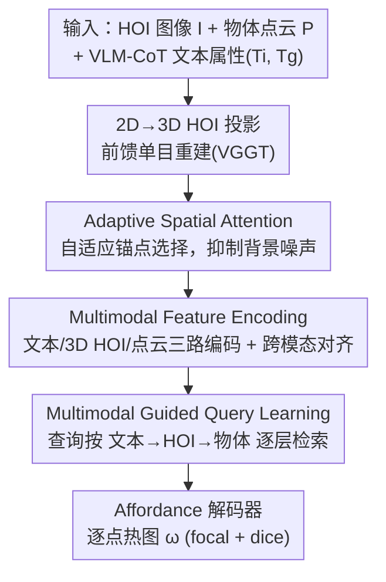

# QueryMe: Query-Driven Open-Vocabulary 3D Object Affordances Grounding from Multimodal Evidence

**会议**: CVPR 2026  
**论文**: [CVF Open Access](https://openaccess.thecvf.com/content/CVPR2026/html/Zhao_QueryMe_Query-Driven_Open-Vocabulary_3D_Object_Affordances_Grounding_from_Multimodal_Evidence_CVPR_2026_paper.html)  
**代码**: 待确认  
**领域**: 3D视觉  
**关键词**: 开放词表 affordance、3D 物体功能区域、多模态查询、HOI 图像、跨域泛化

## 一句话总结
QueryMe 把单张人-物交互（HOI）图像用前馈式单目重建投影到 3D 空间，再用一组可学习查询向量按"文本→3D HOI→物体点云"的固定顺序逐步检索证据，从而在开放词表设定下定位物体的功能区域，在未见 affordance 上 AUC 比前作 GREAT 高 4.19%。

## 研究背景与动机
**领域现状**：开放词表 3D 物体 affordance grounding 的目标是：给定任意语义描述（如"切""握"），在物体点云上标出对应的可操作区域。近期方法普遍把点云几何结构和语义标签结合，或额外引入文本描述、HOI 图像、点云的 2D 投影等多模态线索来增强先验。

**现有痛点**：这些方法大多绑定训练时见过的物体类别与几何结构，遇到没见过的物体/功能时泛化很差；同时它们往往只用视觉或只用文本单一模态，没有形成连贯的跨模态表示。更关键的是，当 affordance 知识直接从 2D HOI 图像学习时，2D 图像分布与 3D 物体功能之间存在巨大的域间隙（domain gap），知识难以可靠迁移到 3D。

**核心矛盾**：模型缺乏"几何不变性"建模（同类物体形状差异大时不稳）和"类比推理"能力（同一物体多种用法无法举一反三），而根因是 2D→3D 的跨域映射没做好——直接在 2D 学到的交互先验落到 3D 点云上会失真。

**本文目标**：(1) 缩小 2D HOI 与 3D 物体之间的域间隙；(2) 让模型对未见物体/未见 affordance 都能泛化；(3) 把视觉、语言、几何三种线索真正融成一个跨模态表示。

**切入角度**：认知心理学指出人类识别物体是"从一般几何形状到高层功能属性"逐步推进的。作者据此设计一个 3D 查询机制——以物体为条件去"检索"人类通常交互的几何区域，而不是显式地把物体配上预定义区域。借助单目前馈重建（VGGT）已经成熟，把 2D HOI 图像映射进 3D 特征空间变得可行。

**核心 idea**：先把 HOI 图像前馈重建到 3D，再用一组随物体几何采样出来的可学习查询，按固定模态顺序做跨模态注意力检索，把功能区域当作"查询命中"而非"分类预测"来定位。

## 方法详解

### 整体框架
输入是物体点云 $P \in \mathbb{R}^{N\times3}$、单张 HOI RGB 图像 $I$，以及由 VLM 通过思维链（CoT）产出的两类文本属性——交互属性 $T_i$（如"用手握住杯身倒水"）和几何属性 $T_g$（如"杯柄因符合人体工学的弧度便于抓握"）。模型 $M$ 要输出逐点的 affordance 热图 $\omega = M(H, T, P)$。

整条管线分四步：① 用前馈重建（VGGT）把 HOI 图像 $I$ 映射进 3D，得到含坐标+特征的 $H \in \mathbb{R}^{N\times6}$；② **Adaptive Spatial Attention** 在这片重建出来、夹杂大量噪声与背景的 3D HOI 空间里挑出关键交互锚点；③ **Multimodal Feature Encoding** 用独立的文本/3D HOI/点云编码器抽特征并跨模态对齐；④ **Multimodal Guided Query Learning** 用可学习查询按"文本→HOI→物体"顺序逐层检索证据，最后送进 affordance 解码器出热图。

### 关键设计

**1. 2D→3D HOI 投影：把交互先验搬进 3D 空间消除域间隙**

针对"2D HOI 图像直接学 affordance、迁到 3D 会失真"的痛点，QueryMe 不在 2D 图像域里学交互，而是先用前馈单目重建方法 VGGT 把单张 HOI 图像映射成带坐标的 3D HOI 点集 $H \in \mathbb{R}^{N\times6}$，让交互发生在和物体点云同一个 3D 度量空间里。这样手-物交互的几何结构（手怎么贴合物体、贴在哪）能被直接学习并抽象，模型遇到没见过的物体也能靠几何相似性把功能区域"类比"过去。消融里把这一支换成 ResNet18 直接抽 2D 特征后，未见 affordance 的 AUC 从 74.00 暴跌到 60.50，是所有组件里掉得最狠的，印证 3D 投影是泛化的根基。

**2. Adaptive Spatial Attention：自适应锚点抑制重建噪声**

前馈重建出来的 3D HOI 空间天然含噪、且保留大量无关背景，直接处理全部点既贵又脏。该模块（也叫 Auto-Adaptive Spatial Anchor Selection）先用全局采样保留比例 $p$ 的子集 $P_s$（$N_s = pN$），用轻量 MLP 把每个采样点坐标编码成 $d$ 维特征，再喂进 1D 卷积建模采样序列上的空间连续性与局部拓扑（避免显式建图）。卷积聚合后一个重要性预测器给每个采样点打分 $s_j$，最后把分数按距离反比权重 $w_{ij} = \frac{1}{|p_i - p_j|^2 + \varepsilon}$ 插值回全部原始点：$\hat{s}_i = \frac{\sum_j w_{ij} s_j}{\sum_j w_{ij}}$。这套"采样打分→插值回传"既保证邻近点重要性平滑、保留结构一致性，又把算力集中到几何/语义显著的交互区域。去掉它后未见 affordance AUC 从 74.00 掉到 67.85。

**3. Multimodal Feature Encoding：三路编码 + 跨模态对齐**

文本侧用两个结构相同、参数独立的 RoBERTa 分别编码交互属性 $T_i$ 和几何属性 $T_g$，并插入轻量双向 cross-attention 让两者互相 attend，得到精炼表示 $T' = \{T'_i, T'_g\}$。3D HOI 编码器按重要性分数取 top-$k$ 候选点 $P_k = \{p_i \mid \text{rank}(\hat{s}_i) \le k\}$，再均匀采样喂两层 PointNet++ 抽层级几何特征 $H'_o$，并用交互文本 $T'_i$ 作 query、$H'_o$ 作 key/value 做 cross-attention 得到交互感知表示 $H'_i = \text{CrossAttn}(T'_i, H'_o)$。物体点云用层级 PointNet++ 编码，并和几何文本 $T'_g$ 跨注意力融合得到 $P'$。三路输出 $T', H', P'$ 构成后续查询要检索的多模态记忆。

**4. Multimodal Guided Query Learning：按固定模态顺序逐层检索**

这是把"开放词表 affordance"重述成"查询命中"的核心。先用最远点采样（FPS）从物体点云取一组位置 $pos \in \mathbb{R}^{K\times3}$，初始化等量、初值为零的可学习查询 $q_0 \in \mathbb{R}^{K\times d}$，并通过 MLP 位置编码器 $\phi_{pos}$ 注入位置（作者实测 3D RoPE 在固定单帧点云上几乎无增益，MLP 编码反而更利于局部性与优化平滑）。查询数与 FPS 点数一一对应。每一层里，查询对多模态记忆 $M = \{T', H', P'\}$ 按**固定顺序 $T' \to H' \to P'$** 做 cross-attention：先注入文本先验，再注入 3D 人-物交互线索，最后注入点云中间特征，实现"从粗到细"地学习功能与交互位置；每层末尾重新注入位置并做 self-attention 抽象物体内在几何结构（残差+LayerNorm）。最终查询与点云特征 $P'$ 交互、经 sigmoid 出逐点 affordance：$\omega = \sigma(f[\text{Attention}(q, P')])$。

### 损失函数 / 训练策略
监督逐点热图，总损失为 focal loss 与 Dice loss 之和：$L_{total} = L_{focal} + L_{dice}$。无需对 affordance 类别做显式监督。训练 50 epoch，batch size 8，学习率 $1\times10^{-5}$，两张 NVIDIA L20；几何提取用 VGGT，3D backbone 用 PointNet++。

## 实验关键数据

数据集为 PIADv2（混合 3DIR / 3DAffordanceNet / Objaverse，覆盖 43 个物体类、24 个 affordance 类），按 GREAT/LASO 协议分三档：Seen（同分布）、Unseen Object（未见物体、已知功能）、Unseen Affordance（未见功能，零样本）。评测指标 AUC、aIoU、SIM（↑ 越高越好）与 MAE（↓ 越低越好）。

### 主实验

| 设定 | 指标 | GREAT（前 SOTA） | QueryMe | 提升 |
|------|------|------|------|------|
| Seen | AUC↑ | 91.99 | **92.34** | +0.35 |
| Seen | aIoU↑ | 38.03 | **39.39** | +1.36 |
| Unseen Object | AUC↑ | 79.57 | **83.03** | +3.46 |
| Unseen Object | aIoU↑ | 20.16 | **21.76** | +1.60 |
| Unseen Affordance | AUC↑ | 69.81 | **74.00** | +4.19 |
| Unseen Affordance | SIM↑ | 0.290 | **0.316** | +0.026 |

在 Seen 与两个 Unseen 设定下 QueryMe 几乎全指标领先，且越是 Unseen 越拉得开（未见 affordance AUC +4.19%），印证 3D 投影 + 多模态查询带来的泛化收益。唯一例外是 Unseen Object 的 MAE 略升（0.109→0.118），作者解释为查询机制给 affordance 区域附近少量非功能点分配了小激活分，而每个点云仅 2048 点，使 MAE 这种逐点误差被放大，但不影响整体定位精度。

### 消融实验

| 配置 | Unseen-Aff AUC↑ | Unseen-Aff SIM↑ | 说明 |
|------|------|------|------|
| 仅 query（去三模态证据） | 67.42 | 0.291 | AUC 较全模型掉 6.58 |
| + Object | 69.69 | 0.306 | 加物体点云 |
| + Object + HOI | 71.48 | 0.296 | 再加 3D HOI |
| **全模态（Obj+HOI+Text）** | **74.00** | **0.316** | 完整模型 |
| w/o Cross-Attention | 68.93 | 0.266 | 去文本-HOI/点云融合 |
| w/o Adaptive Spatial Attention | 67.85 | 0.274 | 去自适应锚点 |
| w/o 3D HOI（换 2D ResNet18） | 60.50 | 0.240 | 掉得最狠 |

### 关键发现
- **3D HOI 投影贡献最大**：把 3D HOI 换成 2D ResNet18 特征后，未见 affordance AUC 从 74.00 跌到 60.50，说明在 3D 而非 2D 学交互几何是泛化的关键。
- **三模态逐步加都涨**：Obj→+HOI→+Text 单调提升，证明查询机制确实从每个模态里挖到互补证据；三个全去掉时 Seen/Unseen-Obj/Unseen-Aff 的 AUC 分别掉 3.82/5.54/6.58，Unseen 掉得更多。
- **自适应锚点抑噪有效**：去掉后未见 affordance AUC 掉约 6 个点，验证重建空间里的背景噪声确实会干扰几何学习。

## 亮点与洞察
- **把 affordance grounding 从"分类"重述为"查询检索"**：用一组随几何采样的查询去命中功能区域，天然支持开放词表，避免绑定预定义类别。
- **2D→3D HOI 投影是点睛之笔**：借成熟的前馈单目重建（VGGT）把交互搬进 3D 度量空间，几何相似性可直接做类比推理，这套"先重建再学交互"的思路可迁移到其他需要跨 2D/3D 域的任务（如 grasp 预测、接触点估计）。
- **固定模态检索顺序（文本→HOI→物体）**是一个朴素但有效的"由粗到细"课程：先给语义先验定调，再用交互线索收紧，最后落到物体几何。

## 局限与展望
- **MAE 在 Unseen Object 上反而略升**：查询会给功能区附近少量非功能点小激活，2048 点的稀疏点云会放大这种逐点误差，热图边界的精细度仍有提升空间。
- **依赖前馈重建质量**：整条管线建立在 VGGT 重建之上，重建本身的噪声/背景靠 Adaptive Spatial Attention 缓解，但若重建严重失真（极端视角、强遮挡），上限会受限。⚠️ 论文未给出重建质量与最终精度的定量关系。
- **依赖 VLM 产出的 CoT 文本属性**：交互属性与几何属性来自 VLM 的思维链，文本质量与 VLM 能力强相关，迁到 VLM 覆盖差的物体类别时可能掉点。

## 相关工作与启发
- **vs GREAT**：GREAT 用 LLM + 几何感知做开放词表 grounding，QueryMe 沿用其 CoT 文本属性与三档评测协议，但把交互学习从隐式几何先验改成"显式 3D HOI 投影 + 多模态查询检索"，在未见 affordance 上 AUC +4.19%。
- **vs LASO / IAG**：二者靠更好地整合视觉与文本线索改善泛化，但仍受限于固定训练 taxonomy 与手工几何先验；QueryMe 用查询机制 + 3D HOI 几何把类比推理能力补上，Unseen 设定下全面领先。
- **vs 3D-AffordanceLLM / DAG**：同样想借大模型/扩散先验跨越 2D-3D 域间隙，但 QueryMe 的差异在于不依赖生成式渲染，而是直接在重建后的 3D HOI 空间做轻量查询检索，结构更紧凑。

## 评分
- 新颖性: ⭐⭐⭐⭐ 把 affordance 重述为多模态查询检索、并用前馈重建做 2D→3D HOI 投影，组合新颖但单项技术多为成熟模块拼装。
- 实验充分度: ⭐⭐⭐⭐ 三档划分 + 四指标 + 模态/组件双重消融较完整，但只在 PIADv2 单一基准上验证。
- 写作质量: ⭐⭐⭐⭐ 动机-方法-实验链条清晰，公式与算法伪码齐全，个别符号（如重建维度）排版稍乱。
- 价值: ⭐⭐⭐⭐ 未见 affordance 显著提升，对具身操作/VLA 的功能区域定位有实用价值。

<!-- RELATED:START -->

## 相关论文

- [\[CVPR 2026\] Ov3R: Open-Vocabulary Semantic 3D Reconstruction from RGB Videos](ov3r_open-vocabulary_semantic_3d_reconstruction_from_rgb_videos.md)
- [\[CVPR 2026\] OnlinePG: Online Open-Vocabulary Panoptic Mapping with 3D Gaussian Splatting](onlinepg_online_open-vocabulary_panoptic_mapping_with_3d_gaussian_splatting.md)
- [\[CVPR 2026\] HAMMER: Harnessing MLLMs via Cross-Modal Integration for Intention-Driven 3D Affordance Grounding](hammer_harnessing_mllms_via_cross-modal_integration_for_intention-driven_3d_affo.md)
- [\[CVPR 2026\] ORD: Object-Relation Decoupling for Generalized 3D Visual Grounding](ord_object-relation_decoupling_for_generalized_3d_visual_grounding.md)
- [\[CVPR 2026\] JOPP-3D: Joint Open Vocabulary Semantic Segmentation on Point Clouds and Panoramas](jopp3d_joint_open_vocabulary_semantic_segmentation.md)

<!-- RELATED:END -->
