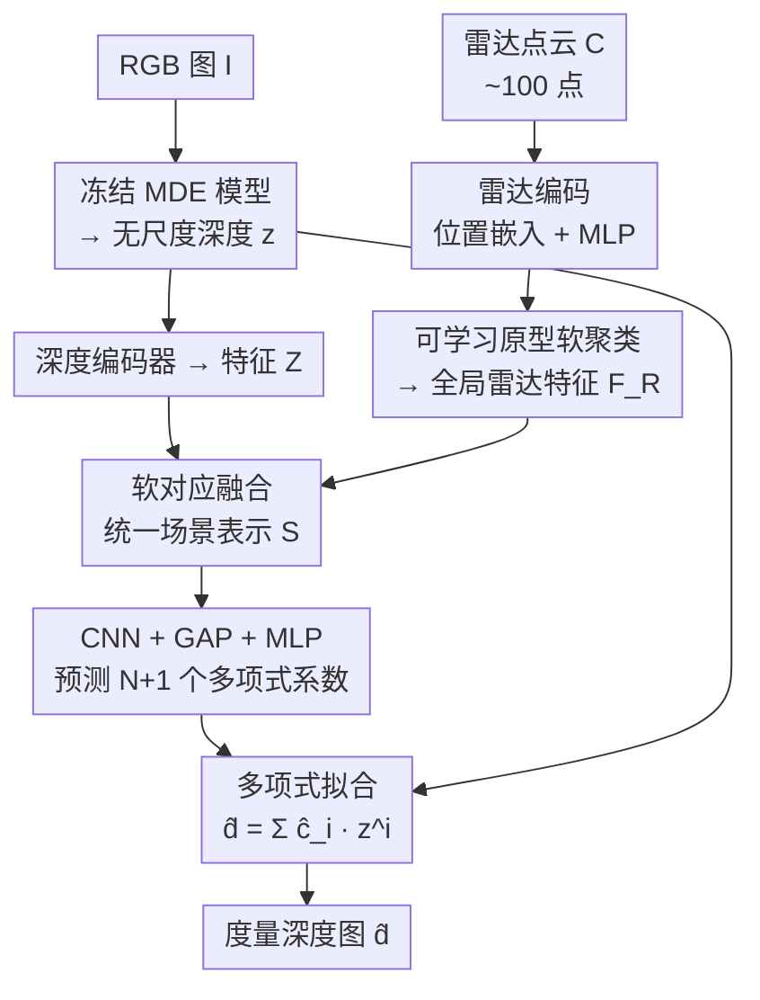

# Radar-Guided Polynomial Fitting for Metric Depth Estimation

**会议**: CVPR 2026  
**arXiv**: [2503.17182](https://arxiv.org/abs/2503.17182)  
**代码**: 无  
**领域**: 3D视觉  
**关键词**: 雷达-相机深度估计, 度量深度, 多项式拟合, 单目深度先验, 单调性正则

## 一句话总结
POLAR 把"用稀疏雷达点把无尺度的单目深度（MDE）变成度量深度"这件事重新表述成一个**多项式拟合**问题——用雷达特征预测一组多项式系数，对 MDE 深度做非均匀的逐深度修正（而非传统的全局 scale-and-shift 仿射），在三个数据集上平均把 MAE/RMSE 降了 24.9%/33.2%，同时还做到了实时（40 fps）和最低算力。

## 研究背景与动机
**领域现状**：纯单目深度估计（MDE）基础模型（DepthAnything、UniDepth 等）在海量数据上训练，能很好地推断**相对深度结构**，但天生只能给出"无尺度"的深度——单张 2D 图恢复 3D 是病态问题，缺少绝对的米制尺度。要拿到度量深度，主流做法是引入一个测距传感器（lidar / radar）。lidar 点云稠密精确但贵、耗电、恶劣天气下不稳；radar（尤其毫米波）每帧只有约一百个点、噪声大，但便宜、省电、抗雨雾、且已经标配在量产车上，是更现实的选择。

**现有痛点**：现有雷达-相机方法把 MDE 的无尺度深度往度量深度上拉时，几乎都假设"整幅场景只差一个全局尺度（和偏移）"，于是套一个全局**仿射变换** $\hat{a}z+\hat{b}$。但作者指出一个被忽视的事实：MDE 在**每个物体/局部区域内部**重建得很合理，却经常把不同物体**互相之间的相对深度摆错**。一旦有三个及以上区域被摆到错误的相对深度上，任何单一的 scale-and-shift 都无法同时把它们都对齐——因为仿射变换的曲线是一条直线，**零个拐点**，没有"在不同深度段做不同力度修正"的自由度。

**核心矛盾**：要修跨区域错位，就需要一个能在不同深度段做**非均匀**拉伸/压缩的变换；但如果干脆去回归每个像素的尺度（自由度 = 像素数 ~$10^6$），而约束只有几百个雷达点（~$10^2$），系统严重欠定、不稳，容易把原本对的结构也拟合坏。自由度太低（仿射，2 个）又过约束。

**切入角度 + 核心 idea**：在"仿射（2 自由度，欠表达）"和"逐像素尺度（$10^6$ 自由度，欠定）"之间找中间地带——把变换写成关于 MDE 深度 $z$ 的 $N$ 阶**多项式** $\hat{d}=\sum_{i=0}^{N}\hat{c}_i z^i$，自由度恰好是 $N{+}1$ 项系数，经验上接近雷达点的数量级，于是问题"恰好适定"。低阶项管全局尺度，高阶项引入最多 $N{-}2$ 个**拐点**来修跨区域错位。系数由雷达+MDE 的多模态特征预测，并用一个一阶导正则保住局部单调性。一句话：**用雷达预测的多项式系数代替全局仿射，把无尺度深度非均匀地掰成度量深度。**

## 方法详解

### 整体框架
POLAR 的输入是一张 RGB 图 $I$ 和一帧同步的雷达点云 $C\in\mathbb{R}^{N_C\times 3}$，输出是度量深度图 $\hat{d}$。整条管线只做一件事：**预测一组多项式系数，把冻结 MDE 给出的无尺度深度 $z$ 拟合成度量深度**。具体分四步串起来：(1) 用冻结的 MDE 基础模型 $M$ 推出无尺度深度 $z$，作为几何先验，省去采集大规模雷达-相机配对数据；(2) 雷达分支把稀疏点云编码、并用一组**可学习原型**软聚类成全局雷达特征 $F_R$；(3) 把 MDE 深度特征 $Z$ 和雷达特征 $F_R$ 通过**软对应（soft-correspondence）注意力**融合成统一场景表示 $S$；(4) $S$ 经浅层 CNN + 全局平均池化压成场景向量，再由 MLP 预测 $N{+}1$ 个多项式系数 $\hat{c}$，最后对 $z$ 的各次幂加权求和得到 $\hat{d}$。整个网络是**单阶段**的，不像以往方法那样要多阶段训练、显式学雷达-像素关联，所以又快又省。

### 关键设计

**1. 多项式拟合：用拐点修仿射修不了的跨区域错位**

这是全文的根。作者把"无尺度→度量"的变换从仿射 $\hat{a}z+\hat{b}$ 升级为 $N$ 阶多项式

$$\hat{d}(x,y)=\sum_{i=0}^{N}\hat{c}_i\cdot z(x,y)^i.$$

几何上，仿射变换是一条直线、零拐点，只能把整幅深度场按同一个系数整体拉伸；而 $N$ 阶多项式的二阶导 $f''(z^*)=\sum_{i=2}^{N}i(i{-}1)\hat{c}_i (z^*)^{i-2}=0$ 可以有最多 $N{-}2$ 个零点，也就是最多 $N{-}2$ 个**拐点**——曲率能在不同深度段翻转。这就让变换具备了"哪段深度该多修、哪段几乎不动"的能力：低阶系数（含 scale、shift）负责全局尺度，高阶系数负责局部修正——既能修跨物体的低频错位（图1 的把一个物体整体挪到正确深度），也能锐化物体边界的高频误差。系数符号还自带可解释性：高阶项正系数把该深度区间往外推、负系数往里压，相当于在需要的地方动态制造拐点。关键在于它把自由度从仿射的 2 个、逐像素的 $10^6$ 个，收到 $N{+}1$ 个——经验上接近雷达点数量级，让拟合从"欠定/过定"变成"恰好适定"，而且相比仿射只是让最后那个 MLP 多输出几维、算力增加 <0.01% FLOPs，几乎免费。

**2. 可学习原型做雷达聚合：从又稀又噪的点云里抽出稳定模式**

雷达点云只有约一百个点、噪声大、还有多径、仰角模糊等问题，直接编码+池化（像 RadarNet、RadarCam 那样）容易被离群点带偏。POLAR 先给每个点拼上正弦 3D 位置嵌入、过 MLP $\psi_r$ 得到点特征 $F_r$，再引入一组**可学习原型** $P\in\mathbb{R}^{N_P\times c_r}$ 当作"质心"，对雷达特征做**软聚类**：

$$D_{ij}=\|P_j-\Phi_r(F_r)_i\|^2,\quad F_R=\sigma(-D/\tau)\,\Psi_r(F_r),$$

其中 $\sigma$ 是 softmax，每个雷达点按特征相似度被软分配到各原型上，再聚合成全局场景描述 $F_R$。这样做的好处是原型会学到雷达点配置里"反复出现的空间/几何模式"，做的是**选择性聚合**——把有意义的模式匹配出来、压住离群点的影响，而不是无差别地把噪声一起 pool 进去。消融里把原型换成自注意力、或把聚合换成 cross-attention 都明显掉点，说明这套"原型软聚类"确实更适配雷达点云的稀疏与噪声。

**3. 软对应融合：让雷达的米制线索对齐到 MDE 的几何结构上**

要预测系数，得先把"雷达带来的绝对尺度"和"MDE 带来的稠密几何结构"融到一起。MDE 深度图 $z$ 先过深度编码器 $f_z$ 得特征 $Z$；这些特征继承了大规模训练带来的不变性（对光照、外观、视角鲁棒），主要编码**物体级几何**，比逐像素颜色稳定得多。于是作者在 $Z$ 和雷达特征 $F_R$ 之间学一个**软空间对应**（本质是一层 cross-attention）：

$$S=\mathrm{softmax}\!\left(\frac{(Z+E)\,(\Phi_R(F_R))^T}{\sqrt{c_r}}\right)\Psi_R(F_R),$$

$E$ 是可学习 2D 位置嵌入，$c_z$ 设成等于 $c_r$ 让两路特征落在同一嵌入空间。这一步的意义是：把雷达点配置匹配到"稳定可见的形状/表面"上，而不是匹配到会随光照视角乱变的像素颜色上，得到的统一表示 $S$ 既有结构又有米制锚点，是后续预测系数的基础。$S$ 再过浅 CNN $f_s$ + 全局平均池化得到场景向量 $\bar S$，最后 MLP $\psi_s$ 输出 $\hat{c}=\psi_s(\bar S)\in\mathbb{R}^{N+1}$。

**4. 一阶导单调性正则：给高阶多项式套上"别把深度序搞反"的缰绳**

高阶多项式表达力强，但函数空间巨大，若不约束极易产生**非单调**的有害变换——把同一物体内本该"近→远"的深度序拟合反、或在噪声雷达点上产生剧烈振荡（高次多项式的经典毛病）。作者在 L1+L2 监督之外加了第三项，约束预测深度对输入 $z$ 的一阶导接近 1：

$$\mathcal{L}=\lambda_1\|\hat{d}-d\|_1+\lambda_2\|\hat{d}-d\|_2^2+\lambda_m\Big\|\mathbf{1}_{H\times W}-\frac{\mathrm{d}\hat{d}}{\mathrm{d}z}\Big\|_1,\qquad \frac{\mathrm{d}\hat{d}}{\mathrm{d}z}=\sum_{i=1}^{N}i\,\hat{c}_i\,z^{i-1}.$$

直觉是：在一个物体/局部区域内部，初始深度更大的像素，最终度量深度不应反而更小——这等价于让多项式**近似分段单调递增**（类似 isotonic regression 的归纳偏置），前提是相信 MDE 对物体内相对深度估得基本对。它在"保住局部序"和"允许跨区域修正"之间取得平衡，把振荡压住的同时仍放行必要的非均匀矫正。消融显示去掉这项掉点最猛（见下表），是稳定多项式拟合的关键。

### 损失函数 / 训练策略
损失即上式三项加权和：$L_1$（鲁棒、抗离群）、$L_2$（重罚大误差）保证逼近真值，$\lambda_m$ 的一阶导项保单调。MDE 主干冻结（如 UniDepth），只训雷达分支、融合模块与系数预测头；多项式阶数 $N$ 作为超参（默认 8）。训练高效——单卡 A6000 上每 epoch 仅 33.16 分钟，是所有基线里最快的。

## 实验关键数据

### 主实验
在 nuScenes、ZJU-4DRadarCam（ZJU）、View-of-Delft（VoD）三个数据集、最大评测距离 50/70/80m 下，用 MAE/RMSE 评测（越低越好）。下表摘 80m 处的代表结果：

| 数据集 (80m) | 指标 | POLAR | 此前最好基线 | 提升 |
|--------|------|------|----------|------|
| nuScenes | MAE / RMSE | **1407.8 / 3193.5** | TacoDepth 1492.4 / 3324.8 | ↓ |
| ZJU | MAE / RMSE | **629.6 / 1171.3** | RadarCam 1183.5 / 3229.0 | 大幅↓ |
| VoD | MAE / RMSE | **1500.1 / 3951.8** | RadarCam 2227.4 / 5385.8 | 大幅↓ |

平均看：相对最强基线，nuScenes 上 MAE/RMSE 降 4.4%/3.7%，ZJU 上降 38.5%/57.5%，VoD 上降 31.8%/38.5%；跨三数据集平均 MAE↓24.9%、RMSE↓33.2%。

**效率**（nuScenes，单 A6000）：

| 指标 | POLAR | TacoDepth | RadarCam-Depth |
|------|-------|-----------|----------------|
| 推理时延 (ms) | **24.81** | 29.30 | 315.64 |
| 算力 (GFLOPs) | **89.70** | 139.87 | 619.02 |
| 训练 (min/epoch) | **33.16** | — | 86.38 |

推理 24.81 ms ≈ 40.3 fps（比 TacoDepth 快 15.3%、比 RadarCam 快 92.1%），算力比 TacoDepth 省 39.5%、比 RadarCam 省 85.5%。即"最准 + 最快 + 最省"三冠。

### 消融实验
| 配置 (nuScenes / VoD, MAE) | nuScenes | VoD | 说明 |
|------|---------|------|------|
| 完整模型 | 1407.8 | 1500.1 | — |
| 去 monotonicity loss | 1921.1 | 1924.5 | 去一阶导单调正则，掉最多 |
| 用 cross-modality att. 替融合 | 2238.8 | 2147.9 | 软对应融合换普通跨模态注意力 |
| direct decoding（解码头回归深度） | 1968.0 | 1855.9 | 不做多项式、直接逐像素回归 |
| 去 learnable prototypes | 1615.5 | 1619.3 | 原型软聚类换自注意力 |
| 去 feature aggregation（换 cross-attn） | 1454.1 | 1543.1 | 聚合公式(2)换 cross-attention |

多项式阶数敏感性（nuScenes / ZJU MAE）：阶 1（=仿射）2156.8 / 1078.2 → 阶 8 **1407.8 / 629.6**（最优）→ 阶 10 反弹到 1463.7 / 643.3。

### 关键发现
- **单调性正则贡献最大**：去掉它 nuScenes MAE 从 1407.8 飙到 1921.1，证明"保局部深度序"是高阶多项式能稳的命门。
- **阶数有甜点**：从仿射（阶1）一路涨到阶 8 单调变好，阶 10 反而退化——印证高次多项式的振荡风险，需把阶数当超参调。
- **多项式表述本身关键**：换成 direct decoding 逐像素回归大幅变差，因为约束（稀疏雷达点）远少于自由度（像素数），系统欠定。

## 亮点与洞察
- **把"传感器融合补全"重新表述成"多项式场景拟合"**：最妙的一招是用一个标量函数 $\hat{d}=\sum\hat{c}_i z^i$ 统一了 scale-shift（阶1）和逐像素回归（阶∞）两个极端，靠选阶数精确控制自由度，让欠定问题变适定。这种"用函数复杂度匹配观测稀疏度"的思路可迁移到任何"稀疏监督拟合稠密预测"的场景。
- **拐点 = 可解释的修正旋钮**：把"修跨区域错位"翻译成"在曲率该翻转处制造拐点"，系数符号直接对应"推远/拉近"，给了一个少见的可解释深度修正视角。
- **一阶导正则当作软 isotonic 约束**：用 $\|\mathbf{1}-\mathrm{d}\hat d/\mathrm{d}z\|_1$ 把"保单调"做成可微正则，既驯服了高次多项式的振荡，又不写死单调（仍允许跨区域翻序），是个干净可复用的 trick。
- **冻结 MDE + 轻量头**：把昂贵的大模型当几何先验冻住，只训一个极轻的雷达-融合-系数头，是它同时拿下精度和效率的根本原因。

## 局限性 / 可改进方向
- 作者承认：多项式阶数是需要逐数据集调的超参（不同场景最优阶可能不同），缺一个自适应选阶机制。
- 一阶导正则虽压住了振荡，但作者也说还可加更强约束进一步稳住高阶拟合。
- 自己看：方法本质是一个**全局**标量映射 $z\mapsto\hat d$——同一个 $z$ 值在图像不同位置会被映成同一深度，若两个不同区域恰好 MDE 深度相近但真值差很多，单条多项式曲线无法把它们分开；这也是为什么它依赖 MDE 把物体内相对深度估对。
- 评测全在驾驶场景（nuScenes/ZJU/VoD），室内、低速、非车载雷达配置下的泛化未验证。

## 相关工作与启发
- **vs 全局仿射类（scale-and-shift 方法）**：它们假设全场景只差一个尺度+偏移（零拐点），修不了三区域以上的相对错位；POLAR 用多项式引入拐点，从根上突破仿射的表达上限。
- **vs RadarCam-Depth（逐像素 scale map）**：RadarCam 回归每像素尺度，自由度 = 像素数，约束只有稀疏雷达点 → 欠定，容易把原本对的 MDE 结构拟合坏、甚至漏掉整栋楼/吊臂。POLAR 把自由度收到 $N{+}1$ 项，既稳又轻。
- **vs RadarNet / GET-UP（补全/直接解码 + 显式雷达-像素关联）**：这类方法多阶段训练、显式学关联，复杂且慢（GET-UP 推理 445ms）；POLAR 单阶段直接预测系数，绕开关联学习，24.81ms 实时。
- **vs lidar 深度补全**：作者指出直接把 lidar 补全方法搬到雷达上效果很差（雷达比 lidar 稀疏几个数量级且更噪），所以才需要原型软聚类这种针对雷达噪声特性的设计。

## 评分
- 新颖性: ⭐⭐⭐⭐⭐ 首次把雷达-相机度量深度表述为多项式场景拟合，用拐点统一仿射与逐像素两个极端，洞察干净。
- 实验充分度: ⭐⭐⭐⭐ 三数据集 × 三距离 + 精度/效率/阶数/模块消融齐全；但仅驾驶场景，缺跨域（室内/非车载）验证。
- 写作质量: ⭐⭐⭐⭐⭐ 几何直觉（拐点、自由度配比）讲得透彻，动机到方法逻辑链顺畅。
- 价值: ⭐⭐⭐⭐⭐ 最准+最快+最省、几乎零额外算力，实时车载部署友好，工程价值高。

<!-- RELATED:START -->

## 相关论文

- [\[CVPR 2026\] The Midas Touch for Metric Depth](the_midas_touch_for_metric_depth.md)
- [\[CVPR 2026\] MD2E: Modeling Depth-to-Edge Cues for Monocular Metric Depth Estimation](md2e_modeling_depth-to-edge_cues_for_monocular_metric_depth_estimation.md)
- [\[CVPR 2026\] UniDAC: Universal Metric Depth Estimation for Any Camera](unidac_universal_metric_depth_estimation_for_any_camera.md)
- [\[CVPR 2026\] LiteSense: Lifting Lightweight ToF with RGB for High-Resolution Metric Depth Estimation](litesense_lifting_lightweight_tof_with_rgb_for_high-resolution_metric_depth_esti.md)
- [\[CVPR 2026\] Depth Hypothesis Guided Iterative Refinement for Event-Image Monocular Depth Estimation](depth_hypothesis_guided_iterative_refinement_for_event-image_monocular_depth_est.md)

<!-- RELATED:END -->
