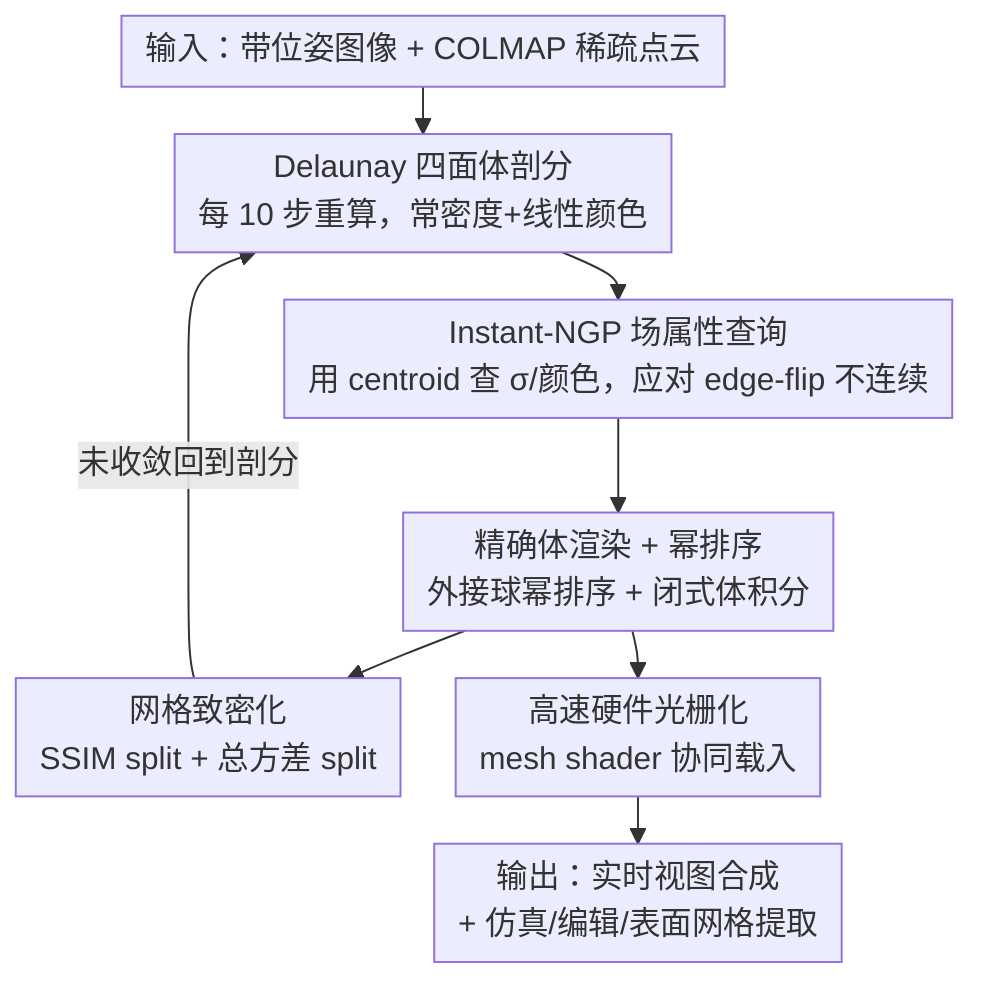

# Radiance Meshes for Volumetric Reconstruction

**会议**: CVPR 2026  
**论文**: [CVF Open Access](https://openaccess.thecvf.com/content/CVPR2026/html/Mai_Radiance_Meshes_for_Volumetric_Reconstruction_CVPR_2026_paper.html)  
**代码**: 待确认（论文提供桌面/Web 光栅器与光追参考实现）  
**领域**: 3D视觉  
**关键词**: 辐射场、Delaunay 四面体、体渲染、硬件光栅化、实时视图合成

## 一句话总结
Radiance Mesh 用 Delaunay 四面体剖分把场景切成"常密度+线性颜色"的四面体单元来表示辐射场，配合按外接球幂排序的精确体渲染与一套新颖的网格着色器（mesh shader）光栅化，在质量逼近 3DGS 的同时实现比它更快、且无 popping 的实时视图合成，并天然兼容仿真/编辑/表面网格提取等图形生态。

## 研究背景与动机
**领域现状**：自 NeRF 以来辐射场成为 3D 重建主流。模型设计长期受一条权衡支配——渲染快的表示（如不透明三角网格）难优化，优化稳的表示（如 MLP）渲染慢。3DGS 是这条曲线上很好的折中点：渲染快、易接入现有图形生态。

**现有痛点**：3DGS 仍有四个硬伤——① 为高帧率做的体渲染近似会产生 popping（视角切换时图元忽隐忽现）；② 超广角/鱼眼等复杂相机模型下 splatting 很困难；③ splat 难编辑；④ 虽快于多数辐射场，但仍远慢于传统基于网格的实时渲染。新近的 Radiant Foam（RadFoam）用可优化 3D Voronoi 图剖分空间、能快速光追，但 Voronoi 单元平均有 15.5 个面，要光栅化得把每个面镶嵌成几十个三角形，开销过大；而且求单元透明度要在片元着色器里遍历所有邻居找到背面距离，非常贵。

**核心矛盾**：要"既能用硬件三角光栅器/光追器（图形生态原生支持三角形）、又能做精确体渲染（无 popping）"，但能直接优化顶点位置的几何表示一旦动点就会改变拓扑（边翻转 edge flip），导致从顶点位置到网格拓扑的映射不连续，优化会被打断——这正是 RadFoam 当年考虑 Delaunay 却放弃的原因。

**本文目标**：用一种原生由三角形构成、面数固定、可精确体渲染、且顶点位置能无约束优化的表示，同时拿到"网格的快"和"辐射场的好优化"。

**切入角度**：Voronoi 的对偶是 Delaunay 四面体剖分，后者的单元全是四面体（4 个三角面，面数固定），天生被硬件支持；点动了只需每隔几步重算三角剖分即可，顶点可无约束优化。关键是解决 edge flip 带来的拓扑不连续。

**核心 idea**：给每个 Delaunay 四面体赋"常密度 + 线性变化颜色"构成 radiance mesh；把密度/颜色这些非空间属性交给一个 Zip-NeRF 风格的 Instant-NGP 场来参数化（而非绑在顶点上），从而即使拓扑翻转、场依然平滑可优化。

## 方法详解

### 整体框架
输入是带位姿的图像集合 + 稀疏初始点云（COLMAP SfM）。优化时场景由一组 3D 点 $\{v_i\}$ 和一个 Instant-NGP 数据结构 $G_\theta$ 表示。每 10 步重算一次 $\{v_i\}$ 的 Delaunay 三角剖分，得到不重叠的四面体集合 $\{T_k\}$；因为点在动，四面体会动态生灭，所以用 $G_\theta$ 查询每个四面体的密度 $\sigma_k$、球谐基色 $c^0_k$ 与线性颜色梯度 $\nabla c_k$。渲染时先按外接球幂对四面体排序，对每条射线在每个四面体内做闭式体积分，用硬件光栅器从前到后混合出像素颜色。优化中通过两类 split 分数做网格致密化（densification）补细节。

### 关键设计

**1. Radiance Mesh 表示：常密度+线性颜色的 Delaunay 四面体**

针对"想要三角形原生、面数固定、又能精确体渲染"的矛盾，本文给每个 Delaunay 四面体 $T_k$ 赋一个常密度 $\sigma_k$ 和一个线性变化的颜色场：内部任意点 $p$ 的颜色为 $c_k(p) = c^0_k + \nabla c_k \cdot (p - O_k)$，$O_k$ 取外接圆心或质心。因为密度恒定、颜色线性，射线穿过四面体区间 $[t^{in}_k, t^{out}_k]$ 的体渲染积分 $\Delta C_k = \int_{t^{in}_k}^{t^{out}_k} e^{-\sigma_k(t-t^{in}_k)} c_k(r(t))\,\sigma_k\,dt$ 有**闭式解**，只依赖入/出点颜色与密度，不需数值积分采样。整组四面体可用外接球幂 $P(T) = \|O(T) - o\|_2^2 - R(T)^2$ 对相机原点 $o$ 做基数排序（radix sort）从前到后排好，再用硬件混合算 $C = \sum_k w_k \Delta C_k,\ w_k = \prod_{l<k}(1-\alpha_l)$。由于全是三角形且面数固定，可直接吃硬件三角光栅器/光追器，做到精确可见性，从根上杜绝 3DGS 因排序近似导致的 popping 与光度不一致。

**2. Instant-NGP 场属性查询：用 centroid 化解 edge-flip 不连续**

把密度/颜色绑在顶点上会出大问题：顶点微动触发边翻转时，拓扑突变会让重心插值的颜色不连续，优化无法平滑（消融里"No Instant-NGP"直接崩）。本文改为优化一个由 Instant-NGP + mip-NeRF 360 收缩函数参数化的**场**，对每个四面体用一个中心点去查它。四面体是体而 NGP 吃点，故仿 Zip-NeRF 用外接半径 $R_k$ 做预滤波下权 $b_k \leftarrow \phi(R_k)\circ G_\theta(O_k)$，再经浅层 head 出 $\sigma_k,\ c^0_k,\ \nabla c_k$。中心点有两个候选：**外接圆心**在边翻转瞬间对参与翻转的四面体重合，使函数连续，但四面体变扁时条件数极差、圆心会剧烈移动；**质心**不连续但数值条件好得多，靠同样的 $R_k$ 下权滤波来弥补不连续。实验证明 centroid 更优（PSNR 27.89 vs circumcenter 27.79）。颜色梯度还加了激活把每四面体内的负向变化限制在 $-\min c_k$ 内，并复用单通道（mono）梯度省 30% 着色器内存读取。

**3. 网格致密化：SSIM split + 总方差 split 双判据**

类似 3DGS 靠图元对渲染的贡献来增删点，但本文只做致密化（加点）：每 500 步在采样的 $M$ 张训练图上算两类分数选四面体"分裂"，再在选中四面体里挑插入点。① **SSIM split** $S_k$（基于 Error-Based Densification）把每像素的 SSIM 误差按贡献权重 $w_k\alpha_k$ 反投到所有贡献该像素的图元上累积，取跨图 top-2 误差的均值，$S_k > 0.5$ 的图元被选——top-2 是因为三角化一个图元至少需两个视角。它主导大部分致密化决策但对"一开始就低密度"的薄结构失效。② **总方差 split** $T_k$ 把每个四面体当作其体内辐射的估计器，算残差 $\delta = C - C_{gt}$ 的加权方差 $\sigma^2_k$ 再乘以总误差权重，$T_k > 2.0$ 的被选，专门补薄结构。插入点不用均匀采样（大四面体刚擦到表面时随机点几乎都落空），而是取两张最高误差视角对应射线的近似交点，越界则回退到随机点。

**4. 高速硬件光栅化：mesh shader 协同载入消除重复读取**

为了用硬件三角光栅器画四面体体积，过去做法发射 2-3 个三角形再插值透明度，但发射可变量几何很慢。本文改为发射**重复但静态**的几何（每面复制两次、每顶点按所连四面体数复制），靠光栅管线自行筛选；并且不插值透明度，而是插值到背面的距离。无 mesh shader 时退化为 instanced shader：为每个四面体画一条三角带实例，顶点着色器用实例索引载入四面体属性和平面方程，代价是每个四面体被载入 4 次。有 mesh shader 时，一个线程块能协同生成网格数据直送光栅器，借 warp shuffle 让顶点共享载入数据，使每个四面体只载一次——消融显示"tile-based → instanced → mesh shader"逐级显著提速。

### 损失函数 / 训练策略
按标准体渲染重建损失优化场 $G_\theta$ 与点集 $\{v_i\}$；每 10 步重建一次 Delaunay 剖分、每 500 步做一次致密化。可微渲染器用 Slang.D 实现为 tile-based 以便跨顶点/片元着色器追导数；Vulkan 渲染器用 C++/Slang 支持 mesh shader（最快路径）；Web viewer 用 JavaScript+WebGPU 做 instanced 渲染。

## 实验关键数据

在 mip-NeRF 360 的 9 个场景 + DeepBlending/Tanks&Temples 的 4 个场景上评测，对比 3DGS、EVER、SVRaster、RadFoam、Triangle Splatting。GPU-hr 在 RTX4090 上测，FPS 在各数据集测试分辨率下测（本文 FPS 还含显示到帧缓冲的时间，更贴近实际使用）。

### 主实验（质量 + 速度）

| 数据集 | 指标 | 3DGS | RadFoam | 本文 |
|--------|------|------|---------|------|
| mip360 室外 | PSNR↑ | 24.63 | 23.90 | 24.64 |
| mip360 室内 | PSNR↑ | 31.05 | 30.66 | 30.31 |
| T&T+DB | PSNR↑ | 26.65 | 19.20 | 26.53 |
| mip360 室外 | FPS↑ | 145 | 234 | **240** |
| mip360 室内 | FPS↑ | 251 | 162 | **384** |
| T&T+DB | FPS↑ | 535 | 353 | 475 |

质量上本文全面超过最相似基线 RadFoam（尤其 T&T+DB，RadFoam 因数值不稳几乎重建失败 PSNR 仅 19.20，本文 26.53），逼近 3DGS；速度上普遍快于所有基线，在 1440p 下比原版 3DGS 快 32%，光追在 mip360 室内场景比 RadFoam 快 17%。显存上 RadFoam 在 RTX4090(24GB) 约 330 万单元就 OOM，本文可支持约 1500 万四面体。

### 消融实验（bicycle + room 场景）

| 配置 | PSNR↑ | SSIM↑ | LPIPS↓ | 说明 |
|------|------|------|------|------|
| 完整模型 | **27.89** | **0.830** | **0.301** | — |
| No SSIM Splitting | 26.92 | 0.751 | 0.417 | 掉得最狠，纹理细节丢失 |
| No Total Var Splitting | 27.59 | 0.825 | 0.312 | 薄结构丢失 |
| No Instant-NGP（属性绑顶点） | 27.25 | 0.787 | 0.360 | 拓扑翻转致优化崩坏 |
| Constant Color（恒定色替线性色） | 27.68 | 0.813 | 0.324 | 小幅下降 |
| No Downweighting | 27.68 | 0.826 | 0.307 | 轻微下降 |
| No Centroid（改用外接圆心） | 27.79 | 0.826 | 0.310 | 数值条件差，略逊 |

### 关键发现
- **SSIM split 贡献最大**：去掉后 PSNR 从 27.89 跌到 26.92、SSIM 0.830→0.751，主要影响纹理；总方差 split 影响较小但专管薄结构。
- **Instant-NGP 场不可省**：把属性直接绑顶点会因 edge-flip 拓扑翻转使优化变坏（PSNR 掉 0.64），印证"用场而非顶点参数化属性"是化解拓扑不连续的关键。
- **着色器实现决定速度**：tile-based → instanced 硬件三角光栅器 → mesh shader，逐级显著提速，mesh shader 通过消除重复图元载入再提一档。

## 亮点与洞察
- **把 Voronoi 的对偶 Delaunay 直接拿来当辐射场表示**：RadFoam 嫌弃 Delaunay 拓扑不连续而选 Voronoi，本文反其道——既然四面体面数固定、原生三角形对硬件友好，那就用 Instant-NGP 场来吸收拓扑不连续，鱼与熊掌兼得。
- **常密度+线性色 → 体积分有闭式解**：这是"精确体渲染 + 硬件光栅化"能同时成立的数学基础，比 3DGS 的近似 alpha 合成更干净，从根上消除 popping。
- **mesh shader 协同载入**这一系统级优化很实用：用静态重复几何 + warp shuffle 共享载入，把四面体光栅化做到比 3DGS 还快，且代码可迁到 Web/光追。
- 输出是真·三角网格，天然接图形生态：可做 PBD/xPBD 物理仿真、布尔编辑、阈值提取水密表面网格、鱼眼/畸变相机渲染。

## 局限与展望
- **训练开销偏高**：GPU-hr 明显高于多数基线（如室外 4.515 vs 3DGS 0.609、SVRaster 0.194），频繁重算 Delaunay 剖分 + NGP 查询的代价不小。
- **质量略逊 3DGS/SVRaster**：室内 PSNR（30.31）低于 3DGS（31.05），追求极致画质的场景仍有差距，⚠️ 论文未深入分析质量差距来源。
- **centroid 查询不连续仍靠下权缓解**：选了数值条件更好的质心而非数学连续的外接圆心，本质是用滤波近似掩盖不连续，极端扁四面体下可能仍有隐患。
- **依赖 COLMAP 初始化与定期重剖分**：管线对初始稀疏点云与剖分频率（每 10 步）有依赖，超大规模场景下重剖分频次/显存仍是工程约束。

## 相关工作与启发
- **vs RadFoam（最相似基线）**：RadFoam 用 3D Voronoi + 光追，单元平均 15.5 面、光栅化代价高且求背面距离要遍历邻居；本文用其对偶 Delaunay 四面体（4 面固定），可硬件光栅化，质量更高、优化更稳（T&T+DB 上 RadFoam 几乎崩、本文 26.53），显存上限高约 4.5 倍。
- **vs 3DGS**：3DGS 画质略高但有 popping、复杂相机困难、难编辑、慢于网格渲染；本文精确可见性无 popping、1440p 快 32%、原生三角网格易编辑/仿真。
- **vs EVER / SVRaster**：二者也做精确体渲染、画质高，但渲染更慢、可移植性差（EVER 室内仅 66 FPS）；本文在保持精确积分的同时大幅提速并跨桌面/Web/光追可移植。

## 评分
- 新颖性: ⭐⭐⭐⭐⭐ 用 Delaunay 四面体当辐射场、靠 NGP 场吸收拓扑不连续 + 闭式体积分 + mesh shader 光栅化，是一条清晰且少有人走通的新路。
- 实验充分度: ⭐⭐⭐⭐ 三数据集质量/速度/显存对比 + 多维消融 + 着色器实现对比较扎实，但训练开销与质量差距分析略浅。
- 写作质量: ⭐⭐⭐⭐ 推导完整、图示丰富，公式密度高，部分系统实现细节放在补充材料。
- 价值: ⭐⭐⭐⭐⭐ 无 popping 的实时辐射场 + 原生三角网格 + 跨平台（含 Web/光追）+ 接入物理仿真/编辑，工程落地价值很高。

<!-- RELATED:START -->

## 相关论文

- [\[CVPR 2026\] Color-Encoded Illumination for High-Speed Volumetric Scene Reconstruction](color-encoded_illumination_for_high-speed_volumetric_scene_reconstruction.md)
- [\[CVPR 2026\] Volumetric Functional Maps](volumetric_functional_maps.md)
- [\[CVPR 2025\] Volumetric Surfaces: Representing Fuzzy Geometries with Layered Meshes](../../CVPR2025/3d_vision/volumetric_surfaces_representing_fuzzy_geometries_with_layered_meshes.md)
- [\[CVPR 2026\] MozzaVID: Mozzarella Volumetric Image Dataset](mozzavid_mozzarella_volumetric_image_dataset.md)
- [\[CVPR 2026\] SMVRT: Implicit Human 3D Modeling Using Sparse Multi-View Volumetric Reconstruction with Transformer Fusion](smvrt_implicit_human_3d_modeling.md)

<!-- RELATED:END -->
