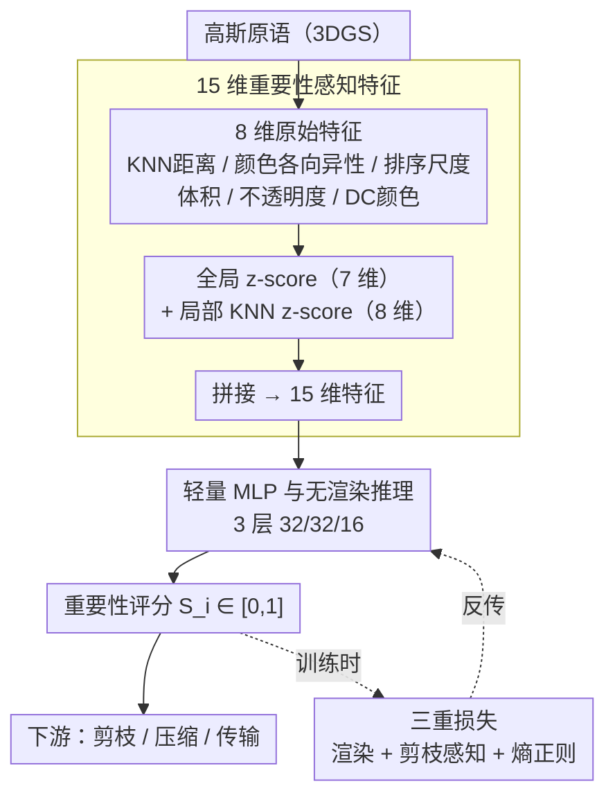

# RAP: Fast Feedforward Rendering-Free Attribute-Guided Primitive Importance Score Prediction for Efficient 3D Gaussian Splatting Processing

**会议**: CVPR 2026  
**arXiv**: [2602.19753](https://arxiv.org/abs/2602.19753)  
**作者**: Kaifa Yang, Qi Yang, Yiling Xu, Zhu Li (上海交大, UMKC)  
**代码**: [GitHub](https://github.com/yyyykf/RAP)  
**领域**: 3D视觉  
**关键词**: 3D Gaussian Splatting, 重要性评估, 无渲染推理, 前馈预测, 剪枝

## 一句话总结

提出 RAP，一种无需渲染的前馈式高斯原语重要性评分方法，通过从内在属性和局部邻域统计量提取 15 维特征，用轻量 MLP 预测重要性评分，训练一次即可泛化到未见场景。

## 背景与动机

3DGS 产生的大量原语中，贡献度差异极大。估计原语重要性对剪枝、压缩和传输至关重要。现有方法存在显著局限：

- **基于属性的启发式**（如透明度阈值）：过于简单，忽略原语间的遮挡和交互
- **基于渲染的方法**（如 LightGaussian, EAGLES）：依赖多视图渲染，时间随视图数线性增长，对视图选择敏感，需专用光栅化器
- **基于学习的方法**（如可学习 mask）：与具体重建框架耦合，场景修改后需重训

## 核心问题

能否绕过渲染直接从高斯原语的内在属性预测其重要性，从而实现快速、即插即用、可泛化的重要性评估？

## 方法详解

### 整体框架

RAP 要给 3DGS 里成千上万个高斯原语各打一个重要性分，供剪枝、压缩、传输使用，但它刻意绕开了"渲染—比对"那条又慢又挑视图的老路。整条流水线只做两件事：先为每个高斯从自身属性和局部邻域统计中抽出一个 15 维特征向量，再用一个轻量 MLP 一次性把它回归成 $[0,1]$ 的重要性评分 $S_i$。这个 MLP 在 10 个场景上训练一次，之后套到任何未见场景推理时**完全不需要渲染**；三重损失只在训练阶段提供监督，推理时不参与。

### 关键设计

**1. 15 维重要性感知特征：把"哪个原语该留"写进属性统计**

基于属性的启发式（如透明度阈值）太粗，忽略了原语间的遮挡与交互；基于渲染的方法又得多视图光栅化、时间随视图数线性增长。RAP 的出发点是冗余原语在属性上本就有迹可循，于是先为每个高斯算 8 维原始特征

$$\mathbf{F}_i^{raw} = \{d_i, A_i, s_{0,i}, s_{1,i}, s_{2,i}, V_i, o_i, C_i\}$$

其中 $d_i$ 是 KNN 平均距离（衡量空间隔离度），$A_i$ 是颜色各向异性（随机采样 $M$ 个方向算 RGB 标准差），$s_{0,i}\le s_{1,i}\le s_{2,i}$ 是排序后的尺度（保证旋转不变），$V_i = s_0 \times s_1 \times s_2$ 是高斯体积，$o_i$ 是不透明度，$C_i$ 是 DC 颜色（零阶 SH 均值）。接着对每个特征同时做全局和局部两套归一化——全局 z-score $f_i^{(G)} = \frac{f_i - \mu^{(G)}}{\sigma^{(G)}}$ 提供场景级参考，局部 KNN z-score $f_i^{(L)} = \frac{f_i - \mu_i^{(L)}}{\sigma_i^{(L)}}$ 强调局部对比度（DC 颜色只做局部归一化），再截断到百分位范围并线性缩放到 $[0,1]$。最终 7 维全局加 8 维局部拼成 15 维，既紧凑又对"该不该剪"有判别力。

**2. 轻量 MLP 与无渲染推理：让评分一次训练、跨场景复用**

可学习 mask 这类方法把重要性和具体重建框架绑死，场景一改就得重训。RAP 把这一步换成一个与框架解耦的 3 层 MLP（隐藏宽度 32/32/16），输入 15 维特征、输出重要性评分 $S_i \in [0,1]$。因为特征只依赖原语自身属性而非某次渲染，这个 MLP 训练一次即可即插即用地接到任意 3DGS 流水线后面，推理时不触发任何光栅化，实测速度是基于渲染方法的 3–7×。

### 损失函数 / 训练策略

监督信号靠三重损失互补。**渲染损失**把评分软性地重加权进不透明度和尺度 $\tilde{o}_i = o_i S_i,\ \tilde{\mathbf{s}}_i = \mathbf{s}_i S_i$ 后再渲染，逼网络让高分原语对图像贡献大：

$$\mathcal{L}_{\text{render}} = (1-\lambda_{\text{dssim}}) \mathcal{L}_1 + \lambda_{\text{dssim}} \mathcal{L}_{\text{D-SSIM}}$$

**剪枝感知损失**用 $\mathcal{L}_{\text{prune}} = (\text{mean}(S_i) - S_{\text{target}})^2$ 把平均分拉向目标值，防止网络给所有原语都打高分的平凡解；**分布正则**则最大化评分的熵 $\mathcal{L}_{\text{entropy}} = 1 - \text{EntropyNorm}(S)$（用 $B=250$ bins 的软直方图近似可微熵），让评分平滑铺满 $[0,1]$ 而不是挤在两端。训练在 DL3DV-10K 的 10 个场景上跑 15000 次迭代，每 epoch 从一个场景随机采一个视图；推理阶段不需要任何渲染。

## 实验关键数据

| 方法 | Mip-Outdoor BD-Rate | Mip-Indoor | Deep Blending | Tanks&Temples |
|------|-------------------|------------|---------------|---------------|
| LightGS | -35.21% | -31.15% | -30.72% | -37.98% |
| MesonGS | -34.89% | -30.34% | -28.84% | -36.12% |
| EAGLES | -41.28% | -24.98% | -29.87% | -30.01% |
| PUP-3DGS | -22.54% | -8.70% | -19.46% | +7.06% |
| **RAP** | **-42.63%** | **-33.90%** | **-36.76%** | **-40.11%** |

*BD-Rate 相对 opacity baseline，越低越好*

| 数据集 | Opacity | LightGS | MesonGS | C3DGS | PUP-3DGS | **RAP** |
|--------|---------|---------|---------|-------|----------|---------|
| Mip-Indoor 计算时间 (s) | 1.27 | 22.71 | 14.84 | 15.96 | 21.22 | **5.72** |
| Tanks&Temples 计算时间 (s) | 2.53 | 18.62 | 17.53 | 9.22 | 20.50 | **6.66** |

## 亮点

- **无渲染推理**：训练完成后计算重要性评分不需要渲染，推理速度是基于渲染方法的 3-7×
- **即插即用**：与具体重建/压缩框架解耦，可直接集成到任意 3DGS 流水线
- **强泛化性**：在 10 个场景上训练，在 Mip-NeRF 360/Deep Blending/Tanks&Temples 13 个场景上均表现优异
- **三重损失设计精巧**：渲染 loss 保真度 + 剪枝 loss 防平凡 + 熵正则保分布，三者互补
- **四大观察驱动特征设计**：从冗余原语的属性异常出发，系统提取空间/外观/尺度线索

## 局限与展望

- 仅用 10 个场景训练，未验证在更大规模/更多样化场景（如城市级别）的泛化性
- 15 维特征中未利用高阶 SH 系数的信息
- KNN 距离计算本身有一定开销（$K=128$）
- 对于动态场景或编辑后的 GS 的适用性有待评估

## 与相关工作的对比

- vs **LightGaussian**：LightGS 用 2D 投影面积 × 绝对不透明度估计重要性，依赖渲染；RAP 属性驱动免渲染
- vs **PUP-3DGS**：PUP 基于 Hessian 梯度分析重要性，在 Tanks&Temples 甚至不如 opacity baseline（+7.06% BD-Rate）；RAP 稳定领先
- vs **EAGLES/MesonGS**：这些方法用混合不透明度 + 体积，质量不错但计算时间 3-7× 于 RAP
- vs **Compact-3DGS**：可学习 mask 方法与框架耦合需重训；RAP 训练一次跨场景可用

## 启发与关联

- 从内在属性预测重要性的思路可推广到其他 3D 表示（NeRF 体素、点云）
- 三重损失框架中"防平凡解 + 分布正则"的设计模式有通用价值
- 局部 vs 全局归一化的特征设计对处理跨场景差异具有参考意义

## 评分

- 新颖性: ⭐⭐⭐⭐ — 无渲染重要性预测是实用的新思路
- 实验充分度: ⭐⭐⭐⭐⭐ — 多数据集 + 多任务（后处理剪枝/训练中剪枝/压缩）
- 写作质量: ⭐⭐⭐⭐ — 观察驱动的特征设计动机清晰
- 价值: ⭐⭐⭐⭐ — 对 3DGS 的实际部署有切实帮助

<!-- RELATED:START -->

## 相关论文

- [\[CVPR 2026\] Fast SceneScript: Fast and Accurate Language-Based 3D Scene Understanding via Multi-Token Prediction](fast_scenescript_fast_and_accurate_language-based_3d_scene_understanding_via_mul.md)
- [\[CVPR 2026\] NG-GS: NeRF-Guided 3D Gaussian Splatting Segmentation](ng_gs_nerf_guided_3d_gaussian_splatting_segmentation.md)
- [\[CVPR 2026\] Cross-Instance Gaussian Splatting Registration via Geometry-Aware Feature-Guided Alignment](cross-instance_gaussian_splatting_registration_via_geometry-aware_feature-guided.md)
- [\[CVPR 2026\] Let it Snow! Animating 3D Gaussian Scenes with Dynamic Weather Effects via Physics-Guided Score Distillation](let_it_snow_animating_3d_gaussian_scenes_with_dynamic_weather_effects_via_physic.md)
- [\[CVPR 2026\] E2EGS: Event-to-Edge Gaussian Splatting for Pose-Free 3D Reconstruction](e2egs_event-to-edge_gaussian_splatting_for_pose-free_3d_reconstruction.md)

<!-- RELATED:END -->
