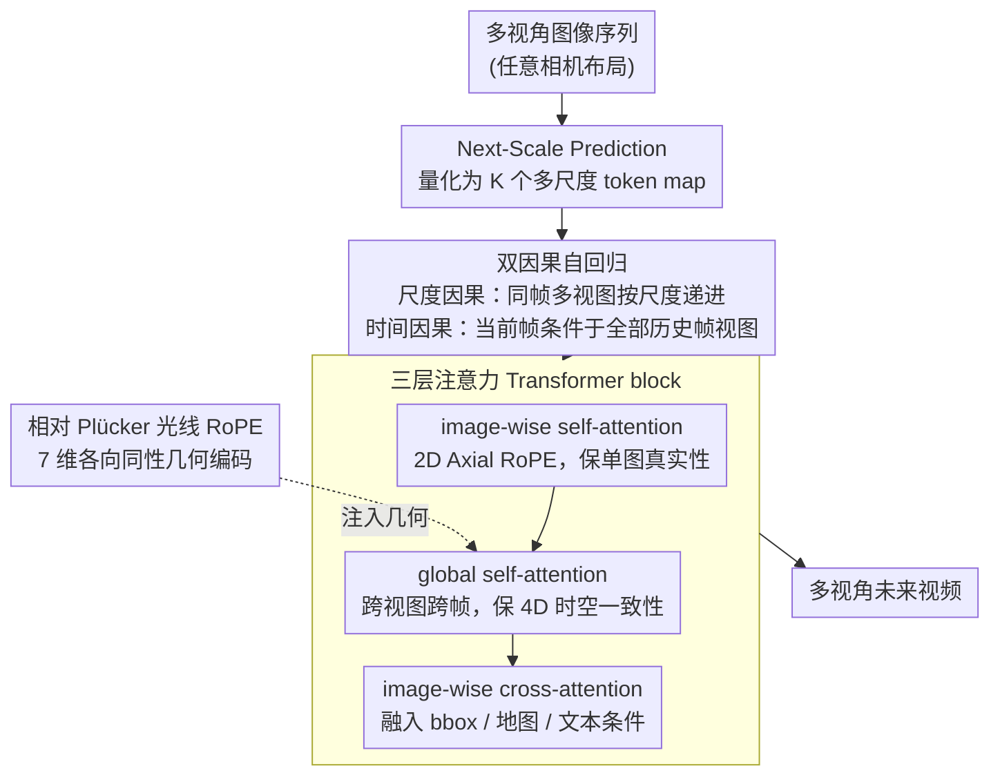

# RayNova: Scale-Temporal Autoregressive World Modeling in Ray Space

**会议**: CVPR 2026  
**arXiv**: [2602.20685](https://arxiv.org/abs/2602.20685)  
**作者**: Yichen Xie, Chensheng Peng, Mazen Abdelfattah, Yihan Hu 等 (Applied Intuition, UC Berkeley)  
**代码**: [项目页](https://raynova-ai.github.io/)  
**领域**: 3D视觉  
**关键词**: 世界模型, 多视角视频生成, 自回归, Plücker光线, 自动驾驶

## 一句话总结

提出 RayNova，一种基于双因果（尺度+时间）自回归的几何无关多视角世界模型，利用相对 Plücker 光线位置编码实现统一的 4D 时空推理，在 nuScenes 上取得 SOTA 多视角视频生成效果。

## 背景与动机

世界基础模型 (WFM) 旨在模拟真实世界的物理演化。现有方法存在根本限制：

1. **空间-时间解耦设计**：空间用多视角邻接关系，时间用视频生成技术，分别处理，限制了对新相机配置和快速运动的适应性
2. **强 3D 先验依赖**：依赖点云/BEV 等显式 3D 表示，限制了在开放世界的泛化能力
3. **固定相机配置绑定**：多数方法假设固定的传感器布局和相邻关系

## 核心问题

如何在保持物理合理性的同时，以最小归纳偏置构建可泛化到任意相机配置和运动的世界模型？

## 方法详解

### 整体框架

RayNova 想做一个不绑死相机配置、也不依赖点云/BEV 等显式 3D 先验的多视角世界模型，能在任意传感器布局和快速运动下都生成物理合理的未来。它把世界建模整体放进"光线空间"的自回归框架：每帧的多视角图像先被量化成多尺度 token，再沿"尺度"和"时间"两条因果链逐步生成，每一步生成都由一个三层注意力 block 完成，几何信息全部通过相对 Plücker 光线的位置编码注入，而不是靠任何 3D 表示。

### 关键设计

**1. Next-Scale Prediction：把图像生成拆成从粗到细的尺度自回归**

RayNova 的生成骨架沿用视觉自回归模型：先把每张图像量化为 $K$ 个多尺度 token map $X_{1:K}$，再从粗到细逐尺度生成，每个尺度都以更粗的尺度为条件

$$p(X_1, \ldots, X_K) = \prod_{k=1}^K p(X_k | X_1, \ldots, X_{k-1})$$

这套从粗到细的顺序生成给后面"尺度+时间"双因果提供了天然的递进结构。

**2. 双因果自回归：用尺度与时间两条因果链统一 4D 时空**

现有世界模型大多把空间和时间拆开——空间用多视角邻接、时间用视频生成技术分别处理，结果对新相机配置和快速运动都不灵。RayNova 把两者统一成两条因果链：**尺度因果**让同一帧的所有视图联合建模（因为它们描述同一 3D 空间），按尺度递进生成

$$p(X_1^{1:V}, \ldots, X_K^{1:V}) = \prod_{k=1}^K p(X_k^{1:V} | X_1^{1:V}, \ldots, X_{k-1}^{1:V})$$

**时间因果**则让当前帧以所有历史帧的所有视图为条件，而不假设同相机帧间的强依赖

$$p(X_{1:K}^{1:V,1:T}) = \prod_{t=1}^T \prod_{k=1}^K p(X_k^{1:V,t} | X_{1:k-1}^{1:V,1:t})$$

不预设"同一相机相邻帧最相关"这条偏置，正是它能适配任意相机布局的关键。

**3. 各向同性时空表示：相对 Plücker 光线 RoPE 替代显式 3D 先验**

这是 RayNova 几何无关的核心。它不靠点云/BEV，而是给每个 token 算一条 Plücker 光线 $\mathbf{p}_k^{v,t} = (\mathbf{m}, \mathbf{d}, t) \in \mathbb{R}^7$（$\mathbf{m} = \mathbf{o}^{v,t} \times \mathbf{d}_k^{v,t}$），并把旋转位置编码扩展到这 7 维空间

$$\mathbf{R} = \begin{bmatrix} \mathbf{R_m} & 0 & 0 \\ 0 & \mathbf{R_d} & 0 \\ 0 & 0 & \text{RoPE}_{d/4}(t) \end{bmatrix}$$

注意力分数只看 token 间的**相对**位置 $a_{i,j} = \mathbf{q}_i^T \mathbf{R}_\Delta^{i,j} \mathbf{k}_j$（$\mathbf{R}_\Delta^{i,j} = \mathbf{R}_i^T \mathbf{R}_j$）。由于编码对所有尺度/视图/帧各向同性、且是相对量，模型天然能外推到训练分布之外的相机配置，这也是它在 4m 位移下仍稳健的根源。

**4. 三层注意力 Transformer：在真实性、一致性、可控性之间分工**

每个 block 用三层注意力各管一摊：**image-wise self-attention** 配 2D Axial RoPE 让每张图独立处理、保证单图真实性；**global self-attention** 跨视图跨帧统一注意 + Plücker 光线 RoPE，保证 4D 时空一致性；**image-wise cross-attention** 融入条件信号。条件这边，bbox 投影 8 个角点到图像空间编码、配 T5 文本嵌入，地图则采样 3D 点后投影、用 PointNet 编码。

### 损失函数 / 训练策略

长视频生成最大的敌人是分布漂移，RayNova 用递归训练对治：逐帧前向/反向传播、梯度累积后统一更新；缓存 latent 特征（而非 KV）省下 50% GPU 显存、同时保留 KV 投影层的梯度；并在 visual token 输入里注入随机位翻转噪声来模拟推理误差，让训练分布贴近真实自回归推理。

## 实验关键数据

| 方法 | 分辨率 | FID ↓ | FVD ↓ | 吞吐量 ↑ (img/s) |
|------|--------|-------|-------|----------------|
| MagicDrive | 224×400 | 16.2 | - | 1.76 |
| DriveDreamer | 256×448 | 14.9 | 341 | 0.37 |
| Panacea | 256×512 | 17.0 | 139 | 0.67 |
| **RayNova** | **384×672** | **10.5** | **91** | **1.96** |

| 评估维度 | 方法 | 指标 (相对 Oracle) |
|---------|------|-------------------|
| 目标条件 (StreamPETR) | Panacea | 32.1 NDS (68%) |
| | **RayNova** | **41.9 NDS (89%)** |
| 目标条件 (SparseFusion) | X-Drive | 69.6 NDS (95%) |
| | **RayNova** | **72.0 NDS (99%)** |
| 新视角合成 FID (shift 4m) | StreetGaussian | 67.44 |
| | **RayNova** | **17.48** |

## 亮点

- **几何无关设计**：不依赖点云/BEV/深度等 3D 先验，仅通过相对光线位置编码实现几何感知
- **双因果自回归**：统一的尺度+时间因果框架，比解耦的空间-时间注意力更灵活
- **超强新视角泛化**：零样本适配未见相机配置，4m 位移下 FID 仅 17.48 vs StreetGaussian 67.44
- **高效生成**：1.96 img/s 吞吐量远超扩散模型 baseline（0.37-1.76）
- **异构数据兼容**：可混合使用不同传感器配置/分辨率/帧率的训练数据

## 局限与展望

- 使用基于图像的 VAE，可能影响 FID/FVD 指标
- 训练数据量（~60小时）相比一些私有数据方法仍有限
- 递归训练需要更长的训练时间
- 地图条件的 3D 点投影缺乏高度信息
- 实验仅在驾驶场景验证，未验证室内等其他场景

## 与相关工作的对比

- vs **Panacea**：Panacea 假设多帧同相机的强依赖关系，受限于特定相机配置；RayNova 完全解耦，FVD 91 vs 139
- vs **X-Drive**：X-Drive 用点云作为 3D 先验，RayNova 无需任何 3D 表示
- vs **StreetGaussian/OmniRe**：显式 3D 表示在大幅相机偏移下急剧退化（FID 67+），RayNova 保持稳健（17.48）
- vs **BEVWorld**：BEV 表示绑定于特定高度平面，RayNova 的光线空间更通用

## 启发与关联

- 相对 Plücker 光线编码的设计思路可推广到其他需要几何感知的生成任务
- 双因果自回归为多模态/多分辨率生成提供了统一框架
- 递归训练解决分布漂移的方案对其他长序列生成任务有借鉴意义
- 与 VAR (Visual Autoregressive Model) 的结合值得关注

## 评分

- 新颖性: ⭐⭐⭐⭐⭐ — 双因果自回归 + 相对光线位置编码是全新的设计范式
- 实验充分度: ⭐⭐⭐⭐ — 多维度评估（质量/条件/新视角/运动），但仅限驾驶场景
- 写作质量: ⭐⭐⭐⭐⭐ — 数学推导严密，图示优秀
- 价值: ⭐⭐⭐⭐⭐ — 开创了几何无关世界模型的新方向

<!-- RELATED:START -->

## 相关论文

- [\[CVPR 2026\] OpenVO: Open-World Visual Odometry with Temporal Dynamics Awareness](openvo_open-world_visual_odometry_with_temporal_dynamics_awareness.md)
- [\[CVPR 2026\] DuoMo: Dual Motion Diffusion for World-Space Human Reconstruction](duomo_dual_motion_diffusion_for_world-space_human_reconstruction.md)
- [\[CVPR 2026\] GLINT: Modeling Scene-Scale Transparency via Gaussian Radiance Transport](glint_modeling_scene-scale_transparency_via_gaussian_radiance_transport.md)
- [\[ICCV 2025\] UST-SSM: Unified Spatio-Temporal State Space Models for Point Cloud Video Modeling](../../ICCV2025/3d_vision/ust-ssm_unified_spatio-temporal_state_space_models_for_point_cloud_video_modelin.md)
- [\[CVPR 2026\] AvatarPointillist: AutoRegressive 4D Gaussian Avatarization](avatarpointillist_autoregressive_4d_gaussian_avatarization.md)

<!-- RELATED:END -->
