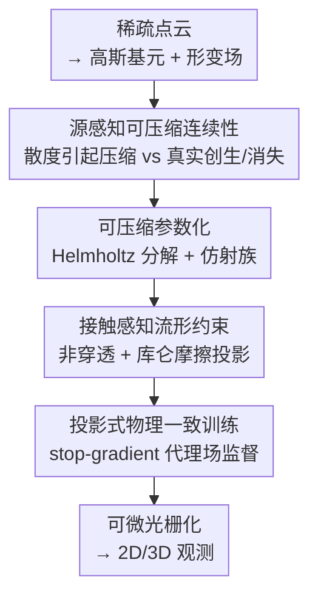

# Real-Time Dynamic Scene Rendering with Controlled Compressibility and Contact Awareness

**会议**: CVPR 2026  
**论文**: [CVF Open Access](https://openaccess.thecvf.com/content/CVPR2026/html/Shi_Real-Time_Dynamic_Scene_Rendering_with_Controlled_Compressibility_and_Contact_Awareness_CVPR_2026_paper.html)  
**代码**: 无  
**领域**: 3D视觉  
**关键词**: 动态场景渲染, 4D高斯泼溅, 可压缩流, 接触约束, 物理先验

## 一句话总结
针对动态 3D 高斯泼溅常用"不可压缩、无源"运动假设导致接触/遮挡边界出现伪影的问题，本文用一个"源感知的连续性方程 + 隐式曲面接触约束"的投影框架，把网络预测的速度场投影到物理可行集上去监督训练，在 Plenoptic Video（33.84 dB PSNR、120 FPS）和 D-NeRF（35.24 dB PSNR、300 FPS）上同时拿到更高保真度和实时速度。

## 研究背景与动机

**领域现状**：动态场景的新视角合成主流是把时间编码进 NeRF 的形变场，或把 3D Gaussian Splatting（3DGS）扩展到 4D——给每个高斯基元估计逐帧的运动/速度场。为了稳定优化，很多方法引入运动学先验（分片刚体、仿射部件），或用"连续性方程残差"匹配的方式减少对显式光流监督的依赖。

**现有痛点**：这些方法几乎都默认运动是**无源、保体积（不可压缩）**的，于是无法表达现实里普遍存在的压缩/膨胀、曝光漂移、物体生长/消失等"非保体积"效应；而接触与摩擦更是很少建模——界面处的非穿透、切向滑移要么被忽略，要么用软惩罚近似，结果就是在遮挡边界、接触面附近产生拉丝、涂抹等伪影。

**核心矛盾**：一旦允许"源项"，速度场的散度 $\nabla\!\cdot u$（体积压缩引起的密度变化）和真正的"创生/湮灭"在图像证据下变得**部分不可区分**（弱可辨识）；同时接触集合随时间离散变化，使目标函数非光滑。把这两者解耦、又保持数值良态和实时可解，是个互相纠缠的难题。

**本文目标**：在不做显式物理仿真的前提下，让动态渲染既能表达可压缩运动与外观变化，又能在接触界面满足非穿透与库仑摩擦，且每一步内部子问题都保持线性/凸、可批量快速求解。

**切入角度**：把"运动估计"变成"带物理先验的投影"——在连续性方程里显式加一个源汇场 $q$，再把网络速度投影到由可压缩先验和接触约束共同定义的可行集上，用投影后的场作为监督信号。

**核心 idea**：用"源增广连续性方程 + 隐式曲面接触锥"构造一组可闭式求解的凸投影子问题，把不可辨识的密度变化拆成"散度引起的压缩" vs "真实创生/消失"，并强制接触处的物理可行性。

## 方法详解

### 整体框架
方法从第一帧的稀疏 SfM 点云出发，编码成一组随时空演化的高斯基元，由一个可学习的形变场驱动其运动。每一帧，作者不直接信任网络给出的速度，而是先用"源感知可压缩流"和"接触感知流形先验"把速度**投影**到物理可行集上，得到一个代理速度场 $\tilde v$ 与代理源场 $\tilde q$；再用 stop-gradient 的方式让这两个投影场反过来监督网络（投影损失 + 连续性一致损失）。最终高斯基元经可微光栅化生成 2D/3D 观测。整条管线的内部投影都保持线性最小二乘或小规模二阶锥规划（SOCP），因此能批量求解、维持实时。

### 关键设计

**1. 源感知可压缩连续性：把"压缩导致的密度变化"和"真实创生/消失"分开**

无源、不可压缩的传输假设无法解释现实里的体积压缩与外观漂移，于是作者给连续性方程显式加一个源汇场 $q$（$q>0$ 创生，$q<0$ 消失）：$\partial_t\psi + u\cdot\nabla\psi + \psi\,\nabla\!\cdot u = q$，其中 $\psi$ 是被输运的量（像素强度/密度/不透明度）。这样一来，$\psi$ 的变化要么归因于"输运 + 散度 $\nabla\!\cdot u$ 引起的体积压缩"，要么归因于"通过 $q$ 的真实增减"，而不是全部硬塞给速度场去解释。在图像平面，作者最小化逐帧的源感知连续性残差 $\rho(u,q)=\sum_i[s_i + g_i^\top u(x_i) + \psi_i(\nabla\!\cdot u)(x_i) - q(x_i)]^2$（$s_i=\partial_t\psi$、$g_i=\nabla\psi$）；在 3D 把高斯基元写成 $\psi_t(x)=\sum_i m_i^t\,\delta(x-\gamma_i^t)$，对应得到运动学关系 $u(\gamma_i^t)\approx\dot\gamma_i^t$ 和质量平衡 $\dot m_i^t + m_i^t(\nabla\!\cdot u) \approx q$。质量变量只进连续性子问题、不耦合颜色分支，因此对 $u,q$ 仍是线性求解。为保证 $\nabla\!\cdot u$ 与 $q$ 之间可辨识，还加了**全局质量预算**和**零均值规范（gauge）**，再配合一条课程：训练里逐步开启可压缩性与源项，避免一上来就退化。

**2. 可压缩参数化：用 Helmholtz 分解 + 仿射族把"体积变化"限制在可控方向**

直接让速度自由可压缩会让问题病态（低纹理、重复视角、谱重叠的基会让正规方程条件数变差）。作者把速度做 Helmholtz 分解：$u = u_\tau + P\nabla\Phi$，其中 $u_\tau$ 是无散度（不可压缩）部分（$\nabla\!\cdot u_\tau\equiv 0$），所有体积变化都由势流分量 $P\nabla\Phi$ 承担，且被投影到一个预先规定的正交子空间 $\mathcal{E}=\mathrm{span}(V)$ 内，于是 $\nabla\!\cdot u=\mathrm{tr}(P\nabla^2\Phi)$ 只沿受控方向发生，可辨识性显著改善。同时用一个**仿射族**近似局部运动：$u(x)=\Omega(t)x + E_0(t)x + \kappa(t)x + b(t)$，把旋转（反对称 $\Omega$）、保体积剪切（无迹对称 $E_0$）、各向同性缩放（标量 $\kappa$，$\nabla\!\cdot u=d\kappa$）和平移 $b$ **解耦**，用 $\lambda_\kappa\kappa^2$ 正则压缩量。最终所有未知系数堆叠成一个带 $\lambda_{\mathrm{comp}}\|\alpha\|_2^2$ 正则的线性最小二乘，既保留闭式/高效求解，又能显式控制可压缩传输与源的表达力。

**3. 接触感知流形约束：用隐式曲面把非穿透与库仑摩擦写成逐样本投影**

接触/摩擦不建模就会在边界出伪影，但显式碰撞检测又非光滑、组合爆炸。作者把约束曲面隐式表示为 $\phi_k(x,t)=0$，定义单位法向 $n_k=\nabla\phi_k/\|\nabla\phi_k\|$、切向投影 $P_{T,k}=I-n_kn_k^\top$、曲面法向速度 $b_k=-\partial_t\phi_k/\|\nabla\phi_k\|$，并用容差 $\varepsilon$ 取激活接触集 $\mathcal{A}(x,t)=\{k:|\phi_k|\le\varepsilon\}$。对每个样本，把目标速度投影到可行集 $\mathcal{C}=\bigcap_{k\in\mathcal{A}}\mathcal{C}_k$ 上：粘滞（sticking）时是带等式约束的 KKT 线性系统、有闭式解 $u^*=v-A^\top(AA^\top)^{-1}(Av-b)$；非穿透是单不等式投影；库仑摩擦则投影到二阶锥 $\{\|x\|\le\mu t\}$ 上，统一了粘/滑两种接触。多接触时是个小 SOCP，可批量、也可用连续凸投影迭代近似；为得到更平滑的场，还能在邻域里拟合局部仿射 $u(x)=Ax+b$ 的约束最小二乘。这把刚性的方向先验替换成了带物理意义的流形约束。

**4. 投影式物理一致训练：stop-gradient 代理场 + 物理一致损失**

如果让网络和投影场互相回传梯度会不稳定。作者采用交替方案：先用 stop-gradient 算出投影代理速度 $\tilde v$ 与代理源 $\tilde q$，再在外层只更新网络参数 $v_\theta$。核心是投影损失 $\mathcal{L}_{\mathrm{proj}}=\sum_i w_i\|v_\theta(x_i)-\tilde v(x_i)\|_2^2$，并按 Danskin 原理只让 $v_\theta$ 接收梯度（$\tilde v,\tilde q$ 被截断）。此外配一条逐像素连续性一致损失 $\mathcal{L}_{\mathrm{CE}}$ 惩罚违反源增广传输律，以及当有轨迹/质量时的几何损失 $\mathcal{L}_{\mathrm{geo}}$ 对齐投影运动与观测；接触则用非穿透软惩罚 $\mathcal{L}_{\mathrm{nopen}}$ 和摩擦软惩罚 $\mathcal{L}_{\mathrm{fric}}$。这样训练目标始终对齐传输、质量平衡和接触条件，同时外层优化保持稳定。

### 损失函数 / 训练策略
总损失是投影损失 $\mathcal{L}_{\mathrm{proj}}$、连续性一致 $\mathcal{L}_{\mathrm{CE}}$、几何/速度一致 $\mathcal{L}_{\mathrm{geo}}$、非穿透 $\mathcal{L}_{\mathrm{nopen}}$ 与摩擦 $\mathcal{L}_{\mathrm{fric}}$ 的加权和。训练采用课程：先无源不可压缩，再渐进开启可压缩性与源项；接触检测带 hysteresis（滞回）并在粘滞失败时回退到非穿透，避免求解器抖振（chattering）。实现基于 PyTorch，单张 RTX 3090；Plenoptic 约 14,000 步、D-NeRF 约 20,000 步（15,000 步后停止高斯增长）。⚠️ 部分公式经 OCR 还原，符号细节以原文为准。

## 实验关键数据

### 主实验

Plenoptic Video（6 个真实场景，1352×1014）：

| 方法 | PSNR↑ | SSIM↑ | LPIPS↓ | 训练↓ | FPS↑ |
|------|-------|-------|--------|-------|------|
| K-Planes | 30.73 | 0.93 | 0.07 | 190 min | 0.10 |
| MixVoxels | 30.85 | 0.96 | 0.21 | 91 min | 16.70 |
| RealTime4DGS | 29.95 | 0.92 | 0.16 | 8 h | 72.80 |
| Deformable4DGS | 28.42 | 0.92 | 0.17 | 72 min | 39.93 |
| **本文** | **33.84** | **0.965** | **0.07** | **35 min** | **120.00** |

PSNR 比最强先前结果高约 +3.0 dB，训练比 K-Planes 快约 5.4×、比 HyperReel 快 15×+，推理 120 FPS 约为 RealTime4DGS 的 1.6×。

D-NeRF（8 段单目序列，800×800）：

| 方法 | PSNR↑ | SSIM↑ | LPIPS↓ | 训练↓ | FPS↑ |
|------|-------|-------|--------|-------|------|
| TiNeuVox | 32.87 | 0.97 | 0.04 | 28 min | 1.60 |
| Deformable4DGS | 32.99 | 0.97 | 0.05 | 13 min | 104.00 |
| Deformable3DGS | 39.31 | 0.99 | 0.01 | 26 min | 85.45 |
| **本文** | 35.24 | 0.99 | 0.02 | **6 min** | **300.00** |

比 TiNeuVox +2.37 dB、比 K-Planes +4.17 dB，训练 6 min、推理 300 FPS。Deformable3DGS 的 PSNR 更高（39.31），但训练/推理更慢，本文走的是"交互式实时 + 有竞争力画质"的路线。

### 消融实验

D-NeRF 上的逐模块消融（Table 3）：

| ID | 可压缩流 | 接触约束 | 投影 | PSNR↑ | SSIM↑ | LPIPS↓ | time↓ |
|----|---------|---------|------|-------|-------|--------|-------|
| a | | | | 28.97 | 0.90 | 0.19 | 16 min |
| b | ✓ | | | 32.50 | 0.97 | 0.05 | 16 min |
| c | | ✓ | | 30.30 | 0.95 | 0.07 | 16 min |
| d | ✓ | ✓ | | 34.80 | 0.98 | 0.03 | 13 min |
| e | ✓ | ✓ | GP | 35.00 | 0.99 | 0.03 | 8 min |
| f | ✓ | ✓ | LL | **35.24** | 0.99 | 0.02 | **6 min** |

GP=逐高斯基元投影，LL=局部线性场投影。

### 关键发现
- **源感知可压缩流贡献最大**：单开它（a→b）PSNR +3.53 dB、LPIPS 降 74%，因为把强度变化归给散度而非全靠流来解释，抑制了拉伸/涂抹伪影。
- **接触约束单独也有效**：单开（a→c）+1.33 dB、LPIPS 降 63%，且不增加额外自由度。
- **LL 投影优于 GP**：逐基元 GP 投影一致性紧但跨基元耦合弱，LL 在质量-效率上更优，且训练更快（6 min vs 8 min）。两者都保持线性内解与 stop-gradient 训练。

## 亮点与洞察
- **把"不可辨识"变成"可约束"**：散度引起的密度变化和真实创生/消失在图像下本是混淆的，作者用全局质量预算 + 零均值规范 + 课程把它强行可辨识——这是物理约束改善病态反问题的典型范式，可迁移到光流、流体重建等任务。
- **物理先验全部写成闭式/凸投影**：粘滞→KKT 线性、非穿透→单不等式投影、摩擦→二阶锥投影，既有物理意义又能批量实时求解，避免了显式碰撞仿真的非光滑与组合爆炸。
- **stop-gradient + Danskin 原理**让"投影监督"这种隐式优化层稳定可训，这个技巧在任何"先解子问题再监督网络"的框架里都通用。

## 局限与展望
- 作者承认：图像域导数会放大噪声，需要多尺度平滑与鲁棒损失，代价是衰减高频运动；接触检测不可靠时会阻碍学习，需 hysteresis + 回退机制兜底。
- 自己看：方法强依赖隐式约束曲面 $\phi_k$ 的质量，从单目噪声序列稳健提取近似 SDF 等距面/法向并非易事；可压缩子空间 $\mathcal{E}$ 需预先规定，对未知运动模式可能不够灵活。
- 改进方向：把约束曲面也端到端学习；自适应选择/扩展可压缩子空间；在更大尺度真实接触场景验证。

## 相关工作与启发
- **vs Deformable4DGS / RealTime4DGS**: 它们扩展 3DGS 到动态场景但缺物理建模，本文在速度场上加源感知可压缩 + 接触流形投影，边界更真实、保真度更高（Plenoptic +3 dB）。
- **vs 连续性驱动的速度先验方法**: 同样用连续性残差匹配，但本文显式引入源项把"压缩"与"创生/消失"解耦，并补上接触/摩擦的二阶锥投影，旧方法默认无源、保体积。
- **vs Deformable3DGS**: 对方 PSNR 更高（D-NeRF 39.31）但慢，本文优先实时交互（300 FPS）下保持有竞争力画质。

## 评分
- 新颖性: ⭐⭐⭐⭐ 把源感知可压缩流 + 隐式曲面接触锥统一进 3DGS 投影框架，角度新颖且物理动机扎实。
- 实验充分度: ⭐⭐⭐⭐ 两个标准动态基准 + 完整逐模块消融，但接触场景的定量验证略少。
- 写作质量: ⭐⭐⭐ 公式密集、动机清晰，但 method 部分推导偏重、可读性一般。
- 价值: ⭐⭐⭐⭐ 实时 + 物理可信渲染，对 AR/VR、数字孪生、机器人有实用价值。

<!-- RELATED:START -->

## 相关论文

- [\[CVPR 2026\] Changes in Real Time: Online Scene Change Detection with Multi-View Fusion](changes_in_real_time_online_scene_change_detection_with_multi-view_fusion.md)
- [\[CVPR 2026\] Space-Time Forecasting of Dynamic Scenes with Motion-aware Gaussian Grouping](space-time_forecasting_of_dynamic_scenes_with_motion-aware_gaussian_grouping.md)
- [\[CVPR 2026\] Consistent Instance Field for Dynamic Scene Understanding](consistent_instance_field_for_dynamic_scene_understanding.md)
- [\[CVPR 2026\] KV-Tracker: Real-Time Pose Tracking with Transformers](kv-tracker_real-time_pose_tracking_with_transformers.md)
- [\[CVPR 2026\] Fast-FoundationStereo: Real-Time Zero-Shot Stereo Matching](fast-foundationstereo_real-time_zero-shot_stereo_matching.md)

<!-- RELATED:END -->
