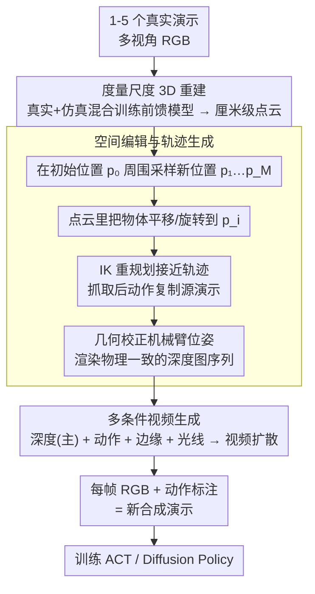

# Real2Edit2Real: Generating Robotic Demonstrations via a 3D Control Interface

**会议**: CVPR 2026  
**arXiv**: [2512.19402](https://arxiv.org/abs/2512.19402)  
**代码**: [https://real2edit2real.github.io/](https://real2edit2real.github.io/) (有，项目主页)  
**领域**: 3D视觉 / 机器人学习 / 数据增强  
**关键词**: 机器人演示生成, 3D编辑, 视频生成, 数据增强, 空间泛化

## 一句话总结

提出 Real2Edit2Real 框架，通过"3D 重建 → 点云编辑生成新轨迹 → 深度引导视频生成合成演示"的三阶段管线，从仅 1-5 个真实演示生成大量多样化的操作演示数据，使策略性能达到甚至超过 50 个真实演示训练的水平，数据效率提升 10-50 倍。

## 研究背景与动机

**领域现状**：机器人操作学习（robot manipulation learning）正从传统控制转向数据驱动的视运动策略（visuomotor policy）。像 ACT、Diffusion Policy、π0 等强大的策略架构已经出现，但它们的性能严重依赖大规模、多样化的演示数据。特别是空间泛化（spatial generalization）——物体在不同位置/朝向时策略仍能正常工作——需要在大量不同空间配置下收集演示。

**现有痛点**：(1) 收集真实机器人演示极其昂贵——每个新位置配置需要人工操作或遥操作，一个简单的抓放任务可能需要数百次演示才能覆盖足够的空间变化；(2) 纯 2D 数据增强（如随机裁剪、颜色抖动）无法改变物体的 3D 空间位置，对空间泛化帮助有限；(3) 使用 3D 模拟器（如 Isaac Gym）可以生成大量数据，但 sim-to-real gap 严重影响迁移效果；(4) 现有的视频生成方法虽然能合成视觉上逼真的视频，但缺乏精确的 3D 空间控制——无法保证生成的操作轨迹在物理上是可行的。

**核心矛盾**：需要大量在不同 3D 空间配置下的演示数据 vs 真实数据收集成本极高。核心挑战在于如何在保持空间精确性的同时实现高视觉保真度的数据生成。

**本文目标**：设计一个框架，能从少量（1-5 个）真实演示出发，自动生成在新空间配置下的高质量操作演示——生成的数据足够训练出强泛化能力的操作策略。

**切入角度**：作者的核心观察是 3D 空间编辑和 2D 视觉生成可以分工协作——先在 3D 点云空间中精确编辑物体位置和机械臂轨迹（确保几何正确性），再用条件视频生成模型将编辑后的 3D 场景渲染为逼真的多视角视频（确保视觉保真度）。深度图作为连接这两个世界的桥梁——它既是 3D 编辑的可靠输出，又是视频生成的精确控制信号。

**核心 idea**：用 3D 编辑保证空间正确性，用深度引导视频生成保证视觉真实性，通过深度图作为两者之间的 3D 控制接口。

## 方法详解

### 整体框架

Real2Edit2Real 想解决的事很具体：手里只有 1-5 个真实机器人演示，怎么变出几十上百个覆盖不同物体位置的新演示，让训练出来的策略在物体被随手放到桌面任意位置时都还能完成任务。它的核心判断是——空间正确性和视觉真实性应该分两步走，3D 点云负责"摆对位置"，2D 视频生成负责"画得逼真"，而深度图正好是连接两者的接口。

整条管线分三段接力。先从源演示的多视角 RGB 把场景重建成带真实物理尺度的 3D 点云；再在点云里把目标物体挪到新位置、用逆运动学重新算出机械臂的接近轨迹并做几何校正，渲染出一串物理一致的深度图；最后把这串深度图连同动作、边缘、光线等条件喂给视频扩散模型，生成视觉逼真的多视角操作视频，每一帧 RGB 配上对应动作标注，就是一条全新的演示数据。

### 关键设计

**1. 度量尺度 3D 重建：让"向右挪 10cm"在物理上真的成立**

纯 2D 图像编辑（如 inpainting）有个根本毛病——在图里被"移动"的物体，在 3D 空间里可能压根找不到一个合理位姿，编辑出来的场景几何上是矛盾的。这篇先从演示的多视角 RGB 把场景重建成点云，关键是**度量尺度（metric-scale）**：重建出的 3D 坐标与真实世界的厘米级坐标一一对应，所以"把杯子向右移动 10cm"这种指令在点云里有确切的物理含义，而不只是像素层面的平移。重建模型本身是前馈式（DUSt3R 一类）网络，但这篇专门用真实数据 + 仿真数据混合训练（hybrid training）把它 co-train 出来，让它在机器人操作这种特定场景下也能稳定吐出可靠的度量尺度几何。先把度量尺度的几何拿到手，后面所有"挪物体"的编辑才有物理意义的坐标可依。

**2. 深度可靠的空间编辑与轨迹生成：在点云里挪物体、重规划轨迹、几何校正出物理一致的深度**

空间泛化卡在训练数据里物体位置不够多样，而人工去摆不同位置再演示成本极高。这篇把这一步彻底自动化：给定源演示中物体初始位置 $p_0$，在它周围定义一个采样空间（如以 $p_0$ 为中心、半径 $r$ 的球体），采出一批新位置 $\{p_1, p_2, \dots, p_M\}$。对每个新位置，先在点云里把物体从 $p_0$ 平移/旋转到 $p_i$，再用逆运动学（IK）重新规划"够到 $p_i$"的接近轨迹——而抓取之后的抬起、移动、放下这些动作直接从源演示复制，因为它们相对物体是不变的，变的只是怎么够到它。这里有一步容易被忽略却不可省：物体挪位后机械臂的关节角必须经 IK 重解才运动学可行，所以要做一道**几何校正**，把校正后的机械臂模型重新渲染进新场景，才能得到物理一致的深度图序列——消融里"无几何校正"会让深度信号物理失真、策略性能明显下降，正说明这一步是后续视频生成可靠条件的前提。整段编辑全在 3D 点云里完成、再投影成深度图，每条新轨迹的几何因此都是自洽的；这套流程还能扩展到高度编辑（改物体垂直位置）和纹理编辑（改物体外观）。

**3. 多条件视频生成：四路信号各管一摊，把深度图"画"成真实视频**

只用深度图控制虽然能保证 3D 布局对，但容易出纹理闪烁、物体外观前后不一致这类伪影。所以这篇在视频扩散模型（基于 SVD 一类架构）上叠了四种控制信号，各有明确分工：深度图序列是主控信号，通过 ControlNet 式注入引导每帧的空间布局；动作信号编码机械臂关节角/末端位姿的变化，确保生成的运动轨迹和规划轨迹一致；边缘图守住几何边界的锐利度，防物体轮廓糊掉；光线映射（ray maps）编码相机内外参，保证多视角之间几何对得上。四路信号经各自的编码器分别注入扩散模型的 U-Net，从几何、运动、结构、视角四个维度一起约束生成过程——这也是为什么消融里去掉任何一路质量都会掉。

### 一个完整示例：从 1 个 Mug-to-Basket 演示长出一批

假设手里只有 1 条 "Mug to Basket" 真实演示，杯子初始在桌面位置 $p_0$。第一段，多视角 RGB 重建出带度量尺度的点云，确认杯子在真实坐标系下的厘米级位置。第二段开始空间增强：在 $p_0$ 周围半径 $r$ 的球内采出新位置，比如 $p_1$ 在右后方约 10cm。把点云里的杯子平移到 $p_1$，用 IK 重新解出机械臂"从初始位姿够到 $p_1$"的接近轨迹——而抓住之后抬起、移到篮子、松手这串动作原样复制自源演示。几何校正确认新的关节角运动学可行后，渲染出这条新轨迹的深度图序列。第三段，把深度序列连同动作、边缘、光线四路条件送进视频扩散模型，生成一段视觉逼真的多视角操作视频；每帧 RGB 配上对应动作标注，就成了一条标注完整的新演示。对采样出的 $p_1, p_2, \dots, p_M$ 重复这套流程，1 条真实演示便扩成覆盖整片采样空间的一批合成演示，喂给 ACT / Diffusion Policy 训练即可。

### 损失函数 / 训练策略

视频生成模型用标准去噪扩散目标训练：

$$\mathcal{L} = \mathbb{E}_{t, \epsilon}\big[\,\|\epsilon - \epsilon_\theta(x_t, t, c)\|^2\,\big]$$

其中条件 $c$ 打包了深度、动作、边缘、光线映射四路信号，训练数据来自源演示视频及其对应的深度图与动作标注。操作策略侧则直接用 ACT 或 Diffusion Policy 等标准架构，在生成的增强数据上端到端训练——生成视频每帧的 RGB 图像和对应动作标注成对，构成策略的训练样本。

## 实验关键数据

### 主实验（4 个真实操作任务）

| 任务 | 源演示数 | 训练数据来源 | 成功率 (%) ↑ |
|------|---------|-------------|-------------|
| Mug to Basket | 50 (真实) | 仅真实数据 | ~70-80 |
| Mug to Basket | 1 | Real2Edit2Real 生成 | **~75-85** |
| Pour Water | 50 (真实) | 仅真实数据 | ~65-75 |
| Pour Water | 5 | Real2Edit2Real 生成 | **~65-80** |
| Lift Box | 50 (真实) | 仅真实数据 | ~70 |
| Lift Box | 3 | Real2Edit2Real 生成 | **~70-75** |
| Scan Barcode | 50 (真实) | 仅真实数据 | ~60-70 |
| Scan Barcode | 5 | Real2Edit2Real 生成 | **~65-75** |

### 消融实验（条件控制信号的贡献）

| 条件配置 | 视频质量 (FVD ↓) | 策略成功率 ↑ | 说明 |
|---------|-----------------|-------------|------|
| 仅深度 | 中等 | 中等 | 基础空间控制 |
| 深度 + 动作 | 提升 | 提升 | 运动一致性改善 |
| 深度 + 动作 + 边缘 | 进一步提升 | 进一步提升 | 几何边界更锐利 |
| **深度 + 动作 + 边缘 + 光线** | **最优** | **最优** | 完整多条件控制 |
| 无几何校正 | 下降 | 明显下降 | 深度信号物理不一致 |

### 关键发现

- **数据效率提升惊人**：1-5 个源演示 + Real2Edit2Real 生成 ≈ 50 个真实演示的训练效果，数据效率提升 10-50 倍
- **深度图作为控制信号是关键**：深度比 RGB 更适合作为 3D 控制接口——它天然编码了空间布局信息且对光照/纹理变化鲁棒
- **几何校正至关重要**：不做几何校正（机械臂在新位置的运动学不一致）会严重降低视频质量和策略性能
- 多条件控制中动作信号的贡献独立于深度——它确保了运动的动力学正确性而非仅仅空间正确性
- 框架支持高度编辑和纹理编辑的扩展——展示了作为通用数据生成框架的潜力

## 亮点与洞察

- **3D-2D 桥接的优雅设计**：将 3D 编辑的空间精确性与 2D 视频生成的视觉保真度结合，深度图作为桥梁的设计既自然又有效。这个思路可以迁移到其他需要"精确 3D 控制 + 逼真 2D 渲染"的应用中
- **"少量真实 + 大量生成"的范式**：与 sim-to-real 不同，Real2Edit2Real 的起点是真实数据（不是模拟器），因此生成的数据天然更接近真实域——这种"从真实到生成再到真实"的闭环更容易被实际系统采用
- **多条件控制的系统性设计**：不是简单堆叠条件信号，而是每个信号都有明确的控制目标——深度控制空间、动作控制运动、边缘控制结构、光线控制视角，分工明确
- **实用性极强**：在实际机器人部署中，减少数据收集需求 50 倍意味着一个新任务可以从"需要一天的演示收集"变为"只需几分钟"

## 局限与展望

- 当前要求源演示具有多视角录制——单视角场景下 3D 重建质量可能不足
- 视频生成模型的推理速度较慢——生成一段多视角演示视频可能需要数分钟，大规模数据生成需要 GPU 集群
- 空间编辑范围受限于源场景的背景——当物体移动到源演示中未出现的背景区域时，视频生成需要"想象"新背景
- 仅验证了桌面操作任务，移动操作（mobile manipulation）和灵活手（dexterous hand）场景有待探索
- 操作类型的泛化性有限——当前框架适合位置变化的增强，但对操作策略本身的变化（如从抓取变为推动）不能直接处理
- 视频生成的保真度仍存在极限——在复杂遮挡、透明物体、变形物体等场景中可能出现伪影

## 相关工作与启发

- **vs MimicGen (Mandlekar et al. 2023)**：MimicGen 通过在模拟器中对源演示做空间变换来生成数据，需要完整的模拟环境。Real2Edit2Real 直接从真实数据出发，不需要模拟器
- **vs GenAug (Chen et al. 2023)**：GenAug 使用扩散模型对操作图像做增强，但只做 2D 级别的变换，无法改变 3D 空间配置。Real2Edit2Real 的 3D 编辑提供了真正的空间变化
- **vs RoboCasa**：RoboCasa 是纯模拟数据生成方案，受限于 sim-to-real gap。Real2Edit2Real 的"真实数据为起点"的策略避免了这个问题
- 启发：类似框架可以应用于自动驾驶（从少量真实驾驶轨迹生成覆盖更多路况的训练数据）和 AR/VR（从少量真实交互生成多样化的训练演示）

## 评分

- **新颖性**: ⭐⭐⭐⭐ 3D 编辑 + 深度引导视频生成的组合是新颖的；"3D 控制接口"的概念提供了新的思考框架
- **实验充分度**: ⭐⭐⭐⭐ 4 个真实任务、多策略架构验证、详细消融，数据效率的提升令人信服
- **写作质量**: ⭐⭐⭐⭐ 框架图清晰，三阶段管线容易理解，演示视频有说服力
- **价值**: ⭐⭐⭐⭐⭐ 直接解决了机器人学习中最大的瓶颈之一（数据收集成本），10-50 倍的数据效率提升有重大实际意义

<!-- RELATED:START -->

## 相关论文

- [\[CVPR 2026\] ArtLLM: Generating Articulated Assets via 3D LLM](artllm_generating_articulated_assets_via_3d_llm.md)
- [\[CVPR 2026\] OLATverse: A Large-scale Real-world Object Dataset with Precise Lighting Control](olatverse_a_large-scale_real-world_object_dataset_with_precise_lighting_control.md)
- [\[CVPR 2026\] PaNDaS: Learnable Shape Interpolation Modeling with Localized Control](pandas_learnable_shape_interpolation_modeling_with_localized_control.md)
- [\[CVPR 2026\] HyperMVP: Hyperbolic Multiview Pretraining for Robotic Manipulation](hyperbolic_multiview_pretraining_for_robotic_manipulation.md)
- [\[CVPR 2026\] ConsisVLA-4D: Advancing Spatiotemporal Consistency in Efficient 3D-Perception and 4D-Reasoning for Robotic Manipulation](consisvla-4d_advancing_spatiotemporal_consistency_in_efficient_3d-perception_and.md)

<!-- RELATED:END -->
