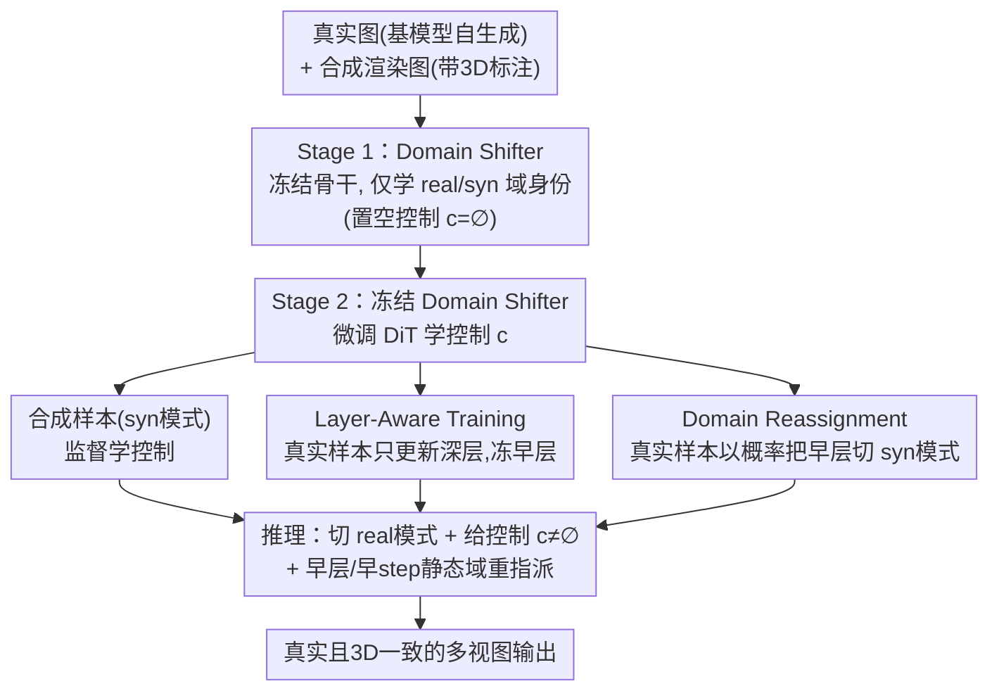

# Realiz3D: 3D Generation Made Photorealistic via Domain-Aware Learning

**会议**: CVPR 2026  
**arXiv**: [2605.13852](https://arxiv.org/abs/2605.13852)  
**代码**: 无（项目主页有可视化结果）  
**领域**: 3D视觉 / 扩散模型  
**关键词**: 域适配、3D可控生成、多视图、Domain Shifter、域泄漏

## 一句话总结
针对"用合成 3D 渲染图微调扩散模型获得 3D 可控性时会丢失真实感"这一痛点，本文用一个轻量的 Domain Shifter（低秩残差适配器）把"域身份（真实/合成）"从"3D 控制信号"里解耦出来，再配合层级感知训练与域重指派把控制力从合成域迁移到真实域，最终在多视图纹理生成与文生多视图任务上同时拿到强 3D 一致性与显著更高的真实感。

## 研究背景与动机

**领域现状**：要让图像扩散模型支持精确的几何/材质/视角控制（多视图、法向图、相机位姿等），主流做法是：先在数十亿真实图像上预训练，再用一小批合成 3D 资产的渲染图去微调——因为只有合成数据才能拿到准确的 3D 标注（法向、位置、相机）。

**现有痛点**：合成渲染图远不够真实，与真实照片之间存在严重的域间隙（domain gap）。直接在合成数据上微调能学到控制，但会灾难性遗忘真实图像的外观；即便把真实数据混进来一起训（mixed-domain training），也只能缓解、不能根治遗忘。结果是真实感（来自真实图像）与可控性（来自合成 3D 数据）之间出现一个难以摆脱的 trade-off。

**核心矛盾**：本文识别出真实感下降的关键根因——微调时，模型把"控制信号的存在"和"合成外观"绑在了一起。因为只有合成样本带非空控制 $c\neq\varnothing$，模型隐式地学到了"一旦给控制信号，就该把图画成合成的样子"，即**控制信号泄漏了域身份**（domain leakage）。推理时只要施加控制，图像就跟着变假。

**本文目标**：训一个可控扩散模型，能在给定 3D 控制信号时仍生成既真实又跨视图几何一致的图像；具体分解为两个子问题——(1) 把域身份从控制信号里剥离，阻止域泄漏；(2) 让只在合成数据上学到的控制力，能迁移到没有控制标注的真实域。

**切入角度**：作者借用扩散模型已知的两条结构性观察——早期 timestep / 网络早层主要决定低频结构（这部分真实与合成是共享的、域无关的），晚期 timestep / 深层决定高频外观（这里域间隙最大）。既然早层是天然的"跨域桥梁"，就可以把控制力锚定在早层、把真实外观锚定在深层。

**核心 idea**：先**显式地、独立于控制信号地**学一个二值"域协变量"（real/synthetic），通过 Domain Shifter 注入；之后再学 3D 控制，使控制不再与合成外观纠缠，从而推理时切到"真实模式 + 控制信号"就能同时拿到真实感与可控性。

## 方法详解

### 整体框架
Realiz3D 的输入是一个在真实图像上预训练的文生图扩散 Transformer（DiT）、一份带 3D 标注的合成数据集 $\{\{x_{\text{syn}}^v\}_{v=1}^V, c\}$、以及一份无控制信号的真实图像集 $\{x_{\text{real}}, \varnothing\}$（真实数据直接由基模型自己生成，用合成数据的文本描述作 prompt 以保证公平）；输出是一个能在"真实模式 + 控制信号"下生成多视图、既真实又 3D 一致的可控生成器。多视图通过把 $V=4$ 个视角拼成 $2\times2$ 网格、视图间做 self-attention 实现；真实数据则用单图模式（attention 只在各视图内）。

整个方法分两阶段，全程**只用标准扩散损失**：

- **Stage 1（解耦域与控制）**：冻结 DiT 骨干，只训 Domain Shifter，用真实+合成图像（都置空控制 $c=\varnothing$）让模型学会区分 real/synthetic 两个域，建模 $q_\theta(x\mid e_{\text{domain}}, \varnothing)$。这样"域"的概念被独立于控制学到。
- **Stage 2（带表示绑定的微调）**：冻结 Domain Shifter，微调 DiT 骨干学控制（控制只有合成数据有），建模 $q_\theta(\{x^v\}\mid e_{\text{domain}}, c)$。同时通过 **Representation Binding**（= 层级感知训练 + 域重指派）把控制力从合成域迁移到真实域。
- **推理**：把 Domain Shifter 切到真实模式 $e_{\text{domain}}=e_{\text{real}}$ 并给控制 $c\neq\varnothing$，即可生成真实且可控的图像；还可对预选的早层 / 早 timestep 做静态域重指派进一步增强控制。

### 关键设计

**1. Domain Shifter：用低秩残差把域身份单独编码，阻断域泄漏**

这是解耦"域"与"控制"的核心。它针对的痛点是：直接微调会让模型把"有控制信号"等同于"画成合成样子"。Domain Shifter 是一个轻量模块，含两个可学习域嵌入 $e_{\text{syn}}, e_{\text{real}}\in\mathbb{R}^d$ 和一个共享的低秩变换，把域嵌入以残差形式加到进入某个扩散块的潜表示 $X$ 上：

$$\tilde{X} = X + \mathcal{D}(\text{domain}) = X + W_{\text{left}} W_{\text{right}}\, e_{\text{domain}},$$

其中 $W_{\text{left}}\in\mathbb{R}^{d\times r}$、$W_{\text{right}}\in\mathbb{R}^{r\times d}$ 构成一个秩 $r\ll d$ 的映射，该残差被加到块内所有 token 上，相当于一个按域身份调制激活的低秩偏置。类比 LoRA，它有足够容量在潜空间里"挪动到邻近模式"（在真实/合成之间切换），同时保持稳定高效。关键是它在 **Stage 1** 单独训练（骨干冻结、控制置空），使"域"这个概念被独立学到——之后 Stage 2 再学控制时，控制不再背负域身份。这也是与 Wonder3D 的 domain switcher 的区别：本文既不改已有的条件机制、也不依赖成对数据；而且如果像那样把 switcher 和模型联合训，模型容易塌成"可控+合成 / 真实+不可控"两个互斥模式，所以本文坚持两阶段、且只让低秩残差去承载域差异。

**2. Layer-Aware Training：真实样本只更新深层，保住真实感不破坏控制**

Stage 2 若只用合成数据微调骨干、靠共享骨干把控制迁到真实图，推理切到真实模式时控制常常失效、图还是发假。原因之一是**遗忘真实感**：更新只发生在合成数据上，骨干会漂向合成统计。为此把真实样本重新引入训练，但真实图没有控制监督，直接训会干扰从合成学到的控制表示。基于"早层域无关、负责结构；深层负责高频外观、域差异大"的观察，本文规定：用真实样本训练时，**只更新靠后的扩散块（外观相关），冻结靠前的块（结构相关）**。具体每次真实数据迭代冻结 DiT 块 $B\in[0, B_i]$，其中块索引 $i$ 从 $[0, \tau_B]$ 随机抽取——这种随机层冻结对早层表示做正则、又不需要固定的硬切分点。处理真实样本时 Domain Shifter 置真实模式，让模型保持真实外观统计而不动结构通路。

**3. Domain Reassignment：把真实样本"喂进"合成特征空间，强化控制迁移**

光保住真实感还不够——控制迁移只是"涌现式"的、不稳，因为模型从没见过 $e_{\text{domain}}=e_{\text{real}}$ 且 $c\neq\varnothing$ 同时成立的样本。Domain Reassignment 的做法是：以概率 $p_B$，在处理真实样本时把早期 DiT 块（$B\in[0, B_j]$，$j$ 从 $[0,\tau_B]$ 抽样）**重指派为合成模式**，即在对应 Domain Shifter 里把 $e_{\text{domain}}\leftarrow e_{\text{syn}}$。这个设计是**非对称**的：让真实样本融进合成特征空间，而不是反过来——因为合成域才是有显式控制监督的那一侧。结果是早层学到能携带控制力的共享结构表示，深层仍锚定真实外观。Layer-Aware Training 与 Domain Reassignment 合起来就是 **Representation Binding**：一种在特征空间里的软对齐，既保真实感又促控制迁移。

**4. 推理时域重指派：测试时无需再训即可重新平衡真实感与可控性**

推理时已经可以直接切真实模式 $e_{\text{real}}$ + 给控制 $c\neq\varnothing$ 拿到可控生成；但作者发现控制还能进一步加强而不牺牲真实感。由于 $e_{\text{syn}}$ 下生成更忠实于控制（合成域被直接监督过控制），推理采用**部分、非随机**的域重指派：把预先选定的早层与早 timestep 设为合成模式，深层与晚 timestep 保持真实模式。该配置全局调一次、不按样本调。因为早层只管粗粒度、域无关的结构，这种混合配置让用户在测试时自由地重新平衡真实感与可控性，无需额外训练。

### 损失函数 / 训练策略
全程**只用标准扩散去噪损失**：Stage 1 用它训 Domain Shifter，Stage 2 用它训 DiT 骨干，没有引入任何额外的对齐/对比/判别损失。多视图任务下，合成样本以 $2\times2$ 网格、视图间 self-attention 训练；真实样本用单图模式（视图内 attention）。Stage 2 的真实/合成数据按等量混合。控制注入方式随任务而定：纹理任务把法向图、位置图经 VAE 编码后与噪声潜表示按通道拼接；文生多视图任务把相机视角信息通过位置编码注入潜样本。

## 实验关键数据

评估指标说明（自定义/带下标的指标先讲清）：
- **3D 一致性**：把生成图反投影到 mesh 再重投影回各视角，报告生成图与重投影图之间的 **PSNR↑ / SSIM↑ / LPIPS↓**。
- **先验保持** $\text{FID}_B / \text{KID}_B$（↓）：与"基 T2I 模型用同一 prompt 生成的真实图"比，衡量是否保住了基模型的真实先验。
- **真实世界真实感** $\text{FID}_I / \text{KID}_I$（↓）：与 ImageNet 真实照片（选最贴近评测物体的类别）比，衡量真正贴近真实照片的程度。
- **文图对齐** CLIP↑。
- 评测集：取自 Sketchfab 的 40 个 3D 物体（沿用先前工作）。

### 主实验

**多视图纹理生成（Tab. 1）**——Realiz3D 与各类适配方法在同一基模型/数据下对比（节选）：

| 方法 | PSNR↑ | LPIPS↓ | FID_B↓ | KID_B↓ | FID_I↓ | KID_I↓ | CLIP↑ |
|------|-------|--------|--------|--------|--------|--------|-------|
| Syn Only（全微调，仅合成） | **25.76** | **0.0831** | 168.21 | 0.0240 | 218.29 | 0.0431 | 0.2628 |
| Syn + Real（混合域全微调） | 25.63 | 0.0833 | 164.37 | 0.0226 | 214.84 | 0.0411 | 0.2629 |
| Domain Adapter (r32) | 25.61 | 0.0843 | 164.17 | 0.0223 | 215.80 | 0.0408 | 0.2610 |
| Domain Switcher (2-Stage) | 24.94 | 0.0888 | 157.89 | 0.0185 | 210.18 | 0.0350 | 0.2644 |
| **Realiz3D (Ours)** | 24.78 | 0.0865 | **141.90** | **0.0121** | **200.24** | **0.0291** | 0.2674 |

真实感（FID_B/KID_B、FID_I/KID_I）全面领先：FID_I 从 Syn Only 的 218.29 降到 200.24、KID_I 从 0.0431 降到 0.0291；同时 3D 一致性（PSNR 24.78 vs 25.76）只略低于纯合成基线，没有像轻量微调（LoRA PSNR 仅 ~22）那样为真实感大幅牺牲几何。

**文生多视图生成（Tab. 3）**——同样在真实感上大幅领先，3D 一致性接近纯合成基线：

| 方法 | PSNR↑ | FID_B↓ | KID_B↓ | FID_I↓ | KID_I↓ | CLIP↑ |
|------|-------|--------|--------|--------|--------|-------|
| Syn Only | **19.66** | 168.60 | 0.0204 | 215.57 | 0.0363 | 0.2541 |
| Syn + Real | 19.37 | 164.44 | 0.0192 | 214.72 | 0.0361 | 0.2586 |
| TRELLIS (large, 3D-native 预训练) | - | 181.92 | 0.0275 | 224.22 | 0.0441 | 0.2495 |
| **Realiz3D (Ours)** | 19.02 | **122.01** | **0.0056** | **196.01** | **0.0171** | **0.2629** |

注：Domain Switcher (Joint) / Spatial Adapter 等个别基线在 FID_B 上更低，但它们的 3D 一致性（PSNR 17~18）明显更差——即把几何丢了换来的"真实感"，不可与本文同等情境直接比大小。

### 消融实验
基于 Tab. 2，逐步加组件（DS=两阶段 Domain Shifter，LA Train=层级感知训练，Reassign=域重指派，Sampling=推理时域重指派）：

| # | 配置 | 训练 | PSNR↑ | FID_B↓ | FID_I↓ | 说明 |
|---|------|------|-------|--------|--------|------|
| (1) | DiT + DS | Joint | 25.53 | 166.93 | 216.63 | 联合训：真实感几乎无改善（退化成 Syn 模式） |
| (2) | DiT + DS（Stage 2 无真实数据） | 2-Stage | 25.11 | 162.02 | 212.86 | 只两阶段、不引真实数据：真实感有限 |
| (3) | DiT + DS（Stage 2 引真实数据） | 2-Stage | 23.97 | **137.23** | **198.44** | 真实感最强，但控制（PSNR）掉最多 |
| (7) | DS + LA Train + Reassign | 2-Stage | 24.52 | 141.20 | 199.39 | 加回层级训练+重指派，找回控制 |
| (8) | **Ours（全组件）** | 2-Stage | 24.78 | 141.90 | 200.24 | 控制与真实感的最佳折中 |

### 关键发现
- **两阶段是真实感的前提**：把 DS 和骨干联合训（配置 1）几乎学不到真实感提升，验证了"必须先独立学域、再学控制"的设计动机——联合训会塌成可控但合成的模式。
- **真实数据 + 层级策略缺一不可**：Stage 2 引入真实数据（配置 3）能把真实感拉到最强，但会牺牲控制（PSNR 跌到 23.97）；再加 Layer-Aware Training 与 Domain Reassignment（配置 7→8）把 PSNR 找回到 24.78，FID_I 仅小幅回升到 200，说明 Representation Binding 确实在"保真实感"和"留控制"之间架了桥。
- **作者诚实指出**：Realiz3D 的控制力仍略低于纯合成基线，原因包括 3D 一致性指标对合成图特有的像素级细节敏感、以及为追求真实感偶尔会偏离几何信号。

## 亮点与洞察
- **把"真实感丢失"重新归因为"域泄漏"**：核心洞察是问题不在"合成图本身难看"，而在"模型把控制信号当成了合成域的标志"。一旦这样定位，解法就从"对抗合成外观"变成"解耦域与控制"，干净且轻量。
- **借扩散模型的层级/timestep 分工做跨域桥梁**：用"早层域无关结构、深层域相关外观"这条已知规律，把控制锚在早层、真实感锚在深层，是个很可复用的思路——任何"有标注的难看域 → 想迁到没标注的好看域"的迁移任务都可借鉴这种非对称的"把无标注样本喂进有标注特征空间"的做法。
- **训练/推理两处都用域重指派**：训练时随机重指派做正则化、推理时静态重指派做测试时调节，同一机制服务两个目的，且推理调节无需重训，工程上很实用。

## 局限与展望
- **控制力略逊于纯合成基线**（作者承认）：3D 一致性指标偏好合成图的像素级细节，本文为真实感会偶尔偏离几何；基模型的光照偏置也会带来外观不一致。
- **依赖"早层域无关、深层域相关"的经验假设**：层冻结的阈值 $\tau_B$、重指派概率 $p_B$、推理时选哪些早层/早 step 都是要调的超参，论文把细节放在附录，泛化到其它架构/任务时可能需重新调参。
- **真实数据来自基模型自生成**：用基模型自己生成的"真实"图作监督，真实感上限被基模型本身锁死；若用真正的真实照片，FID_I 是否还能进一步降值得验证。
- **只验证了纹理与文生多视图两个任务、$V=4$ 固定视角**：对更多/任意视角、更复杂控制（材质、光照）的扩展性尚未充分检验。

## 相关工作与启发
- **vs Wonder3D 的 Domain Switcher**：它把 1D 域向量与 timestep 嵌入拼接、与模型联合训，且依赖成对数据、改动已有条件机制。本文不改条件机制、不依赖成对数据，且坚持两阶段——避免联合训塌成"可控+合成 / 真实+不可控"两个互斥模式。实验中 Domain Switcher (Joint) 真实感(FID_B)看似低，但 3D 一致性明显差。
- **vs AnimateDiff 的域适配器**：它把 LoRA 域适配器先拟合"低质视频域"再冻结、推理时移除。本文指出"给合成域单独拟合一个适配器"是无效的——因为合成域早已编码在基模型权重里，所以反过来用 Domain Shifter 去标记并切换域身份。
- **vs 混合域微调 / replay 真实数据 [32]**：单纯把真实数据混进来只能缓解遗忘、不能根治域泄漏（Tab. 1 中 Syn+Real 真实感提升有限）。本文的增量是显式解耦 + 层级感知地引入真实数据。
- **vs SDEdit 等训练无关方法**：SDEdit 靠加噪再去噪逼近真实，但 3D 一致性差（PSNR 仅 ~22 / ~18）；本文通过训练把控制真正学进模型，一致性与真实感兼得。

## 评分
- 新颖性: ⭐⭐⭐⭐⭐ 把真实感损失重新诊断为"控制信号泄漏域身份"，并用低秩 Domain Shifter + 非对称域重指派干净地解耦，视角新颖。
- 实验充分度: ⭐⭐⭐⭐ 两任务、七大类基线、完整组件消融且诚实报告控制力的折中；但缺真实照片监督对比、控制类型偏少。
- 写作质量: ⭐⭐⭐⭐⭐ 动机—诊断—方法—消融逻辑紧凑，对"为什么这么设计"交代清楚，trade-off 讲得诚实。
- 价值: ⭐⭐⭐⭐ 轻量、只用标准扩散损失、即插于 DiT，对"合成标注→真实域"这类迁移问题有较强可复用性。

<!-- RELATED:START -->

## 相关论文

- [\[CVPR 2026\] Learning Hierarchical Hyperbolic Mixture Model for Part-aware 3D Generation](learning_hierarchical_hyperbolic_mixture_model_for_part-aware_3d_generation.md)
- [\[CVPR 2026\] Photo3D: Advancing Photorealistic 3D Generation through Structure-Aligned Detail Enhancement](photo3d_advancing_photorealistic_3d_generation_through_structure-aligned_detail_.md)
- [\[CVPR 2026\] QD-PCQA: Quality-Aware Domain Adaptation for Point Cloud Quality Assessment](qd-pcqa_quality-aware_domain_adaptation_for_point_cloud_quality_assessment.md)
- [\[CVPR 2026\] Mamba Learns in Context: Structure-Aware Domain Generalization for Multi-Task Point Cloud Understanding](mamba_learns_in_context_structure-aware_domain_generalization_for_multi-task_poi.md)
- [\[CVPR 2026\] FreeScale: Scaling 3D Scenes via Certainty-Aware Free-View Generation](freescale_scaling_3d_scenes.md)

<!-- RELATED:END -->
