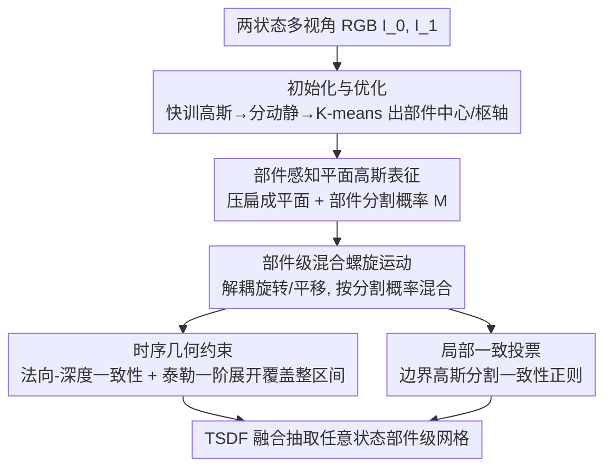

# REArtGS++: Generalizable Articulation Reconstruction with Temporal Geometry Constraint via Planar Gaussian Splatting

**会议**: CVPR 2026  
**论文**: [CVF Open Access](https://openaccess.thecvf.com/content/CVPR2026/html/Wu_REArtGS_Generalizable_Articulation_Reconstruction_with_Temporal_Geometry_Constraint_via_Planar_CVPR_2026_paper.html)  
**代码**: 项目页 https://sites.google.com/view/reartgs2/home  
**领域**: 3D视觉 / 铰接物体重建 / 高斯泼溅  
**关键词**: 铰接物体, 关节参数估计, 平面高斯泼溅, 螺旋运动, 时序几何约束

## 一句话总结
REArtGS++ 只用任意两个状态下的多视角 RGB 图，就能在不预设关节类型、不依赖外部模型的情况下重建出未见铰接物体（抽屉、冰箱等）的部件级表面网格并估计关节参数——靠把每个关节建成可解耦的螺旋运动、用平面高斯+泰勒一阶展开把"法向-深度一致性约束"从离散两状态扩展到整个运动区间，在 PARIS 与 ArtGS-Multi 上几乎全指标 SOTA，尤其对螺旋关节和多部件物体优势巨大。

## 研究背景与动机
**领域现状**：铰接物体（有可动部件、靠关节连接）在机器人和具身智能里无处不在，但比静态物体难重建——既要部件级网格，又要估计关节参数。早期 ASDF、DITTO 用昂贵的 3D 监督训生成模型，泛化差；PARIS 用神经辐射场实现"类别无关"的两状态建模；ArtGS、REArtGS 进一步引入 3D 高斯泼溅（3DGS）的显式表征，重建又快又真。

**现有痛点**：作者观察到 ArtGS/REArtGS 仍有两个硬伤。其一，它们**依赖关节类型先验**——需要额外流水线和预设阈值来判断关节是旋转还是平移，且默认关节只能二选一。遇到**螺旋关节**（边转边移）或多部件物体时，错误的类型先验会让关节轴参数估计严重崩坏（论文表里 REArtGS 在某些多部件物体上 Axis Ang 误差高达 87）。其二，**只有两状态监督很难施加时序几何约束**——关节参数和高斯基元是联合优化的，未见中间状态缺乏几何约束会反过来拖累关节估计；REArtGS 虽用 SDF 增强几何约束，但 SDF 是静态映射，做不了时序正则。

**核心矛盾**：铰接重建要同时学好"部件分割+关节参数+几何表面"，三者耦合优化；而现有方法既被关节类型先验束缚（限定旋转/平移），又只能在离散两状态上约束几何，整个时间区间 $t\in[0,1]$ 的中间状态几何无人监督。

**本文目标**：(1) 不要关节类型先验，统一建模任意刚体运动（旋转/平移/螺旋）；(2) 把几何一致性约束从离散两状态扩展到整个运动区间，且全程无监督。

**切入角度**：用**平面高斯**（把 3D 高斯压扁成 2D 平面，得到准确法向和无偏深度）打好几何底子，再借**泰勒一阶展开**把"某一状态的法向-深度一致"近似推广到时间连续区间，从而绕开"只能在离散状态约束"的限制。

**核心 idea**：把每个关节建成**解耦的螺旋运动**（旋转+平移分开学、不预设类型），用部件分割概率做**运动混合权重**联合优化部件高斯与关节参数；同时用**时序几何约束**让整个区间的几何自洽。

## 方法详解

### 整体框架
输入是未见铰接物体在任意两个不同状态 $I_0,I_1$ 下的多视角 RGB 图（无深度监督），输出是任意状态 $t\in[0,1]$ 的部件级表面网格 + 关节参数（旋转角、旋转轴、枢轴点、平移）。流程：先快速训出两状态的初始高斯并据 Chamfer 距离区分动/静态高斯、用 K-means 聚出部件中心与枢轴做**初始化**；再用**部件感知平面高斯表征**把高斯压扁成平面、并给每个高斯一组属于各部件的分割概率；运动上用**部件级混合螺旋运动**把各部件的解耦螺旋运动按分割概率混合到每个高斯；优化时叠加**时序几何约束**（法向-深度一致性经泰勒展开覆盖整个区间）与**局部一致投票**（修边界高斯的模糊分割）；收敛后用 TSDF 融合在任意状态抽取部件级网格。

### 关键设计

**1. 部件感知平面高斯表征：先把几何底子打准，才能谈时序约束**

普通 3DGS 的高斯是各向异性椭球，渲染法向和深度都不够准，无法支撑后面的几何约束。REArtGS++ 沿用 PGSR 思路引入尺度损失 $\mathcal{L}_{\text{scale}}=\frac{1}{N_\mathcal{G}}\sum_i\|\min(s_1,s_2,s_3)\|$ 把每个高斯沿最短轴压扁成 2D 平面，于是能从平面的最短轴+视角方向自然渲染出准确法向 $\mathbf{N}$、并按 $\mathbf{D}(\rho)=\frac{d}{\mathbf{N}(\rho)\mathbf{K}^{-1}\tilde\rho}$ 得到无偏深度（射线与平面交点即真实表面，无偏差）。在此基础上给每个平面高斯配一组分割概率 $\mathbf{M}=\{m_1,...,m_k\}$ 表示它属于各部件的概率：直觉是"高斯离某部件中心越近、属于它的概率越大"，用可学习的部件中心 $(O,V,\Lambda)$ 算相对距离 $L_i=V(\mu_i-O)\Lambda$ 与马氏距离 $\gamma_i=L_i^\top L_i$，再叠一个 MLP 学的残差项得到 $\mathbf{M}_i$。准确法向+无偏深度是第 3 点时序几何约束能成立的前提。

**2. 部件级混合螺旋运动：不预设关节类型，统一吃下旋转/平移/螺旋**

REArtGS 把高斯运动建成旋转或平移的时间插值，ArtGS 用对偶四元数但缺枢轴显式建模导致枢轴和平移纠缠——两者都难估螺旋运动，且要预设关节类型，多部件物体上一旦类型判错就崩。REArtGS++ 直接把每个关节参数 $\omega$ **解耦**成旋转和平移、设 $\omega=\{q(\theta,a),o,t\}$ 全部可学（$q$ 是关节四元数、$o$ 枢轴、$t$ 平移），天然覆盖 $SE(3)$ 任意刚体运动而无需类型先验。每个平面高斯的运动由各部件运动按分割概率**混合**得到：$\mu_i(t)=\sum_{j=1}^{k} m_j\big[R_j(\mathbf{q}(t))(\mu_i-o_j)+o_j+t_j(t)\big]$，分割概率 $(m_1,...,m_k)$ 就是混合权重。为避免指数坐标在 $\|\theta\|>\pi$ 处奇异，定义规范状态 $t^*=0.5$、让角度落在 $[-\pi/2,\pi/2]$，状态 $t$ 的角度与平移按 $\theta(t)=\frac{t-t^*}{t^*}\theta$ 线性插值。这样部件分割 $\mathbf{M}$ 和关节参数被无监督地联合优化出来。

**3. 时序几何约束：用泰勒一阶展开把"两状态一致"推广到整个时间区间**

PGSR 那种"法向 $\bar{\mathbf{N}}$（由深度局部块叉积反算）对齐渲染法向 $\mathbf{N}$"的一致性正则只能管单个离散状态，管不了连续区间 $t\in[0,1]$ 的中间状态——而中间状态几何没约束正是拖累关节估计的根源。REArtGS++ 用泰勒一阶展开近似法向随时间的变化：$\mathbf{N}(\omega,t)\approx \mathbf{N}(\omega,t_0)+\lim_{t\to t_0}\frac{\mathrm{d}\mathbf{N}(\omega,t)}{\mathrm{d}t}(t-t_0)$，其中 $t_0=0,1$ 让深度/法向渲染能在算颜色损失的单次前向里同时得到；梯度项用差分近似 $\nabla\mathbf{N}(\omega,t_0)\approx\frac{N(\omega,t)-N(\omega,t^*)}{t-t^*}$。因为规范状态 $t^*$ 不施加运动变换，这个近似既省算力又避免运动误差累积（且 $N(\omega,t^*)$ 不参与反传以省显存）。最终时序几何约束为 $\mathcal{L}_{\text{geo}}=(1-\nabla\mathbf{I}(t_0))\big(\|\bar{\mathbf{N}}(\omega,t_0)-\mathbf{N}(\omega,t_0)\|+\|\nabla\bar{\mathbf{N}}(\omega,t_0)-\nabla\mathbf{N}(\omega,t_0)\|\big)$，用图像梯度 $\nabla\mathbf{I}$ 避开边缘。这是把几何一致性"沿时间铺开"的关键。

**4. 局部一致投票：修边界高斯模糊分割导致的分割飘忽**

基于距离的分割 $\mathbf{M}$ 在相邻部件**边界高斯**处常学不出有明确倾向的概率分布，造成分割模糊不一致。REArtGS++ 先按"邻域里多数高斯不属于本部件的比例 $\ge\beta$（$\beta=0.2$）"判定边界高斯，再用 k-means 把边界高斯切成 $4\times k$ 个局部区域；每个区域按各点到区域中心的距离加权、softmax 聚出一个投票分布 $\mathbf{M}_{\text{vote}}=\sum_i\frac{\Phi_{\text{softmax}}(-\delta)M_i}{\sum_i M_i}$，最后用 KL 散度 $\mathcal{L}_{\text{vote}}=\sum\frac{1}{|\mathcal{N}_n|}D_{\text{KL}}(\mathbf{M}_{\text{vote}}\|M_i)$ 把每个边界高斯的分割拉向其局部投票分布。本质是给点级分割注入**空间上下文**，靠局部聚合而非孤立点判断，消除重叠区的歧义分割。

### 损失函数 / 训练策略
总目标为 $\mathcal{L}=\lambda_{\text{render}}\mathcal{L}_{\text{render}}+\lambda_{\text{scale}}\mathcal{L}_{\text{scale}}+\lambda_{\text{center}}\mathcal{L}_{\text{center}}+\lambda_{\text{geo}}\mathcal{L}_{\text{geo}}+\lambda_{\text{vote}}\mathcal{L}_{\text{vote}}$，其中 $\mathcal{L}_{\text{render}}$ 是 3DGS 标准 L1+D-SSIM 渲染损失、$\mathcal{L}_{\text{center}}$（沿用 ArtGS）把部件中心对齐到对应高斯均值位置。初始化阶段先用 vanilla 3DGS 快训两状态高斯（几分钟），按 Chamfer 距离 $\Delta x_i>\tau_x$（$\tau=0.02$）区分动/静态、用匈牙利匹配取两状态均值作规范状态高斯，再 K-means 聚部件中心与枢轴。方法还能扩展到多状态输入 $\{I_0,I_{t_1},...,I_1\}$。收敛后按 $\mathcal{G}^j=\{\mathcal{G}_i|\max(\mathcal{G}_i=m_j)\}$ 取部件高斯、Eq.5 更新到状态 $t$、TSDF 融合（体素 0.04）抽网格。

## 实验关键数据

### 主实验
三个数据集：PARIS（10 个 PartNet-Mobility 物体）、ArtGS-Multi（5 个多部件 + 2 个自采螺旋关节物体）、真实世界（5 个物体）。指标全部越低越好：CD-w/CD-s/CD-m 是整体/静态/动态部件的 Chamfer 距离（$\times10^3$），Axis Ang（轴角误差，°）、Axis Pos（枢轴距离，mm）、Part Motion（部件运动误差）。

| 数据集 | 指标 | REArtGS++ | REArtGS | ArtGS | 说明 |
|--------|------|-----------|---------|-------|------|
| PARIS 合成（均值） | CD-w ↓ | **3.25** | 4.49 | 4.78 | 相对 REArtGS 降 ~27.6% |
| PARIS 合成（均值） | Axis Ang ↓ | **0.01** | 0.04 | 0.02 | 关节轴估计最准 |
| ArtGS-Multi（多部件均值） | Axis Ang ↓ | **0.55** | 49.43 | 25.08 | 多部件上断层领先 |
| ArtGS-Multi（多部件均值） | Axis Pos ↓ | **0.50** | 230.31 | 96.49 | 枢轴误差降两个数量级 |
| 螺旋关节物体（均值） | Axis Ang ↓ | **0.07** | 67.13 | 64.93 | 螺旋关节优势最显著 |

在多部件物体上，ArtGS/REArtGS 因依赖关节类型先验、一旦先验判错（如 Table 31249、Storage 47468）轴参数严重退化；REArtGS++ 不需类型估计，鲁棒性远超。

### 消融实验
| 配置 | Axis Ang ↓ | Axis Pos ↓ | CD-m ↓ | 说明 |
|------|-----------|-----------|--------|------|
| 完整模型（w/ all） | **0.41** | **1.18** | **2.38** | 全组件 |
| w/o 平面高斯 | 5.18 | 21.38 | 7.57 | 退回原始 3DGS，几何变差 |
| w/o 螺旋运动 | 22.78 | 88.26 | 29.68 | 改用对偶四元数，螺旋关节崩 |
| w/o 初始化 | 33.47 | 71.74 | 126.03 | 部件中心/枢轴随机初始化，最致命 |
| w/o $\mathcal{L}_{\text{vote}}$ | 2.66 | 15.10 | 10.38 | 边界分割模糊 |
| w/o $\mathcal{L}_{\text{geo}}$ | 4.04 | 16.08 | 5.70 | 缺时序几何约束 |
| w/ random $\Delta t$ | 5.83 | 23.10 | 10.07 | 用随机中间态做差分反而变差 |

### 关键发现
- **初始化和螺旋运动建模贡献最大**：去掉初始化让 CD-m 从 2.38 暴涨到 126.03、Axis Ang 到 33.47，是所有消融里最致命的；去掉解耦螺旋运动（退回对偶四元数）让螺旋关节 Axis Ang 从 0.41 升到 22.78，印证"不预设类型 + 解耦螺旋"是处理螺旋/多部件的核心。
- **时序几何约束要选对差分基准**：用规范状态 $t^*$ 做差分近似有效，但"w/ random $\Delta t$"（用随机中间态替代 $t^*$）反而带来负效果（Axis Ang 5.83），因为早期优化时其它状态的运动尚不准、会引入额外运动误差。
- **螺旋关节是最大受益场景**：在 2 个自采螺旋关节物体上，REArtGS++ 的 Axis Ang 0.07 对比 REArtGS 的 67.13、ArtGS 的 64.93，几乎是"能用 vs 不能用"的差距。

## 亮点与洞察
- **泰勒一阶展开把几何约束"沿时间铺开"**：用一阶差分近似法向随时间的导数、并固定在规范状态 $t^*$ 上算，既覆盖了整个连续运动区间、又省算力省显存、还避免运动误差累积——这是把"离散两状态约束"升级成"时序约束"的巧妙一招，可迁移到任何"两端监督、想约束中间过程"的动态重建任务。
- **解耦螺旋运动 + 混合权重**：把关节参数拆成旋转/平移分量、用部件分割概率做运动混合权重，一举甩掉关节类型先验、统一吃下旋转/平移/螺旋，对多部件物体尤其鲁棒——这是"先验越少越泛化"的好例子。
- **平面高斯是几何约束的地基**：先把高斯压扁拿到准法向+无偏深度，后面的时序一致性约束才立得住，体现"表征质量决定约束能做到多细"。
- **局部投票修边界分割**：把无监督部件分割的模糊边界用 KNN 局部投票+KL 拉齐，是一个轻量但有效的"空间上下文正则"思路。

## 局限与展望
- **依赖两状态多视角图与已知相机位姿**：每个状态需 60-100 张有位姿的 RGB 图，采集成本不低；对只有单状态或位姿不准的场景不适用。
- **真实世界结果仍逊于合成**：真实数据上 CD/关节误差明显高于合成（如 Storage 真实物体 CD-w 仍 10+），表明对真实噪声、纹理缺失的鲁棒性有限。
- **泰勒一阶近似的适用范围**：对运动幅度很大或高度非线性的关节，一阶展开近似可能不够 ⚠️（论文未充分讨论大运动下的近似误差，以原文为准）。
- **部件数 $k$ 需预知或由初始化聚类决定**：K-means 聚部件数若与真实部件不符，可能影响分割与关节估计。

## 相关工作与启发
- **vs REArtGS（直接前作）**：REArtGS 把运动建成旋转/平移的时间插值、用静态 SDF 做几何约束、依赖关节类型先验；REArtGS++ 改成解耦螺旋运动（无类型先验）+ 平面高斯 + 泰勒时序约束，在 PARIS 合成 CD-w 降 27.6%、多部件 Axis Ang 从 49.43 降到 0.55。
- **vs ArtGS**：ArtGS 用对偶四元数建运动但枢轴与平移纠缠、仍需类型先验；REArtGS++ 显式解耦枢轴/旋转/平移，螺旋关节上 Axis Ang 0.07 vs 64.93。
- **vs PARIS / DTA**：PARIS 用神经辐射场隐式表征，多部件感知弱、动态表面不平滑；本文用显式平面高斯，重建更快更真、部件级网格更准。
- **vs PGSR（几何先验来源）**：借用 PGSR 的平面高斯+法向深度一致性，但 PGSR 是静态单状态的；本文用泰勒展开把它扩展到时间连续区间，是对 PGSR 的动态化推广。

## 评分
- 新颖性: ⭐⭐⭐⭐ 解耦螺旋运动 + 泰勒时序几何约束是实打实的新组合，但建立在 REArtGS/PGSR 既有框架上的增量
- 实验充分度: ⭐⭐⭐⭐⭐ 三数据集 + 含螺旋/多部件的挑战集 + 两组细致消融，把每个组件贡献都拆清楚
- 写作质量: ⭐⭐⭐⭐ 方法逻辑清晰、公式完整，但 CVF 抓取的公式排版较乱，部分记号需对照原文
- 价值: ⭐⭐⭐⭐ 对机器人/具身智能里铰接物体的部件级重建与关节估计有直接实用价值，尤其解决了螺旋/多部件痛点

<!-- RELATED:START -->

## 相关论文

- [\[CVPR 2026\] Particulate: Feed-Forward 3D Object Articulation](particulate_feed-forward_3d_object_articulation.md)
- [\[CVPR 2026\] Uni3R: Unified 3D Reconstruction and Semantic Understanding via Generalizable Gaussian Splatting from Unposed Multi-View Images](uni3r_unified_3d_reconstruction_and_semantic_understanding_via_generalizable_gau.md)
- [\[CVPR 2026\] ST4R-Splat: Spatio-Temporal Referring Segmentation in 4D Gaussian Splatting](st4r-splat_spatio-temporal_referring_segmentation_in_4d_gaussian_splatting.md)
- [\[CVPR 2026\] Minimal Constraint Relaxation for Multiview Autocalibration](minimal_constraint_relaxation_for_multiview_autocalibration.md)
- [\[CVPR 2026\] IDESplat: Iterative Depth Probability Estimation for Generalizable 3D Gaussian Splatting](idesplat_iterative_depth_probability_estimation_for_generalizable_3d_gaussian_sp.md)

<!-- RELATED:END -->
