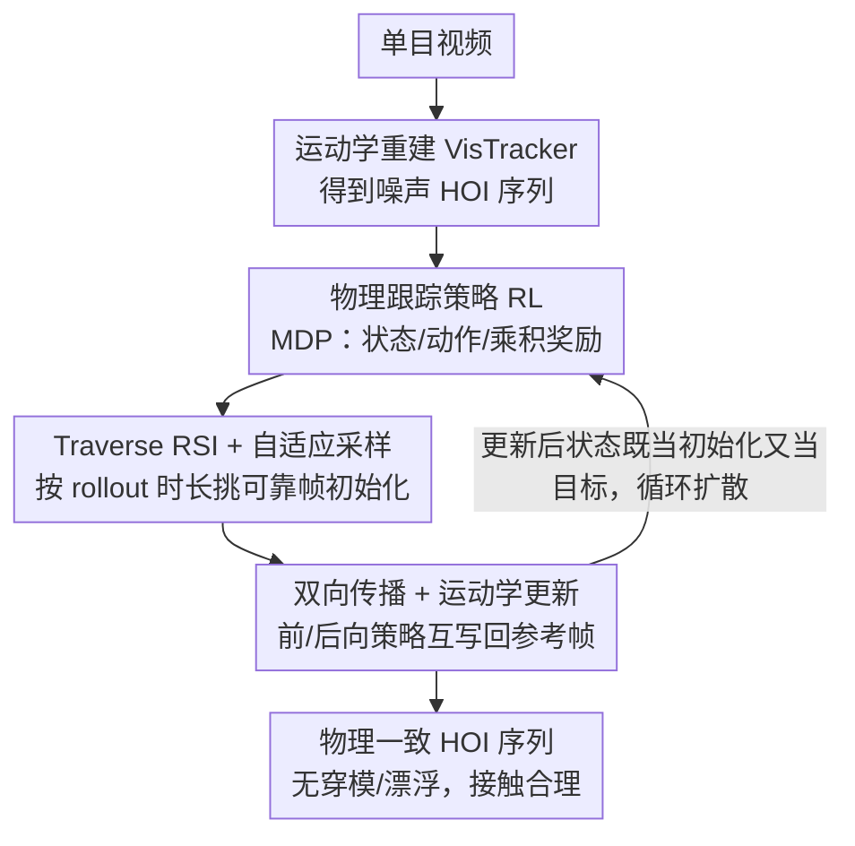

# Recovering Physically Plausible Human-Object Interactions from Monocular Videos

**会议**: CVPR 2026  
**arXiv**: [2606.05359](https://arxiv.org/abs/2606.05359)  
**代码**: https://dingbang777.github.io/RePHO/ (项目页)  
**领域**: 3D视觉 / 人物-物体交互重建 / 物理仿真  
**关键词**: HOI重建, 单目视频, 物理仿真, 强化学习, 接触一致性

## 一句话总结
RePHO 把单目视频估出来的「视觉上还行、物理上漏洞百出」的人-物交互（HOI）序列，丢进物理仿真器里用强化学习策略重演一遍，靠「自适应采样 + 前后向双向传播 + 在线更新运动学目标」从极噪的初值里识别可靠帧并逐步扩散，最终输出无穿模、无漂浮、接触合理的物理一致 HOI 序列，在 BEHAVE / InterCap 上物理指标大幅领先。

## 研究背景与动机
**领域现状**：从单目 RGB 视频重建全身人-物交互（HOI）是 3D 视觉长期难题。近几年 VisTracker 等基于运动学（kinematic）的方法已能从视频里恢复出视觉上相当不错的人体与物体轨迹，配合模板还能跟踪接触关系。

**现有痛点**：这些方法本质上都是「运动学」的——它们直接回归位姿，不显式建模接触力、重力、碰撞。于是结果普遍存在物理违例：物体悬空漂浮（floating）、人体与物体互相穿插（interpenetration）、运动抖动（jitter）。即便有些工作加了「物理感知损失」去惩罚接触违例，也只是软约束，达不到真正的物理可行。

**核心矛盾**：要拿到物理一致的结果，最直接的办法是把动作丢进物理仿真器、用 RL 训一个控制策略去复现交互（已有 InterMimic 等工作这么做）。但这些 RL-based HOI 框架都假设输入是干净的动捕（MoCap）数据；而单目重建在遮挡、快速运动时位姿会严重漂移、抖动甚至发散——直接拿这种噪声序列去训 RL，rollout 一开始就因为「接触缺失 / 物体悬空」而立刻终止，根本学不起来。

**本文目标**：在不依赖干净动捕、只有噪声单目重建的前提下，训出一个能在物理仿真器里稳定复现该交互的策略，从而把噪声运动学结果「物理化」。

**切入角度**：作者观察到，噪声序列虽然整体不可信，但仍含有可靠信号——接触清晰、物体运动慢的帧往往估得准；而且经验上「初始帧接触模式的准确度」与「RL 早期 rollout 能撑多久不失败」强相关。于是只要能自动找出这些可靠帧当锚点，再把它们重演出的物理合理状态向整段序列扩散，就能在噪声里把整个序列「捞」出来。

**核心 idea**：从可靠帧出发训物理跟踪策略，用**自适应采样**挑出可靠初始化帧、用**前后向双向传播 + 在线更新运动学目标**把物理合理的接触状态逐步扩散到全序列，让策略在极噪输入下也能学出稳定真实的交互。

## 方法详解

### 整体框架
RePHO 是一个两阶段 pipeline。**第一阶段**用现成的运动学方法 VisTracker 从输入视频重建出全局坐标下的人-物交互轨迹 $M=\{\mathbf{q}_t^h,\mathbf{q}_t^o\}_{t=1}^T$（人体用 SMPL-H 参数化、物体用 6DoF 位姿），但这个估计往往很噪。**第二阶段**把这段噪声运动学同时当作「初始化状态」和「跟踪目标」，在物理仿真器里用 RL 训一个跟踪策略去模仿它：每个时刻 $t$，策略观察当前物理状态 $s_t^s$ 和一组未来参考状态 $\{\hat s_{t,t+k}\}_{k\in\mathbf{K}}$，输出动作 $a_t$ 驱动人形朝下一个运动学目标推进，同时保持物理可行；沿时间 rollout 就得到一段物理落地的 HOI 序列。

第二阶段的难点全在「噪声初值」上，所以围绕它叠了两个机制：先用 **Traverse RSI + 自适应采样**从全时间轴里识别出可靠帧、优先从干净帧初始化 rollout；再用 **双向传播 + 运动学更新**，让前向/后向两个策略各自把成功 rollout 出来的物理合理状态写回去、覆盖原本的噪声参考帧，并把更新后的状态既当新初始化又当新跟踪目标，逐步把物理一致性从可靠帧扩散到整段序列。

### 关键设计

**1. 物理仿真器内的 HOI 跟踪策略：把重建转成 MDP 复现问题**

针对「运动学结果不含物理」这个根因，RePHO 不再回归位姿，而是把 HOI 跟踪建模成马尔可夫决策过程（MDP），让仿真器的接触力、重力、碰撞天然保证物理可行。**状态** $\mathbf{s}_t=\{s_t^s,s_t^g\}$ 由当前物理状态与未来运动学参考组成：物理状态 $s_t^s$ 含人体与物体的关节旋转/位置/线速度/角速度 $\{\theta,p,\dot p,\omega\}$，外加两个几何/触觉线索——$d_t$（人体关节到物体表面最近点的向量）和 $c_t$（二值接触标记）。一个关键取舍是：作者**只给手部提供接触标记**，因为最小化的接触引导是稳定 HOI 跟踪所必需的；物体上的接触点、其他身体部位、地面接触都**不给**，而是交给 RL 配合后面的自适应采样自动学出来。目标状态 $s_t^g=\{\hat s_{t,t+k}\}_{k\in\mathbf{K}}$ 把未来参考都表示成相对当前物理状态的差量（旋转用 $\ominus$、位置用减法），并按人体根节点位置与朝向归一化。**动作** $a_t\in\mathbb{R}^{51\times3}$ 是 51 个驱动关节的指数映射目标旋转，作为 PD 控制目标由仿真器转成关节力矩。

**奖励**用连乘而非加权和：

$$r_t = r_t^{h}\cdot r_t^{o}\cdot r_t^{c}\cdot r_t^{d}\cdot r_t^{e}$$

其中 $r_t^h,r_t^o$ 惩罚人体/物体的位姿、位置、速度误差（如 $\|\theta_t^h-\hat\theta_t^h\|$、$\|p_t^o-\hat p_t^o\|$）；接触项 $r_t^c$ 对齐获得的接触状态 $c_t$ 与参考 $\hat c_t$、并惩罚物体接触点与配对手关节之间的距离；距离项 $r_t^d$ 压低人-物邻近度偏差 $\|d_t-\hat d_t\|$；能量项 $r_t^e$ 惩罚突变运动和突发接触力。每项写成 $\exp(-\lambda E)$ 的形式。连乘的好处是任一项崩了整体奖励就趋零，逼策略把所有约束同时满足，而不是靠某项高分掩盖另一项的违例。

**2. Traverse RSI + 自适应采样：从噪声序列里识别可靠帧当锚点**

针对「从噪声帧初始化 rollout 立刻失败、根本训不动」这个痛点，作者改造了参考状态初始化（RSI）。标准 RSI 是随机挑一帧把仿真器置成该帧参考位姿，目的是改善后段跟踪；而这里的目的不同——是要**先找出哪些帧可靠**。于是在 RL 早期改成在整条时间轴上**均匀采样**初始化帧、让每帧被访问的次数相同，作者称之为 **Traverse RSI**。训几个 epoch 后会出现明显分化：从可靠帧（接触遮挡少、运动慢）初始化的 rollout 能撑很久才失败，从噪声帧出发的几乎立刻崩。作者维护一个 buffer 记录「每帧初始化对应的 rollout 长度」，再用**自适应采样**逐步抬高干净帧的采样概率，让 RSI 越来越偏向能带来稳定有效学习的可靠帧。这一步等于让策略自己「投票」选出可信锚点，而不需要任何额外的帧质量标注。

**3. 双向传播 + 在线运动学更新：把物理合理状态向全序列扩散**

光挑出可靠帧还不够——干净帧附近能 rollout 成功后，这些成功 rollout 产生的状态其实**比原始 VisTracker 估计更物理合理**（接触配置准时尤其如此），作者称之为「准确运动学状态的传播」。于是用 buffer 把成功 rollout 的有效仿真状态记下来，**回写覆盖**原本噪声的运动学参考帧；之后的 rollout 既从这些改进后的状态初始化，又把它们当**新的跟踪目标**（受 [50] 启发），参考帧按 rollout 成功统计（剩余长度 + 奖励）加权采样，buffer 持续演化。

关键洞察是：传播不仅能**前向**进行，也能**后向**——倒放视频，从一个物理有效的接触配置出发可以把它传到更早的帧。所以实现里**同时训两个策略**：前向策略按时间顺序跟踪、接收未来参考；后向策略倒序跟踪、接收过去参考；两者都从 InterMimic 的策略 checkpoint 初始化再微调。两个策略互相喂状态——前向策略可以从后向 rollout 改进过的状态初始化，反之亦然。这在「某个转移在一个时间方向上比另一个方向更容易」时特别有效：例如「把物体放下」比「从噪声初值里把物体拿起来」更容易，于是后向 rollout 的「放下」恰好给前向「拿起」提供了优质跟踪目标。如此前后向双向传播，更新逐渐扩张覆盖整段序列，直到两个策略都能物理一致地重建出完整 HOI。

### 损失函数 / 训练策略
- 第二阶段用 RL 优化上面的连乘奖励 $r_t$；动作经 PD 控制转力矩在仿真器内 rollout。
- 前/后向策略均以 InterMimic 预训练 checkpoint 初始化后单序列微调。
- 训练分阶段：早期 Traverse RSI 均匀采样探查可靠帧 → 自适应采样偏向干净帧 → 双向传播 + 在线更新运动学参考，更新依据「剩余 rollout 长度 + 奖励」。

## 实验关键数据

### 主实验
在 BEHAVE（35 段 subject 03 测试片段）与 InterCap（38 段测试片段）上评测，与运动学 SOTA VisTracker 对比（VisTracker 也是本方法的初始化来源）。指标含 3D 精度（CD-H/CD-O，PA Chamfer Distance, cm）与一系列物理感知指标：ContRate-h（手部接触检出率，↑）、ContDist-h/w（手部/全身接触距离, cm, ↓）、Pen（穿模深度, cm, ↓）、ObjFloat（物体悬空比例, ↓）、ObjJerk（物体抖动/jerk, ↓）。

| 数据集 | 方法 | CD-H↓ | CD-O↓ | ContRate-h↑ | ContDist-h↓ | Pen↓ | ObjFloat↓ | ObjJerk↓ |
|--------|------|-------|-------|-------------|-------------|------|-----------|----------|
| BEHAVE | VisTracker | **5.39** | **8.73** | 0.52 | 7.78 | 6.64 | 0.30 | 524.9 |
| BEHAVE | **RePHO** | 6.82 | 11.06 | **0.89** | **4.33** | **3.91** | **0.10** | **188.5** |
| InterCap | VisTracker | **6.39** | **11.07** | 0.48 | 10.22 | 3.11 | 0.49 | 508.2 |
| InterCap | **RePHO** | 7.04 | 12.32 | **0.81** | **4.84** | **1.76** | **0.06** | **151.2** |

代价是 CD（纯 3D 精度）略降约 1.4 cm，但所有交互相关与物理感知指标全面大幅改善：BEHAVE 上接触率 0.52→0.89、穿模 6.64→3.91、抖动 524.9→188.5、悬空 0.30→0.10。

与物理-based SOTA InterMimic 对比（均以 VisTracker 估计为输入，新增 SR-B / SR-F 两个成功率指标）：

| 数据集 | 方法 | SR-B↑ | SR-F↑ | CD-H↓ | CD-O↓ | ContRate-h↑ |
|--------|------|-------|-------|-------|-------|-------------|
| BEHAVE | InterMimic (direct) | 0 | 3.8 | – | – | – |
| BEHAVE | InterMimic (finetune) | 17.1 | 26.7 | 7.10 | 12.48 | 0.82 |
| BEHAVE | **RePHO** | **51.4** | **60.0** | **6.74** | **10.50** | **0.87** |
| InterCap | InterMimic (direct) | 0 | 8.8 | – | – | – |
| InterCap | InterMimic (finetune) | 21.1 | 29.5 | 6.32 | 12.29 | 0.70 |
| InterCap | **RePHO** | **52.6** | **57.1** | 6.45 | 10.54 | **0.71** |

预训练 InterMimic 直接推理在噪声 VisTracker 重建上几乎不可用（SR-B=0，立刻因接触不稳/缺失而失败）；即便单序列微调，成功率也只有 17~21%。RePHO 把 SR-B 拉到 51~53%、SR-F 拉到 57~60%，证明它对噪声运动学输入的强鲁棒性。

> 指标定义：**SR-B**（Success Rate-Binary）= 策略能否从头到尾无失败地重建整段序列；**SR-F**（Success Rate-Frame）= 策略能成功重建的最长连续帧段 / 总序列长度（短于 2 秒的 rollout 忽略），反映能复现的最长物理有效片段占比。

### 消融实验
在 BEHAVE 上逐项开关三个设计（SR-B / SR-F）：

| 自适应采样 | 运动学更新 | 双向传播 | SR-B↑ | SR-F↑ | 说明 |
|:---:|:---:|:---:|:---:|:---:|------|
| ✗ | ✗ | ✗ | 11.4 | 24.5 | 朴素训练 |
| ✓ | ✗ | ✗ | 14.3 | 40.4 | +自适应采样 |
| ✓ | ✓ | ✗ | 17.1 | 43.5 | +在线更新运动学 |
| ✓ | (✓) | ✓ | 40.0 | 59.4 | 更新只用于初始化、不当跟踪目标 |
| ✓ | ✓ | (✓) | 48.5 | 59.7 | 双向传播用单策略而非两策略 |
| ✓ | ✓ | ✓ | **51.4** | **60.0** | 完整 RePHO |

### 关键发现
- **三个机制逐级叠加都涨点**：朴素训练 SR-B 仅 11.4，加自适应采样→14.3，再加运动学更新→17.1，最后加双向传播一跃到 51.4——双向传播是拉满成功率的最大贡献项。
- **运动学更新必须当「跟踪目标」而不只是初始化**：若更新后的状态只用于初始化、不替换跟踪目标（第 4 行），SR-B 从 51.4 掉到 40.0。原因（图 6）很直观：策略若去模仿噪声参考，遇到「拿箱子」这类初期无人-物接触的动作就学不会；而用后向 rollout 更新出的目标，策略才学得会先抓住再完成后续。
- **双向 > 单向**：用单一策略实现双向传播（第 5 行）SR-B 48.5，略低于双策略的 51.4，印证「某些转移在反方向更易获得」（放下易、拿起难）带来的互补价值。

## 亮点与洞察
- **让策略自己「投票」找可靠帧**：用「rollout 能撑多久」作为帧可靠度的免标注代理信号，再用自适应采样放大干净帧权重——把一个难标注的「帧质量评估」问题，转化成 RL 训练里自然涌现的统计量，思路很巧。
- **时间双向传播 + 在线改写目标**：把成功 rollout 的物理合理状态回写覆盖噪声参考、并同时倒放视频做后向传播，等于让仿真器充当「去噪器」，从少数可靠锚点把物理一致性向两端扩散。这套「自更新数据集」的范式可迁移到其他「初值噪声大、但局部有可信片段」的序列重建任务（如手-物操作、机器人模仿学习）。
- **连乘式奖励**：把人体/物体/接触/距离/能量五项用乘法耦合，任一违例就拉垮总分，比加权和更能逼出「全约束同时满足」的解。
- **real-to-sim 桥梁**：作者明确指向用互联网级人类视频教机器人学 HOI 技能的愿景——把噪声视频重建变成 simulation-ready 的物理一致动作，是打通 real-to-sim 数据管线的关键一步。

## 局限与展望
- **两阶段串行、上限受初值制约**（作者承认）：先视频→运动学再物理细化，虽然更新机制能改善初值，但整体成功率仍被初始 4D 重建质量卡住；未来可探索端到端「视频→动力学」联合推断几何与物理交互。
- **场景过简**（作者承认）：每段只处理单物体、且接触动态较弱；多物体、多人、更剧烈接触、场景感知 HOI 尚未覆盖。
- **CD 精度有代价**：物理化换来约 1.4 cm 的 Chamfer 精度下降，对纯几何精度敏感的下游需权衡。
- **评测口径需留意**：物理指标都只在「策略成功 rollout 出来的连续帧段」上计算，失败片段被排除；不同方法成功帧集合不同（表 2 还取交集），横向比较时需注意这层 caveat。
- **依赖物体模板**：初始化用的 VisTracker 是基于模板的，对无模板/未见物体类别的泛化未验证。

## 相关工作与启发
- **vs VisTracker（运动学 SOTA，本文的初始化）**：VisTracker 用 SIF-Net 神经场 + HVOP-Net 处理遮挡，跟踪连贯但纯运动学、不含物理，结果漂浮穿模严重。RePHO 不重做重建，而是把它的输出当噪声初值丢进物理仿真器修正——以约 1.4 cm 的 CD 代价换来接触/穿模/悬空/抖动的全面改善。
- **vs InterMimic（物理-based HOI 跟踪 SOTA）**：InterMimic 在大规模干净 HOI 动捕上预训练、统一奖励能 track 多样物体，但假设输入干净；面对噪声 VisTracker 重建，直接推理 SR-B=0、微调也只 17~21%。RePHO 正是补上「如何在极噪单目重建上稳定训 RL」这一环——用自适应采样 + 双向传播让 SR-B 翻到 51%+。本文的前/后向策略都从 InterMimic checkpoint 微调，是站在它肩上。
- **vs 物理感知损失类方法**：那类工作只在运动学优化里加软惩罚项，不显式建模接触力/重力/碰撞，治标不治本；RePHO 直接用物理仿真器作硬约束，从机制上消除违例。
- **vs 标准 RSI / DeepMimic 系**：标准 RSI 随机初始化是为改善后段跟踪；本文的 Traverse RSI 反过来用均匀采样 + rollout 时长统计来「诊断哪些帧可靠」，是对 RSI 的目的性改造。

## 评分
- 新颖性: ⭐⭐⭐⭐⭐ 把「rollout 时长当可靠度信号 + 时间双向传播在线改写跟踪目标」用来攻克「噪声单目重建上训 RL」，思路新颖且切中真痛点
- 实验充分度: ⭐⭐⭐⭐ 两个标准 HOI benchmark、同时对比运动学与物理两类 SOTA、消融清晰；但仅单物体场景、且物理指标只在成功帧上算，覆盖面有限
- 写作质量: ⭐⭐⭐⭐⭐ 动机推导（噪声里有可靠信号→识别+传播）层层递进，方法与图配合清楚
- 价值: ⭐⭐⭐⭐⭐ 打通「噪声视频重建→物理一致动作」，对 real-to-sim、从人类视频学机器人 HOI 技能有直接价值

<!-- RELATED:START -->

## 相关论文

- [\[CVPR 2026\] RHINO: Reconstructing Human Interactions with Novel Objects from Monocular Videos](rhino_reconstructing_human_interactions_with_novel_objects_from_monocular_videos.md)
- [\[CVPR 2026\] PhysHO: Physics-Based Dynamic 3D Gaussian Human and Object from Monocular Video](physho_physics-based_dynamic_3d_gaussian_human_and_object_from_monocular_video.md)
- [\[CVPR 2026\] ArtHOI: Taming Foundation Models for Monocular 4D Reconstruction of Hand-Articulated-Object Interactions](arthoi_taming_foundation_models_for_monocular_4d_reconstruction_of_hand-articula.md)
- [\[CVPR 2026\] NeoVerse: Enhancing 4D World Model with in-the-wild Monocular Videos](neoverse_enhancing_4d_world_model_with_in-the-wild_monocular_videos.md)
- [\[CVPR 2026\] CARI4D: Category Agnostic 4D Reconstruction of Human-Object Interaction](cari4d_category_agnostic_4d_reconstruction_of_human_object_interaction.md)

<!-- RELATED:END -->
