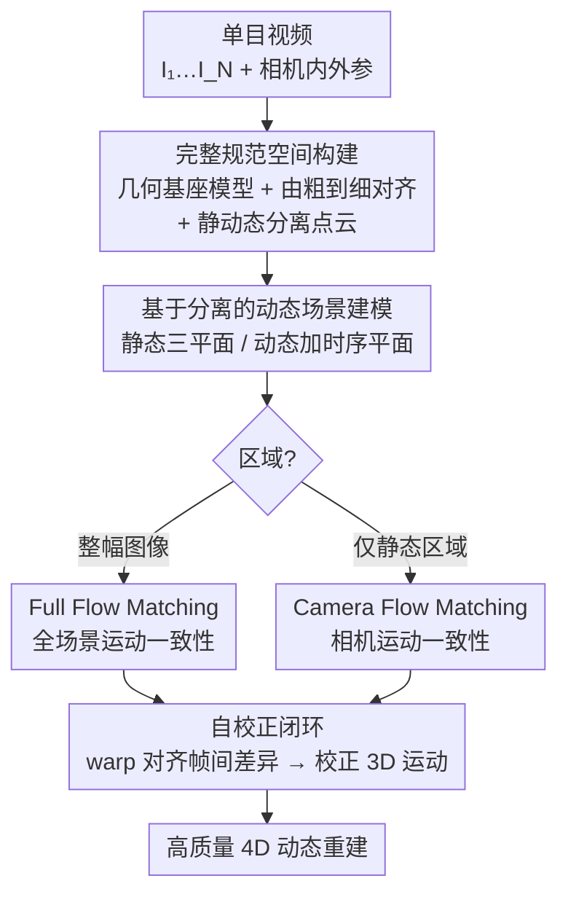

# ReFlow: Self-correction Motion Learning for Dynamic Scene Reconstruction

**会议**: CVPR 2026  
**论文**: [CVF Open Access](https://openaccess.thecvf.com/content/CVPR2026/html/Liang_ReFlow_Self-correction_Motion_Learning_for_Dynamic_Scene_Reconstruction_CVPR_2026_paper.html)  
**代码**: 项目页（论文中标注，具体地址待确认）  
**领域**: 3D视觉  
**关键词**: 单目动态重建, 4D 重建, 自校正光流匹配, 3D 高斯泼溅, 运动监督

## 一句话总结
ReFlow 提出一种"自校正"的单目动态场景重建框架，用视频帧间差异本身直接监督 3D 运动，无需外部光流/追踪先验，配合完整规范空间初始化与静动态解耦，在 NVIDIA Monocular 与 Nerfies-HyperNeRF 上把重建质量推到新 SOTA（NVIDIA 均值 PSNR 28.20 dB）。

## 研究背景与动机

**领域现状**：单目动态场景重建（从一段视频恢复随时间变化的 3D 结构）近年随 3D 高斯泼溅（3DGS）快速进步，主流做法是用 time-varying Gaussians 或形变场建模时序变化。

**现有痛点**：现有方法有两个老大难。其一，初始化不完整——大家普遍用 COLMAP 这类为静态场景设计的 SfM 来初始化高斯，得到的点云常常缺失动态区域，而且没把静态点和动态点区分开，造成一个纠缠、不完整的初始表征；后续重建和运动估计都建立在这个糟糕地基上，很不稳定。其二，过度依赖外部运动先验——为了稳住动态部分的重建，很多方法引入预先算好的光流或点追踪作为"伪真值"，强行约束 3D 运动去对齐这些外部估计。

**核心矛盾**：外部运动先验是把双刃剑。它由独立 pipeline 生成，本身可能有误差；一旦光流估计器在快速运动、遮挡、弱纹理区域出错，错误会沿着硬约束传播进重建。论文点名 MotionGS 把光流拆成运动流与相机流来约束，但仍紧紧绑定在外部光流标签质量上，估计器一不准就崩。本质矛盾是：**重建质量被外部估计器的精度锁死**。

**本文目标**：作者想问——能不能纯靠 2D 观测、完全不要外部运动引导，就解锁 4D 动态场景？这拆成两个子问题：(i) 如何给动态区域提供可靠初始化并把静/动态表征解耦；(ii) 如何在没有外部光流的情况下约束 3D 运动。

**切入角度**：作者抓住一个朴素观察——连续帧之间的像素差异本来就是真实 3D 运动造成的。如果重建出的 3D 运动是对的，把它投影成 2D 流去 warp 前一帧，warp 结果就该和后一帧对齐。换言之，视频自己就是运动监督信号。

**核心 idea**：用"视频帧间差异"代替"外部光流先验"来监督 3D 运动，形成一个自校正闭环——运动不准 → warp 后的帧偏离观测 → 偏差反过来把运动推向正确解。

## 方法详解

### 整体框架
ReFlow 是一个统一的单目动态重建 pipeline：输入是带相机内外参的单目视频 $V=\{I_i\}_{i=1}^N$，输出是一个能区分静/动态、且运动被正确学到的 4D 场景表征。整条链路分三步走——先把规范空间建完整、再把静动态解耦建模、最后用自校正光流匹配学运动。前两步是给运动学习"打地基"（解决初始化不完整与纠缠），第三步才是核心创新（用视频自监督运动）。

### 关键设计

**1. 完整规范空间构建：先把动态区域的地基补全、再把静动态拆开**

针对"COLMAP 初始化缺动态区域、且静动态纠缠"这个痛点，作者放弃 SfM，改用几何基座模型（geometry foundation model）从图像对回归逐像素 3D 坐标，并在全局连通图上强制几何一致性，得到统一点云。直接套到长视频有两个麻烦：内存随帧数二次增长 $O(N^2)$，且远距离视角共视太少导致对齐困难。解法是**由粗到细的层级对齐**：把视频切成 $K$ 个不重叠片段，每段取首帧当关键帧，先在关键帧之间建小连通图、优化相机位姿/内参/深度求一个粗的全局一致结构（最小化几何一致损失 $\min \sum_{(a,b)} \mathcal{L}_{align}(X_a^a, X_b^a, C_a^a, C_b^a)$），再在每个片段内做局部精对齐。粗→细同时保证了时间相邻帧的局部一致与整段序列的全局一致。拿到统一几何后，再用每帧的动态掩码 $M_i^{dyn}$ 把点云反投影、聚合成**分离的静态点云 $P^{3D,stat}$ 与动态点云 $P^{3D,dyn}$**，为后面区域特定的运动约束铺好路。

**2. 基于分离的动态场景建模：让静态和动态用各自合适的表征**

有了分离点云，作者给两类内容配不同表征。动态物体挑一个掩码覆盖最大、颜色最丰富的参考帧来代表 $P^{3D,dyn}$；静态区域则把当前帧与关键帧的点云融合成 $P^{3D,stat}_{fusion}$ 以增加视角覆盖。建模上，静态成分只用三平面空间特征 $F_s=\{F^{xy},F^{xz},F^{yz}\}$ 编码位置相关信息，解码出与时间无关的高斯参数 $G_s:\{\mu_s,s_s,q_s,\sigma_s,c_s\}=D_s(x,y,z;F_s)$；动态成分额外加时序平面 $F_t=\{F^{xt},F^{yt},F^{zt}\}$，让位置和旋转随时间变化 $G_d:\{\mu_d(t),s_d,q_d(t),\sigma_d,c_d\}=D_d(x,y,z,t;F_s,F_t)$。这种干净的拆分不仅减少早期歧义、让优化更稳，更关键的是为下一步"对静/动态分别施加不同运动约束"提供了表征前提。

**3. 自校正光流匹配：用视频自己当运动监督，构成自校正闭环**

这是 ReFlow 的灵魂。核心把"3D-2D 对齐"实现为一次像素级 warp：把 3D 运动投影成 2D 流，用它把 $I_1$ warp 向 $I_2$，再比对 warp 结果与真实帧。作者按运动来源区分两种流——**Full Flow** $F_{full}=\text{FlowRender}(G_{t1},G_{t2},P_1,P_2)$ 表示物体运动+相机运动造成的整幅位移；**Camera Flow** $F_{cam}=\text{CamFlowRender}(G_{t1},P_1,P_2)$ 只隔离相机运动、假设场景静止。对每种流都定义两类约束：运动一致性损失 $\mathcal{L}_{mc}=\mathcal{L}_{photo}(I_1^{warped},I_2)$（warp 输入图与真实图对齐，运动一不准 warp 帧就偏离观测、产生显式校正信号），以及跨时间渲染损失 $\mathcal{L}_{cr}=\mathcal{L}_{photo}(\hat{I}_1^{warped},I_2)$（warp 渲染图、强化时序一致），其中 $\mathcal{L}_{photo}$ 是 L1 与结构相似度的组合。**Full Flow Matching** 作用于整幅图监督全场景运动；**Camera Flow Matching** 只作用在分离出的静态区域——因为静态区域的观测变化只该来自视角移动，这给了一个干净无歧义的监督，强制静态区域严格跟随相机流、避免把光照/视角伪影误当成运动。两者一起构成完整的自校正回环，让运动在不依赖任何外部稠密引导的情况下被学准。

### 损失函数 / 训练策略
总目标在帧对 $(I_1,I_2)$ 上、仅用视频监督：

$$\mathcal{L} = \mathcal{L}_{baseline} + \lambda_{ff}\mathcal{L}_{fullflow}(I_1,I_2) + \lambda_{cf}\mathcal{L}_{camflow}(I_1^{static},I_2^{static})$$

其中 $\mathcal{L}_{baseline}$ 是 4DGS 框架的光度渲染损失加特征平面正则项，$\mathcal{L}_{fullflow}=\lambda_{mc}\mathcal{L}_{mc}+\lambda_{cr}\mathcal{L}_{cr}$，$\mathcal{L}_{camflow}$ 形式相同但只作用静态区域。训练采用两阶段：粗阶段冻结动态区域形变场、只对静态区域施加相机流匹配；细阶段联合优化静动态、激活形变场。全部实验在单张 NVIDIA RTX A6000 上完成。

## 实验关键数据

### 主实验
NVIDIA Monocular 数据集（8 个场景，PSNR/SSIM/LPIPS），ReFlow 在全部场景三项指标领先；下表摘录均值与几个代表场景，对比近期 SOTA MoDec-GS：

| 数据集/场景 | 指标 | ReFlow | MoDec-GS | Deformable-3DGS |
|------|------|--------|----------|-----------------|
| NVIDIA 均值 | PSNR↑ | **28.20** | 26.63 | 25.86 |
| NVIDIA 均值 | SSIM↑ | **0.903** | 0.879 | 0.888 |
| NVIDIA 均值 | LPIPS↓ | **0.103** | 0.160 | 0.132 |
| Balloon2 | PSNR↑ | **29.01** | 27.15 | 26.48 |
| Umbrella | PSNR↑ | **27.21** | 25.02 | 26.18 |

在 Nerfies-HyperNeRF 上同样最优：Nerfies-HyperNeRF 子集 PSNR 25.97 / SSIM 0.674（4DGS 为 24.46 / 0.588）；HyperNeRF 子集 PSNR 26.15 / SSIM 0.736，超过 MotionGS（24.80 / 0.69）与 MoDec-GS（25.02 / 0.679）。注意 ReFlow 没用任何外部光流，却击败了显式吃光流标签的 MotionGS——直接印证了"自监督运动够用甚至更好"。

### 消融实验
NVIDIA Monocular 上逐组件消融（PSNR / SSIM / LPIPS），CompInit.=完整规范空间初始化，Sep.=静动态分离建模，FullFM=Full Flow Matching，CamFM=Camera Flow Matching：

| 配置 | PSNR↑ | 说明 |
|------|-------|------|
| Baseline | 25.81 | 4DGS 基线 |
| #1 仅 FM（稀疏初始化下） | 26.45 | 自校正光流直接加在基线上，+0.64 dB |
| #2 w/o align（用未对齐原始点云） | 24.50 | 比基线还掉 0.71 dB——错位几何引入噪声 |
| #3 + 层级对齐 | 26.60 | 一致规范空间，+0.79 dB |
| #4 + 静动态分离 | 27.00 | +1.19 dB（相对基线） |
| #5 + Full Flow Matching | 27.85 | 在 #4 基础上 +0.85 dB |
| Ours（再加 CamFM） | **28.20** | 静态区域质量进一步提升 |

### 关键发现
- **对齐是地基，不对齐反而有害**：直接灌未对齐的原始点云（#2）比基线还掉 0.71 dB，说明几何先验必须先对齐好才有用，否则只是噪声。这是个反直觉但很重要的结论。
- **光流匹配需要"合适的地基"才发力**：Full Flow Matching 在已做静动态分离的表征上（#4→#5）才贡献 +0.85 dB，印证了"区分运动类型的表征"是自校正监督有效的前提。
- **自校正光流单独就很强**：即使在稀疏初始化下直接加 FM（#1），也能 +0.64 dB，说明这套监督机制本身不挑架构、即插即用。

## 亮点与洞察
- **"视频即监督"的范式转变**：把帧间差异当作天然的运动校正信号，绕开外部光流/追踪的误差传播，这个观察简单却深刻——重建质量不再被估计器精度锁死。
- **静/动态分离不只是建模技巧，更是约束前提**：正因为先把静态分出来，Camera Flow 才能在"只该有相机运动"的静态区域提供干净监督，避免把光照伪影误判为运动。分离是为后续区域特定约束服务的，设计动机环环相扣。
- **自校正闭环可迁移**：这套"投影 3D 运动→warp→比对观测→反推校正"的思路，理论上能嫁接到任何用形变场/速度场建模动态的 4D 表征上，作为一个免外部先验的运动正则项。

## 局限与展望
- 方法依赖几何基座模型给出的逐像素 3D 坐标与动态掩码质量——若掩码或几何回归在极端场景失准，静动态分离会受影响（⚠️ 论文未充分量化这一敏感性）。
- 由粗到细对齐虽缓解了 $O(N^2)$ 内存，但对超长视频的可扩展性、片段切分粒度的影响论文未深入讨论。
- 评测集中在 NVIDIA Monocular 与 Nerfies-HyperNeRF 这类相对受控的捕获，对大范围户外、剧烈快速运动的泛化仍待验证。
- 自校正监督本质是光度一致，在弱纹理、强反光区域可能仍乏力——这正是它想替代的外部光流也头疼的场景。

## 相关工作与启发
- **vs MotionGS**：MotionGS 把外部光流拆成运动流与相机流来约束 3DGS，但性能与光流估计器质量强绑定、估计器不准就失败；ReFlow 同样区分两类流，却完全从视频自监督生成，不吃任何外部光流标签，在 HyperNeRF 上反超 MotionGS（26.15 vs 24.80 PSNR）。
- **vs 基于光流/追踪的方法**：传统光流法依赖预算光流质量、对快速运动与遮挡敏感；追踪法要稳定的 2D 点轨迹、在弱纹理/快速运动区表现差。ReFlow 直接从原始输入提取运动信息，简化流程的同时规避了这些外部依赖。
- **vs COLMAP 初始化的 3DGS 动态方法**：它们用静态 SfM 初始化、缺动态区域且静动态纠缠；ReFlow 用几何基座模型做完整规范空间构建并显式分离静动态，从地基上解决了不完整与纠缠问题。

## 评分
- 新颖性: ⭐⭐⭐⭐⭐ "视频自身即运动监督"的自校正范式简洁有力，真正摆脱外部光流依赖
- 实验充分度: ⭐⭐⭐⭐ 两数据集全面对比 + 清晰的逐组件消融，但缺对掩码/几何失准的敏感性分析与更野外的泛化测试
- 写作质量: ⭐⭐⭐⭐ 动机推导（图 1/2）讲得很清楚，方法逻辑环环相扣
- 价值: ⭐⭐⭐⭐ 给免外部先验的 4D 重建立了新范式，自校正闭环可迁移到其他动态表征

<!-- RELATED:START -->

## 相关论文

- [\[CVPR 2026\] MOSAIC-GS: Monocular Scene Reconstruction via Advanced Initialization for Complex Dynamic Environments](mosaic-gs_monocular_scene_reconstruction_via_advanced_initialization_for_complex.md)
- [\[CVPR 2026\] Point4Cast: Streaming Dynamic Scene Reconstruction and Forecasting](point4cast_streaming_dynamic_scene_reconstruction_and_forecasting.md)
- [\[CVPR 2026\] Learning Explicit Continuous Motion Representation for Dynamic Gaussian Splatting from Monocular Videos](learning_explicit_continuous_motion_representation_for_dynamic_gaussian_splattin.md)
- [\[CVPR 2026\] 4D Reconstruction from Sparse Dynamic Cameras](4d_reconstruction_from_sparse_dynamic_cameras.md)
- [\[CVPR 2026\] MSCD-GS: Motion-Separated Cooperative Deblurring Dynamic Reconstruction via Gaussian Splatting](mscd-gs_motion-separated_cooperative_deblurring_dynamic_reconstruction_via_gauss.md)

<!-- RELATED:END -->
