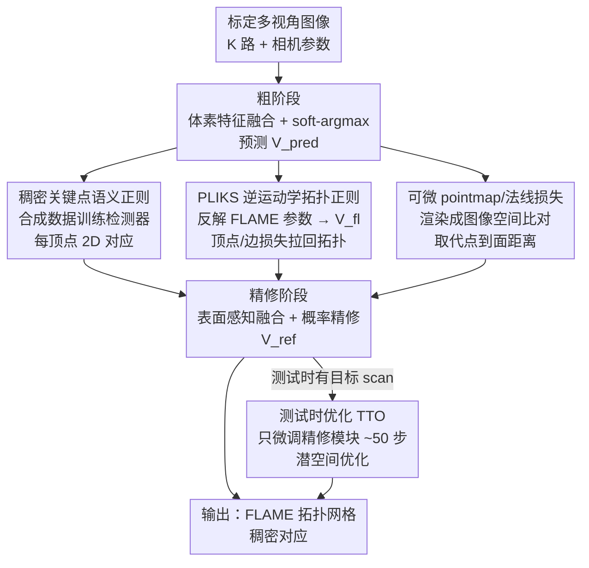

# Registration-Free Learnable Multi-View Capture of Faces in Dense Semantic Correspondence

**会议**: CVPR 2026  
**arXiv**: [2605.01450](https://arxiv.org/abs/2605.01450)  
**代码**: https://filby89.github.io/mochi (有)  
**领域**: 3D视觉  
**关键词**: 多视角人脸重建, 稠密语义对应, FLAME, 免配准训练, 测试时优化

## 一句话总结
MOCHI 是首个**不需要预先配准数据**就能训练的多视角稠密对应人脸重建框架，靠"伪线性逆运动学求解器 + 可微 pointmap/法线损失 + 合成数据训练的稠密关键点"三件套直接从原始扫描学拓扑一致的 FLAME 网格，再加一个轻量测试时优化（TTO），重建精度反超了它本想替代的、又慢又费人工的传统配准流水线。

## 研究背景与动机

**领域现状**：要做"稠密对应"的高保真人脸重建——即给不同人、不同表情都输出**同一套拓扑**的网格（顶点一一对应，方便后续动画/编辑）——目前最高保真的做法仍是多视角立体（MVS）扫描得到原始 scan，再用非刚性配准把 scan 对齐到预定义模板拓扑（如 FLAME）。ToFu / TEMPEH / GRAPE 这类学习方法用神经网络一步从标定多视角图像预测固定拓扑网格，把这条多阶段流水线压成前馈推理，省掉了推理时的迭代配准。

**现有痛点**：这些学习方法虽然推理快，但**训练监督仍然依赖它们想取代的那条慢且手工的配准流水线**——必须先用传统配准把每个 scan 配准好作为 GT，而准备这些 GT 配准既耗时又要人工核查修正（修牙齿穿模、补极端表情失败、逐人调超参）。换句话说，"想干掉配准"的方法本身离不开配准。

**核心矛盾**：直接拿原始 scan 当监督的天然信号是 scan-to-mesh 的**点到面距离（point-to-surface）**，但它依赖离散的最近点搜索，梯度不光滑；当网络预测的网格还没紧贴 scan 时（训练早期、大形变区域），这种损失会诱发自交、穿模等 artifact，根本撑不住"从零学拓扑"。这就是为什么大家都退而求其次去依赖预配准 GT。

**本文目标**：去掉训练时对预配准 GT 的依赖，让网络**直接在原始 scan + 标定图像上训练**，同时保证输出仍是拓扑一致的 FLAME 网格，且精度不输甚至超过传统配准。

**切入角度**：既然问题出在"没有拓扑约束 + 点到面损失不稳"，那就把拓扑约束做成网络内部的可微正则、把不稳的损失换成可微渲染损失、再用一个不依赖几何 GT 的语义信号（合成数据训出的稠密关键点）兜住眼/唇这类几何模糊区。

**核心 idea**：把"配准这一步搬进网络内部"——用伪线性逆运动学（PLIKS）从自由顶点预测反解 FLAME 参数当隐式拓扑正则，配合可微 pointmap/法线损失和稠密语义关键点，免配准地学出稠密对应网格。

## 方法详解

### 整体框架
MOCHI 沿用 TEMPEH 的多视角采集设定：输入 $K$ 路标定相机的图像 $\{\mathcal{I}_i\}_{i=1}^K$，输出一个 FLAME 拓扑（$n_v=5023$ 顶点）的网格 $\hat{M}=(\mathbf{V},\mathbf{T})$，要求它在空间上贴合原始 scan、同时保持规范拓扑。整条流水线是**粗到精**两阶段网络：粗阶段（coarse）用体素特征融合预测初始网格 $\mathbf{V}_c$，精修阶段（refinement）按表面法线采样多视角特征逐顶点微调出 $\mathbf{V}_{\text{ref}}$。

关键在于训练时**没有 GT 配准**，全靠三路免配准监督把网络"逼"回拓扑一致：① 一个稠密关键点检测器（纯合成数据训练）给出每顶点的 2D 对应，当语义正则；② PLIKS 求解器从预测顶点 $\mathbf{V}_{\text{pred}}$ 反解 FLAME 参数、再前向得到拓扑规范网格 $\mathbf{V}_{\text{fl}}$，用顶点/边损失把自由预测拉回 FLAME 流形；③ 把预测网格和 GT scan 都可微渲染成 pointmap + 法线图，在图像空间比对（取代点到面距离）。推理时再叠一个可选的 TTO：只微调精修模块几十步，让重建贴合当前这一个 scan。

### 关键设计

**1. PLIKS 伪线性逆运动学求解器：把"拓扑约束"做成网络内部的可微正则**

这一项直接针对"没有 GT 配准、网络自由预测会跑出 FLAME 拓扑"的核心痛点。做法是给定网络自由预测的顶点 $\mathbf{V}_{\text{pred}}$，先对 FLAME 的 $S$ 个蒙皮段用 Procrustes 对齐估出每段的刚性旋转 $\{\mathbf{R}_s\}$（只估一次、不迭代精修以求效率），固定旋转后解一个**线性最小二乘**反求形状 $\boldsymbol{\beta}$、表情 $\boldsymbol{\psi}$、平移 $\mathbf{t}$：

$$[\boldsymbol{\beta},\boldsymbol{\psi},\mathbf{t}]=\arg\min\big\|\mathbf{R}(\bar{\mathbf{V}}+\mathbf{B}_{\text{id}}\boldsymbol{\beta}+\mathbf{B}_{\text{exp}}\boldsymbol{\psi})+\mathbf{t}-\mathbf{V}_{\text{pred}}\big\|_2^2$$

解出的参数再前向过一遍 FLAME 层得到拓扑规范的 $\mathbf{V}_{\text{fl}}$，然后用顶点对齐 + 边长正则把自由预测拉回去：$\mathcal{L}_{\text{PLIKS-align}}=\lambda_v\|\mathbf{V}_{\text{fl}}-\mathbf{V}_{\text{pred}}\|_2^2+\lambda_e\mathcal{L}_{\text{edge}}(\mathbf{V}_{\text{fl}},\mathbf{V}_{\text{pred}})$，并对参数本身加 $\ell_2$ 正则 $\mathcal{L}_{\text{PLIKS-reg}}=\lambda_\beta\|\boldsymbol{\beta}\|_2^2+\lambda_\psi\|\boldsymbol{\psi}\|_2^2$ 鼓励落在分布内。

妙在它是**隐式（双向）正则**而非硬约束：梯度同时流过 $\mathbf{V}_{\text{pred}}$ 和 $\mathbf{V}_{\text{fl}}$，一边把自由预测往合理解剖结构上推、一边让 FLAME 网格吸收自由预测里的视角相关细节。作者特意解释了为何不直接回归 FLAME 参数——直接回归身份参数需要远多于多视角数据集所能提供的被试量，容易过拟合，而且会把重建死锁在 FLAME 形状空间里；隐式正则则是"轻推"到规范拓扑、仍允许偏离 3DMM 流形保留细节。

**2. 可微 pointmap + 法线损失：把不稳的点到面距离换成图像空间的光滑监督**

这是论文专门做过分析才确定的设计：传统 scan-to-mesh 的点到面损失依赖离散最近点指派，梯度不光滑，在网格尚未紧贴 scan 时会绕过拓扑正则、催生自交和 artifact，尤其大形变下训练直接崩。MOCHI 改成在所有标定视角下做**可微渲染比对**：对 GT scan $\mathbf{S}$ 渲出每视角的法线图 $\mathbf{N}_{\text{gt},i}$ 和逐像素 3D pointmap $\mathbf{P}_{\text{gt},i}$，对预测网格可微渲出对应的 $\mathbf{N}_{\text{pred},i}$、$\mathbf{P}_{\text{pred},i}$，再用 Geman–McClure 鲁棒惩罚抑制 scan 噪声/离群：

$$\mathcal{L}_{\text{geom}}=\sum_{i=1}^K \rho_{\text{GM}}\big(\|\mathbf{N}_{\text{pred},i}-\mathbf{N}_{\text{gt},i}\|_2\big)+\rho_{\text{GM}}\big(\|\mathbf{P}_{\text{pred},i}-\mathbf{P}_{\text{gt},i}\|_2\big)$$

其中 $\rho_{\text{GM}}(x)=\dfrac{x^2}{x^2+\sigma^2}$（$\sigma=10$）。因为渲染过程处处可微、不含离散最近点选择，梯度光滑且空间一致，即便从只用关键点预训练的很粗初始也能稳定收敛、保持干净几何——消融里把点到面损失权重调大就会出现穿模，而 pointmap 监督在大权重下依然平滑。

**3. 合成数据训练的稠密关键点检测器：在几何线索失效的眼/唇区给语义信号**

纯几何损失在部分缺失、有噪、语义模糊的区域（唇、牙、眼睑）解不出对应。MOCHI 训一个**每顶点 2D 对应**的稠密关键点检测器来提供语义监督：在 Blender 里渲 25,000 张合成图（随机形状/表情/姿态/反照率/HDR 光照/自然背景、加 HAAR 随机发型），用 DINOv3-Large 主干 + LoRA 分支、$\ell_2$ 回归从单图预测稠密 2D 关键点 $\mathbf{U}\in\mathbb{R}^{n_v\times2}$。训练时把它当重投影损失，**同时**约束规范网格 $\mathbf{V}_{\text{fl}}$ 和自由预测 $\mathbf{V}_{\text{pred}}$：

$$\mathcal{L}_{\text{lm}}=\sum_{i=1}^K\big[\mathcal{D}_i(\mathbf{V}_{\text{fl}})+\mathcal{D}_i(\mathbf{V}_{\text{pred}})\big],\quad \mathcal{D}_i(\mathbf{V})=\|\Pi_i(\mathbf{V})-\mathbf{U}_i\|_2^2$$

注意它**不负责几何精度**，只当模糊区的语义正则——单用关键点会把三角面"喷"到 scan 表面、误差看着低但解剖错乱，所以必须和 PLIKS 搭配（消融证实：只用关键点眼/鼻/耳出 artifact，加 PLIKS 才解剖一致）。这也是合成数据的红利：不需要任何真实标注或 GT 配准就能拿到稠密语义对应。

**4. 潜空间测试时优化（TTO）：用学到的精修先验给单个 scan 做几十步微调**

前馈模型泛化虽好，但对某一个具体采集仍有残差错位（尤其唇、眼睑）。TTO 在推理时给定目标 scan，**只微调精修模块**约 50 步，用的还是 §3.5 那套几何损失（多视角关键点 + 边长正则 + 眼球约束 + pointmap/法线损失），不需要任何预配准。关键区别在于它**在学到的潜空间里优化**而非从零优化顶点坐标：精修模块的先验相当于在"合理人脸几何流形"上移动，因此只要几十步就稳、快地收敛，对 scan 噪声/部分几何更鲁棒。消融显示直接优化原始顶点（即便单调学习率）误差更高、更易出 artifact，印证了潜空间优化提供了隐式语义正则。正是 TTO 让 MOCHI 反超传统手工配准流水线——20 步即可超过经典配准精度，步数越多越好。

### 损失函数 / 训练策略
总训练目标把几何、关键点、拓扑一致三类项加权组合：

$$\mathcal{L}_{\text{total}}=\lambda_{\text{geom}}\mathcal{L}_{\text{geom}}+\lambda_{\text{lm}}\mathcal{L}_{\text{lm}}+\lambda_{\text{align}}\mathcal{L}_{\text{PLIKS-align}}+\lambda_{\text{reg}}\mathcal{L}_{\text{PLIKS-reg}}$$

训练分三段，在单张 A100(80GB) 上共约 1 周：先只用 2D 关键点预训练 150k 步，再训粗阶段 300k 步、精修阶段 300k 步。精修阶段额外用粗配准 $\mathbf{V}_{\text{ref}}$ 当几何锚点，损失含多视角关键点损失、边长正则、眼球掩码约束 $\|\mathbf{M}^{\text{eyes}}\odot(\mathbf{V}_{\text{ref}}-\mathbf{V}_{\text{pred}})\|_2^2$ 和 pointmap/法线几何损失。

## 实验关键数据

### 主实验
在 FaMoS（8 视角，官方 split）和 CoMA（6 视角，zero-shot）上报告 GT scan 到预测面的点到面误差（mm，越低越好），按整头（去头皮）/脸/唇/颈分区。下表取整头（去头皮）的 Median 误差对比：

| 数据集 | 设定 | 方法 | Median↓ | Mean↓ |
|--------|------|------|---------|-------|
| FaMoS | 仅图像 | TEMPEH（需配准训练） | 0.36 | 0.63 |
| FaMoS | 仅图像 | **MOCHI**（免配准） | **0.26** | **0.48** |
| FaMoS | 图像+scan | Classic 配准（手工） | 0.10 | 0.24 |
| FaMoS | 图像+scan | **MOCHI TTO** | **0.07** | **0.21** |
| CoMA | 仅图像 | TEMPEH | 0.81 | 1.40 |
| CoMA | 仅图像 | **MOCHI**（zero-shot） | **0.53** | **1.09** |
| CoMA | 图像+scan | Classic 配准 | 0.10 | 0.23 |
| CoMA | 图像+scan | **MOCHI TTO** | **0.07** | **0.17** |

- **仅图像**：MOCHI 在 FaMoS 整头 Median 从 TEMPEH 的 0.36 降到 0.26（约 28% 降幅），且**没用任何配准监督**；CoMA 零样本 0.53 vs 0.81，增益跨数据集迁移。
- **图像+scan**：MOCHI TTO（FaMoS Median 0.07）反超传统手工配准流水线（0.10），CoMA 上同样 0.07 vs 0.10。

### 消融实验
| 配置 | 关键结论 | 说明 |
|------|---------|------|
| 点到面 vs pointmap（粗阶段） | 点到面权重增大→穿模/自交；pointmap 大权重仍平滑 | 离散最近点选择导致梯度不可微 |
| 仅关键点 vs 关键点+PLIKS | 仅关键点眼/鼻/耳出 artifact 与噪声三角；加 PLIKS 解剖一致 | PLIKS 强制规范拓扑、抑 artifact |
| TTO 直接优化顶点 vs 潜空间 | 直接优化顶点误差更高、更易 artifact | 潜空间优化提供隐式语义正则 |
| TTO with/without 法线 | 法线带来小幅提升（早期步更明显） | 法线图改善高频细节 |
| TTO 步数 | 20 步即超经典手工配准，步数越多越好 | 用 point-to-surface 做 TTO 反而次优 |

### 关键发现
- **贡献最大的两块**：可微 pointmap 损失（让免配准训练稳得住）+ PLIKS（让拓扑正确），两者缺一不可——只关键点会"喷三角面"，只 pointmap+PLIKS 会在唇/眼系统性错位。
- **为何潜空间 TTO 更好**：微调精修模块等价于在合理人脸几何流形上移动，只需几十步即收敛，比从零优化顶点更稳、对噪声更鲁棒。
- **失败场景**：scan 含大片牙齿区域时，TTO 偶尔会被牙齿几何"带偏"而扭曲嘴唇。

## 亮点与洞察
- **把"配准"搬进网络内部**：以往学习方法离不开传统配准提供 GT，本文用 PLIKS 当可微的隐式拓扑正则，第一次实现免配准训练却反超需配准的 TEMPEH——这是思路上的"釜底抽薪"。
- **损失诊断很扎实**：作者没有想当然用点到面损失，而是分析出它"离散最近点→梯度不光滑→免配准时崩"，再换成可微渲染损失，是一个把"训练不稳"追到根上的范例。可迁移到任何"网格还没对齐时就要用 scan 监督"的重建任务。
- **隐式正则 vs 硬约束的取舍**：不直接回归 3DMM 参数（怕过拟合身份、锁死形状空间），而是"轻推回拓扑、仍允许偏离流形"，在拓扑一致与细节保真之间给了一个聪明的折中。
- **潜空间 TTO 的普适性**：把测试时优化放进学到的精修模块潜空间而非裸顶点，几十步就稳收敛，这个"在先验流形上做 per-instance 微调"的范式可迁移到其他可微重建/拟合问题。

## 局限性 / 可改进方向
- **额外计算开销**：渲染 pointmap/法线图比点到面损失每步多约 60 ms（FaMoS 8 视角），PLIKS 求解器每步再加约 150 ms（A100，Kaolin），训练更贵。
- **罕见 TTO 失败**：scan 含大片牙齿时模型可能 latch 到牙齿几何而扭曲嘴唇，说明拓扑正则在极端语义歧义区仍不够鲁棒。
- **数据集单一**：训练/评测主要依赖 FaMoS（唯一公开的"标定相机+原始 scan"多视角数据集），且被试都戴发网、评测主动去掉头皮区域，对带头发/极端外观的泛化尚未充分验证。
- **改进思路**：把牙齿/口腔内部纳入显式约束、或给 TTO 加区域自适应步长，或许能缓解牙齿带偏问题；稠密关键点检测器若引入少量真实数据微调可能进一步缩小 sim-to-real gap。

## 相关工作与启发
- **vs TEMPEH [9]**：TEMPEH 同样多视角体素融合预测 FLAME 拓扑网格，但训练**必须**有（至少粗）配准当监督/正则；MOCHI 沿用其采集与粗到精骨架，却用 PLIKS+可微渲染损失+合成关键点彻底去掉配准依赖，仅图像设定下精度还反超 TEMPEH（28% Median 降幅）。
- **vs Classic 配准流水线**：传统流水线先 MVS 再非刚性 ICP 配准、要逐人手工核查修牙齿/极端表情，又慢又费人工；MOCHI+TTO 全自动且精度反超（0.07 vs 0.10 mm），相当于"用学到的先验替代人工核查"。
- **vs GRAPE [46] / ToFu [49] / ReFA [51]**：这些学习方法都还需要 GT 配准训练（ToFu 体素读顶点、ReFA 在 UV 空间精修、GRAPE 加 visual hull 泛化新机位）；MOCHI 的差异点是"免配准训练"本身。
- **vs 神经表示（NeRF/Gaussian avatar）**：那类方法渲染保真但缺乏显式网格的可编辑性与图形引擎兼容性；MOCHI 输出显式 FLAME 拓扑网格，天然适配下游动画/编辑。

## 评分
- 新颖性: ⭐⭐⭐⭐⭐ 首个免配准训练的多视角稠密对应人脸重建，把配准搬进网络是真正的范式转变。
- 实验充分度: ⭐⭐⭐⭐ FaMoS+CoMA 跨数据集 + 多组消融到位，但受限于唯一公开数据集、外观多样性有限。
- 写作质量: ⭐⭐⭐⭐⭐ 动机—损失诊断—设计逻辑链清晰，公式与消融对齐，图文对照好读。
- 价值: ⭐⭐⭐⭐⭐ 直接消除高保真人脸捕获最大瓶颈（手工配准），对 VFX/AR/数字人产线意义重大。

<!-- RELATED:START -->

## 相关论文

- [\[CVPR 2026\] CUBE: Representing 3D Faces with Learnable B-Spline Volumes](cube_bspline_3d_faces.md)
- [\[CVPR 2026\] Generalized-CVO: Fast and Correspondence-Free Local Point Cloud Registration with Second Order Riemannian Optimization](generalized-cvo_fast_and_correspondence-free_local_point_cloud_registration_with.md)
- [\[CVPR 2026\] C-GenReg: Training-Free 3D Point Cloud Registration by Multi-View-Consistent Geometry-to-Image Generation with Probabilistic Modalities Fusion](c-genreg_training-free_3d_point_cloud_registration_by_multi-view-consistent_geom.md)
- [\[CVPR 2026\] 3D-Aware Multi-Task Learning with Cross-View Correlations for Dense Scene Understanding](3d-aware_multi-task_learning_with_cross-view_correlations_for_dense_scene_unders.md)
- [\[CVPR 2026\] TokenGS: Decoupling 3D Gaussian Prediction from Pixels with Learnable Tokens](tokengs_decoupling_3d_gaussian_prediction_from_pixels_with_learnable_tokens.md)

<!-- RELATED:END -->
