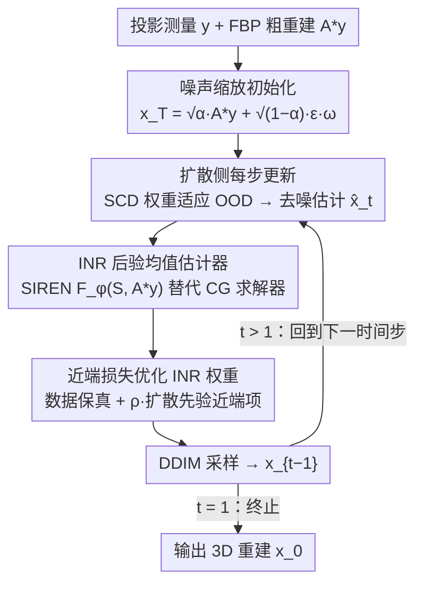

# Regularizing INR with Diffusion Prior for Self-Supervised 3D Reconstruction of Neutron Computed Tomography Data

**会议**: CVPR 2026  
**arXiv**: [2603.10947](https://arxiv.org/abs/2603.10947)  
**代码**: 即将公开  
**领域**: 3D视觉  
**关键词**: Neutron CT, Sparse-view Reconstruction, Implicit Neural Representation, Diffusion Prior, Inverse Problem

## 一句话总结

提出 DINR (Diffusive INR)，在 DD3IP 扩散框架内用 INR 替代传统反演求解器，通过近端损失将扩散去噪估计注入 INR 优化过程，在极端稀疏视角（低至 4-5 视图）的中子 CT 重建中超越现有 SOTA 方法。

## 研究背景与动机

**领域现状**：中子 CT 是一种重要的成像模态，能够通过氢分布表征体积内部结构，广泛应用于氢燃料电池制造、锂离子电池研究、植物/土壤水分运输监测以及混凝土辐射屏蔽安全监控等领域。

**现有痛点**：中子束流量极低，采集每个视角需要很长的曝光时间，导致实际可获取的投影视图数量远低于 Nyquist 采样要求。传统 FBP 算法在稀疏视角下产生严重伪影（4 视角仅 19.31 dB PSNR）；MBIR 使用手工先验（TV、qGGMRF）虽有改善但需要针对每个稀疏度进行耗时的参数搜索，且对微结构细节的保真度有限。

**核心矛盾**：INR（如 SIREN）具备分辨率无关、内存高效、易与物理前向模型集成等优势，但存在严重的低频谱偏置问题，在稀疏监督下高频结构重建能力差（4 视角时 PSNR 仅 14.76 dB）。扩散模型（如 DD3IP/SCD）能提供强大的生成先验并适应 OOD 数据，但其反演步骤通常使用 CG 求解器，未能利用 INR 的连续表示优势。

**本文目标**：如何将扩散模型的强生成先验有效注入 INR 框架，在不修改扩散模型架构的前提下，实现极端稀疏视角条件下的高保真 3D CT 重建？

**切入角度**：DD3IP 框架的一个关键结论是后验均值的估计方式可以自由替换——本文利用这一模块化特性，用 INR 替代 CG 求解器作为扩散反演步骤中的后验均值估计器，并通过近端损失函数将扩散去噪输出反馈给 INR。

**核心 idea**：在扩散反向过程的每个时间步，用包含扩散去噪估计近端项的损失函数优化 INR 权重，让 INR 同时满足测量数据一致性和扩散先验约束。

## 方法详解

### 整体框架

DINR 构建在 DD3IP (3D Deep Diffusion Image Prior) 框架之上。问题建模为 $y = Ax + n$，其中 $x$ 是 3D 衰减系数体积，$y$ 是投影测量，$A$ 是平行束投影矩阵。框架在扩散反向过程的每个时间步 $t$ 执行三个操作：(1) 更新扩散模型权重适应 OOD 数据；(2) 生成去噪估计 $\hat{x}_t$；(3) 用近端损失优化 INR 权重并通过 DDIM 采样生成下一步估计。扩散模型仅在合成椭球数据上预训练，推理时通过 SCD 的权重更新机制适应真实中子 CT 数据。

### 关键设计

**1. 用 INR 当后验均值估计器：把 CG 求解器换成可微的连续表示**

DD3IP 在每个扩散时间步都要从带噪声的 $x_t$ 出发，估计一个"干净"的后验均值送回去做下一步采样，原版用的是 CG（共轭梯度）求解器。本文把这个求解器整个换成一个 SIREN 架构的 INR：$F_\phi$ 接收 3D 坐标网格 $S$，输出每个坐标处的衰减系数。为了不让 INR 从零开始硬拟合，还把 FBP 粗重建 $A^*y$ 当辅助输入喂进去，相当于先给它一个低频骨架再精修，收敛明显更快。这一替换之所以成立，是因为 DD3IP 框架本身已证明后验采样的正确性与 DIS（去噪推断求解器）的具体选择无关——换句话说"谁来估后验均值"是个可插拔的接口。换成 INR 的好处是它把离散体素换成连续函数，天然分辨率无关、内存友好，而且全程可微，能和 CT 前向模型 $A$、扩散先验一起端到端优化，这正是 CG 求解器做不到的。

**2. 近端损失：让一份损失同时背负"对得上测量"和"像扩散先验"两个约束**

光有 INR 还不够，纯 INR 有严重的低频谱偏置，4 视角下高频微结构基本崩掉（PSNR 仅 14.76 dB）。本文的关键是给 INR 的优化目标加一个近端项，把扩散模型每一步去噪出来的估计 $\hat{x}_t$ 当作"靠近目标"拉进损失：

$$\mathcal{L}_\phi = \underbrace{\text{MSE}\big(A F_\phi(S, A^*y),\, y\big)}_{\text{数据保真}} + \underbrace{\rho \cdot \text{MSE}\big(\hat{x}_t,\, F_\phi(S, A^*y)\big)}_{\text{近端项 / 扩散先验}}$$

前一项保证 INR 重建投影回去要和实测 $y$ 对得上，后一项把 INR 的输出往扩散去噪估计 $\hat{x}_t$ 上拽。后者等于把扩散模型学到的图像先验"借"给 INR，正好补上它缺先验、高频糊的短板。权重 $\rho$ 调先验影响有多强；初始化阶段直接令 $\rho=0$，先让 INR 老老实实把数据拟合干净，再在反向过程里逐步引入先验。

**3. 噪声缩放初始化：用一个标量 $\omega$ 间接拧扩散框架的正则化旋钮**

扩散反向过程从哪个起点出发，决定了最终重建里"低频骨架"和"生成细节"的配比。本文在初始化时给注入噪声乘了一个可调标量 $\omega>0$：

$$x_T = \sqrt{\alpha_T}\, A^*y + \sqrt{1-\alpha_T}\, \epsilon \cdot \omega$$

$\omega$ 越大、注入噪声越强，FBP 低频成分相对就被压低，扩散先验主导得更多，等价于把 DD3IP 框架的正则化强度调高。由于不同稀疏度对先验的依赖程度不同（视图越少越要靠先验补结构），$\omega$ 需要按稀疏度搜一个合适值——合成数据落在 0.02–0.2、真实数据约 0.002。这是一个不改动扩散模型架构、只在入口处就能调节整体行为的轻量旋钮。

### 损失函数 / 训练策略

**完整算法流程**：

1. 初始化 INR 权重 $\phi_T$：使用标准 MSE 损失（$\rho=0$）拟合投影数据
2. 加载预训练扩散模型权重 $\theta_T$（在合成椭球数据上训练）
3. 初始化 $x_T = \sqrt{\alpha_T} A^*y + \sqrt{1-\alpha_T} \epsilon \cdot \omega$
4. 对每个时间步 $t = T \to 1$：
    - SCD 步骤：更新 $\theta_{t-1} = \arg\min_\theta \text{MSE}(AD_\theta(x_t|y), y)$
    - 去噪：$\hat{x}_t = D_{\theta_{t-1}}(x_t|y)$
    - INR 更新：$\phi_{t-1} = \arg\min_\phi \mathcal{L}_\phi(S, y, \hat{x}_t, \rho)$
    - 采样：若 $t>1$，$x_{t-1} = \text{DDIM}_{\theta_{t-1}}(F_{\phi_{t-1}}(S, A^*y), \eta)$；若 $t=1$，直接输出 $x_0 = F_{\phi_0}(S, A^*y)$

**关键超参数设置**：合成数据 $\rho$ 使近端项与数据项之比为 $1 \times 10^{-5}$；真实数据该比例为 $1 \times 10^{-6}$；$\omega$ 通过参数搜索确定（合成数据在 0.02–0.2，真实数据为 0.002）。

## 实验关键数据

### 主实验

**合成数据**（$2 \times 256 \times 256$ 混凝土微结构体模）：

| 视角数 | FBP | INR (SIREN) | DD3IP | **DINR** |
|:---:|:---:|:---:|:---:|:---:|
| 4 | 19.31 / 0.08 | 14.76 / 0.18 | 26.17 / 0.25 | **26.27 / 0.24** |
| 8 | 21.67 / 0.18 | 28.15 / 0.35 | 28.37 / 0.34 | **28.56 / 0.38** |
| 16 | 25.27 / 0.30 | 30.34 / 0.54 | 31.21 / 0.61 | **31.30 / 0.63** |
| 32 | 29.62 / 0.43 | 32.85 / 0.66 | 32.91 / 0.74 | **33.43 / 0.76** |

*指标：PSNR (dB) / SSIM*

**真实中子 CT 数据**（1091 视角/360° 中子扫描仪，下采样至 256 分辨率）：

| 视角数 | FBP | MBIR (qGGMRF) | INR | DD3IP | **DINR** |
|:---:|:---:|:---:|:---:|:---:|:---:|
| 5 | 19.90 / 0.10 | 21.02 / 0.04 | 20.18 / 0.03 | 20.89 / 0.06 | **21.27 / 0.05** |
| 9 | 22.90 / 0.33 | **26.00 / 0.38** | 24.08 / 0.27 | 25.41 / 0.34 | 25.22 / 0.35 |
| 17 | 25.91 / 0.55 | 28.10 / 0.58 | 27.30 / 0.54 | **28.04 / 0.62** | 27.56 / 0.62 |
| 33 | 30.11 / 0.73 | 31.00 / 0.77 | 29.70 / 0.71 | 31.19 / 0.79 | **31.37 / 0.77** |

*指标：PSNR (dB) / SSIM；MBIR 对每个稀疏度使用穷举参数搜索（$10^{-4}$ 到 $10^6$）以获得最佳性能*

### 消融实验

**ROI 尺度分析**（真实数据，数据驱动的无偏 ROI 选择）：

文中未进行传统消融实验，但提供了系统性的 ROI 尺度分析替代。从 $64 \times 96$ 区域中裁剪 $64 \times 64$ 至 $8 \times 8$ 的子区域计算 PSNR：

| ROI 尺度 | DINR vs DD3IP 趋势 | DINR vs MBIR 趋势 |
|:---:|:---:|:---:|
| $> 48 \times 48$ | 接近或略优 | MBIR 在中等稀疏度更优 |
| $32 \times 32$ | DINR 明显更优 | DINR 开始超越 MBIR |
| $< 32 \times 32$ | DINR 显著更优 | DINR 全面超越 |

### 关键发现

- **合成数据全面领先**：DINR 在所有 4 个稀疏度（4/8/16/32 视角）上均取得最高 PSNR 和 SSIM，4 视角时比纯 INR 高 11.51 dB
- **超稀疏场景优势突出**：5 视角真实数据下 DINR (21.27 dB) 超越穷举调参的 MBIR (21.02 dB) 和 DD3IP (20.89 dB)
- **微结构保真度更高**：ROI 缩小到 $32 \times 32$ 以下时 DINR 优势放大，说明其对孔隙/微结构等高频细节的保真度优于竞争方法
- **MBIR 在中等稀疏度仍有优势**：9 视角真实数据中 MBIR (26.00 dB) 优于 DINR (25.22 dB)，表明手工先验在数据量较充足时仍具竞争力
- **全局指标可能低估 DINR 优势**：MBIR 在 5/9 视角时整体视觉质量较差，但因背景区域平滑而获得较高全图 PSNR，ROI 分析揭示了这一指标偏差

## 亮点与洞察

- **模块化的先验注入方式**：利用 DD3IP 框架的 DIS 无关性，通过近端损失将扩散先验"即插即用"地融入 INR，设计简洁优雅
- **纯合成预训练 → 真实推理**：扩散模型仅在合成椭球数据上训练即可有效引导真实混凝土微结构重建，验证了 SCD 的 OOD 适应能力
- **ROI 分析方法论**：提出数据驱动的多尺度 ROI 评估，类似于 CT 图像质量评估中的 SNR 增长曲线方法，揭示了全图 PSNR 掩盖的局部优势
- **对科学成像的实际价值**：中子 CT 是低通量成像的典型代表，DINR 的成功证明了扩散先验+INR 路线在科学成像逆问题中的潜力

## 局限与展望

- **超参数依赖**：$\rho$、$\omega$ 需要手动调参或参数搜索，不同数据集/稀疏度需要不同配置
- **中等稀疏度不敌 MBIR**：9 视角真实数据中 MBIR 仍优 0.78 dB，说明扩散先验在数据约束不够极端时可能引入偏差
- **验证规模小**：仅在 $2 \times 256 \times 256$ 体积上测试，未扩展到大规模 3D 重建
- **缺乏消融实验**：未量化 FBP 输入对 INR 的贡献、近端项 vs 无近端项的效果、不同 INR 架构的影响
- **SSIM 与 PSNR 不一致**：部分实验中 PSNR 最优但 SSIM 并非最优（如 5 视角真实数据 DINR SSIM=0.05 vs DD3IP SSIM=0.06）
- **计算开销未讨论**：每个时间步同时优化扩散权重和 INR 权重的计算成本未量化
- **仅限平行束几何**：未扩展到锥束或螺旋 CT 等更常见的采集几何

## 相关工作与启发

- **vs DD3IP**：DINR 用 INR 替代 CG 求解器，获得连续表示和分辨率无关性，在 4 个合成数据稀疏度上一致获胜
- **vs 纯 INR (SIREN)**：纯 INR 在 4 视角时崩溃（14.76 dB），扩散先验近端项有效弥补了 INR 的低频偏置缺陷
- **vs MBIR (qGGMRF)**：MBIR 需要对每个稀疏度穷举正则化参数搜索（$10^{-4} \sim 10^6$），DINR 更鲁棒且在超稀疏场景超越
- **近端损失的通用性**：这种将生成先验通过近端项注入物理驱动优化的范式可推广到 X-ray CT、电子 CT 等其他断层成像模态
- **启发**：ROI 尺度分析表明全图指标可能严重低估算法在关键区域的优势，科学成像评估应发展基于分割的任务驱动指标

## 评分

- 新颖性: ⭐⭐⭐⭐ — INR 与扩散先验的近端融合是有意义的贡献，但核心思想基于 DD3IP 框架的模块化替换
- 实验充分度: ⭐⭐⭐ — 合成+真实数据双验证，但体积规模小、缺少消融实验、部分稀疏度不优
- 写作质量: ⭐⭐⭐ — 方法描述清晰、公式推导完整，但篇幅较短、图表紧凑
- 价值: ⭐⭐⭐⭐ — 对科学成像领域的极端稀疏重建有切实价值，模块化设计具有良好的可扩展性

<!-- RELATED:START -->

## 相关论文

- [\[CVPR 2025\] Regularizing INR with Diffusion Prior for Self-Supervised 3D Reconstruction of Neutron CT Data](../../CVPR2025/3d_vision/regularizing_inr_with_diffusion_prior_self-supervised_3d_reconstruction_of_neutr.md)
- [\[CVPR 2026\] Revisiting Pose Sensitivity in Splat-based Computed Tomography under Sparse-view Reconstruction](revisiting_pose_sensitivity_in_splat-based_computed_tomography_under_sparse-view.md)
- [\[CVPR 2026\] DuoMo: Dual Motion Diffusion for World-Space Human Reconstruction](duomo_dual_motion_diffusion_for_world-space_human_reconstruction.md)
- [\[CVPR 2026\] E-RayZer: Self-supervised 3D Reconstruction as Spatial Visual Pre-training](e-rayzer_self-supervised_3d_reconstruction_as_spatial_visual_pre-training.md)
- [\[CVPR 2026\] From None to All: Self-Supervised 3D Reconstruction via Novel View Synthesis](from_none_to_all_self-supervised_3d_reconstruction_via_novel_view_synthesis.md)

<!-- RELATED:END -->
