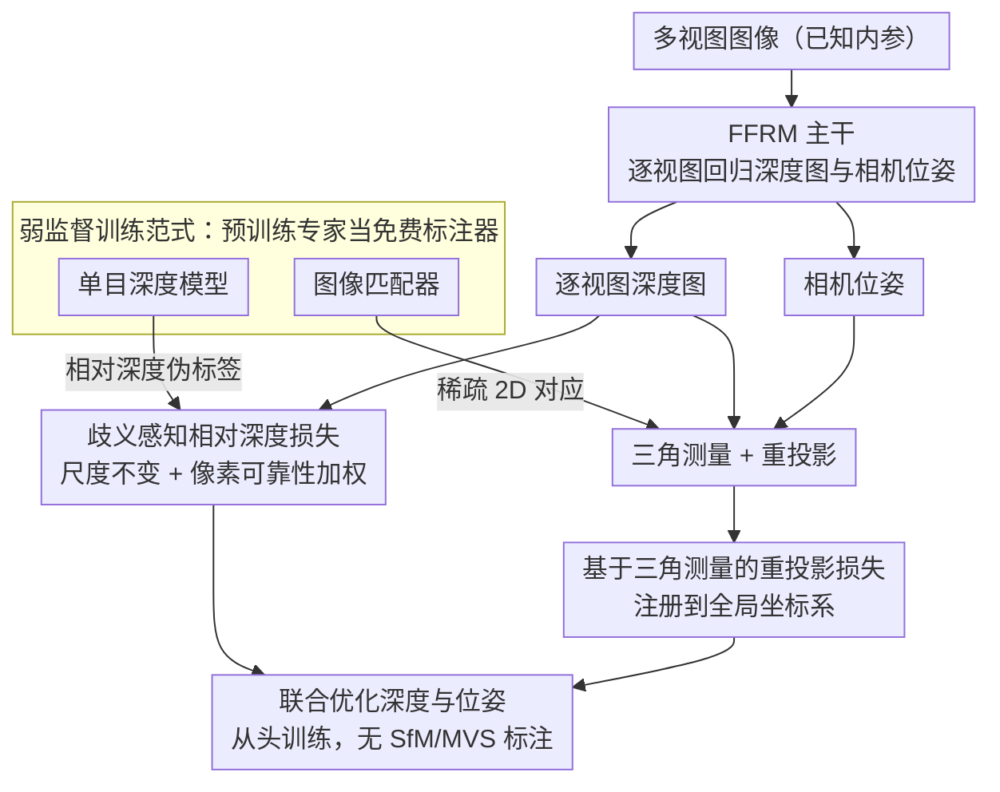

# Reliev3R: Relieving Feed-forward 3D Reconstruction from Multi-View Geometric Annotations

**会议**: CVPR 2026  
**arXiv**: [2604.00548](https://arxiv.org/abs/2604.00548)  
**代码**: 无  
**领域**: 3D视觉  
**关键词**: 前馈3D重建, 弱监督, 单目深度, 稀疏对应, 无SfM训练

## 一句话总结

Reliev3R 首次提出无需多视图几何标注（无需 SfM/MVS 生成的点云和位姿）即可从头训练前馈3D重建模型（FFRM）的弱监督范式，利用单目相对深度和稀疏图像对应作为替代监督，性能追平甚至超过部分全监督 FFRM。

## 研究背景与动机

前馈3D重建模型（如 DUSt3R、MASt3R）将 2D 图像端到端映射到 3D 内容，但严重依赖 SfM/MVS 流水线生成的多视图几何标注。这些标注计算昂贵、在弱纹理场景中脆弱、难以扩展。

**核心观察**：多视图几何标注不是重建的本质——原始多视图输入本身已包含所有几何线索（深度-外观关系、多视图对应、位姿诱导的重投影结构）。用 SfM 标注训练 FFRM 等价于把传统重建流水线"嵌入"到 Transformer 中。

**关键问题**：能否直接从多视图输入中学习几何原理，而不依赖重型几何标注？

## 方法详解

### 整体框架

Reliev3R 想解决的是「FFRM 训练离不开 SfM/MVS 标注」这个数据瓶颈：以往要先用传统重建流水线为每个场景算出稠密点云和精确位姿，才能拿来监督网络。它的做法是把这套昂贵标注换成两类几乎免费的弱监督信号。网络主体仍是标准 FFRM——吃进一组多视图图像，逐视图回归深度图和相机位姿；变的只是监督端：一边用预训练单目深度模型给出的相对深度伪标签管住每张图深度的「形状」，另一边用现成图像匹配器给出的稀疏 2D 对应点，通过三角测量把各视图的深度和位姿拧到同一个全局坐标系里。两路信号一局部一全局，互相补位，于是整个模型可以在完全没有 3D 几何标注的图像集上从头训练。

### 关键设计

**1. 歧义感知相对深度损失：让单目深度先验管住每张图的形状，又不被天空、反射面带偏**

单目深度能给每个像素一个「大概多远」的相对先验，但它有两个麻烦：一是只有相对关系、没有跨视图一致的绝对尺度，二是在天空、镜面反射这类区域估计本身就不靠谱。Reliev3R 因此采用尺度不变的深度损失，只约束预测深度的排序与形状、不强求绝对尺度，从而容忍单目伪标签在不同视图间的尺度漂移。关键在「歧义感知」：损失对每个像素带一个可靠性权重，自动压低天空、反射面等不可信区域的贡献，避免错误伪标签把优化拽歪。这样单目深度只在它擅长的地方（稠密、局部的相对结构）出力，不擅长的地方则被静默掉。

**2. 基于三角测量的重投影损失：用稀疏对应给局部深度补上跨视图的全局一致性**

光有单目深度，每张图各自形状对了，但视图之间对不齐——缺的正是全局几何一致性。这一项用现成匹配器在图像对之间找出稀疏的 2D 对应点，把它们当成几何锚点：拿网络预测的深度图和相机位姿对这些匹配点做三角测量，再投影回各自视图，最小化重投影误差。因为重投影同时依赖深度和位姿，这个损失会把两者联合优化，等于强迫逐视图的深度预测注册到一个统一的全局 3D 坐标系。它和上一项形成清晰分工：相对深度损失负责「每张图内部对不对」，重投影损失负责「各张图之间拼不拼得齐」。

**3. 弱监督训练范式：两类伪标签全由预训练专家零样本生成，彻底甩掉 SfM**

把前两项的监督来源往回追，会发现没有一处需要场景特定的 3D 真值：相对深度来自现成单目深度模型，稀疏对应来自现成图像匹配器，二者都是零样本地在输入图像上跑一遍就得到，相当于把预训练专家模型当作免费的标注器。唯一保留的外部假设是相机内参已知——这在多数实际采集里本就可获取，并非苛刻条件。这一范式的意义在于把训练数据的边界从「带 SfM 标注的场景」放宽到「任意一组未标注多视图图像」，让 FFRM 的训练规模不再被标注流水线卡住。

### 损失函数 / 训练策略

总损失为歧义感知尺度不变深度损失与三角测量重投影损失之和，两项联合监督深度与位姿。模型从头训练，不加载任何全监督 FFRM 的预训练权重。两项损失的权重配比等具体超参以原文为准。

> ⚠️ 上述损失的具体加权与训练细节以原文为准。

## 实验关键数据

### 主实验

| 方法 | 监督 | 深度精度 | 位姿精度 | 说明 |
|------|------|---------|---------|------|
| MVDUSt3R | 全监督 | 中 | 中 | 早期FFRM |
| FLARE | 全监督 | 中 | 中 | 近期FFRM |
| AnyCam | 弱监督(位姿) | — | 中 | 专注位姿估计 |
| **Reliev3R** | **弱监督** | **追平/超越** | **超越AnyCam** | 无需几何标注 |

用更少的标注数据追平甚至超过部分全监督方法。

### 消融实验

| 配置 | 深度精度 | 位姿精度 | 说明 |
|------|---------|---------|------|
| 仅相对深度损失 | 中（局部好） | 差 | 缺乏全局一致性 |
| 仅重投影损失 | 差 | 中 | 缺乏深度形状约束 |
| 两者结合 | 最优 | 最优 | 互补效应显著 |
| 无歧义感知 | 下降 | — | 天空等区域引入噪声 |

### 关键发现

- 两种监督信号高度互补：相对深度约束局部形状，重投影约束全局对齐
- 歧义感知机制至关重要——没有它，天空/反射面的错误深度估计会破坏优化
- 在位姿估计上显著超过 AnyCam（同为弱监督方法），说明深度和位姿的联合优化比独立估计更有效

## 亮点与洞察

- **降低3D学习的数据门槛**：从"需要SfM标注"到"只需图像+预训练模型"，大幅降低了训练数据构建成本
- **预训练模型作为免费标注器**：单目深度模型和匹配器提供的伪标签足以替代昂贵的SfM流水线
- **迈向可扩展的3D基础模型**：消除几何标注瓶颈后，FFRM 可以在任意规模的多视图数据上训练

## 局限与展望

- 仍假设已知相机内参，虽然实际中通常可获取但限制了完全的"零假设"学习
- 伪标签质量受限于预训练模型——在严重分布外的场景可能不可靠
- 当前性能仍略低于最新的全监督 FFRM（如 VGGT、Fast3R），但差距在缩小
- 未来可探索完全自监督（连内参也不需要）的训练范式

## 相关工作与启发

- **vs DUSt3R/MASt3R/VGGT**: 这些全监督 FFRM 性能更强但依赖 SfM 标注，Reliev3R 摆脱了这一依赖
- **vs AnyCam**: 同为弱监督但 AnyCam 只估计位姿，Reliev3R 同时做深度和位姿
- **vs MonoDepth**: 单目深度方法不具备多视图一致性，Reliev3R 将其作为组件而非最终方案

## 评分

- 新颖性: ⭐⭐⭐⭐⭐ 首个无多视图几何标注从头训练 FFRM 的方法，范式创新
- 实验充分度: ⭐⭐⭐⭐ 多数据集对比全面
- 写作质量: ⭐⭐⭐⭐ 动机清晰，技术细节完整
- 价值: ⭐⭐⭐⭐⭐ 对可扩展3D重建有重要推动

<!-- RELATED:START -->

## 相关论文

- [\[CVPR 2026\] AnchorSplat: Feed-Forward 3D Gaussian Splatting with 3D Geometric Priors](anchorsplat_feed-forward_3d_gaussian_splatting_with_3d_geometric_priors.md)
- [\[CVPR 2026\] PanoVGGT: Feed-Forward 3D Reconstruction from Panoramic Imagery](panovggt_feed-forward_3d_reconstruction_from_panoramic_imagery.md)
- [\[CVPR 2026\] Speed3R: Sparse Feed-forward 3D Reconstruction Models](speed3r_sparse_feed-forward_3d_reconstruction_models.md)
- [\[CVPR 2026\] VGG-T3: Offline Feed-Forward 3D Reconstruction at Scale](vgg-t3_offline_feed-forward_3d_reconstruction_at_scale.md)
- [\[CVPR 2026\] MoRe: Motion-aware Feed-forward 4D Reconstruction Transformer](more_motion-aware_feed-forward_4d_reconstruction_transformer.md)

<!-- RELATED:END -->
