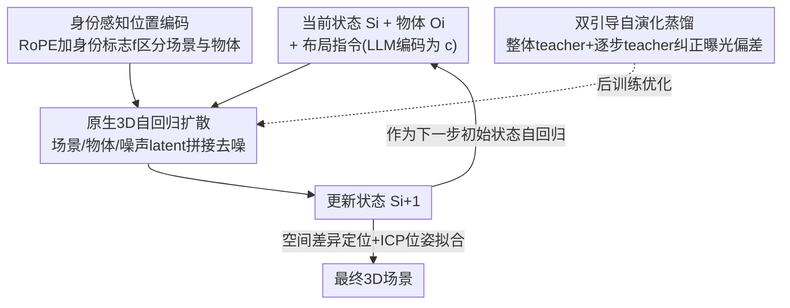

# Repurposing 3D Generative Model for Autoregressive Layout Generation

**会议**: CVPR 2026  
**论文**: [CVF Open Access](https://openaccess.thecvf.com/content/CVPR2026/html/Feng_Repurposing_3D_Generative_Model_for_Autoregressive_Layout_Generation_CVPR_2026_paper.html)  
**代码**: https://github.com/fenghora/LaviGen  
**领域**: 3D视觉  
**关键词**: 3D布局生成, 自回归生成, 3D生成模型复用, 物理合理性, 自演化蒸馏

## 一句话总结
LaviGen 把预训练的原生 3D 生成模型「改造」成自回归布局生成器，直接在原生 3D 空间里一个个地摆放物体，让生成的场景布局既物理合理（不碰撞、不出界、不漂浮）又语义连贯，相比 SOTA 物理合理性高 19%、推理快约 65%。

## 研究背景与动机
**领域现状**：3D 场景布局生成要把物体按语义合理、物理可行的方式摆好（如椅子围着桌子而不是贴墙）。主流做法分两类：一类把布局当语言（LayoutGPT 等用 LLM 输出 JSON 式坐标），另一类用视觉信号间接监督（LayoutVLM 用渲染图 + 可微优化精修位姿）。

**现有痛点**：把布局当语言的方法语义还行，但缺乏物理建模，常出现物体碰撞、互穿、漂浮；LayoutVLM 用 2D 视觉监督虽改善了出界问题，但图像级监督**计算昂贵**、且对复杂 3D 交互理解不够「整体」。两类范式都在**非原生表示**（文本/2D）里工作，丢失了 3D 几何信息。

**核心矛盾**：布局本质上是一种**几何分布**——物体间的空间关系和语义依赖。但现有方法都绕开 3D 空间、在文本或 2D 里近似它，于是「语义对、物理错」与「精修慢」二选一。

**本文目标**：能不能直接从 3D 场景的几何分布里学布局？把近年强大的原生 3D 生成模型（自带空间关系与几何先验）复用过来做布局生成、补全与编辑。

**切入角度**：作者观察到「场景布局是一种特殊的几何分布」，而原生 3D 生成模型（如 TRELLIS）已经在大规模 3D 数据上学到了丰富的空间先验——只要把物体**一个个顺序摆进去**、每步产出一个新的场景状态，就能天然满足物理合理的空间排布。相比一次性注入所有物体条件的「整体生成」（容易让生成过程不稳定），自回归范式可控性更强，还天然支持物体的增删。

**核心 idea**：复用 3D 生成模型 + 自回归地逐物体放置，把布局生成搬进原生 3D 空间；再用一个后训练策略治自回归的「曝光偏差」。

## 方法详解

### 整体框架
给定当前场景状态 $S_i$、一个目标物体 $O_i$ 和布局指令，LaviGen 把它们编码后送入一个**自适应的 3D 扩散模型**，在原生 3D 空间里去噪生成把 $O_i$ 摆好后的更新状态 $S_{i+1}$；$S_{i+1}$ 又作为下一步的初始状态，与下一个物体 $O_{i+1}$ 拼接，自回归地把整个场景一步步摆出来。每步的高保真场景通过比对 $S_{i+1}$ 与 $S_i$ 的空间差异定位新增区域，再用 ICP 把原始网格拟合上去得到位姿。为治自回归长序列的误差累积（曝光偏差），训练时再叠加一个双引导自演化蒸馏后训练。

### 关键设计

**1. 原生 3D 自回归布局扩散：在 3D 空间里逐物体去噪放置**

针对「文本/2D 表示丢几何信息」的痛点，LaviGen 直接在原生 3D 空间建模物体的空间配置。它复用结构化 3D 隐扩散模型 TRELLIS，只保留其**结构级生成阶段**——预测稀疏体素占据来建模物体的空间组织。每个 3D 资产表示为体素索引的局部隐码 $Z=\{z_p\mid p\in P\}$（$P$ 是物体表面附近的活跃体素位置），用 Flow Matching 训练：$x(t)=(1-t)x_0+t\epsilon$，学习时间相关向量场 $v_\theta$ 最小化 $L=\mathbb{E}\|v_\theta(x,t)-(\epsilon-x_0)\|_2^2$。架构上，把场景 $S$、物体 $O$ 编码成隐表示 $s,o\in\mathbb{R}^{N\times d}$，与随机噪声 $\epsilon$ 拼接、再加文本条件 $c$ 一起去噪，目标为 $L=\mathbb{E}\|v_\theta(x,s,o,c,t)-(\epsilon-x_0)\|_2^2$。这样模型每步只需理解「当前场景 + 一个新物体」的上下文，在原生 3D 里产出物理合理的更新状态，避免了一次性塞所有物体导致的不稳定。

**2. 身份感知位置编码：让模型分清「场景」与「新物体」token**

自适应扩散虽让场景、物体、隐 token 能交互，但模型很难区分「哪些 token 是当前场景状态、哪些是新加的物体」。作者在标准旋转位置编码 RoPE 上加一个**身份标志** $f$：拼接输入 $[x,s,o]$ 后，每个 token 关联到体素位置 $(f,h,w,l)$，其中噪声隐 $x$ 与状态 $s$ 取 $f=0$（共享空间坐标），物体 $o$ 取 $f=1$（保留其独立几何语义）。复值位置频率 $\Phi(f,h,w,l)=[\phi_f(f);\phi_h(h);\phi_w(w);\phi_l(l)]$ 里，$\phi_f$ 编码来源身份、其余沿标准 RoPE 编空间位置。这样模型既能区分不同隐流、又保持空间对齐，实现精确的语义解耦与几何一致推理。

**3. 双引导自演化蒸馏：用两个 teacher 纠正自回归的曝光偏差**

自回归训练时用真值上下文、推理时却要基于自己不完美的输出，误差会累积成碰撞和不合理放置（曝光偏差）。受 Self-Forcing 启发，作者让学生 $G_\theta$ 训练时就**基于自己生成的上下文**自演化：自演化 $S_i^\theta=G_\theta(S_{i-1}^\theta,O_i,c)$ 取代教师强制 $S_i^\theta=G_\theta(S_{i-1},O_i,c)$，逼模型学会从自身错误中恢复。但 3D 布局的状态是**累积**的（每个 $S_i$ 隐式编码了之前所有物体），早期放错会传到后面所有状态，单看终态监督不够。于是用**双引导**：整体引导 $L_{holistic}=L_{DM}(p_\theta(S_n|C)\,\|\,p_{TS}(S_n|c))$ 用双向基模型当全局 planner 监督最终场景质量；逐步引导 $L_{step}=\sum_i L_{DM}(p_\theta(S_i|C_i)\,\|\,p_{TP}(S_i|C_i))$ 用因果自回归模型当每步 teacher、在学生不完美上下文上给逐物体纠正。最终目标 $L_{dual}=L_{holistic}+L_{step}$ 等权相加，梯度 $\nabla_\theta L_{dual}\approx\mathbb{E}[(s_T-s_\psi)\nabla_\theta x_0]$，蒸馏用分布匹配蒸馏（DMD）实现。两个 teacher 在场景级与物体级分别给互补的纠正信号，既治误差累积、又把多步采样蒸馏成少步、大幅提速。

### 损失函数 / 训练策略
三阶段从零训练：①替换文本编码器为冻结的 Qwen2.5-VL-7B-Instruct，训双向基础 3D 生成模型（20 epoch）；②自回归范式训 teacher 模型（20k step）作为蒸馏与高效推理基础；③双引导自演化蒸馏，把 teacher 蒸成少步学生（5k step），双向模型当整体 teacher、因果模型当逐步 teacher。自回归顺序由 Qwen-VL 从指令推语义物体序列，推理时也支持用户自定义顺序（如自底向上）。DiT 约 3B 参数，无需精细调参即稳定收敛。

## 实验关键数据

### 主实验
按 LayoutVLM 的 benchmark 评测。指标定义——**CF**（Collision-Free，物体不重叠）、**IB**（In-Boundary，物体在场景边界内）量化物理合理性；**Pos./Rot.**（位置/旋转一致性）量化语义对齐（无真值时由 GPT-4o 从俯/侧视图评分）；**PSA**（Physically-Grounded Semantic Alignment）综合语义相关性与物理可行性；**T** 为推理时间（秒，越低越快）。除 T 外均归一化到 [0,100]，越高越好；报告 8–10 物体的布局。

| 方法 | CF↑ | IB↑ | Pos.↑ | Rot.↑ | PSA↑ | T(s)↓ |
|------|-----|-----|-------|-------|------|-------|
| LayoutGPT | 83.8 | 24.2 | **80.8** | **78.0** | 16.6 | 21.3 |
| Holodeck | 77.8 | 8.1 | 62.8 | 55.6 | 5.6 | 58.2 |
| I-Design | 76.8 | 34.3 | 68.3 | 62.8 | 18.0 | 179.2 |
| LayoutVLM | 81.8 | 94.9 | 77.5 | 73.2 | 58.8 | 75.5 |
| **LaviGen(本文)** | **97.3** | **98.6** | 76.9 | 77.1 | **78.8** | **24.3** |

LaviGen 在 CF/IB（物理合理性）上断层领先，PSA 78.8 远超 LayoutVLM 的 58.8；语义指标 Pos./Rot. 与最强基线相当；推理时间 24.3s，比 LayoutVLM(75.5s) 快约 65%、比 I-Design(179.2s) 快近 7 倍。LayoutGPT 语义最好但 IB 仅 24.2，碰撞与出界严重，印证「只当语言」的物理缺陷。

### 消融实验
从基础 3D 生成模型起逐步叠加组件：

| 配置 | CF↑ | IB↑ | PSA↑ | T(s)↓ | 说明 |
|------|-----|-----|------|-------|------|
| base model | 75.6 | 64.8 | 16.7 | 145.7 | 杂乱布局、严重碰撞 |
| + 身份感知编码 | 89.1 | 96.8 | 71.4 | 144.1 | 物理合理性大涨，但仍有曝光偏差碰撞且推理慢 |
| + 整体引导 $L_{holistic}$ | 79.5 | 81.9 | 59.7 | 24.5 | 蒸馏后大幅提速，但小物体拟合差、旋转翻转 |
| + 逐步引导 $L_{step}$（完整） | **97.3** | **98.6** | **78.8** | **24.3** | 物理合理且语义连贯 |

### 关键发现
- **身份感知编码贡献最大的「物理跳变」**：加它后 IB 从 64.8→96.8、PSA 从 16.7→71.4，说明区分场景/物体 token 是模型理解空间关系的关键。
- **蒸馏带来 ~6 倍提速但需逐步引导兜底**：只加整体引导虽把 T 从 144→24.5s，却让小物体拟合变差、出现旋转翻转；逐步引导补上每步物体级纠正后 CF/IB 才回到 97+。
- **应用扩展**：因直接在 3D 空间操作，LaviGen 天然支持文本方法难做的**布局补全**（给部分场景补全）与**布局编辑**（物体增/删/换，训练时交换自回归目标即可）。用户研究（43 人×10 题）中物理合理性 52.1、整体质量 55.6，均显著高于 LayoutGPT 与 LayoutVLM。

## 亮点与洞察
- **「复用 3D 生成模型 + 自回归」的范式切换**：把布局当几何分布、直接在原生 3D 空间逐物体放置，从根上解决了文本/2D 范式丢几何信息的问题——这个「复用大生成先验做下游结构任务」的思路可迁移到机器人抓取规划、AR/VR 场景搭建等。
- **身份标志 $f$ 嵌进 RoPE 的极简设计**：只加一维来源身份就让模型分清场景与新物体，几乎零额外开销却带来最大的物理合理性提升，是很可复用的工程 trick。
- **针对累积状态定制的双 teacher 蒸馏**：作者指出 3D 布局状态是累积的、不同于视频帧相互独立，因此 per-frame 监督不够、需要场景级+物体级双引导——这一对「累积 vs 独立」的洞察对所有自回归 3D/序列生成都有借鉴价值。

## 局限与展望
- 依赖 TRELLIS 的结构级表示与大规模 3D 资产（约 500K 资产 + 15K 场景）训练，迁移到资产稀缺领域成本高。
- ⚠️ 论文未充分讨论极大规模场景（远超 8–10 物体）下自回归是否仍稳定、误差累积是否被双引导完全控住，长序列极限性能待验证。
- 语义指标 Pos./Rot. 与 LayoutGPT 仍有小差距，说明在「纯语义贴合」上原生 3D 范式并非全面碾压。
- 最终位姿靠 ICP 拟合原始网格，对几何不规则或近似对称物体的旋转估计可能不稳（消融里曾出现旋转翻转），鲁棒性可进一步加强。

## 相关工作与启发
- **vs LayoutGPT（布局当语言）**：LayoutGPT 用 LLM 输出 JSON 坐标，语义强但无物理建模、碰撞/出界严重（IB 仅 24.2）；LaviGen 在原生 3D 空间显式建几何约束，物理合理性断层领先。
- **vs LayoutVLM（2D 视觉监督优化）**：LayoutVLM 用渲染图+可微优化精修、IB 不错但物理合理性仍次优且渲染优化慢（75.5s）；LaviGen 直接 3D 生成，PSA 更高、快约 65%。
- **vs ATISS（早期自回归回归坐标）**：ATISS 直接回归物体坐标、忽略几何语义导致空间不一致；LaviGen 在结构化 3D 隐空间自回归去噪，几何语义更完整。
- **vs Self-Forcing（视频自回归蒸馏）**：借鉴其自演化思想，但针对 3D 布局状态「累积」特性改用整体+逐步双引导，而非视频的逐帧监督。

## 评分
- 新颖性: ⭐⭐⭐⭐⭐ 首次把原生 3D 生成模型复用为自回归布局生成器，范式新。
- 实验充分度: ⭐⭐⭐⭐ 主实验+逐步消融+用户研究+补全/编辑应用，较完整；超大场景极限验证略缺。
- 写作质量: ⭐⭐⭐⭐ 框架、身份编码、双引导蒸馏讲得清楚，公式完整。
- 价值: ⭐⭐⭐⭐⭐ 物理合理性大幅领先且更快，并解锁布局补全/编辑，实用价值高、代码开源。

<!-- RELATED:START -->

## 相关论文

- [\[CVPR 2026\] PointNSP: Autoregressive 3D Point Cloud Generation with Next-Scale Level-of-Detail Prediction](pointnsp_autoregressive_3d_point_cloud_generation_with_next-scale_level-of-detai.md)
- [\[CVPR 2026\] MeshWeaver: Sparse-Voxel-Guided Surface Weaving for Autoregressive Mesh Generation](meshweaver_sparse-voxel-guided_surface_weaving_for_autoregressive_mesh_generatio.md)
- [\[ICCV 2025\] Repurposing 2D Diffusion Models with Gaussian Atlas for 3D Generation](../../ICCV2025/3d_vision/repurposing_2d_diffusion_models_with_gaussian_atlas_for_3d_generation.md)
- [\[CVPR 2026\] BrickNet: Graph-Backed Generative Brick Assembly](bricknet_graph-backed_generative_brick_assembly.md)
- [\[CVPR 2026\] Learning Hierarchical Hyperbolic Mixture Model for Part-aware 3D Generation](learning_hierarchical_hyperbolic_mixture_model_for_part-aware_3d_generation.md)

<!-- RELATED:END -->
