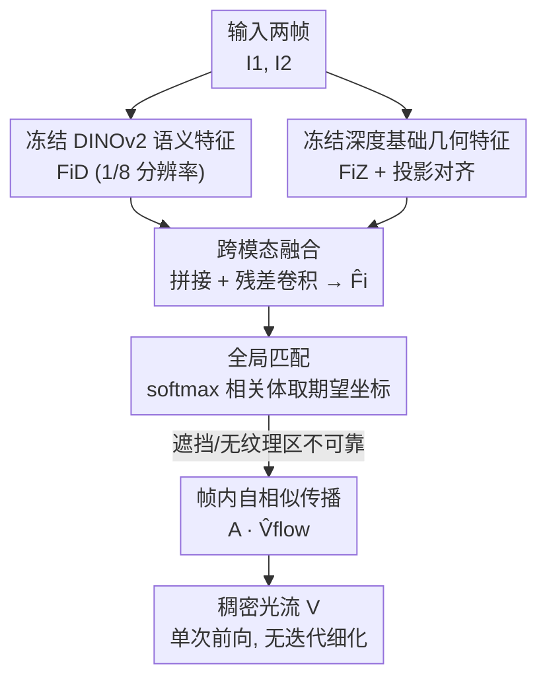

# Rethinking Dense Optical Flow without Test-Time Scaling

**会议**: CVPR 2026  
**arXiv**: [2605.08000](https://arxiv.org/abs/2605.08000)  
**代码**: 无  
**领域**: 3D视觉 / 光流估计  
**关键词**: 稠密光流, 基础模型先验, DINOv2, 单目深度, 全局匹配, 零样本泛化

## 一句话总结
这篇论文提出用冻结的视觉基础模型（DINOv2 语义特征 + Depth Anything V2 几何特征）替代为光流专门训练的编码器，通过一次前向传播的全局匹配估计稠密光流，不做任何迭代细化（test-time refinement），就在 Sintel Final 上拿到 2.81 EPE，反过来质疑"提升光流必须靠堆测试时计算"这一主流假设。

## 研究背景与动机
**领域现状**：稠密光流（dense optical flow）是给两帧之间每个像素估计一个位移向量的基础视觉任务。过去十年的精度提升基本由两条线驱动——越来越复杂的架构（RAFT、SEA-RAFT、FlowFormer）和**测试时的多步迭代细化**（recurrent update / refinement）。RAFT 把光流重新表述成"在 all-pairs 相关体上反复迭代修正"，一跑就是 32 步；SEA-RAFT、FlowSeek 同样依赖 4 步及以上的细化才能拿到 SOTA。

**现有痛点**：这种"靠测试时计算换精度"的路线（作者称之为 test-time scaling）代价高昂——每估一次光流要跑多轮 recurrent 算子，推理开销大；而且这些方法仍坚持训练一个**光流专用的特征编码器**，需要大规模标注数据和漫长训练日程。即便像 FlowSeek 这样引入了单目深度先验，它也只是把深度**注入到 recurrent 细化里**当作"修正引导"，主干仍是要从头训的 flow backbone，离不开迭代更新。

**核心矛盾**：光流本质上是一个**对应（correspondence）问题**——核心难点是学到能跨帧可靠匹配像素、同时尊重场景结构和运动边界的表征。而现代视觉基础模型（DINOv2 的语义判别力、Depth Anything 的边界感知几何线索）**早就编码了这些性质**，却一直和光流这条线"老死不相往来"。主流做法默认光流必须被显式学习、被反复修正，浪费了已有的强先验。

**本文目标**：在不增加任何测试时计算、不做迭代细化的前提下，仅靠一次前向传播估出有竞争力的稠密光流，并验证"强基础模型先验能否部分替代 test-time scaling"。

**切入角度**：把视觉基础模型当作**冻结的表征先验**而非可训练任务——既然 DINOv2 给出空间一致的语义嵌入、深度模型给出锐利的几何边界，那把两者融合后直接做全局匹配，对应关系或许能"自然涌现"，无需 recurrent 修正。

**核心 idea**：用"冻结的 DINOv2 语义特征 + 冻结的深度基础特征 → 跨模态融合 → 一次性全局匹配 + 传播"替代"专用编码器 + 多步迭代细化"，把光流从"需要训练和反复修正的任务"变回"在固定预训练表征上做一次推理"。

## 方法详解

### 整体框架
给定两帧 RGB 图像 $\mathbf{I}_1,\mathbf{I}_2\in\mathbb{R}^{H\times W\times 3}$，目标是估计稠密光流场 $\mathbf{V}\in\mathbb{R}^{H\times W\times 2}$。整套方法的骨架其实沿用了 GMFlow 的"全局匹配 + 传播"管线，但把里面**最关键的特征编码器整个换掉**：不再训练光流专用 CNN 编码器，而是从两个冻结的基础模型分别抽语义特征和几何特征，融合成统一表征后，只跑一次 transformer 全局匹配把光流算出来——全程没有 recurrent、没有迭代细化、没有测试时优化。

具体分四步：① 用冻结的 **DINOv2-S** 对每帧抽 $1/8$ 分辨率的稠密语义特征 $\mathbf{F}_i^D$；② 用冻结的 **Depth Anything V2-B** 抽深度解码器中间特征 $\mathbf{F}_i^Z$，再过一个可学习投影 $\Psi_{\text{proj}}$ 对齐到和 $\mathbf{F}_i^D$ 同样的分辨率与通道；③ 把两路特征沿通道拼接后过**跨模态融合网络** $\Psi_{\text{fusion}}$，得到统一表征 $\hat{\mathbf{F}}_i$；④ 融合特征过 transformer 编码器后，做**全局匹配**（softmax 相关体取期望坐标）得到初始光流，再用帧内自相似**传播**把可靠估计扩散到遮挡/无纹理区域。整个网络里只有投影、融合、匹配三个轻量模块是可训练的，两个基础主干始终冻结。

### 关键设计

**1. 用冻结 DINOv2 语义特征替代光流专用编码器：把对应问题交给自监督先验**

针对"训练 flow-specific 编码器需要大量标注 + 易过拟合运动偏置"这一痛点，作者直接用冻结的 DINOv2-S 抽特征 $\mathbf{F}_i^D=\Phi_{\text{DINO}}(\mathbf{I}_i)\in\mathbb{R}^{\frac{H}{8}\times\frac{W}{8}\times C_D}$。DINOv2 在互联网级图像上自监督训练，给出的稠密嵌入空间一致、能捕捉细粒度结构和语义一致性，天生适合跨帧匹配。关键在于**全程冻结**：训练和测试都不更新主干，一是保住大规模预训练得到的视觉先验、不让它被运动监督带偏导致过拟合，二是稳定优化、让光流估计变成"在固定表征上做推理"而非"边学表征边估光流"。这正是它能在**零样本（合成训练→真实测试，无目标域微调）**设定下强泛化的根源。

**2. 深度基础模型的中间特征作几何先验：用结构线索锚定运动边界**

光流的运动不连续往往和深度边界重合，但纯语义特征对几何边界不敏感。作者从冻结的 Depth Anything V2-B 取**深度解码器的中间特征** $\mathbf{F}_i^Z=\Phi_{\text{Depth}}(\mathbf{I}_i)$，而不是最终的标量深度图——理由是已有工作表明中间表征比最终深度携带更可迁移、更信息丰富的几何信号（深度不连续、物体边界、空间布局，并隐式编码遮挡/反光区的不确定性）。由于深度特征的原生分辨率/维度和 DINOv2 不一致，用一个轻量卷积下采样网络 $\tilde{\mathbf{F}}_i^Z=\Psi_{\text{proj}}(\mathbf{F}_i^Z)$ 对齐。和 FlowSeek 的根本区别在于：FlowSeek 把深度**注入 recurrent 细化当修正引导**，本文把深度当作**塑造对应表征本身的先验**，且不依赖相机内参或显式 3D 重建假设，保持严格零样本。

**3. 跨模态融合：在匹配之前就把语义与几何拧成一股**

语义特征强调外观一致性、几何特征强调结构边界，两者互补但异质。作者先沿通道拼接 $\mathbf{F}_i^C=\text{Concat}(\mathbf{F}_i^D,\tilde{\mathbf{F}}_i^Z)$，再过带残差连接的轻量卷积融合网络 $\hat{\mathbf{F}}_i=\Psi_{\text{fusion}}(\mathbf{F}_i^C)$，让网络以数据驱动的方式跨模态地**重加权、抑制或增强**特征。关键时机是**融合发生在任何匹配/运动估计之前**——早融合让最终表征同时编码"外观相似性"和"结构一致性"，从而在低纹理、重复纹理、运动边界、光照变化这些歧义区域提前消歧，给后续全局匹配喂进一个单一、连贯的表征。这与"在后期或迭代细化里才注入几何先验"的做法形成对比，且融合网络只在冻结特征上加少量可训练参数，保住了泛化能力。

**4. 单次全局匹配 + 自相似传播：无迭代地补齐不可靠区域**

融合特征过 transformer 编码器得到 $\mathbf{F}_1,\mathbf{F}_2$ 后，沿用 GMFlow 的全局匹配但**只跑一次**。先算 all-pairs 相关体 $\mathbf{C}_{\text{flow}}=\frac{\mathbf{F}_1\mathbf{F}_2^\top}{\sqrt{D}}$，softmax 成匹配分布 $\mathbf{M}_{\text{flow}}$，对第二帧坐标网格 $\mathbf{G}_{2D}$ 取期望得到对应坐标 $\hat{\mathbf{G}}_{2D}=\mathbf{M}_{\text{flow}}\mathbf{G}_{2D}$，初始光流即位移 $\hat{\mathbf{V}}_{\text{flow}}=\hat{\mathbf{G}}_{2D}-\mathbf{G}_{2D}$——这给出亚像素精度且能处理大位移，无需局部搜索窗或 recurrent。但 softmax 匹配假设每个像素都有可靠对应，在遮挡/无纹理/出界区会失效。为此加一步**传播**：用第一帧的帧内特征自相似算注意力 $\mathbf{A}=\text{softmax}(\frac{\mathbf{F}_1\mathbf{F}_1^\top}{\sqrt{D}})$，再 $\mathbf{V}=\mathbf{A}\,\hat{\mathbf{V}}_{\text{flow}}$ 把可靠区域的估计沿结构一致的像素扩散到歧义区。作者刻意**不动匹配算子**（沿用 GMFlow 原样），就是为了把性能增益干净地归因到"基础模型驱动的表征"上。

### 损失函数 / 训练策略
用预测光流与真值之间的 $\ell_1$ 回归损失监督（对离群点鲁棒、且和评测用的 EPE 端点误差对齐），对中间和最终预测都施加、最终预测权重更高：

$$L=\sum_{i=1}^{N}\gamma^{N-i}\left\|\mathbf{v}^{(i)}-\mathbf{v}_{gt}\right\|_1$$

其中 $N$ 是预测总数，$\mathbf{v}^{(i)}$ 是第 $i$ 阶段预测，$\gamma$ 控制中间与最终预测的相对权重。训练分阶段：先在 FlyingChairs 上 200k 迭代（batch 16、lr $4\times10^{-4}$、crop $384\times512$），再到 FlyingThings3D 上 800k 迭代（lr 降到 $2\times10^{-4}$、crop $384\times768$）；微调实验用 TSKH 混合集（KITTI+HD1K+Things+Sintel）再训 200k。两块 RTX 6000 GPU，AdamW，DINOv2 与 Depth Anything V2 主干全程冻结，只优化投影/融合/匹配模块，可训练参数量很小。

## 实验关键数据

### 主实验
**跨数据集泛化（仅在 Chairs+Things 上训练，无目标域微调，越低越好）**：

| 方法 | #refine | Things(val,clean) EPE | Sintel(train,clean) EPE | Sintel(train,final) EPE |
|------|---------|------|------|------|
| RAFT | 32 | 4.25 | 1.43 | 2.71 |
| GMFlow | 0 | 3.48 | 1.50 | 2.96 |
| GMFlow | 1 | 2.80 | 1.08 | 2.48 |
| SEA-RAFT (S) | 4 | – | 1.27 | **4.32** |
| FlowSeek (T) | 4 | 3.94 | 1.16 | 2.48 |
| **本文** | **0** | 3.02 | 1.46 | **2.81** |

核心卖点在 **Sintel Final**：本文 2.81 EPE，相比同等训练条件下用了 4 步细化的 SEA-RAFT（4.32）大幅领先，也优于无细化的 GMFlow（2.96），并与额外用 TartanAir 预训练的 FlowSeek（2.63）相当——而本文是**严格单次前向、零细化**。Things 上 3.02 EPE 也优于 RAFT 和无细化 GMFlow。

**Sintel train（Chairs+Things+TSKH 训练后）**：

| 方法 | Extra Data | #refine | Clean EPE | Final EPE |
|------|-----------|---------|-----------|-----------|
| RAFT | – | 32 | 0.768 | 1.217 |
| GMFlow | – | 0 | 0.947 | 1.276 |
| GMFlow | – | 1 | 0.762 | 1.110 |
| SEA-RAFT (S) | TartanAir | 4 | **0.546** | **0.782** |
| FlowSeek (T) | TartanAir | 4 | 0.71 | 1.28 |
| **本文** | – | 0 | 0.847 | 1.140 |

本文在 Sintel Final（1.140）上优于 RAFT、无细化 GMFlow 和 FlowSeek，接近有细化的 GMFlow。SEA-RAFT 两个 split 都最强，但作者点明这很大程度来自训练规模差异：SEA-RAFT 用 $8\times$ L40（约 $4\times$ 有效训练算力）、batch 32 / crop $432\times960$，且和 FlowSeek 都额外用 TartanAir 预训练，而本文只用 $2\times$ RTX 6000、batch 8 / crop $320\times896$、无额外数据。

**KITTI train（微调后）**：本文 EPE 1.99 / F1-all 7.40，和无细化 GMFlow（2.06 / 7.57）相当；SEA-RAFT、FlowSeek 更低但受益于 recurrent 修正和 TartanAir 预训练。作者承认 KITTI 的遮挡、细结构、锐利运动边界正是迭代细化的强项，单次前向在此处吃亏，这是"架构简洁 vs 细粒度局部精度"的权衡。

### 消融实验

| 配置 | Things EPE | Sintel Clean EPE | Sintel Final EPE | Final s40+ EPE |
|------|-----------|------------------|------------------|----------------|
| w/o 融合模块 | 3.52 | 1.575 | 3.12 | 19.37 |
| **w/ 融合模块（完整）** | 3.02 | 1.46 | 2.81 | 16.99 |

| 配置 | FlyingChairs EPE（训 100k） |
|------|------|
| w/o 深度特征（同时去掉融合） | 1.77 |
| w/ 深度特征 | **0.87** |

### 关键发现
- **跨模态融合贡献明显**：开启融合让 Sintel Final 从 3.12 → 2.81（约 10% 相对提升），Things 3.52 → 3.02；且**大运动区收益最大**——Sintel Final 的 $s_{40+}$ 从 19.37 → 16.99，说明语义+几何互补对大位移、运动边界的消歧最有用。
- **深度特征是关键先验**：在 FlyingChairs 上训 100k，加深度特征把 EPE 从 1.77 砍到 0.87（约 51% 相对下降），证明几何线索不是锦上添花而是核心。
- **强先验能部分替代测试时计算**：在零细化设定下，本文 Sintel Final 反超用了多步细化的 SEA-RAFT，直接支撑了"foundation prior 可部分替代 test-time scaling"的中心假设。

## 亮点与洞察
- **范式层面的"减法"**：当整个领域在加架构、加细化步数、加预训练数据时，本文反向论证"把已有基础模型先验用好，单次前向也够"。这种"质疑默认假设"的论文价值不在刷榜而在松动主流信念。
- **深度用"中间特征"而非"标量深度图"**：一个容易被忽略的工程洞察——深度解码器中间层比最终深度携带更可迁移的几何信号（边界、不确定性），这个 trick 可迁移到任何想借用深度先验的稠密预测任务。
- **早融合 + 不动匹配算子**：把几何先验融在匹配之前、并刻意保持 GMFlow 匹配模块原样，让性能增益能干净归因到"表征"而非"架构调参"，是干净的消融设计哲学。
- **天然零样本/跨域友好**：因为主干全冻结、只训三个轻量模块，可训练参数极少，对合成→真实的域迁移格外鲁棒，这对缺标注的实际场景很有吸引力。

## 局限与展望
- **作者承认**：在重遮挡、细结构、精细运动边界的困难场景精度会下降（KITTI 上明显落后于带细化的方法）；方法整体性能受限于所用基础模型的可得性与质量，并会继承大规模预训练数据的偏置。
- **自己发现的局限**：① "反超 SEA-RAFT"主要成立于**同等训练条件**的跨域泛化设定，一旦对手放开训练规模/额外数据（TSKH+TartanAir、$4\times$ 算力），本文在 Sintel/KITTI 上仍落后绝对 SOTA，结论需带这一 caveat；② 没有公开代码，复现门槛较高；③ 损失里写了"对中间和最终预测都监督"，但方法主张单次前向、中间预测从何而来叙述略含糊（⚠️ 以原文为准）。
- **改进思路**：作者也指出在保持基础模型范式的前提下，引入**轻量级细化**或**更大规模预训练**是有希望的方向——即"不彻底抛弃细化，而是用强先验把所需细化步数降到最低"。

## 相关工作与启发
- **vs RAFT / SEA-RAFT**：它们靠 recurrent 更新算子做多步（32 / 4 步）测试时细化换精度；本文单次前向、零细化，在同等训练条件的 Sintel Final 跨域泛化上反超 SEA-RAFT，核心区别是"用冻结基础表征替代专用编码器 + 迭代修正"。
- **vs GMFlow**：本文沿用 GMFlow 的全局匹配公式（softmax 相关体取期望），但**移除了 flow-specific 特征学习**，改用冻结 DINOv2+深度特征驱动匹配；刻意不改匹配算子以隔离表征的贡献。
- **vs FlowSeek**：两者都引入单目深度基础模型，但 FlowSeek 把深度**注入 recurrent 细化当修正引导**、仍训专用 flow backbone；本文把深度当作**塑造对应表征本身的先验**、在匹配前早融合，全程无细化。这是"先验作修正"与"先验作表征"的根本分歧。

## 评分
- 新颖性: ⭐⭐⭐⭐ 把"冻结基础模型先验替代专用编码器+迭代细化"系统性地用到稠密光流，角度新、立论清晰，但全局匹配/融合的组件多为已有部件的重组。
- 实验充分度: ⭐⭐⭐ 覆盖 Sintel/KITTI/Things 跨域+微调并有融合/深度两个消融，但缺推理时延/FLOPs 的直接量化对比（"省测试时计算"的卖点未给硬指标），且未公开代码。
- 写作质量: ⭐⭐⭐⭐ 动机和"质疑 test-time scaling"的主线讲得很清楚，方法公式完整；个别处（中间预测、与对手算力差异）表述需读者自己补 caveat。
- 价值: ⭐⭐⭐⭐ 提供了一条"用基础模型先验降低光流推理成本"的可行路径，对资源受限/零样本场景有启发，结论也松动了"必须靠细化"的领域信念。

<!-- RELATED:START -->

## 相关论文

- [\[CVPR 2026\] Optical Flow Matching: Reframing Optical Flow as Continuous Transport Dynamics](optical_flow_matching_reframing_optical_flow_as_continuous_transport_dynamics.md)
- [\[CVPR 2026\] Flow4DGS-SLAM: Optical Flow-Guided 4D Gaussian Splatting SLAM](flow4dgs-slam_optical_flow-guided_4d_gaussian_splatting_slam.md)
- [\[CVPR 2026\] Learning 3D Reconstruction with Priors in Test Time](tco_learning_3d_reconstruction_with_priors_in_test_time.md)
- [\[CVPR 2026\] ZipMap: Linear-Time Stateful 3D Reconstruction via Test-Time Training](zipmap_linear-time_stateful_3d_reconstruction_via_test-time_training.md)
- [\[CVPR 2026\] Dense Metric Depth Completion from Sparse Direct Time-of-Flight Sensors](dense_metric_depth_completion_from_sparse_direct_time-of-flight_sensors.md)

<!-- RELATED:END -->
