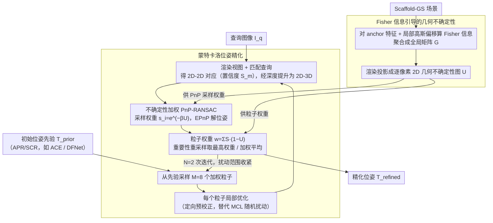

<!-- 由 src/gen_stubs.py 自动生成 -->
# Rethinking Pose Refinement in 3D Gaussian Splatting under Pose Prior and Geometric Uncertainty

**会议**: CVPR2026  
**arXiv**: [2603.16538](https://arxiv.org/abs/2603.16538)  
**代码**: [项目主页](https://arxiv.org/abs/2603.16538)（代码已开源）  
**领域**: 3D视觉  
**关键词**: 3D Gaussian Splatting, 视觉定位, 位姿优化, 蒙特卡洛采样, Fisher信息, 不确定性建模

## 一句话总结

提出 UGS-Loc 框架，通过蒙特卡洛位姿采样和 Fisher 信息引导的 PnP 优化，联合建模位姿先验不确定性和几何不确定性，在无需重训练的条件下显著提升 3DGS 场景中的相机位姿精化鲁棒性。

## 背景与动机

- **3DGS 位姿精化的现状**：3D Gaussian Splatting 已成为视觉定位中强大的场景表示，基于"渲染-比对"策略的位姿精化方法（render-and-compare）取得了 SOTA 精度
- **位姿先验不确定性被忽视**：现有方法依赖单一确定性位姿估计（来自 APR/SCR），当初始位姿偏差较大或遮挡严重时，渲染视图与查询图像的匹配质量急剧退化
- **几何不确定性被忽视**：3DGS 的椭球体原语只是近似几何，稀疏训练视角或动态物体污染区域的深度渲染并不均匀可靠，但现有方法将所有深度等同对待
- **错误传播链路**：不可靠的深度用于将 2D-2D 对应提升为 2D-3D 对应，错误几何信息直接传入 PnP 求解器，导致位姿估计不稳定
- **确定性流水线的脆弱性**：GS-CPR 等方法对初始位姿高度敏感，图 2 展示了从有偏位姿出发产生的错误对应和不稳定精化
- **实际需求**：AR/VR、自动驾驶和机器人应用对位姿精化的鲁棒性有严格要求，需要一种无需重训练、通用的不确定性感知方案

## 方法详解

### 整体框架

UGS-Loc 重新审视 3DGS 里"渲染—比对"式的相机位姿精化，指出它有两处一直被当成确定量处理：一是来自 APR/SCR 的初始位姿先验，二是 3DGS 椭球渲染出的深度几何。它把这两处都改成显式建模的不确定性——蒙特卡洛精化处理位姿先验的不确定性、Fisher 信息引导的 PnP 处理几何的不确定性。整个框架是推理时管线，无需重训练或额外监督，只要 2 次迭代、8 个粒子就能跑完。

### 关键设计

**1. 蒙特卡洛位姿精化：把单一确定位姿换成一群带权粒子**

现有方法只信 APR/SCR 给的一个确定位姿，初始偏差大或遮挡重时，渲染视图和查询图像的匹配质量会急剧崩坏。UGS-Loc 改用一个加权粒子集 $\mathcal{P}=\{(\mathbf{T}^{(m)}, w^{(m)})\}_{m=1}^{M}$ 来表示位姿先验，每个粒子 $\mathbf{T}^{(m)} \in SE(3)$。它用局部优化替代传统 MCL 那种随机扰动预测，把每个粒子直接引到似然分布的附近模式上，因此所需粒子数大幅减少。每个粒子的重要性权重同时综合匹配置信度 $S_m$ 和几何不确定性 $U_m$

$$w^{(m)} = \frac{\sum_i S_m(r_i) \cdot (1 - U_m(r_i))}{\sum_j \sum_i S_j(r_i) \cdot (1 - U_j(r_i))}$$

最终位姿通过重要性重采样取最高权重粒子或加权平均得到，相当于让多假设彼此竞争而非孤注一掷。

**2. Fisher 信息引导的几何不确定性：让 PnP 偏向可靠几何采样**

3DGS 的椭球渲染深度并不处处可靠——稀疏视角或动态污染区域的深度一旦出错，会把错误的 2D-3D 对应直接灌进 PnP 求解器、搞坏位姿。UGS-Loc 把 Fisher 信息扩展到 anchor-based 的 Scaffold-GS 表示（以 anchor 特征和局部高斯偏移为参数），用 Laplace 近似的对角 Hessian 高效估计 $\mathrm{H}'' \simeq \mathrm{diag}((\nabla_\theta f)^\top (\nabla_\theta f)) + \lambda I$，从所有训练视角聚合成全局矩阵 $\mathrm{G}$，再经 3DGS 渲染公式投影成逐像素 2D 不确定性图。这张图转成采样权重 $s_i = e^{-\beta \bar{U}(r_i)} + \epsilon$，让 RANSAC 偏向几何可靠的区域采样、共识评估也按同样权重加权，最终位姿取最大化加权共识 $\sum s_i$ 者。好处是几何不确定性自然融进采样，完全不用改 PnP 求解器本身。

### 损失与优化

整个框架是推理时的精化管线，没有显式的损失函数训练。PnP 求解用 EPnP 算法配不确定性加权 RANSAC；采样的扰动范围按迭代收紧——第一次迭代用平移 10cm、旋转 0.01° 的均匀分布采样，后续迭代收到 1cm / 0.01°。

## 实验关键数据

### 室内基准（7Scenes）

| 方法 | Chess | Fire | Heads | Office | Pumpkin | RedKitchen | Stairs | Avg (cm/°) |
|------|-------|------|-------|--------|---------|------------|--------|------------|
| ACE + GS-CPR | 0.5/0.15 | 0.6/0.25 | 0.4/0.28 | 0.9/0.26 | 1.0/0.23 | 0.7/0.17 | 1.4/0.42 | 0.8/0.25 |
| ACE + UGS-Loc | **0.37/0.12** | **0.47/0.20** | **0.36/0.25** | **0.77/0.22** | **0.79/0.18** | **0.58/0.15** | **1.11/0.33** | **0.64/0.21** |

- ACE + UGS-Loc 相比 ACE + GS-CPR 平均误差降低约 20%
- 在严格阈值 [2cm, 2°] 下准确率达 95.6%（GS-CPR 为 93.1%，迭代版 GS-CPR² 也是 93.1%）

### 室外基准（Cambridge Landmarks）

| 方法 | Kings | Hospital | Shop | Church | Avg (cm/°) |
|------|-------|----------|------|--------|------------|
| DFNet + GS-CPR | 23/0.32 | 42/0.74 | 10/0.36 | 27/0.62 | 26/0.51 |
| DFNet + UGS-Loc | **18.7/0.19** | **14.5/0.29** | **3.9/0.15** | **5.5/0.17** | **10.7/0.20** |
| ACE + GS-CPR | 20/0.29 | 21/0.40 | 5/0.24 | 13/0.40 | 15/0.33 |
| ACE + UGS-Loc | **17.8/0.18** | **13.8/0.30** | **4.2/0.16** | **6.3/0.20** | **10.5/0.21** |

- UGS-Loc 将 GS-CPR 的中位平移误差降低约 30%（Cambridge）
- DFNet 作为较弱先验时，UGS-Loc 的精化结果甚至可超过 ACE+GS-CPR 的组合

### 消融实验

- **粒子数影响**：从 2→16 粒子，Cambridge 平均误差从 11.8/0.24 降至 10.3/0.20（DFNet 先验），性能单调提升
- **迭代精化对比**：GS-CPR 的简单迭代在第 1 次后迅速饱和，而 UGS-Loc 2 次迭代即持续收敛至更低误差
- **匹配模块**：MASt3r 略优于 SuperPoint+LightGlue（11/0.22 vs 13/0.26），但不确定性感知精化使轻量匹配器也能达到接近精度
- **运行效率**：标准配置（m=8）端到端推理 1.1s/迭代，远优于 MCLoc 的 2.4s/查询

## 亮点

- **双重不确定性建模**：首次在 3DGS 位姿精化中联合考虑位姿先验和几何两种不确定性
- **无需重训练**：整个框架是推理时方案，即插即用适配不同位姿估计器和匹配模块
- **高效蒙特卡洛**：通过局部优化替代传统 MCL 的随机预测，仅需 8 个粒子 2 次迭代即达 SOTA
- **Fisher 信息与 PnP 的优雅结合**：几何不确定性通过采样权重自然融入 RANSAC，无需修改 PnP 求解器本身
- **跨先验鲁棒性**：弱先验（DFNet）经 UGS-Loc 精化后可接近强先验（ACE）的结果

## 局限与展望

- 粒子数增加会线性增加推理时间（16 粒子 ≈ 2× 耗时），实时性受限
- Fisher 信息需要从所有训练视角预计算聚合，场景更新时需重新计算
- 仅在 Scaffold-GS 上验证了几何不确定性，未扩展到其他 3DGS 变体（vanilla 3DGS、2DGS 等）
- Cambridge 室外场景的旋转误差改进幅度不如平移误差显著
- 未探讨动态场景或极端光照变化下的不确定性建模
- 蒙特卡洛采样策略的扰动范围是手动设定的超参数

## 与相关工作的对比

- **vs GS-CPR**：GS-CPR 是确定性精化，UGS-Loc 引入概率框架，相比提升约 20-30%
- **vs MCLoc**：同为蒙特卡洛方案，但 MCLoc 基于 NeRF 且需 80 次迭代 2.4s，UGS-Loc 仅 2 次迭代 1.1s 且精度更高
- **vs STDLoc**：STDLoc 在 7Scenes 上与 UGS-Loc 接近（0.76 vs 0.64 cm），但 UGS-Loc 具有更强的跨先验泛化
- **vs Bayes' Rays / FisherRF**：这些方法的不确定性量化面向重建质量而非定位，UGS-Loc 首次将 Fisher 信息用于位姿精化
- **vs HR-APR / NeFeS**：这些需要额外训练的方法在 Cambridge 上达 35/0.78，UGS-Loc 无需训练即达 10.5/0.21

## 评分

- 新颖性: ⭐⭐⭐⭐ 双重不确定性建模的思路清晰且首次系统性地引入 3DGS 定位
- 实验充分度: ⭐⭐⭐⭐ 三个基准、多种先验、详细消融，但缺少更多 3DGS 变体测试
- 写作质量: ⭐⭐⭐⭐ 图示清晰，动机阐述充分，公式推导完整
- 价值: ⭐⭐⭐⭐ 即插即用的推理时方案，实用性强，对 3DGS 定位社区有直接推动

<!-- RELATED:START -->

## 相关论文

- [\[CVPR 2026\] UST-Hand: An Uncertainty-aware Spatiotemporal Point Cloud Interaction Network for 3D Self-supervised Hand Pose Estimation](ust-hand_an_uncertainty-aware_spatiotemporal_point_cloud_interaction_network_for.md)
- [\[CVPR 2026\] VarSplat: Uncertainty-aware 3D Gaussian Splatting for Robust RGB-D SLAM](varsplat_uncertainty-aware_3d_gaussian_splatting_for_robust_rgb-d_slam.md)
- [\[CVPR 2026\] Revisiting Pose Sensitivity in Splat-based Computed Tomography under Sparse-view Reconstruction](revisiting_pose_sensitivity_in_splat-based_computed_tomography_under_sparse-view.md)
- [\[CVPR 2026\] Energy-GS: Image Energy-guided Pose Alignment Gaussian Splatting with redesigned pose gradient flow](energy-gs_image_energy-guided_pose_alignment_gaussian_splatting_with_redesigned_.md)
- [\[CVPR 2026\] ComPose: A Unified Completion-Pose Framework for Robust Category-Level Object Pose Estimation](compose_a_unified_completion-pose_framework_for_robust_category-level_object_pos.md)

<!-- RELATED:END -->
